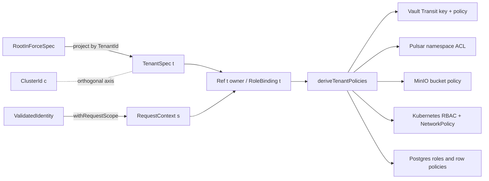

# Tenancy

> **Purpose**: Single source of truth for the amoebius tenant and subject axes — first-class immutable
> `TenantId`, issuer-qualified `SubjectId`, explicit membership and owner indices, derived provider RBAC,
> append-only revocable cross-tenant grants, and scope-narrowed tenant administration.
> **Read this if**: an isolation boundary between tenants or subjects has to be drawn or checked.

This document owns the tenant axis: what a tenant is, the typed shapes access control is derived from rather
than authored, and the honest limit on what two isolation layers actually deliver. It does not own the
namespace partition it composes with, owned by
[namespace_layout_doctrine.md](./namespace_layout_doctrine.md), nor the identity provider realizing it,
owned by [platform_services_doctrine.md](./platform_services_doctrine.md).

Link-graph metadata

**Status**: Authoritative source
**Supersedes**: N/A
**Referenced by**: DEVELOPMENT_PLAN/legacy_tracking_for_deletion_archive.md, DEVELOPMENT_PLAN/phase_00_documentation_suite.md, DEVELOPMENT_PLAN/phase_08_scope_index.md, DEVELOPMENT_PLAN/phase_66_app_tenancy.md, DEVELOPMENT_PLAN/phase_68_user_tenant_isolation_live.md, DEVELOPMENT_PLAN/phase_70_ui_projection_runtime.md, DEVELOPMENT_PLAN/phase_81_ui_single_tenant_live.md, DEVELOPMENT_PLAN/phase_82_ui_multi_tenant_live.md, DEVELOPMENT_PLAN/phase_86_offline_blobs_isolation.md, DEVELOPMENT_PLAN/phase_91_infernix_rederivation.md, DEVELOPMENT_PLAN/phase_92_infernix_ui_rederivation.md, DEVELOPMENT_PLAN/phase_94_jitml_ui_rederivation.md, DEVELOPMENT_PLAN/system_components.md, documents/engineering/README.md, documents/engineering/browser_offline_runtime_doctrine.md, documents/engineering/content_addressing_determinism.md, documents/engineering/extension_conformance_security.md, documents/engineering/extension_conformance_transactions.md, documents/engineering/inforcespec_migration_doctrine.md, documents/engineering/low_code_ui_runtime_doctrine.md, documents/engineering/migration_doctrine.md, documents/engineering/namespace_layout_doctrine.md, documents/engineering/platform_services_doctrine.md, documents/engineering/resource_capacity_storage.md, documents/glossary.md, documents/illegal_state/illegal_state_security.md, documents/illegal_state/illegal_state_techniques.md, documents/illegal_state/illegal_state_tenancy.md
**Generated sections**: none

> **Historical result (invalidated).** Phase-run and implementation-result statements predate the 2026-08-11 reopen unless the owning phase is Done; target doctrine remains normative, and current state is in the [tracker](../../DEVELOPMENT_PLAN/README.md).

## Contents
- [1. Why this doctrine exists](#1-why-this-doctrine-exists)
- [2. The tenant axis is orthogonal to the cluster axis](#2-the-tenant-axis-is-orthogonal-to-the-cluster-axis)
- [3. What a tenant is](#3-what-a-tenant-is)
- [4. The typed shapes: `TenantSpec` / `SubjectSpec` / `Membership` / `Owner` / `RoleBinding`](#4-the-typed-shapes-tenantspec--subjectspec--membership--owner--rolebinding)
- [5. RBAC is derived, never authored](#5-rbac-is-derived-never-authored)
- [6. The tenant-admin surface reduces to a scope-narrowed admin mutation](#6-the-tenant-admin-surface-reduces-to-a-scope-narrowed-admin-mutation)
- [7. Two isolation layers, and the honest limit](#7-two-isolation-layers-and-the-honest-limit)
- [8. What this doctrine owns, and what it defers](#8-what-this-doctrine-owns-and-what-it-defers)
- [9. Planning ownership](#9-planning-ownership)
- [Related Documents](#related-documents)

---

## 1. Why this doctrine exists

A multi-tenant workload keeps more than one customer's data on shared platform services, and the
load-bearing obligation is isolation: tenant B must never read, share, or destroy tenant A's data. The
guarantee has to hold at the layer where a spec is authored, not only at the layer where a policy is
enforced. The failure surfaces at **author time** — a spec that names a cross-tenant grant, or hand-writes a provider ACL that over-grants — and at **runtime** — a rendered policy that leaks.

The obvious alternative is to model a tenant as an ordinary application record and enforce isolation with
hand-authored secret-store policies, message-bus access lists, and SQL grants. It fails because a
hand-authored grant is exactly the surface where a cross-tenant reference becomes representable: an author
can write down a binding that names another tenant's bucket, and nothing in the type of that binding forbids
it. Isolation then rests entirely on review and runtime enforcement, which the amoebius contract ([dsl_doctrine.md §5](./dsl_doctrine.md#5-the-illegal-state-unrepresentable-contract)) rejects for exactly this class of invariant.

The rule this doctrine states: **a tenant is an immutable `TenantId`, a subject is an issuer-qualified
immutable `SubjectId`, every datum and role binding carries mandatory tenant and owner indices, and provider
RBAC is derived from the membership→role→resource graph — never hand-authored.** A `RoleBinding` in tenant `t`
has no constructor that names a resource in tenant `t' ≠ t`; a subject-owned reference has no constructor that
changes its owner; and there is no DSL surface with which to write a Vault policy, a Pulsar ACL, or an SQL grant
directly.

What it forecloses: a cross-tenant data reference or role binding has no inhabitant in a well-typed spec (catalogued at [illegal_state_catalog.md §3.8](../illegal_state/illegal_state_security.md#38-cross-tenant-references-and-literal-secrets), foreclosed by the phantom-tag mechanism of [§4.2](../illegal_state/illegal_state_techniques.md#42-capability-and-phantom-tenant-tags--cross-tenant-refs-are-uninhabitable)), and a hand-authored, un-derived provider grant has no syntax. Deliberate cross-tenant *sharing* is not foreclosed — it survives as an explicit, append-only, revocable capability edge ([§5.4](#54-cross-tenant-sharing-is-an-append-only-revocable-capability-edge)), never a re-tag. The residue this doctrine does **not** claim to foreclose — that the derivation onto Keycloak, Vault, Pulsar, MinIO, Kubernetes API, and Postgres is faithful — is stated honestly in [§7](#7-two-isolation-layers-and-the-honest-limit).

## 2. The tenant axis is orthogonal to the cluster axis

The data plane is already typed with two phantom indices — `DataPlane (c :: ClusterId) t` ([single_logical_data_plane_doctrine.md §3](./single_logical_data_plane_doctrine.md#3-the-binding-reachability-is-a-type-not-a-runtime-probe)) — where `c` is the cluster/forest axis and `t` is the tenant axis. This doctrine disambiguates `t` into a first-class `TenantId`; it introduces no new isolation primitive.

- **`c` — the cluster axis** — is owned by the recursive forest: a parent spawns children, each child's subtree spec is enveloped under a per-child Vault Transit key, and a child cannot decrypt a sibling's subtree ([cluster_lifecycle_doctrine.md §3](./cluster_lifecycle_doctrine.md#3-amoebic-spawning--the-recursive-forest), [vault_pki_doctrine.md §6](./vault_pki_doctrine.md#6-parentchild-unseal-two-sanctioned-modes)). Per-child cryptographic isolation is a property of this axis.
- **`t` — the tenant axis** — is *within and across* a cluster: many tenants share one cluster's platform services, keyed by `TenantId`.

The two axes compose and never fuse: `c` and `t` unify independently, and a datum is located by both. `TenantId` is not a `ClusterId`, and promoting a tenant onto its own cluster ([§7](#7-two-isolation-layers-and-the-honest-limit)) changes the tenant's `c`, never its `t`.

*Orientation. Design intent. The tenant axis `t` runs from one root spec through projection to every derived policy while the cluster axis `c` crosses it without fusing, and the request scope `s` is what carries `t` for a tenant learned at run time; the derived-policy rule is owned by [§5](#5-rbac-is-derived-never-authored) and the skolem scope by [`extension_conformance_security.md` §3](./extension_conformance_security.md#3-the-skolem-scope).*

## 3. What a tenant is

A tenant is an immutable `TenantId` that bundles the per-tenant slice of each service that carries native tenancy:

- a **Keycloak realm** (the tenant's identity boundary — [platform_services_doctrine.md §9](./platform_services_doctrine.md#9-the-loadbalancer-and-the-single-wild-ingress-path));
- a **Vault policy / mount** scoped to `secret/tenants/<t>/…` (the tenant's secret boundary — [vault_pki_doctrine.md §3](./vault_pki_doctrine.md#3-the-secretref-contract-a-name-never-a-value));
- a set of **Pulsar tenant-namespaces** `persistent://<t>/<ns>/…` ([pulsar_client_doctrine.md §6](./pulsar_client_doctrine.md#6-the-declarative-topology-algebra));
- a **MinIO bucket prefix** `<t>/<bucket>` (extending the per-app `<app>/<bucket>` binding of [service_capability_doctrine.md §4](./service_capability_doctrine.md#4-capability--provider--shape-the-binding));
- optionally one **Postgres database**, co-located in its consuming service's namespace ([platform_services_doctrine.md §8](./platform_services_doctrine.md#8-postgres--patroni-via-percona-one-cluster-per-consumer-with-pgadmin)).

`TenantId` is **minted once and immutable**, and it travels with the bytes it tags: no migration re-tags a datum from `t1` to `t2` (the data-plane form of the absent `Ref t1 a → Ref t2 a` coercion, owned by [illegal_state_catalog.md §4.2](../illegal_state/illegal_state_techniques.md#42-capability-and-phantom-tenant-tags--cross-tenant-refs-are-uninhabitable) and the migration invariants of [release_lifecycle_doctrine.md §5](./release_lifecycle_doctrine.md#5-rolloutplan--rolloutphase-the-readiness-gated-apply)). This immutability is the shared boundary between this doctrine (which owns tenant, subject, membership, owner, and RBAC) and the storage-migration doctrine (which owns the data invariants that ride on the tags — [inforcespec_migration_doctrine.md](./inforcespec_migration_doctrine.md)).

The recommended default is one `TenantId` per tenant on shared cluster services, which scales to many tenants; a tenant's *own child cluster* is the hardening projection, not the default ([§7](#7-two-isolation-layers-and-the-honest-limit)).

## 4. The typed shapes: `TenantSpec` / `SubjectSpec` / `Membership` / `Owner` / `RoleBinding`

The tenant surface is a set of phantom-tagged types nested in the `InForceSpec` — a composition axis alongside
app-in-cluster and extension-in-app ([dsl_doctrine.md §4](./dsl_doctrine.md#4-total-composability)), which
*carries* these fields and defers their unrepresentability here:

    TenantSpec (t : TenantId) :
      { tenantId   : TenantId              -- == t; minted once, immutable
      , realm      : KeycloakRealmRef t    -- the tenant's OIDC realm
      , dataNs     : TenantNamespaces t     -- DERIVED: Pulsar ns, MinIO prefix, Vault path, optional Sql db
      , transitKey : SecretRef              -- per-tenant Transit key, named not held
      , roles      : List (RoleSpec t)
      , memberships : List (SomeMembership t)
      }
    SubjectSpec (s : SubjectId) :
      { identity   : SubjectIdentity         -- trusted issuer + immutable subject claim
      , display    : Text                    -- presentation only; never authority
      , credential : Optional SecretRef      -- bootstrap credential by name, when provisioned
      }
    Membership (s : SubjectId) (t : TenantId) :
      { subject : SubjectRef s
      , tenant  : TenantRef t
      , roles   : List (RoleRef t)
      }
    Owner (t : TenantId) :
      < TenantOwned | SubjectOwned : SomeSubjectAt t | RoleShared : RoleRef t >
    RoleBinding (t : TenantId) :
      { role : RoleRef t , resource : Ref t owner Resource , permissions : List Permission }
    Principal (t : TenantId) (s : SubjectId)    -- opaque: verified identity + Membership s t

The isolation is the **absent arms** ([illegal_state_catalog.md §3.8](../illegal_state/illegal_state_security.md#38-cross-tenant-references-and-literal-secrets), technique [§4.2](../illegal_state/illegal_state_techniques.md#42-capability-and-phantom-tenant-tags--cross-tenant-refs-are-uninhabitable)):

- There is **no constructor `Ref t1 a → Ref t2 a`**. Inside a `RoleBinding t1`, the only resource-reference constructors in scope produce `Ref t1 _`, so a binding that names another tenant's bucket, topic, or secret has no inhabitant.
- There is **no bare `sub` identity and no unscoped membership**. `SubjectId` is qualified by the trusted
  issuer, and `Membership s t` is the only route from a subject to a tenant-scoped principal. One subject may
  hold several explicit memberships without acquiring a global or caller-selected tenant.
- There is **no owner re-tagging constructor**. A `Ref t (SubjectOwned s) a` cannot become
  `Ref t (SubjectOwned other) a` or `Ref otherTenant owner a`. Tenant-shared and role-shared publication is an
  explicit audited transition or grant, never a mutable owner field.
- The projection `project : RootInForceSpec → TenantId → TenantSpec t` yields **only** tenant `t`'s subtree — the tenant analogue of the `ChildInForceSpec` projection ([dsl_doctrine.md §5](./dsl_doctrine.md#5-the-illegal-state-unrepresentable-contract)). No field admits a sibling-tenant or cluster-scoped branch.

The logical membership type is independent of identity-provider placement. `RealmPerTenant` remains the
default deployment shape: the route tenant, token issuer, and `Membership s t` must agree, so a realm-`t1`
token cannot satisfy a realm-`t2` route. A future shared-realm shape must produce the same opaque membership
witness from a signed issuer claim and pass the same isolation gate. Applications cannot parse claim paths or
author a tenant selector. The UI request context and tenant-switch invalidation contract are owned by
[low_code_ui_runtime_doctrine.md §10](./low_code_ui_runtime_doctrine.md#10-single-tenant-and-multi-tenant-applications).

**Live projection residue.** [Phase 70](../../DEVELOPMENT_PLAN/phase_70_ui_projection_runtime.md) carries this
typed relation through owner-scoped UI storage and delivery. Projection rows, stream watermarks, opaque handles,
and Pulsar subscriptions retain `(AppId, TenantId, Owner, ProjectionId)`; receipts retain
`(AppId, TenantId, Owner, CommandId)`. Equal local entity ids for Alice, Bob, and Carol cannot collapse either
owner or tenant, and the two owner-erasure mutants turn the external oracle red.

Secrets stay names, never values, throughout: `credential` and `transitKey` are `SecretRef`s resolved by the parent/control-plane daemon into Vault ([vault_pki_doctrine.md §3](./vault_pki_doctrine.md#3-the-secretref-contract-a-name-never-a-value)).

## 5. RBAC is derived, never authored

The typed tenant→role graph is the sole source of truth for access; the concrete provider policies are
**derived from it**, never hand-written — the same derive-don't-author discipline as generated NetworkPolicies
and taint-derived tolerations. The single total boundary is an intermediate derivation, never a renderer:

    deriveTenantPolicies :: TenantSpec -> TenantPolicyDerivation

`TenantPolicyDerivation` is pure. It carries one immutable tenant/role-graph source digest, exact canonical
payloads and content digests, persistent-source/retention/churn operands, provider targets, apply-action and
executor intents, and bounded execution cost operands. Its executor attachment is only
`< Dedicated | SharedControlPlaneRole >`; it contains no concrete `ExecutionUnitId`, supply, observation,
placement, or provision witness. The closed provider index is:

- **Keycloak** — realm roles, client scopes, and route-auth rules;
- **Vault** — policy/auth objects over `secret/tenants/<t>/…`;
- **Pulsar** — tenant, namespace, and ACL objects for `persistent://<t>/…`;
- **MinIO** — IAM, service-account, and bucket-policy objects on `<t>/<bucket>`;
- **Kubernetes API** — generated NetworkPolicy/RBAC objects; and
- **Postgres** — database roles and grants for the tenant's optional database.

Every provider output is resource-bearing. Keycloak and Postgres have distinct schema/index/WAL projections;
Vault has persisted versions and Raft logs/snapshots; Pulsar has ZooKeeper entries and transaction
logs/snapshots; MinIO has dynamic storage-system metadata under an explicit budget, geometry, and model; and
Kubernetes objects have etcd revisions/Events. MinIO metadata is not an application object and does not add an
arm to `ObjectStoreProducerDemand`. Exact source/provider/key-set equality joins each payload, apply intent,
persistence row, and executor. These capacity shapes are owned by
[resource_capacity_storage.md §5.1](./resource_capacity_storage.md#51-durable-demand-is-logical-first-physical-only-after-geometry).

### 5.1 The transaction is tenant-qualified, exhaustive, and may become empty

Every global identity is qualified: `(TenantId, outputId)`, `(TenantId, actionId)`, `(TenantId, executorId)`,
and `(TenantId, minioMetadataId)`. The nested `TenantPolicySourceIdentity.tenant` must equal the outer key. This
is not cosmetic namespacing: it prevents equal-cardinality maps belonging to two tenants from authenticating a
swap.

The live planner consumes a possibly empty desired `Map TenantId TenantPolicyDerivation` and a read-only
observed whole-deployment inventory. Its domain is exactly `keys desired ∪ keys observed`; each tenant row has
optional desired state. An observed-only tenant therefore produces authenticated deletes, deletion of the final
tenant is representable, and empty desired plus empty observed is the exact no-op. Observed output records retain
tenant/source, provider, canonical digest, target, action, and executor provenance, so absence from desired can
never authorize deletion by itself.

Observed execution is one target-keyed map for the whole deployment, outside per-tenant state. Tenant-qualified
actions point into it. Binding resolves abstract attachments and coalesces complete execution-resource deltas by
resolved `ExecutionUnitId` across every tenant. A shared base is replaced once after all deltas are summed; a
dedicated target is unique. Per-tenant copies of an observed executor, uncoalesced deltas, and a repeated base
debit are invalid.

### 5.2 Provider targets and MinIO physical accounting are transition state

Each provider action carries optional old and desired targets. Target changes retain a map of **both** old and
new Keycloak databases, Vault backings, Pulsar metadata stores, MinIO `(store,budget,geometry,model)` tuples,
Kubernetes cluster/namespace/etcd models, and Postgres cluster/database/schema/models, together with their
executor epochs and failure/rollback residents. Cleanup may release the old target only after provider readback
proves cutover or authenticated delete absence.

MinIO dynamic entries are tenant-qualified and grouped globally by `(store,budget,geometry,model)`, including
concurrent old and new groups. Only a retained MinIO backing is legal; `ProviderObjectQuota` needs another supply
arm. One physical fold per store adds `metadataReservePerDrive` once per concurrently resident store and every
dynamic group once. Planned and observed metadata models must match, and readback separates static reserve from
dynamic metadata per drive. Static-per-tenant, dynamic zero/double, split-group, and model-mismatch shapes cannot
produce a witness.

### 5.3 Only sealed actions may touch providers

The seal produces private provider-indexed `ProvisionedTenantPolicyAction`s, not only capacity witnesses. Each
action contains tenant/source, canonical payload/digest, operation, old and desired target, exact persistence
high-water, a provisioned executor reference, failure/rollback retention, and a cleanup predicate. A
provider-specific enactor accepts only its matching action paired with a fresh fingerprint-equal
`ValidatedLiveTarget`; it cannot accept `TenantSpec`, `TenantPolicyDerivation`, or a binder-stage target.

Read-only observers and provider readback normalize exact source, payload, provider target/version, persistence
components, executor assignment, and cleanup. `NoOp` requires identity/source/provider/target/content-digest
equality; equal bytes or a provider version alone never establish content equality. Create/replace/delete retain
old, new, failed-action, rollback, and execution capacity until action readback and old-target cleanup succeed.
No caller-authored prior `Provisioned*` value is transition input.

Phase 66 now implements and gates provider **administrative** apply/readback for all six arms over two
equal-shaped tenants. Six separated observers recover a post-ready challenge, paired illegal graphs have zero
provider effects, and cleanup inventories return to preflight. For Pulsar this means tenant/namespace/ACL state
only. The authenticated native-client produce/consume round trip belongs to Phase 67; Phase 66 records that
data-path check as UNVERIFIED rather than inferring it from administrative convergence. Ledger
`dynamically-resolved`.

There is no DSL surface with which to hand-author a secret-store policy, a message-bus access list, or an
SQL grant, precisely as there is none for a network policy. A hand-authored, un-derived provider grant is
the access-control face of the derive-rather-than-author discipline catalogued for network policies and
tolerations ([illegal_state_catalog.md §4.4](../illegal_state/illegal_state_techniques.md#44-ownership-indices--single-owner-ssot-structurally), [§3.22](../illegal_state/illegal_state_capacity.md#322-a-hand-authored-un-derived-toleration)); a *cross-tenant* binding is foreclosed as a cross-tenant reference ([§3.8](../illegal_state/illegal_state_security.md#38-cross-tenant-references-and-literal-secrets), technique [§4.2](../illegal_state/illegal_state_techniques.md#42-capability-and-phantom-tenant-tags--cross-tenant-refs-are-uninhabitable)).

### 5.4 Cross-tenant sharing is an append-only, revocable capability edge

Isolation forecloses an *accidental* cross-tenant reference, not a *deliberate* one. A tenant that intends to share a resource with another does so through exactly one sanctioned shape, and that shape is **not** a re-tag. There is no `Ref t1 owner a → Ref t2 owner a` and no ownership transfer ([§4](#4-the-typed-shapes-tenantspec--subjectspec--membership--owner--rolebinding), [illegal_state_catalog.md §3.8](../illegal_state/illegal_state_security.md#38-cross-tenant-references-and-literal-secrets)): the shared resource stays owned by, and tagged to, its minting tenant, and its single-owner index is byte-stable.

Sharing is instead an **explicit capability grant** — the capability-as-a-held-token mechanism of [illegal_state_catalog.md §4.2](../illegal_state/illegal_state_techniques.md#42-capability-and-phantom-tenant-tags--cross-tenant-refs-are-uninhabitable). Tenant `t1` grants `t2` a capability scoped to one specific `Ref t1 r`, carrying one specific
`List Capability`. The grant is recorded as an **append-only, revocable edge** in the tenant→role graph: the grant is additive (a new edge, never a mutation of the owner index), and a revocation is a further append (a revoke entry, never a byte-rewrite of history). The derivation of [§5](#5-rbac-is-derived-never-authored) includes the corresponding cross-realm provider grant and its persistence demand from that edge — still derived, never hand-authored — and a revoked edge removes both from the next provisioned reconcile. The append-only migration machinery that realizes such an edge without ever representing an owner change or a data destruction is owned by [inforcespec_migration_doctrine.md](./inforcespec_migration_doctrine.md); this doctrine owns only that a cross-tenant grant is a capability edge over a fixed owner, never a re-tag.

## 6. The tenant-admin surface reduces to a scope-narrowed admin mutation

A tenant administrator creates tenants, subjects, memberships, and role bindings through typed administrative
ports — never through raw SQL, raw provider grants, or a generic browser-held `dhall update`. Each operation
constructs a checked `TenantSpec`, `SubjectSpec`, `Membership`, or `RoleBinding` fragment server-side and
submits the corresponding scope-narrowed mutation to the control-plane daemon admin boundary
([bootstrap_sequence_doctrine.md §5](./bootstrap_sequence_doctrine.md#5-the-admin-control-plane-the-cli--the-control-plane-daemon-rest-api)).
The fragment faces both structural gates of
[dsl_doctrine.md §5](./dsl_doctrine.md#5-the-illegal-state-unrepresentable-contract), then the whole-deployment
tenant plan is rebound and reprovisioned before any effect. A capacity- or target-incompatible update returns
`Left` and cannot construct the opaque `ProvisionedSpec`; secrets remain names throughout.

The scoping is the same projection type that bounds a child cluster: a tenant-admin's action is typed `TenantSpec t` and can only append to or modify `project(spec, t)`. Because `Ref t1 a → Ref t2 a` has no constructor, a tenant-admin's mutation **structurally cannot touch another tenant's or the cluster's subtree**. This is the multi-tenant generalization of the single-operator rule that the cluster is driven only through the control-plane daemon admin REST: the root operator's `dhall update` mutates the forest; a tenant-admin's scope-narrowed `dhall update` mutates only its own `TenantSpec t`.

A browser front end for tenancy administration is a low-code program governed by
[Low-Code UI Runtime](./low_code_ui_runtime_doctrine.md), using the same typed port, subject, ownership, and
server-authorization boundary as workload UIs. Its administrative ports differ in permission and effect; it
does not receive the operator's private channel or a generic `dhall update` capability.

**Reach, though, is not the operator's private channel.** The operator's admin NodePort is node-local and never wild
([bootstrap_sequence_doctrine.md §5](./bootstrap_sequence_doctrine.md#5-the-admin-control-plane-the-cli--the-control-plane-daemon-rest-api), the admin-plane reach class). A tenant-admin using the generic UI runtime is a *remote* principal, so it
reaches this surface as an **authenticated, Keycloak-fronted client of the wild edge** ([platform_services_doctrine.md §9](./platform_services_doctrine.md#9-the-loadbalancer-and-the-single-wild-ingress-path)), whose scope-narrowed `dhall update` is mediated to the control-plane daemon by an in-cluster tenant-admin service — **never** by exposing the operator's node-local admin NodePort to the wild. "The *same* admin control plane" therefore means the same typed `dhall update` semantics and the same two DSL gates, **not** the same transport: the operator's reach is private/node-local, the tenant-admin's is Keycloak-authenticated wild ingress narrowed to `project(spec, t)`.

## 7. Two isolation layers, and the honest limit

Cross-tenant isolation holds at two layers, and the strength of each is stated precisely:

- **Type layer.** `Ref t owner` / `RoleBinding t` cannot name a foreign tenant or owner, and
  `project : RootInForceSpec → TenantId → TenantSpec t` cannot yield a sibling tenant. Where `t` and `owner`
  are static phantoms in the decoded Haskell value this is **type-foreclosed**; where either degrades to a
  value-level identity, a total gadt-decode fold checks tenant, subject, membership, owner, and audience equality.
  Dhall has no dependent types, so the indices acquire their full force in the decode target, not the `.dhall`
  text; this split is stated rather than overclaimed, per
  [illegal_state_catalog.md §6](../illegal_state/illegal_state_techniques.md#6-three-layers-of-foreclosure-and-the-honesty-they-force).
- **Cryptographic / runtime layer.** A per-tenant Transit key and Vault policy, broker-enforced Pulsar namespace
  ACLs, a MinIO bucket policy, generated Kubernetes RBAC/NetworkPolicy, Postgres roles/grants, and Keycloak realm
  isolation at the ext-authz edge mean that even a fabricated cross-tenant reference (impossible by type) is
  refused by the runtime resource. The per-tenant Transit key is the tenant-axis application of the per-child
  key mechanism owned by [vault_pki_doctrine.md §6](./vault_pki_doctrine.md#6-parentchild-unseal-two-sanctioned-modes).

**The honest limit.** The type layer proves *the spec names no foreign tenant*; it does **not** prove *the
`deriveTenantPolicies` result of [§5](#5-rbac-is-derived-never-authored) is faithful* — a derivation bug could
over-grant. That residue is **runtime-checked**, not foreclosed.

**The type layer's own limit, and what closes it.** The phantom index above has full force only where the
tenants are known when the program is compiled, which is why the paragraph on the type layer has to admit a
degradation to a value-level fold. A deployed system learns its tenant from a request, and a value that arrives
at run time cannot index a type — so in the arm that actually matters, isolation was a comparison somebody had
to remember to write. The mechanism that removes the degradation is the **skolem scope**: the tenant is not
named, it is a fresh type variable minted per authenticated request, so a cross-scope use fails to unify rather
than failing a check
([`../illegal_state/illegal_state_techniques.md` §4.8](../illegal_state/illegal_state_techniques.md#48-the-skolem-scope--a-runtime-tenant-becomes-a-compile-time-index)).
The six security laws stated over it — attestation as an index, the skolemised scope, refusal as the default,
indistinguishable refusal, derived injective namespaces, and honest revocation bounds — are owned by
[`extension_conformance_security.md`](./extension_conformance_security.md), and the states they foreclose are
catalogued in [`../illegal_state/illegal_state_tenancy.md`](../illegal_state/illegal_state_tenancy.md).
[Phase 8](../../DEVELOPMENT_PLAN/phase_08_scope_index.md) implements the lexical Register-1 mechanism: its
rank-2 request eliminator, private constructors, and compile pairs prevent request-index forgery, retagging,
and escape. Persisted re-entry, law-family conformance, and provider enforcement remain outside that result;
the [tracker](../../DEVELOPMENT_PLAN/README.md) owns current status.

**Application code is shared; authority is not.** Low-code applications use the same generic client and server
interpreters. Isolation therefore cannot rely on one tenant's compiled UI being absent from another image. It
rests on checked plan scope, mandatory owner indices, per-app/tenant runtime credentials, derived provider
policy, and server reauthorization. A deployment may instantiate one runtime slice per `(AppId, TenantId)`;
pooling several tenant authorities in one process requires a separately admitted isolation shape and does not
follow from sharing the generic binary.

**Phase-68 runtime evidence.** Three real Keycloak subject credentials spanning two tenants are authenticated
and introspected before a private Haskell request-context adapter evaluates the pinned own/foreign matrix.
Postgres RLS, derived tenant/subject MinIO keys, derived Pulsar namespaces through the native Haskell client,
and enforcing NetworkPolicy admit the sanctioned path and leave zero foreign provider or cursor effects.
Independent readback, exact teardown, and the `drop_user_predicate` and `accept_body_tenant` mutants pass.
Browser scope switching remains Phase 82; cross-cluster isolation and complete provider-audit-log
correspondence remain `UNVERIFIED`. See [Phase 68](../../DEVELOPMENT_PLAN/phase_68_user_tenant_isolation_live.md).

In the default shared-service model, tenants
share one Vault, one broker set, one MinIO, and one Kubernetes control plane, so isolation rests on per-tenant
*policy within shared services*: a broker/MinIO/Vault/Kubernetes privilege-escalation bug crosses tenants there.
The **hardening dial** is to promote a
hostile or regulated tenant onto its **own child cluster** — the same `TenantId`, now with its own Vault, PKI
intermediate, and Transit root, so isolation rests on separate cryptographic roots. Because tenant identity is
application logic and isolation shape is a deployment rule ([app_vs_deployment_doctrine.md §1](./app_vs_deployment_doctrine.md#1-two-surfaces-one-app-written-once)), the promotion changes the deployment rule alone — the tenant's buckets, topics, and database move under the same `TenantId` into a new child cluster with **no change to the tenant/user/RBAC surface** above.

**The mechanism is an open obligation, deliberately named as one.** This promotion is *not* a `RolloutPhase`:
that type is the in-cluster server-side-apply of a rendered object slice
([release_lifecycle_doctrine.md §5](./release_lifecycle_doctrine.md#5-rolloutplan--rolloutphase-the-readiness-gated-apply)),
and moving durable bytes **across a cluster boundary** is outside every owner this document could defer to —
`inforcespec_migration` owns the representational surface but not a cross-cluster byte move,
`storage_lifecycle` owns the within-cluster verified shrink, and `gateway_migration` moves the *ingress role*,
not a data plane. Under the general migration law
([migration_doctrine.md §2](./migration_doctrine.md#2-the-law)) the promotion would have to state a
create-new → verified-migrate → retire-old protocol across the boundary, a freshness gate before the tenant is
cut over, and a stand-down path — none of which is specified, and no phase schedules it. It is recorded as an
open instance in [migration_doctrine.md §3](./migration_doctrine.md#3-one-discipline-many-instances) rather
than described as though a mechanism existed, per
[documentation_standards.md §6](../documentation_standards.md#6-honesty-the-proventestedassumed-discipline).
Until it is designed, the hardening dial is available only by standing a tenant up on its own child cluster
**from the start**, which needs no migration at all.

### 7.1 Offline browser partitions preserve scope but cannot prove revocation while disconnected

An offline-capable UI stores data only beneath an opaque partition identity bound to app, tenant, issuer-
qualified subject, device, program, scope epoch, schema, and finite lease. Partition switching closes one
keyspace and opens another; it never re-tags records or makes a tenant/subject field caller-selectable. Local
records and an `OfflinePartitionHandle` are not credentials, membership evidence, or provider authority. On
reconnect, the server re-establishes current Keycloak identity, `Membership`, scope epoch, policy, and every
provider precondition before replay. Provider policies continue to supply the independent runtime denial.

The honest limit is temporal: a disconnected browser cannot observe a server-side membership revocation. The
finite offline lease and deployment flow-label policy bound that exposure; neither local wall-clock state nor
encrypted possession upgrades it to an authorization proof. Encryption, browser mechanisms, replay, and wipe
semantics are owned by [Browser Offline Runtime §§6–9](./browser_offline_runtime_doctrine.md#6-closed-browser-facilities-and-encrypted-storage).

## 8. What this doctrine owns, and what it defers

This doctrine owns the tenant and subject axes: `TenantId`, issuer-qualified `SubjectId`, `TenantSpec`,
`SubjectSpec`, `Membership`, `Owner`, `Principal`, and `RoleBinding`; the cross-tenant capability-edge sharing
shape; the derive-don't-author rule; tenant/owner qualification and
desired∪observed lifecycle of the six-provider transaction, sealed-action authority, and the tenant-admin
scoped-mutation surface. It defers, and cross-references rather than restates:

- the phantom-tag *mechanism* and the cross-tenant-reference catalog entry → [illegal_state_catalog.md §3.8](../illegal_state/illegal_state_security.md#38-cross-tenant-references-and-literal-secrets), [§4.2](../illegal_state/illegal_state_techniques.md#42-capability-and-phantom-tenant-tags--cross-tenant-refs-are-uninhabitable);
- the per-app namespace / `<app>/<bucket>` binding it extends → [service_capability_doctrine.md §4](./service_capability_doctrine.md#4-capability--provider--shape-the-binding);
- the encrypted offline partition, finite lease, and current-authority replay protocol → [browser_offline_runtime_doctrine.md](./browser_offline_runtime_doctrine.md);
- per-child Transit isolation and the `SecretRef` contract → [vault_pki_doctrine.md §6](./vault_pki_doctrine.md#6-parentchild-unseal-two-sanctioned-modes), [§3](./vault_pki_doctrine.md#3-the-secretref-contract-a-name-never-a-value);
- the `dhall update` admin endpoint the tenant-admin surface targets → [bootstrap_sequence_doctrine.md §5](./bootstrap_sequence_doctrine.md#5-the-admin-control-plane-the-cli--the-control-plane-daemon-rest-api);
- the `InForceSpec` projection it mirrors → [dsl_doctrine.md §5](./dsl_doctrine.md#5-the-illegal-state-unrepresentable-contract);
- the append-only migration diff that realizes a capability edge or a tenant promotion without representing destruction → [inforcespec_migration_doctrine.md](./inforcespec_migration_doctrine.md), [release_lifecycle_doctrine.md §5](./release_lifecycle_doctrine.md#5-rolloutplan--rolloutphase-the-readiness-gated-apply), [storage_lifecycle_doctrine.md §7](./storage_lifecycle_doctrine.md#7-deleting-durable-data-is-forbidden-under-normal-operation).

The Phase-91 scoped infernix instance hides tenant scope and ready-artifact constructors, rejects a foreign-
scope reference before contract effects, and observes a real tenant B Vault denial against tenant A's path
with unchanged external work counts. It is one scope pair and a pinned micro-decoder, not proof of general
noninterference or the full production inference chain.

The Phase-92 scoped UI slice derives app, tenant, owner, port, and command coordinates from trusted request context rather than the browser's artifact claim.
Its pure cases reject same-tenant foreign-owner, foreign-tenant, stale-scope, and changed-input attempts before adapter effects; the live pair adds active Keycloak sessions and no new provider effect after tenant B reuses tenant A's exact handle/input.
That pair uses loopback UI origins and a fixed reference worker, so provider-level owner separation, edge enforcement, direct service policy, the full inference chain, and general noninterference remain UNVERIFIED.

Phase 94 adds a narrower jitML UI instance. The pure adapter refuses a copied Ready handle for both a same-tenant non-owner and a foreign tenant before dispatch, checkpoint read, or result write; its browser slice repeats those denials with scoped identity fixtures and observes zero effect change. Because fresh Keycloak sessions, provider enforcement, Envoy, Kubernetes replicas, and direct-worker policy were not stable in the retained environment, they remain UNVERIFIED, as do broad noninterference and the full serving chain. All substrates continue to admit `linux-cpu`. A pristine Linux environment uses Incus for Linux/Linux-CUDA, Lima for Apple, or WSL2 for Windows.

## 9. Planning ownership

This document is normative tenancy doctrine only. Phase 65 delivers the root-operator `dhall update` admin boundary, Phase 66 delivers the derived six-provider administrative projection, and Phase 68 validates the real-Keycloak scoped application request path through Postgres, MinIO, Pulsar, and NetworkPolicy. Tenant-admin scope-narrowed `dhall update`, browser tenant switching, cross-cluster isolation, and complete provider audit correspondence remain later work. Delivery sequencing, completion status, validation gates, and remaining work are owned by [../../DEVELOPMENT_PLAN/README.md](../../DEVELOPMENT_PLAN/README.md) and by the tenancy phase it schedules; this doc never maintains a competing status ledger and links back for status.

Several choices are open and owned by the plan, not fixed here: whether a Vault-namespace-per-tenant (an
Enterprise feature) or a per-tenant policy-and-prefix on OSS Vault backs the tenant's secret boundary
([§3](#3-what-a-tenant-is)); which identity-provider placement realizes the fixed `SubjectSpec`/`Membership`
abstraction ([§4](#4-the-typed-shapes-tenantspec--subjectspec--membership--owner--rolebinding)); and exactly
which tenant/owner invariants are type-foreclosed in the decoded Haskell IR versus decode-foreclosed by a
value-level fold, stated honestly because Dhall lacks dependent types
([§7](#7-two-isolation-layers-and-the-honest-limit)).

Per [documentation_standards.md §6](../documentation_standards.md#6-honesty-the-proventestedassumed-discipline), only the explicitly named Phase-8/27/45/47 and scoped Phase-91/61/72 slices are validated amoebius results. The service-native tenancy shapes this doctrine composes are the identity realm, the per-tenant secret-store
policy, the message-bus tenant namespace, the object-store bucket policy, Kubernetes access control and
network policy, and SQL roles and grants. Untested shapes have sibling precedents but are not upgraded into an
amoebius result; the named phase evidence alone determines what is built and tested.

---

## Related Documents
- [Engineering Doctrine Index](./README.md)
- [DSL Doctrine](./dsl_doctrine.md) — the `InForceSpec` projection and the two illegal-state-unrepresentable gates the tenant surface rides
- [Illegal State Catalog](../illegal_state/illegal_state_catalog.md) — the cross-tenant-reference entry ([§3.8](../illegal_state/illegal_state_security.md#38-cross-tenant-references-and-literal-secrets)) and the capability/phantom-tenant-tag technique ([§4.2](../illegal_state/illegal_state_techniques.md#42-capability-and-phantom-tenant-tags--cross-tenant-refs-are-uninhabitable))
- [Single Logical Data Plane Doctrine](./single_logical_data_plane_doctrine.md) — the two-index `DataPlane (c :: ClusterId) t` this doctrine disambiguates
- [Service Capability Doctrine](./service_capability_doctrine.md) — the per-app `<app>/<bucket>` binding the tenant prefix extends
- [Vault / PKI Doctrine](./vault_pki_doctrine.md) — the `SecretRef`-by-name contract and the per-tenant/per-child Transit key isolation
- [Platform Services Doctrine](./platform_services_doctrine.md) — Keycloak realms, the single wild-ingress ext-authz edge, and the per-consumer Postgres database
- [Pulsar Client Doctrine](./pulsar_client_doctrine.md) — the tenant-namespace topology algebra
- [Browser Offline Runtime](./browser_offline_runtime_doctrine.md) — offline partitions preserve this tenant/subject axis but never substitute for current authority
- [Bootstrap Sequence Doctrine](./bootstrap_sequence_doctrine.md) — the control-plane daemon admin REST the scope-narrowed `dhall update` targets, and the admin-plane reach class
- [InForceSpec Migration Doctrine](./inforcespec_migration_doctrine.md) — cross-tenant sharing as an append-only revocable capability edge, and the diff that realizes a tenant promotion without representing destruction
- [Release Lifecycle Doctrine](./release_lifecycle_doctrine.md) — the `RolloutPlan`/`RolloutPhase` apply that realizes a tenant promotion under the same `TenantId`
- [App vs Deployment Doctrine](./app_vs_deployment_doctrine.md) — tenant identity is application logic; isolation shape is a deployment rule
- [Development Plan](../../DEVELOPMENT_PLAN/README.md)
- [Documentation Standards](../documentation_standards.md)
