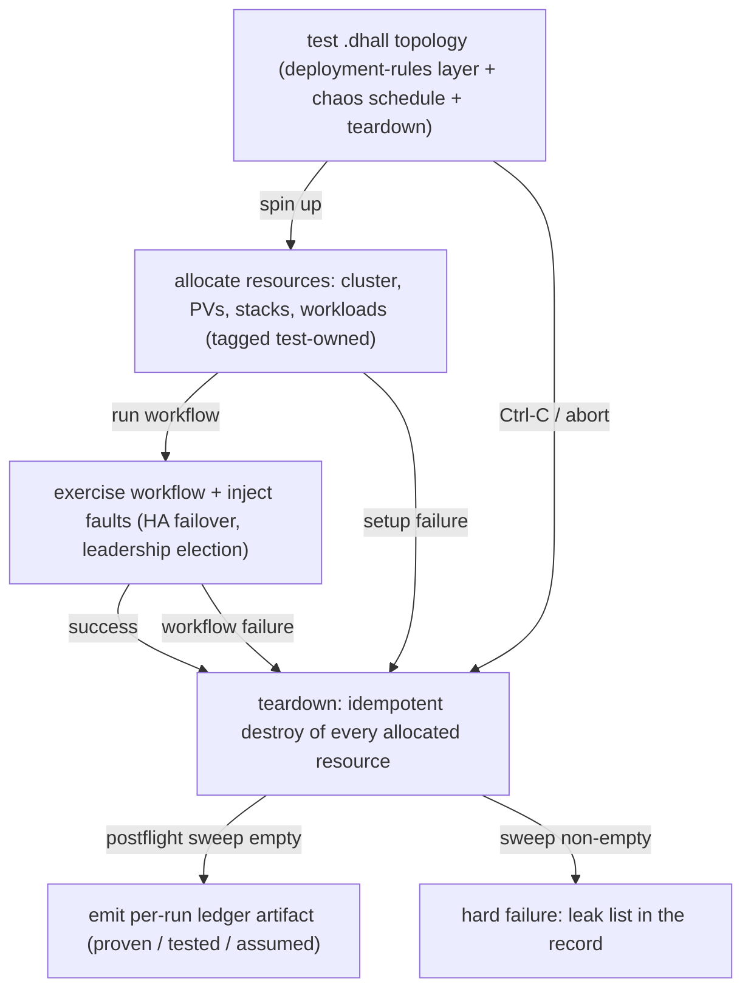
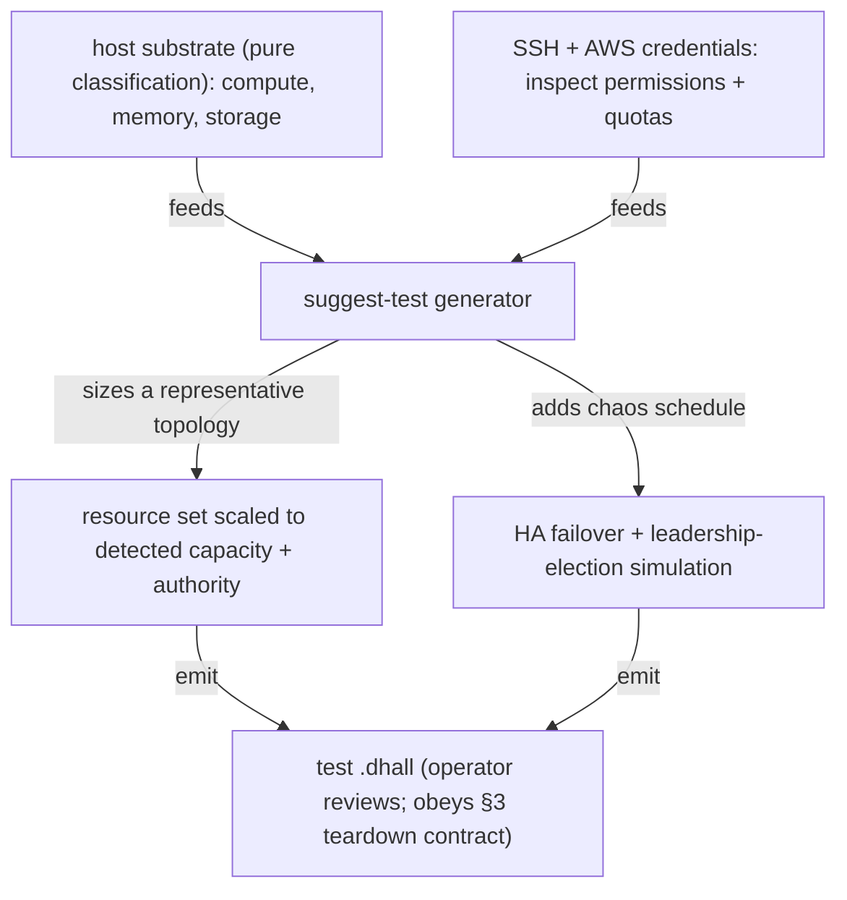

# Testing

**Status**: Authoritative source
**Supersedes**: N/A
**Referenced by**: documents/engineering/README.md, documents/engineering/app_vs_deployment_doctrine.md, documents/engineering/chaos_failover_doctrine.md, documents/engineering/cluster_lifecycle_doctrine.md, documents/engineering/content_addressing_doctrine.md, documents/engineering/monitoring_doctrine.md, documents/engineering/pulumi_iac_doctrine.md, documents/engineering/release_lifecycle_doctrine.md, documents/engineering/resource_capacity_doctrine.md, documents/engineering/single_logical_data_plane_doctrine.md, documents/engineering/storage_lifecycle_doctrine.md, documents/engineering/vault_pki_doctrine.md
**Generated sections**: none

> **Purpose**: Define amoebius testing as a self-tearing-down `InForceSpec` topology — spin up resources, run a
> workflow, **always** tear down — plus the `suggest-test` generator, flagged test credentials, the
> elevated harness as the sole deleter of durable storage, and the per-run proven/tested/assumed ledger
> artifact.

---

## 1. A test is an amoebius spec

**amoebius has no separate test framework — a test *is* an
amoebius deployment.** Everything amoebius already knows how to do — stand up a cluster, render typed
manifests from Dhall, place workloads, inject secrets, fail a leader over — is exactly the machinery a test
needs. So a test is not written in some second language with its own runner; it is written in the *same*
Dhall DSL, and it inherits the *same* illegal-state-unrepresentable guarantee. There is no "test mode" of
the type system that lets a test express a broken cluster the production DSL would reject. The test suite may itself be driven by an amoebius root cluster — the root stands up the test topology, runs the workflow, and tears it down, exactly as it rolls out any child manifest.

Concretely, amoebius tests are Dhall-authored `InForceSpec` topologies that spin up
resources, run the workflow, and tear down resources — there is no need for an explicit list of tests; what
is needed is a general test topology (which, by definition, always tears down the resources it creates). The
vision is emphatic that there is **no enumerated catalog of tests** to maintain — there is a *topology*, and
specific tests are values of it.

Three consequences fall straight out of "a test is a spec":

- **A test is a deployment-rules layer.** A test composes an app spec (or the platform itself) with a
  deployment-rules layer that adds two things the production layer omits: a **chaos/failover schedule** and
  a **mandatory teardown**. That chaos injection lives in deployment rules, never in application logic — the
  app under test does not know it is being tested — per
  [app_vs_deployment_doctrine.md](./app_vs_deployment_doctrine.md).
- **A test cannot represent an illegal cluster.** Because the test reuses the production DSL, a test
  `.dhall` that tried to mis-bind a PVC to no PV, open a backdoor ingress, or place a CUDA workload on a
  GPU-less substrate would fail to type-check before it ever ran — the same contract owned by
  [dsl_doctrine.md](./dsl_doctrine.md) / [illegal_state_catalog.md](./illegal_state_catalog.md).
- **The test runs the real thing.** There is no parallel mock cluster. A test stands up real platform
  services (or a representative subset) and runs a real workflow against them; the only thing that makes it
  a *test* rather than a deployment is the chaos schedule and the always-teardown contract of [§3](#3-the-test-topology-contract-spin-up--run--always-tear-down).

> **Honesty.** Test-as-an-`InForceSpec`-topology, `suggest-test`, flagged credentials, and the elevated
> storage-deleting harness are **Phase 11** in [../../DEVELOPMENT_PLAN/README.md](../../DEVELOPMENT_PLAN/README.md)
> and are **not started**. This document generalizes patterns *proven in the sibling prodbox project*
> (`prodbox/documents/engineering/unit_testing_policy.md`,
> `prodbox/documents/engineering/integration_fixture_doctrine.md`) into amoebius *design intent*. Per
> [documentation_standards.md §6](../documentation_standards.md#6-honesty-the-proventestedassumed-discipline), read every prescriptive statement here as
> a specification to be validated — evidence inherited from prodbox is evidence from a sibling system, never
> proof in amoebius. Sequencing, status, and gates live only in the development plan.

---

## 2. Three registers of amoebius testing

A defect can hide at three depths, and each depth needs a *different* kind of test, because
a test pitched at one depth is structurally blind to the others. amoebius keeps three registers, cheapest
first, and never confuses one for another.

| Register | What it exercises | Where it runs | Mocking posture |
|----------|-------------------|---------------|-----------------|
| **Pure** | DSL decoding, renderers, validation helpers, decision functions, DAG logic | in-process, no cluster | **none** — pure code never touches a mock |
| **Boundary integration** | The binary's CLI routing, subprocess behaviour, config load — through fake tools or controlled subprocesses | in-process + fake/real tool binaries | mocking only at the subprocess/interpreter boundary |
| **Test-`.dhall` topology** | The whole system: a real cluster spun up, a real workflow run, real chaos injected, then torn down | a live substrate ([§8](#8-one-substrate-per-validation)) | no mocks — the real platform |

The first two registers **generalize the prodbox interpreter-only mocking doctrine**: *pure code never
touches mocks; all mocking happens at the subprocess or interpreter boundary* — pure helpers, DAG logic,
and renderers are testable without mocks, and subprocess fakes live in a boundary suite, not deep inside
planning code. Prefer concrete typed values (real ADTs) over mocks whenever the code under test is pure.
The standard Haskell test stack (Cabal `test-suite` stanzas, `tasty`/HUnit/QuickCheck, golden tests,
`typed-process`, structured `bracket`/`finally` cleanup) is inherited from prodbox and pinned by the shared
toolchain owned by [../../DEVELOPMENT_PLAN/README.md](../../DEVELOPMENT_PLAN/README.md) (Toolchain) — this
doc does not restate the version pins.

The third register is the amoebius novelty and the subject of the rest of this document. It is where "a
test is a spec" ([§1](#1-a-test-is-an-amoebius-spec)) cashes out, and it is the only register that can prove the deployed system survives a
fault — at the cost of needing a live substrate and an honest teardown.

The blindness between registers is load-bearing, not incidental: a green pure suite says nothing about
whether the protocol those decisions compose into survives a real partition, and a green topology run says
nothing about the interleavings it did not inject. The three-layer correctness argument (Decision →
Protocol → Runtime) and the Extract → Model → Inject moves that guard them are owned by
[chaos_failover_doctrine.md](./chaos_failover_doctrine.md); this doc owns only the *test-delivery* shape of
the Runtime-layer (Inject) move — the topology that injects faults against a live amoebius cluster.

---

## 3. The test-topology contract: spin up → run → always tear down

**A test that can leak a resource cannot be
run twice.** If a failed run could strand an EBS volume, a hosted zone, or a live cluster, then every test
would silt up the substrate and the next run would start from a dirtier world than the last. amoebius
forecloses that by making teardown **structural**, not a final step whose execution is merely hoped for.

The contract has four clauses (generalized from prodbox's Pulumi-orchestrated infrastructure-test rules:
isolated ephemeral stacks, unique names per run, aggressive tagging, *always* teardown via
`bracket`/`finally`):

1. **Resource ownership is explicit and visible.** The topology that allocates a real resource owns its
   primary cleanup path, and that obligation is *in the spec*, not hidden behind ambient machine state. This
   is the prodbox fixture-ownership rule lifted to the `.dhall` surface: the code that creates owns the
   destroy.
2. **Teardown runs on every exit — success, failure, and Ctrl-C.** Teardown is wrapped in structured
   cleanup so an aborted or crashed run still reclaims what it built. "Always tears down" means *by
   construction of the topology type*, not by operator diligence.
3. **Destroy is idempotent.** Re-running a teardown (after a crash, or because the first attempt half-ran)
   converges to "nothing left," never errors on already-gone resources. The safe recovery from an
   interrupted run is to re-run the same topology, not to clean up by hand.
4. **A cleanup failure is a real failure.** A run whose workflow passed but whose teardown leaked does
   **not** report success. Cleanup errors are surfaced loudly to the operator; if both the workflow and the
   teardown fail, the workflow failure is reported first, but the leak is never swallowed. (prodbox
   integration-fixture rule: *cleanup failures are real failures*.)

The "no explicit list of tests" principle is what makes this a *contract* rather
than a checklist: amoebius does not maintain an enumerated test catalog that each could forget the teardown
clause. The teardown is a property of the topology *type*, so every value of it inherits the guarantee.

---

## 4. No skips, fail fast, and the per-run ledger artifact

**A skipped test that reports success misrepresents coverage — it is worse than a failing test, because it
passes while proving nothing.** amoebius adopts the prodbox skip policy verbatim in spirit — *skip/xfail is prohibited
by default; a missing prerequisite fails fast with an actionable error* — and then makes the honesty
machine-visible by emitting a ledger.

- **Fail fast on missing prerequisites; never skip.** Platform and credential gating belongs in
  prerequisite validation, not in a silent skip. If a topology needs a substrate, a credential, or a tool
  that is absent, the run *fails with a message naming what is missing* — it does not pass-with-a-skip.
- **Every run emits a proven/tested/assumed ledger artifact.** The development plan's phase discipline rule
  is absolute ([../../DEVELOPMENT_PLAN/README.md](../../DEVELOPMENT_PLAN/README.md),
  "Honest ledger"): *every validation emits a proven/tested/assumed ledger artifact*. This doc owns the
  *artifact* — that a topology run produces, as a first-class output beside its pass/fail, a record of which
  correctness layers it actually reached and at what strength. The artifact is the deliverable: it is the
  run's record of *what is known and how it is known*.
- **Skipping an applicable move marks that layer UNVERIFIED — never green.** This is the cardinal honesty
  rule, stated by the plan and inherited from the chaos doctrine: if a test move *applies* to a layer and
  the run does not perform it, the ledger records that layer as **UNVERIFIED**, not as silently passing. A
  topology that exercises a singleton-ownership invariant at the Decision layer but never injects the
  adversarial fault that targets it at the Runtime layer must say so — the Runtime layer is unverified, and
  the ledger says exactly that.
- **This ledger is the typed evidence a `PromotionGate` consumes.** The per-run proven/tested/assumed
  artifact is not only a record for the operator — it is the *input* a release `PromotionGate` reads to
  decide whether an environment pointer may advance. Advancing an `Environment` pointer (dev/staging → prod)
  **requires** the `Release`'s test-topology ledger to reach that environment's required evidence strength:
  **Prod requires the Runtime/chaos layer proven**, not merely a green Decision layer. It follows directly
  from the UNVERIFIED rule above that a **skipped-but-applicable layer BLOCKS prod promotion** — a layer
  recorded UNVERIFIED gives the advance constructor no evidence witness to consume, so promote-unverified→prod
  is **type-foreclosed unrepresentable** (mirroring the sibling infernix `.ready`-gated `ArtifactRef` idiom —
  sibling evidence, not an amoebius result). The `PromotionGate` type, the `Environment` promotion pointer,
  and the required-evidence-strength-per-environment mapping are **owned by**
  [release_lifecycle_doctrine.md §4](./release_lifecycle_doctrine.md#4-promotiongate-promote-unverifiedprod-is-unrepresentable); this doc owns only the ledger the gate
  reads. *(Design intent: the release lifecycle is Phase-0 reference doctrine and this ledger harness is
  Phase 11 / not started — read as a specification to be validated, never a proven amoebius result.)*
- **A Tier-1-only in-process ledger is structurally insufficient to advance a production `PromotionGate`.**
  The front-loaded Phase-1 formal-validation track
  ([../../DEVELOPMENT_PLAN/phase_01_formal_first_dsl_integrity.md](../../DEVELOPMENT_PLAN/phase_01_formal_first_dsl_integrity.md))
  emits this *same* proven/tested/assumed ledger, but from a purely **in-process** run — Dhall typecheck +
  Haskell decoder + QuickCheck + TLA+/TLC, with **no live substrate**. That is a **Tier-1 (design-time)
  artifact only**: it establishes that the spec composes and the protocol is sound in the abstract, and it
  leaves the **Runtime/chaos (Tier-2) layer UNVERIFIED by construction**, because a run that injected no fault
  against a live cluster performed no applicable Runtime move. By the UNVERIFIED rule above, such a
  Tier-1-only ledger is therefore **structurally insufficient to advance a production `PromotionGate`** —
  prod requires the Runtime/chaos layer *proven*, and an in-process ledger carries no Runtime witness for the
  advance constructor to consume, so "we validated the DSL in-process" cannot mean "the cluster enforces it."
  The two-tier split (Tier-1 design-time integrity vs. Tier-2 runtime-enforcement / correspondence integrity)
  is owned by [tla_modelling_assumptions.md](./tla_modelling_assumptions.md); the promotion-gate face of this
  fence is owned by
  [release_lifecycle_doctrine.md §4](./release_lifecycle_doctrine.md#4-promotiongate-promote-unverifiedprod-is-unrepresentable).

The **methodology and grammar** of the ledger — the Extract → Model → Inject moves, the
proven/tested/assumed strengths, and what each move can and cannot establish — are **owned by**
[chaos_failover_doctrine.md](./chaos_failover_doctrine.md) and must not be restated here. This doc owns only
the *per-run artifact contract*: that a topology run emits one, that it states the layer it reached, and
that a skipped-but-applicable move is recorded UNVERIFIED. The failure both docs forbid is the same —
**never report a tested or assumed result as proven.**

---

## 5. `suggest-test`: detect the world, emit a representative test `.dhall`

An operator should not have to hand-write a representative test from scratch for a machine
amoebius can simply *look at*. amoebius already detects what a host is and what credentials can do — so
`suggest-test` turns that introspection into a starting-point test topology the operator then reviews.

Per the original vision, `suggest-test`:

1. **Detects the current substrate** — including compute, memory, and storage available — using the same
   pure substrate classification owned by [substrate_doctrine.md](./substrate_doctrine.md) (detection is a
   fact about the host, never a knob).
2. **Takes SSH and AWS credentials and inspects what they can do** — the machine resources and the
   *permissions and quotas* associated with those credentials. It probes capability (whether these credentials
   can create EBS or a hosted zone, and how much) so the emitted test is *sized to what is actually reachable*, not a
   guess.
3. **Writes a test `.dhall`** that (a) spins up a **representative set of resources** scaled to the detected
   compute/memory/storage and the credential's authority, and (b) **simulates HA failovers and host-daemon
   leadership elections** as appropriate to the substrate.

Three boundaries keep `suggest-test` honest and within doctrine:

- **The output is a proposal, not an oracle.** `suggest-test` emits a *starting-point* test `.dhall` the
  operator reads, edits, and runs — it is a generator of representative topologies, never a self-certifying
  pass. The emitted topology is an ordinary test spec and inherits [§3](#3-the-test-topology-contract-spin-up--run--always-tear-down) (always tears down) and [§8](#8-one-substrate-per-validation) (one
  substrate) unconditionally.
- **It inspects credentials but never embeds them.** Although it *reads* SSH/AWS credentials to learn their
  authority, the test `.dhall` it writes references those credentials **by name only** — secrets never live
  in Dhall; the parent injects them into the child's Vault. The `SecretRef`-by-name contract and the
  parent-injects-into-child model are owned by [vault_pki_doctrine.md](./vault_pki_doctrine.md). A
  `suggest-test` output that inlined a credential would be unrepresentable.
- **The chaos schedule is deployment rules.** The HA-failover and leadership-election simulation it adds is
  attached on the deployment-rules surface, so the app under test is none the wiser — owned by
  [app_vs_deployment_doctrine.md](./app_vs_deployment_doctrine.md). The *mechanics* of leadership election
  and HA failover are owned by [daemon_topology_doctrine.md](./daemon_topology_doctrine.md) and
  [cluster_lifecycle_doctrine.md](./cluster_lifecycle_doctrine.md); `suggest-test` only *schedules* them
  into a topology.

---

## 6. Flagged test credentials

Per the original vision, the credentials used for testing (e.g. AWS deployments) need to be
specifically flagged, as is done in `~/prodbox`. A test must be able to do things
production must not — most sharply, *delete durable storage* ([§7](#7-the-elevated-harness-is-the-sole-deleter-of-durable-storage-leak-free-cycles)) — so the authority to do them must be a
**separate, marked** credential, never the everyday one acting in a test role.

amoebius adopts the prodbox `aws_admin_for_test_simulation` pattern, generalized:

- **Test credentials are a distinct, flagged identity.** The elevated authority a test harness uses is held
  under a credential explicitly flagged as test-simulation, separate from the normal-operation credentials a
  running cluster uses. Normal operation never holds the elevated authority; the test harness never runs
  workloads under the everyday credential. The boundary is an *identity* boundary, not a convention.
- **Test-generated resources carry a test flag.** All test-generated resources carry a flag for the harness
  to see, and these get deleted by the elevated test credentials. Every
  resource a topology allocates is tagged test-owned at creation, so the harness can later find *exactly*
  what it created and reclaim it without guessing — the basis of the leak-free sweep in [§7](#7-the-elevated-harness-is-the-sole-deleter-of-durable-storage-leak-free-cycles).
- **The flagged credential is still a secret-by-name.** The credential's *material* lives in Vault and is
  referenced from Dhall by name only, exactly as in [§5](#5-suggest-test-detect-the-world-emit-a-representative-test-dhall) — flagging changes *which* credential a test uses and
  *what it is allowed to do*, not *where the secret lives*. The vaulting and injection are owned by
  [vault_pki_doctrine.md](./vault_pki_doctrine.md).

The **create-vs-delete credential model** — whether normal-operation credentials are scoped to *create* but
not *delete* cloud storage, and how the elevated test credential is scoped to delete — is an open design
question and is **owned by** [pulumi_iac_doctrine.md](./pulumi_iac_doctrine.md).
This doc records only the testing-side requirement: the *destroy* authority over durable storage is withheld
from normal operation and granted only to the flagged elevated harness.

---

## 7. The elevated harness is the sole deleter of durable storage; leak-free cycles

The elevated-harness exception resolves a real tension. On one side, amoebius **forbids deleting durable data
under normal operation** — clusters are ephemeral, their storage is not, and an accidental delete loses
data the next bring-up needs. On the other side, **leak-free test cycles must
delete the storage they create**, or every run silts up the substrate forever. amoebius
reconciles the two by making harness deletion the **one** sanctioned exception.

The cardinal "no normal-operation deletion of durable data" rule, the retained `no-provisioner` PV model,
and the deterministic rebind it protects are **owned by**
[storage_lifecycle_doctrine.md](./storage_lifecycle_doctrine.md) ([§7](./storage_lifecycle_doctrine.md#7-deleting-durable-data-is-forbidden-under-normal-operation) and [§7.1](./storage_lifecycle_doctrine.md#71-the-single-exception-the-elevated-test-harness), which explicitly delegate the
exception to this doc). This doc owns the **exception mechanism**:

- **One deleter, one credential.** Only the **elevated test harness**, holding the flagged delete-capable
  credential of [§6](#6-flagged-test-credentials), may destroy durable storage — and only storage flagged test-owned. No normal-operation
  code path, and no non-harness test code path, can delete a retained PV or its backing bytes. The DSL
  surface exposes no "delete this durable volume" primitive at all; deletion is an *act of the harness*, not
  a value in a `.dhall`.
- **Flag, then sweep.** A leak-free cycle is: tag every allocated resource test-owned at creation ([§6](#6-flagged-test-credentials)); run
  the workflow; then have the elevated harness **sweep** for test-flagged resources and destroy exactly
  those. The sweep is scoped by the flag, so it can never reach a production volume — it is structurally
  incapable of deleting something it did not create.
- **A non-empty postflight sweep is a hard failure.** After teardown, the harness asserts the test-flagged
  resource set is **empty**. A leftover test-flagged resource is a leak, and a leak is a test failure with
  the leak list in the record — never a tolerated remnant. (This generalizes prodbox's postflight
  tag-sweep assertion: a non-empty sweep fails the run.) The honest counterpart, also inherited from
  prodbox, is that a *retained, by-design* resource is **not** a leak — only an *unflagged-or-unswept*
  remnant of a test is.
- **Pulumi mechanics are owned elsewhere.** Whether Pulumi *itself* destroys under the elevated credential,
  or the harness manually deletes the flagged resources and then destroys the Pulumi backend after a final
  sweep, is an open question and is **owned by**
  [pulumi_iac_doctrine.md](./pulumi_iac_doctrine.md). This doc fixes only the invariant both must satisfy:
  the durable-data destroy capability is exercised solely by the flagged elevated harness, solely on
  test-flagged resources, and the cycle ends with an empty sweep.

> **Honesty.** The flag-and-elevated-sweep mechanism above is a *design resolution* of an explicitly open
> question in the vision, not a built or tested amoebius capability. Treat
> the leak-free guarantee as a specification to be validated, never as a proven result. Delivery (Phase 11)
> is tracked in [../../DEVELOPMENT_PLAN/README.md](../../DEVELOPMENT_PLAN/README.md).

---

## 8. One substrate per validation

A test that silently falls back from one substrate to another proves nothing in particular —
which world it validated is no longer known. amoebius forbids the fallback: **a validation targets exactly
one substrate, named up front, and fails fast if that substrate's inputs are missing.**

The canonical rule — *at most one substrate (`apple` | `linux-cuda` | `linux-cpu` | `windows`) per
validation* — is **phase discipline owned by** [../../DEVELOPMENT_PLAN/README.md](../../DEVELOPMENT_PLAN/README.md)
(rule 3), and the substrate catalog is **owned by** [substrate_doctrine.md](./substrate_doctrine.md). This
doc owns the *testing consequences* of that rule, generalized from prodbox's fixtures-vs-substrate-config
doctrine:

- **A test topology is substrate-locked.** A single test `.dhall` targets one substrate; its validation
  logic carries **no substrate-conditional branching**. Full coverage across substrates is *several
  substrate-locked runs*, not one branchy run that flips between worlds.
- **Fail fast on missing per-substrate inputs; no silent fallback.** A topology that requires a substrate's
  real inputs (a hosted zone, a credential, a GPU) fails fast when they are absent — it does not quietly
  retarget the other substrate, and a fake-tool fixture does not satisfy a prerequisite that demands real
  infrastructure.
- **Fixtures are reusable across substrates; substrate config is not.** A *fixture* fakes a boundary (a CLI,
  a probe) and may be reused anywhere; a *substrate* is the real environment a topology targets. The two are
  not interchangeable — a fixture never silences a missing-substrate-config error. (This is the prodbox
  fixtures-vs-substrate-config distinction, inherited intact.)

What "at most one substrate per validation" buys is precisely the thing the ledger ([§4](#4-no-skips-fail-fast-and-the-per-run-ledger-artifact)) needs to stay
honest: when a run reports a layer proven on `linux-cpu`, it means proven *on `linux-cpu`* — not "proven
somewhere amoebius decided to retreat to."

---

## 9. What this doctrine does not own

To keep the SSoT boundaries crisp:

| Concern | Owned by |
|---------|----------|
| The Extract → Model → Inject moves, the proven/tested/assumed *methodology* and what each move establishes | [chaos_failover_doctrine.md](./chaos_failover_doctrine.md) |
| The async cross-cluster failover correctness obligation + TLA+/io-sim proof artifacts | [chaos_failover_doctrine.md](./chaos_failover_doctrine.md), [tla_modelling_assumptions.md](./tla_modelling_assumptions.md) |
| The retained `no-provisioner` PV model, deterministic rebind, and the cardinal "no normal-operation deletion" rule | [storage_lifecycle_doctrine.md](./storage_lifecycle_doctrine.md) |
| The create-vs-delete credential model and Pulumi create/destroy mechanics (MinIO backend, Vault-envelope) | [pulumi_iac_doctrine.md](./pulumi_iac_doctrine.md) |
| The `PromotionGate`, the `Environment` promotion pointer, and each environment's required evidence strength (the gate that *consumes* this doc's [§4](#4-no-skips-fail-fast-and-the-per-run-ledger-artifact) ledger) | [release_lifecycle_doctrine.md](./release_lifecycle_doctrine.md) ([§4](#4-no-skips-fail-fast-and-the-per-run-ledger-artifact)) |
| That chaos injection lives in deployment rules; the app/deployment dividing line | [app_vs_deployment_doctrine.md](./app_vs_deployment_doctrine.md) |
| Secrets-by-name, `SecretRef`, parent-injects-into-child Vault | [vault_pki_doctrine.md](./vault_pki_doctrine.md) |
| Substrate detection and the substrate catalog | [substrate_doctrine.md](./substrate_doctrine.md) |
| Leadership-election and HA-failover mechanics the topologies exercise | [daemon_topology_doctrine.md](./daemon_topology_doctrine.md), [cluster_lifecycle_doctrine.md](./cluster_lifecycle_doctrine.md) |
| Making an illegal test cluster unrepresentable | [dsl_doctrine.md](./dsl_doctrine.md), [illegal_state_catalog.md](./illegal_state_catalog.md) |
| Phase order, the "at most one substrate per validation" rule as phase discipline, the toolchain pin | [../../DEVELOPMENT_PLAN/README.md](../../DEVELOPMENT_PLAN/README.md) |

---

## 10. Planning ownership

This document is normative testing doctrine only. Delivery sequencing, completion status, validation gates,
and remaining work — the test-topology DSL, `suggest-test`, flagged credentials, the elevated
storage-deleting harness, and the per-run ledger artifact — are owned by
[../../DEVELOPMENT_PLAN/README.md](../../DEVELOPMENT_PLAN/README.md) (Phase 11; with the cross-cluster
failover proof artifacts in Phase 9). This doc never maintains a competing status ledger; it states the
target shape and links back for status. Per [documentation_standards.md §6](../documentation_standards.md#6-honesty-the-proventestedassumed-discipline),
no statement here is a proven amoebius result: the model generalizes patterns proven in prodbox into
amoebius design intent.

---

## Cross-references

- [Engineering Doctrine Index](./README.md)
- [Chaos / Failover Doctrine](./chaos_failover_doctrine.md)
- [Storage Lifecycle Doctrine](./storage_lifecycle_doctrine.md)
- [Pulumi IaC Doctrine](./pulumi_iac_doctrine.md)
- [Release Lifecycle Doctrine](./release_lifecycle_doctrine.md)
- [Application Logic vs Deployment Rules](./app_vs_deployment_doctrine.md)
- [Substrate Doctrine](./substrate_doctrine.md)
- [Vault / PKI Doctrine](./vault_pki_doctrine.md)
- [Daemon Topology Doctrine](./daemon_topology_doctrine.md)
- [DSL Doctrine](./dsl_doctrine.md)
- [Illegal State Catalog](./illegal_state_catalog.md)
- [Development Plan](../../DEVELOPMENT_PLAN/README.md)
- [Documentation Standards](../documentation_standards.md)
