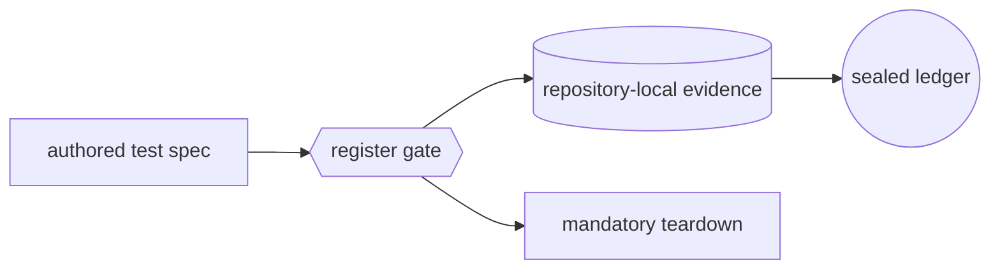
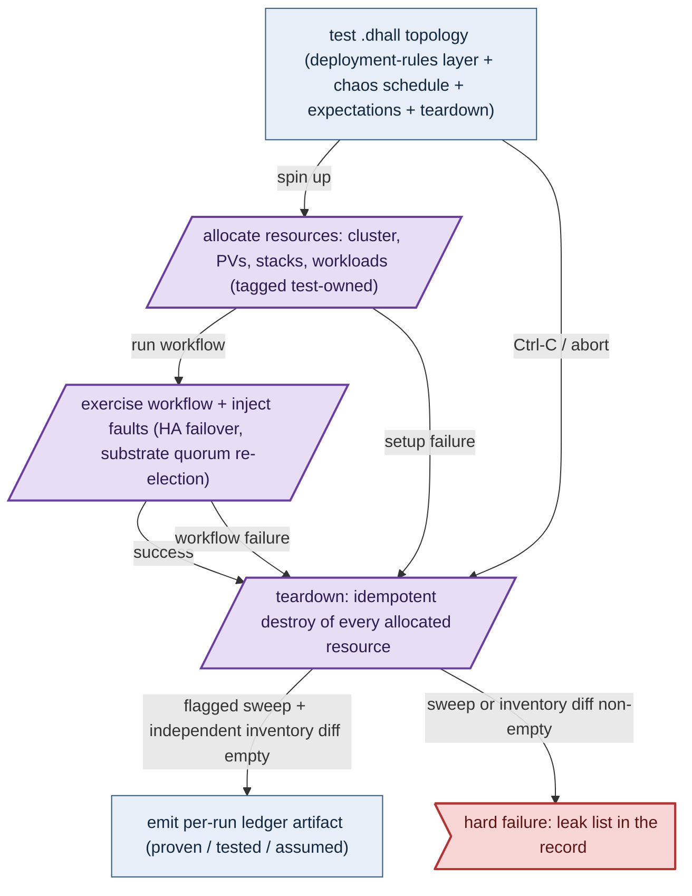
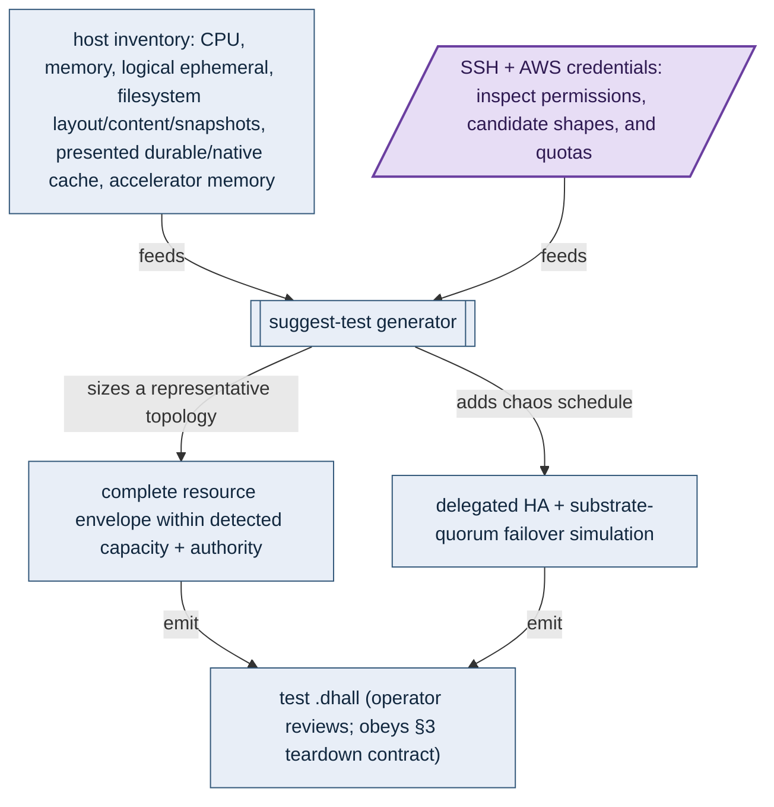
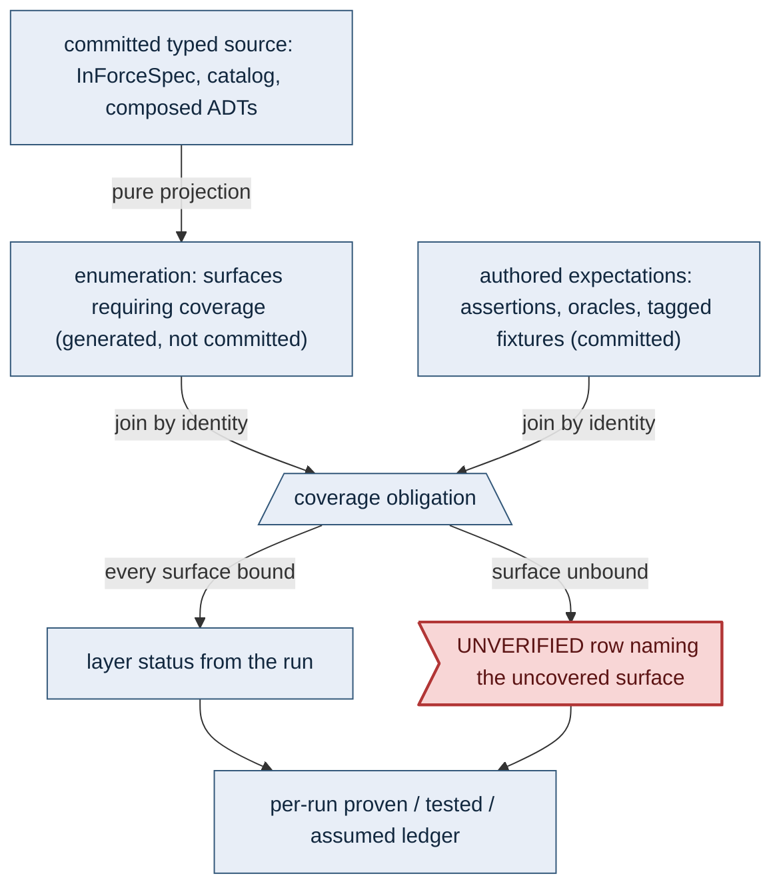

# Testing

> **Purpose**: Define amoebius testing as a self-tearing-down `InForceSpec` topology — spin up resources, run a
> workflow, **always** tear down — plus the `suggest-test` generator, flagged test credentials, the
> elevated harness as the sole automated deleter of test-owned durable storage, and the per-run
> proven/tested/assumed ledger
> artifact.
> **Read this if**: a validation has to be designed, or an existing claim has to be read for what it actually establishes.

This document owns how amoebius validates itself: the registers of evidence, the test-topology contract, and
the rule that a specification generates the coverage enumeration while a human authors the expectation. It
does not own the honesty vocabulary those claims are phrased in, owned by
[documentation_standards.md §6](../documentation_standards.md#6-honesty-the-proventestedassumed-discipline),
nor the phase gates that consume its registers, owned by
[`../../DEVELOPMENT_PLAN/README.md`](../../DEVELOPMENT_PLAN/README.md).

Link-graph metadata

**Status**: Authoritative source
**Supersedes**: N/A
**Referenced by**: DEVELOPMENT_PLAN/README.md, DEVELOPMENT_PLAN/development_plan_phase_model.md, DEVELOPMENT_PLAN/overview.md, DEVELOPMENT_PLAN/phase_00_documentation_suite.md, DEVELOPMENT_PLAN/phase_01_toolchain_spike.md, DEVELOPMENT_PLAN/phase_03_host_assert_cli.md, DEVELOPMENT_PLAN/phase_04_host_ensure_kernel.md, DEVELOPMENT_PLAN/phase_06_linux_engine_bringup.md, DEVELOPMENT_PLAN/phase_08_windows_engine_bringup.md, DEVELOPMENT_PLAN/phase_12_gadt_decode_ir.md, DEVELOPMENT_PLAN/phase_13_illegal_state_corpus.md, DEVELOPMENT_PLAN/phase_14_capacity_core_folds.md, DEVELOPMENT_PLAN/phase_15_storage_geometry_folds.md, DEVELOPMENT_PLAN/phase_16_execution_accelerator_folds.md, DEVELOPMENT_PLAN/phase_17_capability_bind.md, DEVELOPMENT_PLAN/phase_18_provision_seal.md, DEVELOPMENT_PLAN/phase_19_inference_accelerator_provision.md, DEVELOPMENT_PLAN/phase_20_render_manifest_goldens.md, DEVELOPMENT_PLAN/phase_21_chain_kernel_boundary.md, DEVELOPMENT_PLAN/phase_27_ui_authorization_kernel.md, DEVELOPMENT_PLAN/phase_31_ui_browser_interpreter.md, DEVELOPMENT_PLAN/phase_32_ui_server_boundary.md, DEVELOPMENT_PLAN/phase_33_ui_local_composition.md, DEVELOPMENT_PLAN/phase_34_encrypted_browser_runtime.md, DEVELOPMENT_PLAN/phase_36_base_image_registry.md, DEVELOPMENT_PLAN/phase_37_object_reconciler.md, DEVELOPMENT_PLAN/phase_38_capacity_scheduler.md, DEVELOPMENT_PLAN/phase_39_retained_storage.md, DEVELOPMENT_PLAN/phase_41_platform_backbone.md, DEVELOPMENT_PLAN/phase_42_platform_services_2.md, DEVELOPMENT_PLAN/phase_45_app_tenancy.md, DEVELOPMENT_PLAN/phase_47_user_tenant_isolation_live.md, DEVELOPMENT_PLAN/phase_48_content_store_workflow.md, DEVELOPMENT_PLAN/phase_49_ui_projection_runtime.md, DEVELOPMENT_PLAN/phase_50_release_lifecycle.md, DEVELOPMENT_PLAN/phase_53_multicluster_spawn_georepl.md, DEVELOPMENT_PLAN/phase_54_gateway_migration_drills.md, DEVELOPMENT_PLAN/phase_55_provider_deploy_checkpoint.md, DEVELOPMENT_PLAN/phase_56_provider_child_bringup.md, DEVELOPMENT_PLAN/phase_57_provider_ebs_credential.md, DEVELOPMENT_PLAN/phase_58_provider_dynamic_nodes.md, DEVELOPMENT_PLAN/phase_59_determinism_jitcache.md, DEVELOPMENT_PLAN/phase_60_infernix_lift.md, DEVELOPMENT_PLAN/phase_62_test_topology_dsl.md, DEVELOPMENT_PLAN/phase_63_ui_single_tenant_live.md, DEVELOPMENT_PLAN/phase_64_ui_multi_tenant_live.md, DEVELOPMENT_PLAN/phase_66_ui_ha_multizone.md, DEVELOPMENT_PLAN/phase_67_offline_replay_receipts.md, DEVELOPMENT_PLAN/phase_68_offline_blobs_isolation.md, DEVELOPMENT_PLAN/phase_69_offline_release_evolution.md, DEVELOPMENT_PLAN/phase_70_offline_multizone_continuity.md, DEVELOPMENT_PLAN/phase_71_jitml_lift_cuda.md, DEVELOPMENT_PLAN/system_components.md, README.md, documents/engineering/README.md, documents/engineering/app_vs_deployment_doctrine.md, documents/engineering/bootstrap_sequence_doctrine.md, documents/engineering/browser_offline_runtime_doctrine.md, documents/engineering/chaos_failover_doctrine.md, documents/engineering/chaos_failover_worked_examples.md, documents/engineering/cluster_lifecycle_doctrine.md, documents/engineering/conformance_harness_doctrine.md, documents/engineering/content_addressing_doctrine.md, documents/engineering/deterministic_simulation_doctrine.md, documents/engineering/generated_artifacts_doctrine.md, documents/engineering/inforcespec_migration_doctrine.md, documents/engineering/monitoring_doctrine.md, documents/engineering/preflight_validation_doctrine.md, documents/engineering/pulumi_ebs_credential_model.md, documents/engineering/pulumi_iac_doctrine.md, documents/engineering/release_lifecycle_doctrine.md, documents/engineering/repository_layout_doctrine.md, documents/engineering/resource_capacity_sources.md, documents/engineering/single_logical_data_plane_doctrine.md, documents/engineering/storage_lifecycle_doctrine.md, documents/engineering/test_derivation_analysis.md, documents/engineering/testing_spoof_resistance.md, documents/engineering/ui_realtime_coordination_doctrine.md, documents/engineering/validation_frame_doctrine.md, documents/engineering/vault_pki_doctrine.md, documents/glossary.md, documents/illegal_state/illegal_state_lifecycle.md, documents/illegal_state/illegal_state_techniques.md, documents/reading_order.md
**Generated sections**: none

> **Historical result (invalidated).** Phase-run and implementation-result statements predate the 2026-08-11 reopen unless the owning phase is Done; target doctrine remains normative, and current state is in the [tracker](../../DEVELOPMENT_PLAN/README.md).

## Contents
- [1. A test is an amoebius spec](#1-a-test-is-an-amoebius-spec)
- [2. The registers of amoebius testing](#2-the-registers-of-amoebius-testing)
- [3. The test-topology contract: spin up → run → always tear down](#3-the-test-topology-contract-spin-up--run--always-tear-down)
- [4. No skips, fail fast, and the per-run ledger artifact](#4-no-skips-fail-fast-and-the-per-run-ledger-artifact)
- [5. `suggest-test`: detect the world, emit a representative test `.dhall`](#5-suggest-test-detect-the-world-emit-a-representative-test-dhall)
- [6. Flagged test credentials](#6-flagged-test-credentials)
- [7. The elevated harness is the sole automated deleter of test-owned durable storage; leak-free cycles](#7-the-elevated-harness-is-the-sole-automated-deleter-of-test-owned-durable-storage-leak-free-cycles)
- [8. One substrate per validation](#8-one-substrate-per-validation)
- [9. Derivation: generated enumeration, authored expectation](#9-derivation-generated-enumeration-authored-expectation)
- [10. What this doctrine does not own](#10-what-this-doctrine-does-not-own)
- [11. Planning ownership](#11-planning-ownership)
- [12. Spoof-resistant evidence](#12-spoof-resistant-evidence)
- [13. End-to-end tests run in the Playwright image, against three browsers](#13-end-to-end-tests-run-in-the-playwright-image-against-three-browsers)
- [Related Documents](#related-documents)

---

```mermaid
flowchart LR
%% register: orientation
  spec["authored test spec"] --> gate{{"register gate"}}
  gate --> evidence[("repository-local evidence")]
  evidence --> ledger(("sealed ledger"))
  gate --> teardown["mandatory teardown"]
```

*Orientation: one authored topology drives the register gate, evidence, ledger, and teardown owned by [§3](#3-the-test-topology-contract-spin-up--run--always-tear-down).*

## 1. A test is an amoebius spec

**amoebius has no separate test framework — a test *is* an amoebius deployment.** Everything amoebius
already knows how to do — stand up a cluster, render typed manifests from Dhall, place workloads, inject
secrets, fail a leader over — is exactly the machinery a test needs. So a test is not written in some second
language with its own runner; it is written in the *same* Dhall DSL, and it inherits the *same*
illegal-state-unrepresentable guarantee. There is no "test mode" of the type system that lets a test express
a broken cluster the production DSL would reject. The test suite may itself be driven by an amoebius root
cluster — the root stands up the test topology, runs the workflow, and tears it down, exactly as it rolls
out any child manifest.

Concretely, amoebius tests are Dhall-authored `InForceSpec` topologies that spin up
resources, run the workflow, and tear down resources — there is no need for an explicit list of tests; what
is needed is a general test topology (which, by definition, always tears down the resources it creates). The
vision is emphatic that there is **no enumerated catalog of tests** to maintain — there is a *topology*, and
specific tests are values of it.

Three consequences fall straight out of "a test is a spec":

- **A test is a deployment-rules layer.** A test composes an app spec (or the platform itself) with a
  deployment-rules layer that adds three things the production layer omits: a **chaos/failover schedule**, a
  typed **expectation surface** (the `Expectation` values of
  [chaos_failover_doctrine.md §11.2](./chaos_failover_doctrine.md#112-the-typed-expectation-surface-expectation),
  which state what the injected faults must not break), and a **mandatory teardown**. That chaos injection
  lives in deployment rules, never in application logic — the
  app under test does not know it is being tested — per
  [app_vs_deployment_doctrine.md](./app_vs_deployment_doctrine.md).
- **A test cannot reach execution with an illegal cluster.** Because the test reuses the production DSL and
  conditional post-bind infrastructure/materialization/provision boundary, a `.dhall` value that mis-binds a
  PVC, opens a backdoor ingress, or pairs a
  CUDA workload with a GPU-less substrate is rejected at its declared dhall-typecheck, gadt-decode, or `provision-seal`
  locus before it runs. The CUDA pairing is a structured `ProvisionError` at the provision seal, not a claim
  that value arithmetic fails Dhall
  type-checking — the contract is owned by [dsl_doctrine.md](./dsl_doctrine.md),
  [resource_capacity_doctrine.md](./resource_capacity_doctrine.md), and
  [illegal_state_catalog.md](../illegal_state/illegal_state_catalog.md).
- **The test runs the real thing.** There is no parallel mock cluster. A test stands up real platform
  services (or a representative subset) and runs a real workflow against them; the only things that make it
  a *test* rather than a deployment are the chaos schedule, the expectation surface, and the always-teardown
  contract of [§3](#3-the-test-topology-contract-spin-up--run--always-tear-down).

> **Honesty.** Phase 62 implements the topology, suggestion, credential, runner, inventory, delete-authorization,
> and ledger kernels; its scoped live run proves host-process cleanup and untagged-leak detection. Kubernetes,
> retained backing deletion, Pulsar takeover, and Vault/AWS authority remain **UNVERIFIED**. Status is owned by
> [../../DEVELOPMENT_PLAN/README.md](../../DEVELOPMENT_PLAN/README.md); prodbox remains sibling evidence. Per
> [documentation_standards.md §6](../documentation_standards.md#6-honesty-the-proventestedassumed-discipline), read every prescriptive statement here as
> a specification to be validated — evidence inherited from prodbox is evidence from a sibling system, never
> proof in amoebius. Sequencing, status, and gates live only in the development plan.

---

## 2. The registers of amoebius testing

Phase 21 supplies a concrete composite example: Register 1 renders and byte-locks the pure `[Step]` plan with
zero actions, while Register 2 invokes the real executable against subprocess recorders and compares exact
argv/stdin transcripts. Neither result is a Register-3 live-substrate claim.

A defect can hide at three depths, and each depth needs a *different* kind of test, because
a test pitched at one depth is structurally blind to the others. amoebius keeps **three phase-gate registers**
— 1, 2 and 3 — plus the **Register-2.5 deterministic-simulation activity** between the second and third.
The numbering is fixed here and used unchanged everywhere: a phase gate keys to exactly one of 1, 2 or 3, and
never to 2.5 ([`development_plan_standards.md §K`](../../DEVELOPMENT_PLAN/development_plan_standards.md#k-honesty-proven--tested--assumed)).
Cheapest first, and never confuse one for another.

| Register | Name | What it exercises | Where it runs | Mocking posture |
|----------|------|-------------------|---------------|-----------------|
| **1** | **Pure** | DSL decoding, renderers, validation helpers, decision functions, DAG logic | in-process, no cluster; a pinned hermetic checker over committed source (e.g. TLC) counts as Register 1 | **none** — pure code never touches a mock |
| **2** | **Boundary integration** | The binary's CLI routing, subprocess behaviour, config load — through fake tools or controlled subprocesses | in-process + fake/real tool binaries | mocking only at the subprocess/interpreter boundary |
| **2.5** | **Deterministic simulation** (an activity, never a phase gate) | The **real** daemon/reconciler code (lifted onto `io-classes`) run under `IOSim`/`IOSimPOR` against a modeled, fault-injectable environment — concurrent schedules + injected partition/reorder/redelivery/crash, deterministically replayable | in-process, no cluster | no mocks — the *real* code against *modeled* substrates (fake Pulsar/MinIO/apiserver/route53/Vault/clock) |
| **3** | **Test-`.dhall` topology** | The whole system: a real cluster spun up, a real workflow run, real chaos injected, then torn down | a live substrate ([§8](#8-one-substrate-per-validation)) | no mocks — the real platform |

**Register 2.5 — deterministic simulation** sits between the boundary register and the live topology. It runs
the *real* daemon/reconciler code — written once against `io-classes` so one source is both the production
daemon (`m = IO`) and the model under test (`m = IOSim s`) — under `IOSimPOR` against modeled, fault-injectable
substrates, so a rare concurrent interleaving or environment fault becomes a **deterministically replayable**
counterexample rather than a once-a-month live flake. It is not a mock in the prohibited sense: the *code* is
real; only the *substrates* are modeled, and the fidelity of those models to the real Pulsar/apiserver/route53
is an explicit assumed premise discharged by a narrow live conformance check. The mechanics, the fault model,
and the honesty tradeoff are owned by
[deterministic_simulation_doctrine.md](./deterministic_simulation_doctrine.md); this doc owns only the register
*definition* above.

[Phase 22](../../DEVELOPMENT_PLAN/phase_22_deterministic_sim_substrate.md) builds the substrate serving this
activity and gates it at Register 2 with a reference reconciler. Its ledger marks modeled-schedule invariants
tested, model fidelity assumed, and live runtime unverified; later phases supply their own Register-2.5 runs.

The first two registers **generalize the prodbox interpreter-only mocking doctrine**: *pure code never
touches mocks; all mocking happens at the subprocess or interpreter boundary* — pure helpers, DAG logic,
and renderers are testable without mocks, and subprocess fakes live in a boundary suite, not deep inside
planning code. Prefer concrete typed values (real ADTs) over mocks whenever the code under test is pure.
The standard Haskell test stack (Cabal `test-suite` stanzas, `tasty`/HUnit/QuickCheck, golden tests,
`typed-process`, structured `bracket`/`finally` cleanup) is inherited from prodbox and pinned by the shared
toolchain owned by [../../DEVELOPMENT_PLAN/README.md](../../DEVELOPMENT_PLAN/README.md) (Toolchain) — this
doc does not restate the version pins.

**Register-1 ledger instance now validated.** Phase 12's `dsl-spec` gate is the concrete no-cluster decode
instance: five semantic-hash-pinned positives, three distinct tagged negatives, three compile-fail index
pairs, an executed legalized-negative red run, and 5,527 exact structural rows. It emits the ordinary
decision/protocol/runtime ledger with only the recorded spec-decode surface proven for the model and runtime
fidelity UNVERIFIED (ledger `external-run-reference`).

**Validation-locus projection now validated.** Phase 13 joins every catalog entry and named subcase
against the independently authored registry, discharging the dhall-typecheck/gadt-decode subcases whose owners have
been reached and recording an exact-owner deferral for the rest; the counts are a dated observation and live
in the [tracker](../../DEVELOPMENT_PLAN/README.md), not here. Its four infinite-domain QuickCheck properties are
labelled **TESTED (sampled)** under `checkCoverage`; only the finite three-arm `Rke2Servers` enumeration is
labelled **PROVEN (exhausted)**. This Register-1 result establishes spec composition at the registered loci;
model-to-runtime correspondence and runtime fidelity remain **UNVERIFIED** (ledger
`dynamically-resolved`).

**Base capacity/topology Register-1 instance now validated.** The [Phase 14 gate](../../DEVELOPMENT_PLAN/phase_14_capacity_core_folds.md)
adds 15 direct fold negatives with 15 legal twins, two decoded-and-placed positive specs, three dhall-typecheck pairs,
seven compile-index pairs, an exhausted 3×3 compatibility matrix, and four sampled QuickCheck properties
whose independent witness validator never calls the placement implementation. Every property meets its
accept/reject coverage floor, all 19 seeded mutants turn red, and all 11 Phase-14-owned registry subcases
carry evidence at their exact loci. Compile exhaustiveness is proven for the base modules; infinite-domain
properties remain **TESTED (sampled)**, and runtime fidelity remains **UNVERIFIED** (ledger
`dynamically-resolved`).

**Storage-geometry Register-1 instance now validated.** The [Phase 15 gate](../../DEVELOPMENT_PLAN/phase_15_storage_geometry_folds.md)
checks 27 exact negative/twin variants under five stable storage families, two decoded positive specs, and two
dhall-typecheck bounded-training pairs. Six independently calculated equivalence properties satisfy their accept/reject
coverage floors, all 31 mutants turn red, and all five Phase-15-owned registry subcases carry exact-locus
evidence. Compile totality is proven for the five storage modules; infinite arithmetic domains remain
**TESTED (sampled)**. Live backing observation/mutation and model-to-runtime correspondence remain
**UNVERIFIED** (ledger `external-run-reference`).

**Full-vector Register-1 instance now validated.** The [Phase 16 gate](../../DEVELOPMENT_PLAN/phase_16_execution_accelerator_folds.md)
checks 32 exact negative/twin variants spanning eighteen stable families, one accelerator-owner dhall-typecheck pair,
and two decoded composed positives. Seven independent properties meet the decision folds' accept/reject floors,
all 45 committed mutants turn red, and both Phase-16-owned registry rows have exact-locus evidence. Compiler
exhaustiveness covers the ten owner modules; scheduler, storage, accelerator, and provider runtime fidelity
remain **UNVERIFIED** (ledger `external-run-reference`).

**First complete Register-3 application now validated — sealed 2026-08-14.** The
[Phase 36 gate](../../DEVELOPMENT_PLAN/phase_36_base_image_registry.md) composes the pure image/registry
decisions, the capability-gated bootstrap/publication protocol, and live runtime observations on the
`linux-cpu` substrate. Its independent OS-boundary evidence pairs a successful exact in-cluster digest pull
with an `ErrImagePull`/`ImagePullBackOff` public canary under an enforcing node firewall, records firewall
drops and zero established public-registry connections, and reruns the committed no-op-policy mutant. The
ledger marks Decision, Protocol, and Runtime tested for the enumerated Phase-36 boundary while keeping the
Phase-37 reconciler correspondence and Phase-41 MinIO rehome **UNVERIFIED**; the ledger itself is written into
that run's bundle and bound to its source snapshot, never into this document.

The third register is the amoebius novelty and the subject of the rest of this document. It is where "a
test is a spec" ([§1](#1-a-test-is-an-amoebius-spec)) cashes out, and it is the only register that can prove the deployed system survives a
fault — at the cost of needing a live substrate and an honest teardown.

The blindness between registers is load-bearing, not incidental: a green pure suite says nothing about
whether the protocol those decisions compose into survives a real partition, and a green topology run says
nothing about the interleavings it did not inject. The three-layer correctness argument (Decision →
Protocol → Runtime) and the Extract → Model → Inject moves that guard them are owned by
[chaos_failover_doctrine.md](./chaos_failover_doctrine.md); this doc owns only the *test-delivery* shape of
the Runtime-layer (Inject) move — the topology that injects faults against a live amoebius cluster.

---

## 3. The test-topology contract: spin up → run → always tear down

**A test that can leak a resource cannot be run twice.** If a failed run could strand an EBS volume, a
hosted zone, or a live cluster, then every test would silt up the substrate and the next run would start
from a dirtier world than the last. amoebius forecloses that by making teardown **structural**, not a final
step whose execution is merely hoped for.

Before those lifecycle clauses apply, **tests have one physical root and may not touch production**. The
harness resolves the checkout root, creates `.test_data/runs/<run-id>/`, writes an exclusive ownership marker,
and redirects every subordinate temp, cache, kubeconfig, virtual disk, container-engine, and service-state path
beneath it. Before setup it fails if the selected root resolves beneath `.data/**`, if production configuration
is present, or if the ownership marker already exists. It never falls back to `/tmp`, `/var/tmp`, a user home,
or global Docker.

The lifecycle contract then has four clauses (generalized from prodbox's Pulumi-orchestrated
infrastructure-test rules: isolated ephemeral stacks, unique names per run, aggressive tagging, *always*
teardown via `bracket`/`finally`):

1. **Resource ownership is explicit and visible.** The topology that allocates a real resource owns its
   primary cleanup path, and that obligation is *in the spec*, not hidden behind ambient machine state. This
   is the prodbox fixture-ownership rule lifted to the `.dhall` surface: the code that creates owns the
   destroy.
2. **Teardown runs on every exit — success, failure, and Ctrl-C.** Teardown is wrapped in structured
   cleanup so an aborted or crashed run still reclaims what it built. "Always tears down" means *by
   construction of the topology type*, not by operator diligence.
3. **Destroy is idempotent and path-exact.** Re-running teardown converges to "nothing left." The harness may
   delete only the exact run root it created after re-resolving it beneath `.test_data/runs/**` and verifying
   its ownership marker. A missing, replaced, or edited marker quarantines the root and fails the run rather
   than broadening deletion.
4. **A cleanup failure is a real failure.** A run whose workflow passed but whose teardown leaked does
   **not** report success. Cleanup errors are surfaced loudly to the operator; if both the workflow and the
   teardown fail, the workflow failure is reported first, but the leak is never swallowed. (prodbox
   integration-fixture rule: *cleanup failures are real failures*.)

Diagram vocabulary: [diagram_conventions.md](./diagram_conventions.md).

```mermaid
flowchart TD
%% register: algebra
  spec["test .dhall topology (deployment-rules layer + chaos schedule + expectations + teardown)"]:::intent -->|spin up| up[/"allocate resources: cluster, PVs, stacks, workloads (tagged test-owned)"/]:::effect
  up -->|run workflow| run[/"exercise workflow + inject faults (HA failover, substrate quorum re-election)"/]:::effect
  run -->|success| down[/"teardown: idempotent destroy of every allocated resource"/]:::effect
  run -->|workflow failure| down
  up -->|setup failure| down
  spec -->|Ctrl-C / abort| down
  down -->|flagged sweep + independent inventory diff empty| ledger["emit per-run ledger artifact (proven / tested / assumed)"]:::intent
  down -->|sweep or inventory diff non-empty| fail>"hard failure: leak list in the record"]:::refuse
  classDef intent   fill:#e8eef7,stroke:#33587a,color:#12283f,stroke-width:1px
  classDef effect   fill:#e7ddf5,stroke:#6b3fa0,color:#2f1a52,stroke-width:2px
  classDef refuse   fill:#f8d6d6,stroke:#b23636,color:#5c1414,stroke-width:2px
```
*Phase-62 scoped result: the structured host runner and external temporary-scope diff exercise the failure sink; cluster/provider allocation and reclamation remain UNVERIFIED.*

The "no explicit list of tests" principle is what makes this a *contract* rather
than a checklist: amoebius does not maintain an enumerated test catalog that each could forget the teardown
clause. The teardown is a property of the topology *type*, so every value of it inherits the guarantee.

---

## 4. No skips, fail fast, and the per-run ledger artifact

A skipped test that reports success misrepresents coverage. amoebius prohibits skip and expected-failure
success by default. A missing prerequisite fails with an actionable error that names the missing substrate,
credential, authority, or tool.

Every run emits a structured run bundle beneath `.build/runs/<phase>/<run-id>/`. The bundle contains the
proven/tested/assumed ledger, generated surface enumeration, checks, mutants, coverage, command, resolved
toolchain and dependency graph, substrate observation, cleanup result, and raw-observation references. It is
generated run evidence and is never version-controlled.

The ledger schema records these independent axes:

- `layers` records Decision, Protocol, and Runtime strength as `proven`, `proven-for-the-model`, `tested`,
  `assumed`, or `UNVERIFIED`.
- `coverage` joins each runtime-enumerated surface to an independently authored expectation and records the
  reached strength or `UNVERIFIED`.
- `register` and `substrate` identify the validation boundary that actually ran.
- `checks`, `mutants`, and `cleanup` record concrete outcomes, not aggregate success claims.

A ledger linter validates the run bundle before upload. It requires the register and substrate declared by
the phase contract, rejects an unknown enumerated surface, and requires every layer outside the reached
register to remain `UNVERIFIED`. A substrate-`none` design gate may report `proven-for-the-model`, never
runtime proof.

The immutable repository-local attestation binds the source-snapshot digest, phase contract, gate command,
resolved dependencies, toolchain, substrate, runtime bundle, and cleanup outcome. Git contains no ledger,
receipt, enumeration, log, trace, report, screenshot, resolved path, or copied attestation. The complete
placement and retention contract is owned by
[repository_layout_doctrine.md §5](./repository_layout_doctrine.md#5-run-evidence-and-phase-status).

A phase status may move to Done only after the repository-local attestation verifies against the run's recorded
source-snapshot digest and the gate leaves the authored tree unchanged. The digest is what binds a result to
the source that produced it; whether that source is committed, and when, is the operator's own business and
never a gate condition.

Skipping an applicable move records `UNVERIFIED`; it never produces a green substitute. The same rule applies
to an enumerated surface lacking an authored expectation, a missing observer, a skipped mutant, incomplete
cleanup, and an unavailable specialized substrate. A baseline `linux-cpu` route remains available on every
hardware substrate, but it cannot stand in for an Apple or Linux-CUDA claim.

The generated ledger remains the typed evidence consumed by a `PromotionGate`. Production promotion requires
the Runtime/chaos layer at `tested`; a design-only or Runtime-`UNVERIFIED` attestation cannot construct that
transition. The promotion type and environment-strength mapping are owned by
[release_lifecycle_doctrine.md §4](./release_lifecycle_doctrine.md#4-promotiongate-promote-unverifiedprod-is-unrepresentable).

The methodology and strength vocabulary remain owned by
[chaos_failover_doctrine.md](./chaos_failover_doctrine.md). This section owns the per-run artifact boundary:
generate locally, validate independently, attest beneath `.build/evidence-store/**`, and never commit the result.

---

## 5. `suggest-test`: detect the world, emit a representative test `.dhall`

An operator should not have to hand-write a representative test from scratch for a machine
amoebius can simply *look at*. amoebius already detects what a host is and what credentials can do — so
`suggest-test` turns that introspection into a starting-point test topology the operator then reviews.

Per the original vision, `suggest-test`:

1. **Detects the current substrate and its complete supply** — allocatable CPU, memory, and logical pod-local
   ephemeral storage; nodefs/imagefs/containerfs identities and capacities plus **all** current OCI content
   objects and committed/active snapshots; disjoint presented durable and
   native-host-cache backings; accelerator family, whole-device
   count, per-device raw/reserved/net-allocatable and current-free VRAM or Apple unified memory; and any
   provider candidate-node shapes — using the same
   pure substrate classification and inventory owned by
   [substrate_doctrine.md](./substrate_doctrine.md) (detection is a fact about the host, never a knob).
2. **Takes SSH and AWS credentials and inspects what they can do** — the machine resources and the
   *permissions and quotas* associated with those credentials. It probes capability (whether these credentials
   can create EBS or a hosted zone, and how much) so the emitted test is *sized to what is actually reachable*, not a
   guess.
3. **Writes a test `.dhall`** that (a) spins up a **representative set of resources** whose fully expanded
   CPU, memory, pod-ephemeral/catalog-cache, platform-selected OCI-content/snapshot/import workspace,
   presentation-rounded durable/native-host-cache, accelerator/VRAM, and distinct provider compute/
   node-root/durable-quota envelope
   provisions inside the detected supply and credential authority, and (b) schedules the appropriate
   **delegated HA and substrate-quorum failovers** for that topology.

```mermaid
flowchart TD
%% register: algebra
  host["host inventory: CPU, memory, logical ephemeral, filesystem layout/content/snapshots, presented durable/native cache, accelerator memory"]:::intent -->|feeds| gen[["suggest-test generator"]]:::intent
  creds[/"SSH + AWS credentials: inspect permissions, candidate shapes, and quotas"/]:::effect -->|feeds| gen
  gen -->|sizes a representative topology| res["complete resource envelope within detected capacity + authority"]:::intent
  gen -->|adds chaos schedule| chaos["delegated HA + substrate-quorum failover simulation"]:::intent
  res -->|emit| out["test .dhall (operator reviews; obeys §3 teardown contract)"]:::intent
  chaos -->|emit| out
  classDef intent   fill:#e8eef7,stroke:#33587a,color:#12283f,stroke-width:1px
  classDef effect   fill:#e7ddf5,stroke:#6b3fa0,color:#2f1a52,stroke-width:2px
```
*Design intent: a live SSH/AWS capability probe and the detected host inventory feed a pure generator fold that sizes a proposal test topology and its chaos schedule; the credential probe is runtime-checked, not proven here.*

Four boundaries keep `suggest-test` honest and within doctrine:

- **The output is a proposal, not an oracle.** `suggest-test` emits a *starting-point* test `.dhall` the
  operator reads, edits, and runs — it is a generator of representative topologies, never a self-certifying
  pass. The emitted topology is an ordinary test spec and inherits [§3](#3-the-test-topology-contract-spin-up--run--always-tear-down) (always tears down) and [§8](#8-one-substrate-per-validation) (one substrate) unconditionally.
- **The proposal still passes the ordinary staged seal.** After provider shapes, replicas, sidecars, and the
  standard platform graph expand, `planInfrastructure` derives demand from that exact `BoundDeployment` and
  the declared supply or forest budget. `NoInfrastructureRequired` must witness the explicit
  `ObservedInfrastructureMaterialization.AlreadyMaterialized` arm. Otherwise one
  `ProvisionedInfrastructurePlan` owns one `ProvisionedProviderActionBatch`: its closed cloud-provider/SSH-host
  actions, entire Pulumi graph, checkpoints, dependencies, bounded concurrency, and
  cloud-quota/SSH-child-budget partition. Snapshot validation returns the matching
  `ValidatedInfrastructureActionBatch`; plan/action-token CAS may enact only that batch, and receipt-bound
  provider/host readback constructs `ProvisionContext`. Only then may
  `provision` construct the opaque whole-deployment `ProvisionedSpec` for `renderAll`. An overcommitted axis,
  a CUDA demand with no CUDA offering, or an observed inventory/quota smaller than declared rejects before
  its corresponding mutation; generation is not an admission bypass.
- **It inspects credentials but never embeds them.** Although it *reads* SSH/AWS credentials to learn their
  authority, the test `.dhall` it writes references those credentials **by name only** — secrets never live
  in Dhall; the parent injects them into the child's Vault. The `SecretRef`-by-name contract and the
  parent-injects-into-child model are owned by [vault_pki_doctrine.md](./vault_pki_doctrine.md). A
  `suggest-test` output that inlined a credential would be unrepresentable.
- **The chaos schedule is deployment rules.** The HA-failover and substrate-quorum-failover simulation it adds is
  attached on the deployment-rules surface, so the app under test is none the wiser — owned by
  [app_vs_deployment_doctrine.md](./app_vs_deployment_doctrine.md). The *mechanics* of the control-plane daemon's k8s/etcd-delegated single-instance
  and HA failover are owned by [daemon_topology_doctrine.md](./daemon_topology_doctrine.md) and
  [cluster_lifecycle_doctrine.md](./cluster_lifecycle_doctrine.md); `suggest-test` only *schedules* them
  into a topology.

---

## 6. Flagged test credentials

Per the original vision, the credentials used for testing (e.g. AWS deployments) need to be
specifically flagged, as is done in `~/prodbox`. Automated tests must be able to do things normal production
automation must not — most sharply, *delete test-owned durable storage* ([§7](#7-the-elevated-harness-is-the-sole-automated-deleter-of-test-owned-durable-storage-leak-free-cycles)) — so the authority to do them must be a
**separate, marked** credential, never the everyday one acting in a test role.

amoebius adopts the prodbox `aws_admin_for_test_simulation` pattern, generalized:

- **Test credentials are a distinct, flagged identity.** The elevated authority a test harness uses is held
  under a credential explicitly flagged as test-simulation, separate from the normal-operation credentials a
  running cluster uses. Normal operation never holds the elevated authority; the test harness never runs
  workloads under the everyday credential. The boundary is an *identity* boundary, not a convention.
- **Test-generated resources carry a test flag.** All test-generated resources carry a flag for the harness
  to see, and these get deleted by the elevated test credentials. Every
  resource a topology allocates is tagged test-owned at creation, so the harness can later find *exactly*
  what it created and reclaim it without guessing — the basis of the leak-free sweep in [§7](#7-the-elevated-harness-is-the-sole-automated-deleter-of-test-owned-durable-storage-leak-free-cycles).
- **The flagged credential is still a secret-by-name.** The credential's *material* lives in Vault and is
  referenced from Dhall by name only, exactly as in [§5](#5-suggest-test-detect-the-world-emit-a-representative-test-dhall) — flagging changes *which* credential a test uses and
  *what it is allowed to do*, not *where the secret lives*. The vaulting and injection are owned by
  [vault_pki_doctrine.md](./vault_pki_doctrine.md).
- **The flagged `test-secrets.dhall` is the one secret-at-rest, and it *simulates* the operator.** In
  production, secrets are CRUD'd into Vault **by name** through the operator's admin REST before a `.dhall` is
  uploaded ([`bootstrap_sequence_doctrine.md` §5](./bootstrap_sequence_doctrine.md#5-the-admin-control-plane-the-cli--the-control-plane-daemon-rest-api)).
  A test has no operator at a keyboard, so a single **flagged `test-secrets.dhall`** — a value the type system
  admits **only** for the harness and **rejects in production** — carries the secret *values*, and the harness
  loads them into the target Vault, reproducing that operator KV-CRUD step so the rest of the run exercises the
  real secrets-by-name path. It is the one sanctioned place a secret value lives at rest; every other `.dhall`,
  test or not, carries only names ([`dsl_doctrine.md` §6](./dsl_doctrine.md#6-secrets-are-names-never-values)).
- **The `<project>.dhall` under test is harness-created, or the run fails fast.** The harness **creates** the
  `<project>.dhall` it deploys beneath its unique `.test_data/runs/<run-id>/**` root and **deletes it on
  teardown** (the always-teardown contract,
  [§3](#3-the-test-topology-contract-spin-up--run--always-tear-down)); if a `<project>.dhall` of that name
  **already exists, the run fails fast** rather than clobber an operator's real spec. That spec is a value of
  the topology type, so it inherits the same illegal-state-unrepresentable guarantee as any production `.dhall`
  ([§1](#1-a-test-is-an-amoebius-spec)).

The resolved **create-vs-delete credential model** — normal-operation credentials may create but not delete
cloud storage, while the elevated test credential may delete only test-flagged backing — is **owned by**
[pulumi_ebs_credential_model.md §6](./pulumi_ebs_credential_model.md#6-the-ebs-create-vs-delete-credential-model). This doc
records only the testing-side requirement: the *destroy* authority over durable storage is withheld from
normal operation and granted only to the flagged elevated harness.

---

## 7. The elevated harness is the sole automated deleter of test-owned durable storage; leak-free cycles

The elevated-harness exception resolves a real tension. On one side, amoebius **forbids deleting durable data under normal operation** — clusters are ephemeral, their storage is not, and an accidental delete loses
data the next bring-up needs. On the other side, **leak-free test cycles must delete the storage they create**, or every run silts up the substrate forever. amoebius
reconciles the two by making harness deletion the **one** sanctioned automated exception.
This exception is test-scoped: it grants no authority over production backing. Any production break-glass
reclaim is a human-operated external action owned by the storage/migration boundary, not this testing system.

The cardinal "no normal-operation deletion of durable data" rule, the retained `no-provisioner` PV model,
and the deterministic rebind it protects are **owned by**
[storage_lifecycle_doctrine.md](./storage_lifecycle_doctrine.md) ([§7](./storage_lifecycle_doctrine.md#7-deleting-durable-data-is-forbidden-under-normal-operation) and [§7.1](./storage_lifecycle_doctrine.md#71-the-single-exception-the-elevated-test-harness), which explicitly delegate the exception to this doc). This doc owns the **exception mechanism**:

- **One deleter, one credential.** Only the **elevated test harness**, holding the flagged delete-capable
  credential of [§6](#6-flagged-test-credentials), may destroy durable backing — and only backing flagged
  test-owned. No normal-operation code path, and no non-harness test code path, can destroy those backing
  bytes. PVC/PV API objects may disappear with ordinary cluster lifecycle; they are bindings, not the durable
  data protected here. The DSL surface exposes no "delete this durable volume" primitive at all; deletion is
  an *act of the harness*, not a value in a `.dhall`.
- **Flag, then sweep.** A leak-free cycle is: tag every allocated resource test-owned at creation ([§6](#6-flagged-test-credentials)); run
  the workflow; then have the elevated harness **sweep** for test-flagged resources and destroy exactly
  those. The sweep is scoped by the flag, so it can never reach a production volume — it is structurally
  incapable of deleting something it did not create.
- **Leak detection is broader than the deletion scope.** The flag bounds what the elevated harness may
  destroy; it is not the oracle for whether teardown leaked. An observer outside the typed allocation path
  snapshots the applicable substrate inventories before and after the run: Kubernetes API objects; one
  allocation-level record per retained host backing under the run's `.test_data/**` root, read outside node containers;
  and provider resources through a read-only cloud inventory. Equality is checked over those inventories, so
  an untagged resource or backing left after its PVC/PV objects disappear still fails.
- **A non-empty postflight inventory diff is a hard failure.** After teardown, the harness asserts both that
  the test-flagged sweep is empty and that the independent pre/post substrate inventory diff is empty. Any new
  survivor is a leak, recorded with its boundary and identity — never a tolerated remnant. A retained,
  by-design resource already present in both snapshots is not a leak.
- **Pulumi mechanics are owned elsewhere.** The chosen sequence — the harness deletes the test-flagged durable
  backing under elevated authority, verifies absence independently, then prunes the corresponding
  durable-class checkpoint entry — is owned by [pulumi_ebs_credential_model.md §6](./pulumi_ebs_credential_model.md#6-the-ebs-create-vs-delete-credential-model), not restated here. This doc fixes the invariant it must satisfy:
  the durable-data destroy capability is exercised solely by the flagged elevated harness, solely on
  test-flagged resources, and the cycle ends with an empty flagged sweep and independent inventory diff.

> **Honesty.** The flag-and-elevated-sweep mechanism above is a *design resolution* of an explicitly open
> question in the vision, not a built or tested amoebius capability. Treat
> the leak-free guarantee as a specification to be validated, never as a proven result. Delivery (Phase 62)
> is tracked in [../../DEVELOPMENT_PLAN/README.md](../../DEVELOPMENT_PLAN/README.md).

---

## 8. One substrate per validation

Phase 48 is the concrete three-provider-class sweep example: the gate records the complete Kubernetes,
MinIO, and Pulsar inventory plus the named retained set, then fails unless every non-retained remainder is
empty. It runs two full cycles under distinct experiment namespaces and seals both Register-3 live and
Register-2.5 simulation receipts. Its `linux-cpu` execution follows the universal baseline and pristine-host
provider table owned by [substrate_doctrine.md §4](./substrate_doctrine.md#4-virtualized-substrates-synthesizing-a-linux-host-where-the-host-is-not-linux).

A test that silently falls back from a requested specialized lane to CPU proves nothing about that specialized
lane. amoebius forbids that fallback: **a validation names its execution lane up front and fails fast if that
lane's inputs are missing.** This does not make `linux-cpu` hardware-exclusive. The baseline is deliberately
selectable on every detected hardware substrate — at that host's natural architecture, never at another's
([substrate_doctrine.md §1.1](./substrate_doctrine.md#11-the-natural-architecture-rule)).

**An instrument is part of the substrate claim.** A gate declaring substrate `none` asserts it is decidable on
every substrate in the catalog, and an observation tool is a substrate requirement like any other: a gate that
reaches for a Linux kernel tracer has declared `linux-cpu` whether it says so or not. Phase 12 observed its
OS boundary with `strace` under substrate `none` and died at `FileNotFoundError` before its first check on
Apple — a seal that looked green for two years of Linux runs and had never been decidable on two of the four
substrates.

The rule is therefore that **a substrate-`none` gate observes the OS boundary through a mechanism the process
model itself provides**, and `tools/argv_observer.py` is that mechanism: a recording interposer on the declared
absolute route, and a refusing shim on the ambient `PATH` route. It sees the two routes by which a tool can be
reached rather than every `execve`, and that boundary is stated rather than implied — a narrower observation
that holds everywhere beats a total one that holds in one place. A kernel tracer remains the right instrument
where a gate declares the substrate that has one; the live-browser and provider observations below are exactly
that case.

**The instrument rule is a test of availability, not of absence, and the validation frame passes it.** A gate
that lifts a language-validation verb into `amoebius-base` through `docker run --rm` declares a container
engine, and the host band gates one on all three substrates at each one's natural architecture — which is
exactly the property `strace` lacked. Such a gate stays substrate `none`, and the frame's contents, its
bind mount, and the argument in full are owned by
[validation_frame_doctrine.md](./validation_frame_doctrine.md).

The canonical rule — *at most one substrate (`apple` | `linux-cuda` | `linux-cpu` | `windows`) per
validation* — is **phase discipline owned by** [../../DEVELOPMENT_PLAN/README.md](../../DEVELOPMENT_PLAN/README.md)
(rule 5), and the substrate catalog is **owned by** [substrate_doctrine.md](./substrate_doctrine.md). This
doc owns the *testing consequences* of that rule, generalized from prodbox's fixtures-vs-substrate-config
doctrine:

- **A test topology is lane-locked.** A single test `.dhall` targets one execution lane; its validation
  logic carries **no substrate-conditional branching**. Full coverage across substrates is *several
  substrate-locked runs*, not one branchy run that flips between worlds.
- **Fail fast on missing specialized inputs; no silent fallback.** A topology that requires a substrate's
  real inputs (a hosted zone, a credential, a GPU) fails fast when they are absent — it does not quietly
  retarget the other substrate, and a fake-tool fixture does not satisfy a prerequisite that demands real
  infrastructure.
- **The CPU baseline is universal, not a fallback.** Explicitly selecting `linux-cpu` is valid on
  `linux-cpu`, `linux-cuda`, `apple`, or `windows` hardware. It runs natively or through the canonical
  Incus/Lima/WSL2 guest and exposes no accelerator. If the gate requires a pristine Linux host, that guest is
  newly created and its clean preflight is evidence.
- **An architecture is proven only where it runs.** A validation names `linux-cpu/amd64` or
  `linux-cpu/arm64`, and the lane it names is the host's natural architecture. Emulating the other
  architecture, or cross-building an artifact for it, produces no evidence about it: covering both is two
  runs on two machines, the same way covering two substrates is.
- **Fixtures are reusable across substrates; substrate config is not.** A *fixture* fakes a boundary (a CLI,
  a probe) and may be reused anywhere; a *substrate* is the real environment a topology targets. The two are
  not interchangeable — a fixture never silences a missing-substrate-config error. (This is the prodbox
  fixtures-vs-substrate-config distinction, inherited intact.)

What "at most one substrate per validation" buys is precisely the thing the ledger ([§4](#4-no-skips-fail-fast-and-the-per-run-ledger-artifact)) needs to stay
honest. A `linux-cpu` result means the CPU-only lane was selected and observed; the ledger separately records
whether its physical parent was `linux-cpu`, `linux-cuda`, `apple`, or `windows`, whether the lane was
native, Incus, Lima, or WSL2, and **which architecture that lane ran**. A result whose architecture the
ledger cannot name is UNVERIFIED for every architecture, not a pass on the convenient one. A requested
CUDA/Metal run may never relabel itself CPU after failure.

---

## 9. Derivation: generated enumeration, authored expectation

A test suite maintained by hand drifts from the specification it covers. A component added to an
`InForceSpec` acquires no fault drill; a union arm added to a workflow ADT acquires no driven interaction;
an entry added to the illegal-state catalog acquires no negative fixture. The drift is silent at author
time, at type-check, and at decode — the suite still compiles and still passes, reporting a green result
whose coverage no longer matches the surface it claims to cover. The uncovered surface is first exercised
in production.

Generating the tests from the specification removes the drift and destroys the test. An expectation
rendered from the same source as the subject asserts only that the source agrees with itself: a driven
interaction generated from the contract the frontend consumes, or a golden regenerated from the renderer
under test, passes for any output, a stub's included. This is the tautology
[development_plan_standards.md §M](../../DEVELOPMENT_PLAN/development_plan_standards.md#m-gate-integrity-a-gate-cannot-be-passed-by-a-stub)
already forbids — an equivalence check defines its reference side independently of the code under test.

**A test artifact divides into two halves with opposite correctness requirements, and the derivation boundary falls between them.**

| Half | Content | Requirement | Disposition |
|---|---|---|---|
| **Enumeration** — which surfaces exist | declared components, admissible fault targets, capability arms, illegal-state entries, contract constructors | never lags the spec | **generated** from committed source, never committed |
| **Expectation** — what must hold | assertions, oracles, expected error tags, goldens | independent of the code under test | **authored** and committed |

Phase 26 applies this split to security relations: generated coverage enumerates scope/flow rejection classes,
while committed owner-join, swap, and flow matrices supply the independent decisions. See
[Phase 26](../../DEVELOPMENT_PLAN/phase_26_scoped_identity_kernel.md).

Phase 27 applies the same boundary to authorization: its committed action, decision, registry-error, and
stale-epoch tables are evaluated by a string-level reference module that imports no production authorization
code. Generated properties cover four denial classes and all five effect arms, every denied result has an empty
pure effect trace, and separate default-allow and visibility-as-authorization runs must fail. See
[Phase 27](../../DEVELOPMENT_PLAN/phase_27_ui_authorization_kernel.md).

Phase 31 applies the boundary across languages and a real browser. Its PureScript transitions are compared with
a separately implemented Haskell interpreter, while committed DOM, accessibility, focus, and transport tables
own the expected observations. Playwright reads browser state, the loopback server owns request observations,
and `strace` owns the process-network observation; nine explicit mutants must fail at distinct loci. See
[Phase 31](../../DEVELOPMENT_PLAN/phase_31_ui_browser_interpreter.md).

Phase 33 applies the same split to the complete local application story. Generated `start`, `observe`, and
`use-artifact` surfaces exact-join five committed interactions; committed visible/effect/access/denial tables
remain the reference side. Real Chrome, separate domain-process append logs, and `strace` recover a post-ready
workflow nonce through ready-handle use, while five mutations fail at distinct DOM, scope, edge, digest, and
ordering loci. See [Phase 33](../../DEVELOPMENT_PLAN/phase_33_ui_local_composition.md).

The split also applies to lint and mutation corpora. An authored positive seed, mutation recipe, and expected
diagnostic may be committed. The recipe's materialized negative copies are generated enumeration/input and
must be created under `.build/test-corpora/` or `.build/tmp/`. The gate joins each generated case to its
authored expected diagnostic by stable mutation identity; it does not retain a second source tree of copies.

Git chronology is evidence, not an assumption. A fixture introduced in the same commit as its subject has no
repository-established before-implementation provenance and is treated as a regression fixture. It becomes an
independent expectation only through recorded independent review or replacement; until then, the phase cannot
claim the stronger oracle status from that fixture alone.

Enumeration is a pure projection of a committed typed value, so it is a generated artifact in the ordinary
sense and inherits the ordinary treatment of
[generated_artifacts_doctrine.md §3](./generated_artifacts_doctrine.md#3-the-rule) — emitted at gate time,
stamped generated, never checked in. Expectation is authored source
([generated_artifacts_doctrine.md §5](./generated_artifacts_doctrine.md#5-authored-vs-generated-the-committed-source))
and is committed. Neither half changes the existing artifact rules; what is new is that a test contains
both and that they are treated differently.

**The coverage obligation.** The generator emits not tests but the list of surfaces requiring an authored
expectation. Each enumerated surface is either bound to a committed expectation or it is not, and an unbound
surface emits an **UNVERIFIED** row in the ledger's `coverage` array ([§4](#4-no-skips-fail-fast-and-the-per-run-ledger-artifact)),
naming the surface — the `coverage` axis exists precisely so an uncovered surface is recorded, not lost.

```mermaid
flowchart TD
%% register: algebra
  spec["committed typed source: InForceSpec, catalog, composed ADTs"]:::intent -->|pure projection| enum["enumeration: surfaces requiring coverage (generated, not committed)"]:::intent
  enum -->|join by identity| oblig[/"coverage obligation"\]:::intent
  auth["authored expectations: assertions, oracles, tagged fixtures (committed)"]:::intent -->|join by identity| oblig
  oblig -->|every surface bound| reached["layer status from the run"]:::intent
  oblig -->|surface unbound| unver>"UNVERIFIED row naming the uncovered surface"]:::refuse
  reached --> ledger["per-run proven / tested / assumed ledger"]:::intent
  unver --> ledger
  classDef intent   fill:#e8eef7,stroke:#33587a,color:#12283f,stroke-width:1px
  classDef refuse   fill:#f8d6d6,stroke:#b23636,color:#5c1414,stroke-width:2px
```
*Design intent: the generated enumeration accumulates with authored expectations by identity; every bound surface yields a layer status and every unbound surface falls closed to an UNVERIFIED ledger row.*

This introduces no new honesty vocabulary. UNVERIFIED already denotes an applicable move a run did not
perform, already blocks promotion to prod, and is already externally checked
([§4](#4-no-skips-fail-fast-and-the-per-run-ledger-artifact)). The extension is to the *set* of things
recordable as UNVERIFIED — from skipped moves to uncovered surfaces — so absent coverage becomes a claim the
ledger states rather than a gap no artifact represents. Because the enumeration is regenerated at gate time
and never committed, a surface cannot be removed from the required set by editing a checked-in list.

What this forecloses: a hand-curated inventory of what a suite covers, which is the artifact that goes
stale; and generated assertions, with them the appearance of coverage a generated suite produces at no
evidential cost. Authored expectations can still be weak or wrong — that failure is caught by the committed
seeded-mutant discipline required at every gate, not by this boundary.

The analysis this rule was drawn from — including the alternatives rejected, the recommendations not
adopted, and the corpus defects repaired alongside it — is recorded in
[test_derivation_analysis.md](./test_derivation_analysis.md). That record is not authoritative; this section
is.

---

## 10. What this doctrine does not own

To keep the SSoT boundaries crisp:

| Concern | Owned by |
|---------|----------|
| The Extract → Model → Inject moves, the proven/tested/assumed *methodology* and what each move establishes | [chaos_failover_doctrine.md](./chaos_failover_doctrine.md) |
| The async cross-cluster failover correctness obligation + TLA+/io-sim proof artifacts | [chaos_failover_doctrine.md](./chaos_failover_doctrine.md), [gateway_migration_model_doctrine.md](./gateway_migration_model_doctrine.md) |
| The retained `no-provisioner` PV model, deterministic rebind, and the cardinal "no normal-operation deletion" rule | [storage_lifecycle_doctrine.md](./storage_lifecycle_doctrine.md) |
| The create-vs-delete credential model and Pulumi create/destroy mechanics (MinIO backend, Vault-envelope) | [pulumi_iac_doctrine.md](./pulumi_iac_doctrine.md) |
| The `PromotionGate`, the `Environment` promotion pointer, and each environment's required evidence strength (the gate that *consumes* this doc's [§4](#4-no-skips-fail-fast-and-the-per-run-ledger-artifact) ledger) | [release_lifecycle_doctrine.md](./release_lifecycle_doctrine.md) ([§4](#4-no-skips-fail-fast-and-the-per-run-ledger-artifact)) |
| That chaos injection lives in deployment rules; the app/deployment dividing line | [app_vs_deployment_doctrine.md](./app_vs_deployment_doctrine.md) |
| Secrets-by-name, `SecretRef`, parent-injects-into-child Vault | [vault_pki_doctrine.md](./vault_pki_doctrine.md) |
| Substrate detection and the substrate catalog | [substrate_doctrine.md](./substrate_doctrine.md) |
| Leadership-election and HA-failover mechanics the topologies exercise | [daemon_topology_doctrine.md](./daemon_topology_doctrine.md), [cluster_lifecycle_doctrine.md](./cluster_lifecycle_doctrine.md) |
| Making an illegal test cluster unrepresentable | [dsl_doctrine.md](./dsl_doctrine.md), [illegal_state_catalog.md](../illegal_state/illegal_state_catalog.md) |
| Phase order, the "at most one substrate per validation" rule as phase discipline, and dynamic toolchain policy | [../../DEVELOPMENT_PLAN/README.md](../../DEVELOPMENT_PLAN/README.md) |
| The typed `Expectation` surface and the `FaultKind`→invariant map [§9](#9-derivation-generated-enumeration-authored-expectation) derives against | [chaos_failover_doctrine.md](./chaos_failover_doctrine.md) |
| Which artifacts are generated, and the never-commit rule [§9](#9-derivation-generated-enumeration-authored-expectation) inherits | [generated_artifacts_doctrine.md](./generated_artifacts_doctrine.md) |

---

The Phase-40 Register-3 ledger combines a pristine real delete/recreate cycle, an independent Haskell reader, Kubernetes-auth/audit provenance, storage high-water observations, and nine red mutants; its Register-2.5 companion explores 500 deterministic seeds per fault family plus the combined sequence, with modeled fidelity discharged only by the live gate and the three federation surfaces left UNVERIFIED. The gate uses `linux-cpu`, always available on every hardware substrate; pristine Linux uses Incus on Linux/Linux-CUDA, Lima on Apple, or WSL2 on Windows.

The Phase-44 Register-3 instance validates the Lease-held control-plane daemon with an exact seven-object first pass and zero-write rediscovery rerun; 26 pinned dhall-typecheck/gadt-decode negatives; the complete admin reach matrix and four paired capability-admission cases; byte-identical durable state after replacement; password non-persistence; and five committed mutants red for their pinned causes. Full tenant admin, parent→child use, provider materialization, and cross-cluster gateway correspondence remain UNVERIFIED. Ledger `external-run-reference`.

The Phase-45 Register-3 instance validates two equal-shaped tenants through all six provider-admin arms using six separated provider-native observers, fresh challenge correspondence, paired illegal-input zero-effect checks, teardown equality, and the `drop_provider_arm` and `collapse_tenant_key` mutants. It establishes tested provider projection readiness, not the Phase-47 application data path or real-user credential enforcement. Ledger `external-run-reference`; the gate uses universally available `linux-cpu`, with pristine Linux supplied by Incus on Linux/Linux-CUDA, Lima on Apple, or WSL2 on Windows.

The Phase-46 Register-3 instance validates a native Haskell Pulsar client through two distinct namespaces,
with broker-admin readback of duplicate collapse, redelivery, seek, all four subscription types, and empty
postflight inventory. Compile-refusal fixtures pin the CBOR-only and derived-topic API boundaries; three
source mutants turn red. Its Register-2.5 companion covers 720 dedup schedules. Ledger
`dynamically-resolved`. Every hardware substrate can
always run this `linux-cpu` lane; pristine Linux uses Incus on Linux/Linux-CUDA, Lima on Apple, or WSL2 on Windows.

The Phase-47 Register-3 instance specializes the fresh-effect envelope for user/tenant isolation. Three real
Keycloak credentials and authenticated introspection establish authority; separate Postgres, MinIO, Pulsar,
Keycloak, and Kubernetes/CNI observations pair sanctioned effects with zero foreign state, message, cursor,
or reachability effect. Exact cleanup and two authority mutants pass. Complete provider-audit-log
correspondence remains `UNVERIFIED`; normalized provider-native readback is the claimed observer boundary.
Ledger `external-run-reference`. Every hardware substrate always
retains the `linux-cpu` option. When this gate needs a clean machine, Linux and Linux-CUDA hosts materialize it
with Incus, Apple hosts with Lima, and Windows hosts with WSL2.

The Phase-53 Register-3 instance combines a compile-fail projection corpus, a separately authored Dhall
classification table, content-addressed and demand goldens, two in-parent Pulumi Jobs, and external
kind/Pulumi/Vault/MinIO/native-Pulsar/Patroni observers. It requires a no-op second pass, exact stack/cluster
cleanup, and three red mutants. Its ledger marks physically independent child-local brokers and child-local
Vault processes UNVERIFIED rather than inferring them from the two real child clusters. Every hardware
substrate can always run this `linux-cpu` lane. For pristine Linux use Incus on Linux/Linux-CUDA, Lima on
Apple, or WSL2 on Windows.

The Phase-54 gate binds a pre-pinned numeric budget and journal schema to 24 fresh source acknowledgements per
branch. An external file journal, retained MinIO reads, authoritative DNS queried with `dig`, Kubernetes
authority readback, raw-kernel WireGuard inventory, and exact postflight inventories agree on Planned RPO=0
and fenced Failover inside the declared RTO. Two guard mutants turn red. Its honesty rows keep data loss
assumed-and-monitored and leave Route53/WAN fidelity UNVERIFIED.

## 11. Planning ownership

This document is normative testing doctrine only. Delivery sequencing, completion status, validation gates, and remaining work — the test-topology DSL, `suggest-test`, flagged credentials, the elevated storage-deleting harness, and the per-run ledger artifact — are owned by
[../../DEVELOPMENT_PLAN/README.md](../../DEVELOPMENT_PLAN/README.md) (Phase 62; with the cross-cluster failover proof artifacts in Phase 54). This doc never maintains a competing status ledger; it states the target shape and links back for status. Per [documentation_standards.md §6](../documentation_standards.md#6-honesty-the-proventestedassumed-discipline),
the phase-specific validated instances above are amoebius results; the unimplemented test-topology and cross-cluster shapes remain design intent generalized from prodbox.

---

## 12. Spoof-resistant evidence

A gate must observe an **unforgeable effect produced after the gate started**, never a value the system under test supplied. The rule and its per-phase application are owned by
[testing_spoof_resistance.md](./testing_spoof_resistance.md), a slice of this document.

## 13. End-to-end tests run in the Playwright image, against three browsers

The validation frame is `amoebius-base` and it carries no browser
([validation_frame_doctrine.md §5](./validation_frame_doctrine.md#5-the-one-exception-browsers)). Browser
tests run instead in a dedicated **Playwright image**, built from the same Ubuntu base and carrying Chromium,
Firefox, and WebKit.

**Every end-to-end test runs against all three engines.** A rendering, an event ordering, or a storage
behaviour that holds in one engine and not another is a real defect in the UI runtime, and a suite that
exercises one engine cannot see it. Running the same test three times is the cheapest instrument that can.

Two rules keep the exception bounded:

- **Running it is the host binary's job.** End-to-end tests are invoked like every other test — through the
  host binary, as `docker run --rm` — never by a developer driving a browser by hand.
- **The image is built, never pulled.** `amoebius-base` is published and preferentially pulled; the
  Playwright image is built on demand and idempotently by the host binary, and is never pushed. Three browser
  engines are a test-only payload, and publishing it would put that payload in the lineage every pod pulls
  ([image_build_doctrine.md §7](./image_build_doctrine.md#7-what-amoebius-bakes-vs-builds--the-base-container-is-the-supply-chain)).

## Related Documents
- [Engineering Doctrine Index](./README.md)
- [Chaos / Failover Doctrine](./chaos_failover_doctrine.md)
- [Storage Lifecycle Doctrine](./storage_lifecycle_doctrine.md)
- [Pulumi IaC Doctrine](./pulumi_iac_doctrine.md)
- [Release Lifecycle Doctrine](./release_lifecycle_doctrine.md)
- [UI Realtime Coordination](./ui_realtime_coordination_doctrine.md)
- [Browser Offline Runtime](./browser_offline_runtime_doctrine.md)
- [Application Logic vs Deployment Rules](./app_vs_deployment_doctrine.md)
- [Substrate Doctrine](./substrate_doctrine.md)
- [Vault / PKI Doctrine](./vault_pki_doctrine.md)
- [Daemon Topology Doctrine](./daemon_topology_doctrine.md)
- [DSL Doctrine](./dsl_doctrine.md)
- [Illegal State Catalog](../illegal_state/illegal_state_catalog.md)
- [Development Plan](../../DEVELOPMENT_PLAN/README.md)
- [Documentation Standards](../documentation_standards.md)
- [Repository Layout and Artifact Provenance](./repository_layout_doctrine.md)
- [Phase 9](../../DEVELOPMENT_PLAN/phase_09_formal_model_kernel.md) — first formal-model gate using the testing registers
- [Phase 17](../../DEVELOPMENT_PLAN/phase_17_capability_bind.md) — capability-binding gate using derived test surfaces
