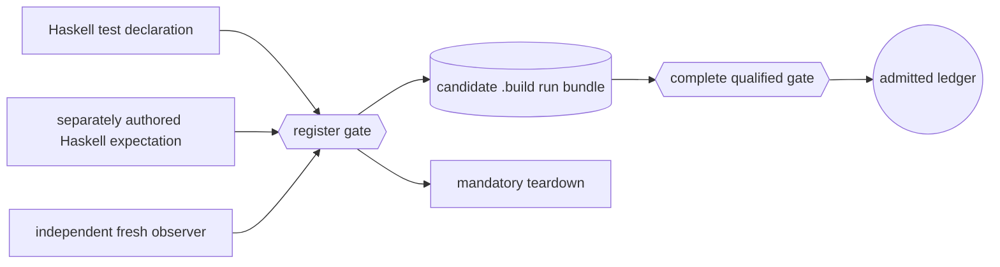
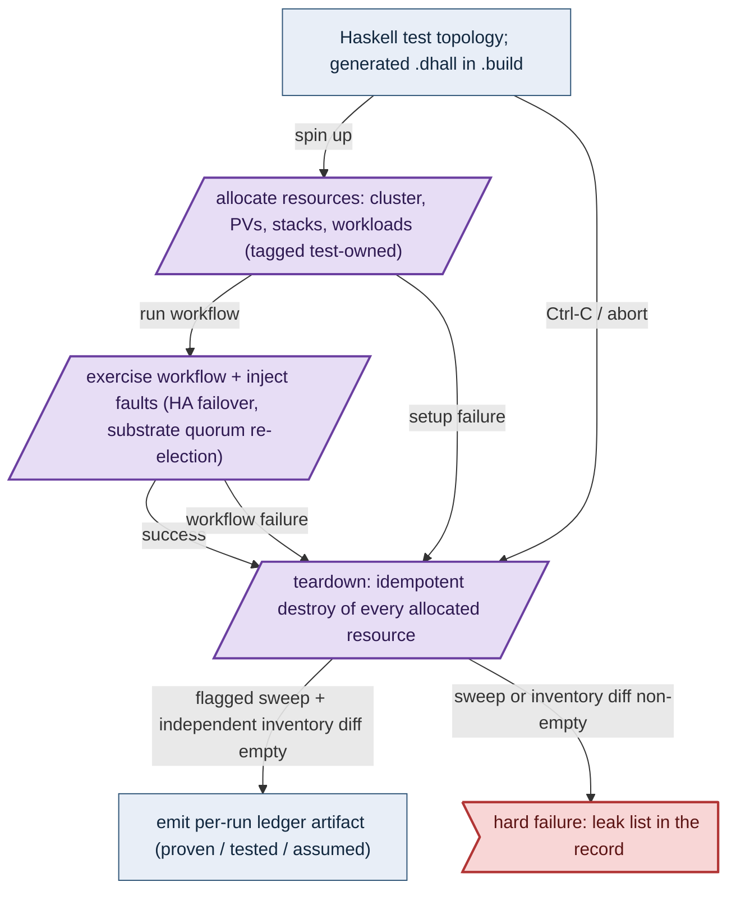
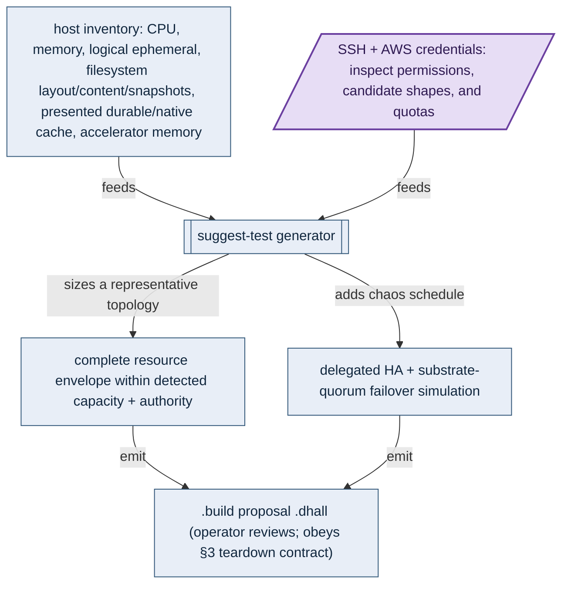

# Testing
> **Purpose**: Define testing registers, production test workflows, independent coverage expectations,
> test-owned resource cleanup, and the evidence each run may claim.
> **Read this if**: a validation has to be designed, or an existing claim has to be read for what it actually establishes.

This document owns how amoebius validates itself: the registers of evidence, the test-topology contract, and
the rule that a specification generates the coverage enumeration while an independent author owns the expectation. It
does not own the honesty vocabulary those claims are phrased in, owned by
[documentation_standards.md §6](../documentation_standards.md#6-honesty-the-proventestedassumed-discipline),
nor the phase gates that consume its registers, owned by
[`../../DEVELOPMENT_PLAN/README.md`](../../DEVELOPMENT_PLAN/README.md).

Link-graph metadata

**Status**: Authoritative source
**Supersedes**: N/A
**Referenced by**: DEVELOPMENT_PLAN/README.md, DEVELOPMENT_PLAN/development_plan_phase_model.md, DEVELOPMENT_PLAN/overview.md, DEVELOPMENT_PLAN/phase_07_evidence_calculus.md, DEVELOPMENT_PLAN/phase_08_scope_index.md, DEVELOPMENT_PLAN/phase_09_resource_index.md, DEVELOPMENT_PLAN/phase_10_calculus_composition.md, DEVELOPMENT_PLAN/phase_11_formal_model_kernel.md, DEVELOPMENT_PLAN/phase_12_explicit_state_checker.md, DEVELOPMENT_PLAN/phase_13_symbolic_checker.md, DEVELOPMENT_PLAN/phase_15_compile_fail_harness.md, DEVELOPMENT_PLAN/phase_26_gadt_decode_ir.md, DEVELOPMENT_PLAN/phase_27_illegal_state_covering.md, DEVELOPMENT_PLAN/phase_28_storage_geometry_folds.md, DEVELOPMENT_PLAN/phase_29_execution_accelerator_folds.md, DEVELOPMENT_PLAN/phase_30_capability_bind.md, DEVELOPMENT_PLAN/phase_31_provision_seal.md, DEVELOPMENT_PLAN/phase_32_inference_accelerator_provision.md, DEVELOPMENT_PLAN/phase_33_render_manifest_oracles.md, DEVELOPMENT_PLAN/phase_34_chain_kernel_boundary.md, DEVELOPMENT_PLAN/phase_38_ui_authorization_kernel.md, DEVELOPMENT_PLAN/phase_42_ui_browser_interpreter.md, DEVELOPMENT_PLAN/phase_43_ui_server_boundary.md, DEVELOPMENT_PLAN/phase_44_ui_local_composition.md, DEVELOPMENT_PLAN/phase_45_encrypted_browser_runtime.md, DEVELOPMENT_PLAN/phase_48_test_workflow_algebra.md, DEVELOPMENT_PLAN/phase_51_host_ensure_kernel.md, DEVELOPMENT_PLAN/phase_52_linux_engine_bringup.md, DEVELOPMENT_PLAN/phase_54_windows_engine_bringup.md, DEVELOPMENT_PLAN/phase_56_base_image_registry.md, DEVELOPMENT_PLAN/phase_58_object_reconciler.md, DEVELOPMENT_PLAN/phase_59_capacity_scheduler.md, DEVELOPMENT_PLAN/phase_60_retained_storage.md, DEVELOPMENT_PLAN/phase_62_platform_backbone.md, DEVELOPMENT_PLAN/phase_63_platform_services_2.md, DEVELOPMENT_PLAN/phase_66_app_tenancy.md, DEVELOPMENT_PLAN/phase_68_user_tenant_isolation_live.md, DEVELOPMENT_PLAN/phase_69_content_store_workflow.md, DEVELOPMENT_PLAN/phase_70_ui_projection_runtime.md, DEVELOPMENT_PLAN/phase_71_release_lifecycle.md, DEVELOPMENT_PLAN/phase_74_multicluster_spawn_georepl.md, DEVELOPMENT_PLAN/phase_75_gateway_migration_drills.md, DEVELOPMENT_PLAN/phase_76_provider_deploy_checkpoint.md, DEVELOPMENT_PLAN/phase_77_provider_child_bringup.md, DEVELOPMENT_PLAN/phase_78_provider_ebs_credential.md, DEVELOPMENT_PLAN/phase_79_provider_dynamic_nodes.md, DEVELOPMENT_PLAN/phase_80_determinism_jitcache.md, DEVELOPMENT_PLAN/phase_81_ui_single_tenant_live.md, DEVELOPMENT_PLAN/phase_84_ui_ha_multizone.md, DEVELOPMENT_PLAN/phase_85_offline_replay_receipts.md, DEVELOPMENT_PLAN/phase_86_offline_blobs_isolation.md, DEVELOPMENT_PLAN/phase_87_offline_release_evolution.md, DEVELOPMENT_PLAN/phase_88_offline_multizone_continuity.md, DEVELOPMENT_PLAN/phase_90_test_topology_live.md, DEVELOPMENT_PLAN/phase_91_infernix_rederivation.md, DEVELOPMENT_PLAN/phase_93_jitml_rederivation.md, DEVELOPMENT_PLAN/system_components.md, README.md, documents/engineering/README.md, documents/engineering/app_vs_deployment_doctrine.md, documents/engineering/bootstrap_sequence_doctrine.md, documents/engineering/browser_offline_runtime_doctrine.md, documents/engineering/chaos_failover_doctrine.md, documents/engineering/chaos_failover_worked_examples.md, documents/engineering/cluster_lifecycle_doctrine.md, documents/engineering/conformance_harness_doctrine.md, documents/engineering/content_addressing_doctrine.md, documents/engineering/deterministic_simulation_doctrine.md, documents/engineering/evidence_calculus_doctrine.md, documents/engineering/extension_conformance_doctrine.md, documents/engineering/extension_conformance_laws.md, documents/engineering/generated_artifacts_doctrine.md, documents/engineering/inforcespec_migration_doctrine.md, documents/engineering/jit_artifact_doctrine.md, documents/engineering/monitoring_doctrine.md, documents/engineering/preflight_validation_doctrine.md, documents/engineering/pulumi_ebs_credential_model.md, documents/engineering/pulumi_iac_doctrine.md, documents/engineering/release_lifecycle_doctrine.md, documents/engineering/repository_layout_doctrine.md, documents/engineering/resource_capacity_sources.md, documents/engineering/single_logical_data_plane_doctrine.md, documents/engineering/storage_lifecycle_doctrine.md, documents/engineering/test_derivation_analysis.md, documents/engineering/testing_spoof_resistance.md, documents/engineering/ui_realtime_coordination_doctrine.md, documents/engineering/validation_frame_doctrine.md, documents/engineering/vault_pki_doctrine.md, documents/engineering/workflow_calculus_doctrine.md, documents/glossary.md, documents/illegal_state/illegal_state_lifecycle.md, documents/illegal_state/illegal_state_techniques.md, documents/reading_order.md, DEVELOPMENT_PLAN/phase_47_tool_and_mutant_generation.md
**Generated sections**: none

## Contents

- [1. A test is an amoebius spec](#1-a-test-is-an-amoebius-spec)
- [2. The registers of amoebius testing](#2-the-registers-of-amoebius-testing)
- [3. The test-topology contract: spin up → run → always tear down](#3-the-test-topology-contract-spin-up--run--always-tear-down)
- [4. No skips, fail fast, and the per-run ledger artifact](#4-no-skips-fail-fast-and-the-per-run-ledger-artifact)
- [5. `suggest-test`: detect the world, emit a representative test `.dhall`](#5-suggest-test-detect-the-world-emit-a-representative-test-dhall)
- [6. Flagged test credentials](#6-flagged-test-credentials)
- [7. The elevated harness is the sole automated deleter of test-owned durable storage; leak-free cycles](#7-the-elevated-harness-is-the-sole-automated-deleter-of-test-owned-durable-storage-leak-free-cycles)
- [8. One substrate per validation](#8-one-substrate-per-validation)
- [9. Derivation: generated enumeration, authored expectation](#9-derivation-generated-enumeration-authored-expectation)
- [10. What this doctrine does not own](#10-what-this-doctrine-does-not-own)
- [11. Planning ownership](#11-planning-ownership)
- [12. Spoof-resistant evidence](#12-spoof-resistant-evidence)
- [13. End-to-end tests run in the Playwright image, against three browsers](#13-end-to-end-tests-run-in-the-playwright-image-against-three-browsers)
- [14. Offline-state semantic evidence](#14-offline-state-semantic-evidence)
- [Related Documents](#related-documents)

```mermaid
flowchart LR
%% register: orientation
  spec["Haskell test declaration"] --> gate{{"register gate"}}
  oracle["separately authored Haskell expectation"] --> gate
  observer["independent fresh observer"] --> gate
  gate --> evidence[("candidate .build run bundle")]
  evidence --> pass{{"complete qualified gate"}}
  pass --> ledger(("admitted ledger"))
  gate --> teardown["mandatory teardown"]
```

*Orientation: a Haskell topology drives the run, but its expectation and observer remain independent and only
the complete qualified gate can admit the candidate ledger. Teardown is owned by [§3](#3-the-test-topology-contract-spin-up--run--always-tear-down).*

## 1. A test is an amoebius spec

**The problem.** A separate test deployment path can accept configurations or take effects that production
cannot. A live test may validate that second implementation instead of the product.

**Why the obvious alternative fails.** Repeating production decisions in a test runner creates a second
implementation. Reusing production decisions to construct the expected result instead creates a circular oracle.

**The rule.** Live topology tests use the actual Haskell-declared deployment, binding, planning, and apply
path. Independent expectations observe its results. Test scheduling, assertions, and cleanup are workflow
operations; they do not replace production decision functions.

Pure and boundary gates precede live topology tests. They require no running cluster and must not inherit a
live dependency from the test-workflow representation. The finite bootstrap and hardware-free ordering are
owned by [validation_frame_doctrine.md](./validation_frame_doctrine.md).

The production DSL must reject an illegal test deployment at the same declared type, decode, or provision
boundary as an illegal production deployment. Each claimed rejection needs its independent positive twin,
exact negative outcome, and changed-production witness. Sharing the DSL does not itself establish the claim.

A test workflow must carry its teardown obligation. The static rule is owned by
[workflow_calculus_doctrine.md](./workflow_calculus_doctrine.md#3-teardown-is-a-type-obligation).
That type obligation cannot guarantee external cleanup after every process or host failure. The runner must
observe cleanup separately and refuse successful results when resources remain.

All behavioral test declarations, expectations, fakes, and mutation intent are Haskell source. Required Dhall
and other external forms are generated lazily beneath `.build/**`. Generated cases carry input, not authority
to decide their own expected outcome.

**What it forecloses.** Tests cannot use a parallel deployment implementation or self-generated semantic
expectations. A complete test workflow remains evidence only for its declared register, observations, and
environmental assumptions.

---

## 2. The registers of amoebius testing

A gate names one final register: 1, 2, or 3. Deterministic simulation is a supporting activity, designated 2.5.
Phase 0's finite governance seed declares no behavioural register. The
[phase standard](../../DEVELOPMENT_PLAN/development_plan_standards.md#k-honesty-proven--tested--assumed) owns
how these boundaries constrain numerical progression.

| Register | Subject | Boundary | Evidence limit |
|---|---|---|---|
| **1 — Pure** | Actual Haskell decoders, folds, renderers, planners, and checkers | Values and admitted compiler/checker inputs; no live infrastructure | Only declared value-level or formal claims |
| **2 — Boundary integration** | Real production binary and effect interpreter | Externally observed tools, fakes, or controlled processes | Actual request selection; real-provider fidelity is separate |
| **2.5 — Deterministic simulation** | Real concurrent production code | Modeled environment under deterministic schedules | Explored schedules and stated environment assumptions |
| **3 — Live topology** | Real deployment and workflows | Named substrate, providers, and injected faults | Only observed effects, architecture, and cleanup |

Register 1 may execute a real compiler or solver as a semantic instrument. Its identity and decision
authority require qualification. Replacing that instrument with a fake changes what can be established;
solver-shaped output cannot retain the real solver's proof authority.

Register 2 places fakes at declared effect boundaries. Pure decisions remain production code rather than
test replacements. The independently authored oracle determines expected requests; the fake records actual
ones without deciding its own expected behaviour.

Register 2.5 runs the same concurrent source through production and modeled interpreters. It must expose
schedule and environmental failures reproducibly. Model fidelity remains an assumption until separately
observed; the [simulation doctrine](./deterministic_simulation_doctrine.md) owns its mechanics.

Register 3 exercises actual infrastructure. A successful fault drill demonstrates that observed run; it
does not prove every future execution or untested interleaving. Test topology ownership and cleanup follow
[§3](#3-the-test-topology-contract-spin-up--run--always-tear-down).

The Decision, Protocol, and Runtime distinction belongs to
[chaos_failover_doctrine.md](./chaos_failover_doctrine.md).
A result in one register cannot substitute for a missing obligation in another.

---

## 3. The test-topology contract: spin up → run → always tear down

**The problem.** A failed test can strand volumes, hosted zones, or clusters and contaminate later runs.

**Why the obvious alternative fails.** A final cleanup step can be skipped by an earlier failure. A type-level
cleanup obligation also cannot make external deletion survive a host failure.

**The rule.** The workflow carries cleanup obligations, handled exits reach teardown, and an independent
supervisor observes the remaining resources before any pass is emitted.

Before those lifecycle clauses apply, **tests have one physical root and may not touch production**. The
harness resolves the checkout root, creates `.test_data/runs/<run-id>/`, writes an exclusive ownership marker,
and redirects every subordinate temp, cache, kubeconfig, virtual disk, container-engine, and service-state path
beneath it. Before setup it fails if the selected root resolves beneath `.data/**`, if production configuration
is present, or if the ownership marker already exists. It never falls back to `/tmp`, `/var/tmp`, a user home,
or global Docker.

The lifecycle contract then has four clauses (re-derived against the shape `prodbox` shows in its Pulumi-orchestrated
infrastructure-test rules: isolated ephemeral stacks, unique names per run, aggressive tagging, *always*
teardown via `bracket`/`finally`):

1. **Resource ownership is explicit and visible.** The topology that allocates a real resource owns its
   primary cleanup path, and that obligation is *in the spec*, not hidden behind ambient machine state. This
   is the prodbox fixture-ownership rule lifted to the `.dhall` surface: the code that creates owns the
   destroy.
2. **Every handled exit reaches teardown.** Structured cleanup covers success, failure, and cancellation.
   An outer supervisor must handle terminated children and observe remaining resources. A process or host
   failure can interrupt cleanup; the type obligation cannot make that external effect inevitable.
3. **Destroy is idempotent and path-exact.** Re-running teardown converges to "nothing left." The harness may
   delete only the exact run root it created after re-resolving it beneath `.test_data/runs/**` and verifying
   its ownership marker. A missing, replaced, or edited marker quarantines the root and fails the run rather
   than broadening deletion.
4. **A cleanup failure is a real failure.** A run whose workflow passed but whose teardown leaked does
   **not** report success. Cleanup errors are surfaced loudly to the operator; if both the workflow and the
   teardown fail, the workflow failure is reported first, but the leak is never swallowed. (prodbox
   integration-fixture rule: *cleanup failures are real failures*.)

Diagram vocabulary: [diagram_conventions.md](./diagram_conventions.md).

```mermaid
flowchart TD
%% register: algebra
  spec["Haskell test topology; generated .dhall in .build"]:::intent -->|spin up| up[/"allocate resources: cluster, PVs, stacks, workloads (tagged test-owned)"/]:::effect
  up -->|run workflow| run[/"exercise workflow + inject faults (HA failover, substrate quorum re-election)"/]:::effect
  run -->|success| down[/"teardown: idempotent destroy of every allocated resource"/]:::effect
  run -->|workflow failure| down
  up -->|setup failure| down
  spec -->|Ctrl-C / abort| down
  down -->|flagged sweep + independent inventory diff empty| ledger["emit per-run ledger artifact (proven / tested / assumed)"]:::intent
  down -->|sweep or inventory diff non-empty| fail>"hard failure: leak list in the record"]:::refuse
  classDef intent   fill:#e8eef7,stroke:#33587a,color:#12283f,stroke-width:1px
  classDef effect   fill:#e7ddf5,stroke:#6b3fa0,color:#2f1a52,stroke-width:2px
  classDef refuse   fill:#f8d6d6,stroke:#b23636,color:#5c1414,stroke-width:2px
```
*Design intent: every exit reaches the same teardown sink, and an external post-run inventory must show no test-owned residue.*

**What it forecloses.** A workflow cannot report success while its cleanup observation is absent or shows
owned residue. Type-level obligations constrain workflow construction; actual cleanup remains an observed
runtime result, including forced termination and recovery.

---

## 4. No skips, fail fast, and the per-run ledger artifact

A skipped test that reports success misrepresents coverage. amoebius prohibits skip and expected-failure
success by default. A missing prerequisite fails with an actionable error that names the missing substrate,
credential, authority, or tool.

Every run emits a structured run bundle beneath `.build/runs/<phase>/<run-id>/`. The bundle contains the
proven/tested/assumed ledger, generated surface enumeration, checks, mutants, coverage, command, resolved
toolchain and dependency graph, substrate observation, cleanup result, and raw-observation references. It is
generated run evidence and is never version-controlled.

The ledger schema records these independent axes:

- `layers` records Decision, Protocol, and Runtime strength as `proven`, `proven-for-the-model`, `tested`,
  `assumed`, or `UNVERIFIED`.
- `coverage` joins each runtime-enumerated surface to an independently authored Haskell expectation and records the
  reached strength or `UNVERIFIED`.
- `register` and `substrate` identify the validation boundary that actually ran.
- `checks`, `mutants`, and `cleanup` record concrete outcomes, not aggregate success claims.

A Haskell bundle checker verifies structure before the bundle is evaluated by the gate. It requires the register
and substrate declared by the phase contract, rejects unknown or duplicate enumerated surfaces, and requires
every layer outside the reached register to remain `UNVERIFIED`. A substrate-`none` gate can report only the
hardware-free layer it actually exercised. This checker establishes bundle well-formedness, not the truth of
any semantic result recorded inside it.

Each claimed obligation must point to fresh raw observation captured after the run started. A pure gate must
invoke the production entry point from the recorded source snapshot and compare it with a separately authored
Haskell expectation; it cannot accept a success marker supplied by the subject. A boundary or live gate must
add an independent observer of the relevant process, filesystem, API, provider, or hardware effect. Every
required positive has a clean control, every required negative has a targeted Haskell mutation plus locus
proof, and the same observation path must turn green for the control and red for the mutation. A generated
summary, exit code alone, self-reported capability, copied log, pre-existing file, or fixture supplied by the
subject is not an observation.

A content-addressed candidate envelope binds the source-snapshot digest, phase contract, exact command,
resolved dependencies, toolchain, substrate, raw observations, and cleanup outcome. Its digest proves only
which bytes were bundled; it proves neither that the command exercised the requirement nor that the oracle
was independent. Git contains no ledger, receipt, enumeration, log, trace, report, screenshot, resolved path,
or copied envelope. Placement and retention are owned by
[repository_layout_doctrine.md §5](./repository_layout_doctrine.md#5-run-evidence-and-phase-status).

Only a complete qualified gate may move a sprint or phase to Done or Validated. Before that pass, the gate
checks the recorded command against the phase contract, the subject/oracle separation, fresh observations, clean and
mutated controls, predecessor chain, source-boundary audit, owned legacy closures, and the fact that the gate
left the tracked tree unchanged. A script, LLM, bundle checker, digest, receipt, or generated document may
produce candidate evidence but may never edit status; only the complete gate result controls that transition.

Skipping an applicable move records `UNVERIFIED`; it never produces a green substitute. The same rule applies
to an enumerated surface lacking an independent Haskell expectation, a missing observer, a skipped mutant, incomplete
cleanup, and an unavailable specialized substrate. A baseline `linux-cpu` route remains available on every
hardware substrate, but it cannot stand in for an Apple or Linux-CUDA claim.

After the development gate passes, an admitted ledger may become typed evidence consumed by a product `PromotionGate`.
That runtime release transition is distinct from development-plan status and cannot promote a sprint or
phase. Production promotion requires the Runtime/chaos layer at `tested`; a design-only or
Runtime-`UNVERIFIED` record cannot construct that transition. The promotion type and environment-strength mapping are owned by
[release_lifecycle_doctrine.md §4](./release_lifecycle_doctrine.md#4-promotiongate-promote-unverifiedprod-is-unrepresentable).

The methodology and strength vocabulary remain owned by
[chaos_failover_doctrine.md](./chaos_failover_doctrine.md). This section owns the per-run artifact boundary:
generate the raw candidate bundle beneath `.build/runs/**`; a complete qualified gate pass may install its
content-addressed receipt beneath `.build/evidence-store/**`. Neither location is committed, and no partial
bundle can stand in for that pass.

---

## 5. `suggest-test`: detect the world, emit a representative test `.dhall`

An operator should not have to hand-write a representative test from scratch for a machine
amoebius can simply *look at*. amoebius already detects what a host is and what credentials can do — so
`suggest-test` turns that introspection into a starting-point test topology the operator then reviews.

Per the original vision, `suggest-test`:

1. **Detects the current substrate and complete supply.** Inventory includes CPU, memory, logical pod-local
   ephemeral storage, filesystem identities/capacities, OCI content objects, and committed/active snapshots.
   It also includes disjoint durable/native-cache backings, accelerator family/count, raw/reserved/net/current-free
   device memory, and provider candidate shapes. The classification belongs to
   [substrate_doctrine.md](./substrate_doctrine.md); detection is a host observation.
2. **Takes SSH and AWS credentials and inspects what they can do** — the machine resources and the
   *permissions and quotas* associated with those credentials. It probes capability (whether these credentials
   can create EBS or a hosted zone, and how much) so the emitted test is *sized to what is actually reachable*, not a
   guess.
3. **Materializes a proposed test `.dhall` beneath `.build/**`.** Its expanded CPU, memory, ephemeral/cache,
   OCI workspace, rounded durable/native-cache, accelerator-memory, and distinct provider compute/root/durable
   envelopes must fit detected supply and authority. The proposal includes the topology's required delegated
   HA and substrate-quorum failovers.

```mermaid
flowchart TD
%% register: algebra
  host["host inventory: CPU, memory, logical ephemeral, filesystem layout/content/snapshots, presented durable/native cache, accelerator memory"]:::intent -->|feeds| gen[["suggest-test generator"]]:::intent
  creds[/"SSH + AWS credentials: inspect permissions, candidate shapes, and quotas"/]:::effect -->|feeds| gen
  gen -->|sizes a representative topology| res["complete resource envelope within detected capacity + authority"]:::intent
  gen -->|adds chaos schedule| chaos["delegated HA + substrate-quorum failover simulation"]:::intent
  res -->|emit| out[".build proposal .dhall (operator reviews; obeys §3 teardown contract)"]:::intent
  chaos -->|emit| out
  classDef intent   fill:#e8eef7,stroke:#33587a,color:#12283f,stroke-width:1px
  classDef effect   fill:#e7ddf5,stroke:#6b3fa0,color:#2f1a52,stroke-width:2px
```
*Design intent: a live SSH/AWS capability probe and the detected host inventory feed a pure generator fold that sizes a proposal test topology and its chaos schedule; the credential probe is runtime-checked, not proven here.*

Four boundaries keep `suggest-test` honest and within doctrine:

- **The output is a proposal, not source or an oracle.** `suggest-test` emits a *starting-point* test `.dhall`
  beneath `.build/**`. The operator may export and retain it outside Git before running it. It is a generator of representative topologies, never a self-certifying
  pass. The emitted topology is an ordinary test spec and inherits [§3](#3-the-test-topology-contract-spin-up--run--always-tear-down) (always tears down) and [§8](#8-one-substrate-per-validation) (one substrate) unconditionally.
- **The proposal still passes the ordinary staged seal.** After provider shapes, replicas, sidecars, and the
  standard platform graph expand, `planInfrastructure` derives demand from that exact `BoundDeployment` and
  the declared supply or forest budget. `NoInfrastructureRequired` must witness the explicit
  `ObservedInfrastructureMaterialization.AlreadyMaterialized` arm. Otherwise one
  `ProvisionedInfrastructurePlan` owns one `ProvisionedProviderActionBatch`: its closed cloud-provider/SSH-host
  actions, entire Pulumi graph, checkpoints, dependencies, bounded concurrency, and
  cloud-quota/SSH-child-budget partition. Snapshot validation returns the matching
  `ValidatedInfrastructureActionBatch`; plan/action-token CAS may enact only that batch, and receipt-bound
  provider/host readback constructs `ProvisionContext`. Only then may
  `provision` construct the opaque whole-deployment `ProvisionedSpec` for `renderAll`. An overcommitted axis,
  a CUDA demand with no CUDA offering, or an observed inventory/quota smaller than declared rejects before
  its corresponding mutation; generation is not an admission bypass.
- **It inspects credentials but never embeds them.** Although it *reads* SSH/AWS credentials to learn their
  authority, the test `.dhall` it writes references those credentials **by name only** — secrets never live
  in Dhall; the parent injects them into the child's Vault. The `SecretRef`-by-name contract and the
  parent-injects-into-child model are owned by [vault_pki_doctrine.md](./vault_pki_doctrine.md). A
  `suggest-test` output that inlined a credential would be unrepresentable.
- **The chaos schedule is deployment rules.** The HA-failover and substrate-quorum-failover simulation it adds is
  attached on the deployment-rules surface, so the app under test is none the wiser — owned by
  [app_vs_deployment_doctrine.md](./app_vs_deployment_doctrine.md). The *mechanics* of the control-plane daemon's k8s/etcd-delegated single-instance
  and HA failover are owned by [daemon_topology_doctrine.md](./daemon_topology_doctrine.md) and
  [cluster_lifecycle_doctrine.md](./cluster_lifecycle_doctrine.md); `suggest-test` only *schedules* them
  into a topology.

---

## 6. Flagged test credentials

Per the original vision, the credentials used for testing (e.g. AWS deployments) need to be
specifically flagged, as is done in `~/prodbox`. Automated tests must be able to do things normal production
automation must not — most sharply, *delete test-owned durable storage* ([§7](#7-the-elevated-harness-is-the-sole-automated-deleter-of-test-owned-durable-storage-leak-free-cycles)) — so the authority to do them must be a
**separate, marked** credential, never the everyday one acting in a test role.

amoebius re-derives the `prodbox` `aws_admin_for_test_simulation` pattern, generalized:

- **Test credentials are a distinct, flagged identity.** The elevated authority a test harness uses is held
  under a credential explicitly flagged as test-simulation, separate from the normal-operation credentials a
  running cluster uses. Normal operation never holds the elevated authority; the test harness never runs
  workloads under the everyday credential. The boundary is an *identity* boundary, not a convention.
- **Test-generated resources carry a test flag.** All test-generated resources carry a flag for the harness
  to see, and these get deleted by the elevated test credentials. Every
  resource a topology allocates is tagged test-owned at creation, so the harness can later find *exactly*
  what it created and reclaim it without guessing — the basis of the leak-free sweep in [§7](#7-the-elevated-harness-is-the-sole-automated-deleter-of-test-owned-durable-storage-leak-free-cycles).
- **The flagged credential is still a secret-by-name.** Its material lives in Vault and Dhall references
  only its name. Flagging changes the selected identity and authority. Vaulting and injection remain owned by
  [vault_pki_doctrine.md](./vault_pki_doctrine.md).
- **The flagged test-secret value is external, untracked, and ignored.** In production, secrets are CRUD'd
  into Vault **by name** through the operator's admin REST before a `.dhall` is uploaded
  ([`bootstrap_sequence_doctrine.md` §5](./bootstrap_sequence_doctrine.md#5-the-admin-control-plane-the-cli--the-control-plane-daemon-rest-api)).
  A test has no operator at a keyboard, so the operator may supply one flagged `test-secrets.dhall` as an
  external input at the specifically ignored repository-root path. It must never be version controlled,
  generated from repository source, copied into `.build/**` or evidence, or treated as an oracle. The harness
  validates that the value is test-only, loads it into the target Vault, and records only secret names and
  redacted identities. This reproduces the operator KV-CRUD step so the rest of the run exercises the real
  secrets-by-name path. No tracked `.dhall`, test or otherwise, may carry secret material
  ([`dsl_doctrine.md` §6](./dsl_doctrine.md#6-secrets-are-names-never-values)).
- **The `<project>.dhall` under test is harness-created, or the run fails fast.** A Haskell declaration lazily
  renders the `<project>.dhall` it deploys beneath a fresh `.build/test-corpora/<run-id>/**` root. The serialized
  file is transient build input, never tracked source; `.test_data/runs/<run-id>/**` remains exclusively
  marker-owned runtime state and is **deleted on teardown** (the always-teardown contract,
  [§3](#3-the-test-topology-contract-spin-up--run--always-tear-down)); if a `<project>.dhall` of that name
  **already exists, the run fails fast** rather than clobber an operator's real spec. That spec is a value of
  the topology type, so it inherits the same illegal-state-unrepresentable guarantee as any production `.dhall`
  ([§1](#1-a-test-is-an-amoebius-spec)). A pre-existing generated-input path or runtime-state root fails
  freshness checks rather than being reused or clobbered.

The resolved **create-vs-delete credential model** — normal-operation credentials may create but not delete
cloud storage, while the elevated test credential may delete only test-flagged backing — is **owned by**
[pulumi_ebs_credential_model.md §6](./pulumi_ebs_credential_model.md#6-the-ebs-create-vs-delete-credential-model). This doc
records only the testing-side requirement: the *destroy* authority over durable storage is withheld from
normal operation and granted only to the flagged elevated harness.

---

## 7. The elevated harness is the sole automated deleter of test-owned durable storage; leak-free cycles

The elevated-harness exception resolves a real tension. On one side, amoebius **forbids deleting durable data under normal operation** — clusters are ephemeral, their storage is not, and an accidental delete loses
data the next bring-up needs. On the other side, **leak-free test cycles must delete the storage they create**, or every run silts up the substrate forever. amoebius
reconciles the two by making harness deletion the **one** sanctioned automated exception.
This exception is test-scoped: it grants no authority over production backing. Any production break-glass
reclaim is a human-operated external action owned by the storage/migration boundary, not this testing system.

The cardinal "no normal-operation deletion of durable data" rule, the retained `no-provisioner` PV model,
and the deterministic rebind it protects are **owned by**
[storage_lifecycle_doctrine.md](./storage_lifecycle_doctrine.md) ([§7](./storage_lifecycle_doctrine.md#7-deleting-durable-data-is-forbidden-under-normal-operation) and [§7.1](./storage_lifecycle_doctrine.md#71-the-single-exception-the-elevated-test-harness), which explicitly delegate the exception to this doc). This doc owns the **exception mechanism**:

- **One deleter, one credential.** Only the **elevated test harness**, holding the flagged delete-capable
  credential of [§6](#6-flagged-test-credentials), may destroy durable backing — and only backing flagged
  test-owned. No normal-operation code path, and no non-harness test code path, can destroy those backing
  bytes. PVC/PV API objects may disappear with ordinary cluster lifecycle; they are bindings, not the durable
  data protected here. The DSL surface exposes no "delete this durable volume" primitive at all; deletion is
  an *act of the harness*, not a value in a `.dhall`.
- **Flag, then sweep.** A leak-free cycle is: tag every allocated resource test-owned at creation ([§6](#6-flagged-test-credentials)); run
  the workflow; then have the elevated harness **sweep** for test-flagged resources and destroy exactly
  those. The sweep is scoped by the flag, so it can never reach a production volume — it is structurally
  incapable of deleting something it did not create.
- **Leak detection is broader than the deletion scope.** The flag bounds what the elevated harness may
  destroy; it is not the oracle for whether teardown leaked. An observer outside the typed allocation path
  snapshots the applicable substrate inventories before and after the run: Kubernetes API objects; one
  allocation-level record per retained host backing under the run's `.test_data/**` root, read outside node containers;
  and provider resources through a read-only cloud inventory. Equality is checked over those inventories, so
  an untagged resource or backing left after its PVC/PV objects disappear still fails.
- **A non-empty postflight inventory diff is a hard failure.** After teardown, the harness asserts both that
  the test-flagged sweep is empty and that the independent pre/post substrate inventory diff is empty. Any new
  survivor is a leak, recorded with its boundary and identity — never a tolerated remnant. A retained,
  by-design resource already present in both snapshots is not a leak.
- **Pulumi mechanics are owned elsewhere.** The chosen sequence — the harness deletes the test-flagged durable
  backing under elevated authority, verifies absence independently, then prunes the corresponding
  durable-class checkpoint entry — is owned by [pulumi_ebs_credential_model.md §6](./pulumi_ebs_credential_model.md#6-the-ebs-create-vs-delete-credential-model), not restated here. This doc fixes the invariant it must satisfy:
  the durable-data destroy capability is exercised solely by the flagged elevated harness, solely on
  test-flagged resources, and the cycle ends with an empty flagged sweep and independent inventory diff.

> **Honesty.** The flag-and-elevated-sweep mechanism above is a *design resolution* of an explicitly open
> question in the vision, not a built or tested amoebius capability. Treat
> the leak-free guarantee as a specification to be validated, never as a proven result. Numerical ownership
> and delivery state live in [../../DEVELOPMENT_PLAN/README.md](../../DEVELOPMENT_PLAN/README.md).

---

## 8. One substrate per validation

A test that silently falls back from a requested specialized lane to CPU proves nothing about that specialized
lane. amoebius forbids that fallback: **a validation names its execution lane up front and fails fast if that
lane's inputs are missing.** This does not make `linux-cpu` hardware-exclusive. The baseline is deliberately
selectable on every detected hardware substrate — at that host's natural architecture, never at another's
([substrate_doctrine.md §1.1](./substrate_doctrine.md#11-the-natural-architecture-rule)).

**An instrument is part of the substrate claim.** A hardware-free gate must use in-process Haskell
observation or a generated subprocess interposer whose availability is established without a container
engine. Requiring a kernel tracer, container image, virtual machine, cluster, or specialized device changes
the gate into a hardware or live gate and is prohibited before the DSL gate barrier.

Container replay may later test portability of an already accepted Haskell/DSL result. It cannot supply the
semantic oracle for that result or make a hardware-dependent command count as substrate `none`.

The canonical rule — *at most one substrate (`apple` | `linux-cuda` | `linux-cpu` | `windows`) per
validation* — is **phase discipline owned by** [../../DEVELOPMENT_PLAN/README.md](../../DEVELOPMENT_PLAN/README.md)
(rule 5), and the substrate catalog is **owned by** [substrate_doctrine.md](./substrate_doctrine.md). This
doc owns the *testing consequences* of that rule, re-derived against the shape `prodbox` shows in its fixtures-vs-substrate-config
doctrine:

- **A test topology is lane-locked.** A single test `.dhall` targets one execution lane; its validation
  logic carries **no substrate-conditional branching**. Full coverage across substrates is *several
  substrate-locked runs*, not one branchy run that flips between worlds.
- **Fail fast on missing specialized inputs.** A topology requiring a hosted zone, credential, or GPU fails
  when that input is absent. Retargeting another substrate or substituting a fake cannot satisfy the original
  live prerequisite.
- **The CPU baseline is universal, not a fallback.** Explicitly selecting `linux-cpu` is valid on
  `linux-cpu`, `linux-cuda`, `apple`, or `windows` hardware. It runs natively or through the canonical
  Incus/Lima/WSL2 guest and exposes no accelerator. If the gate requires a pristine Linux host, that guest is
  newly created and its clean preflight is evidence.
- **An architecture is tested only where it runs.** A validation names `linux-cpu/amd64` or
  `linux-cpu/arm64`, and the lane it names is the host's natural architecture. Emulating the other
  architecture, or cross-building an artifact for it, produces no evidence about it: covering both is two
  runs on two machines, the same way covering two substrates is.
- **Fixtures are reusable across substrates; substrate config is not.** A *fixture* fakes a boundary (a CLI,
  a probe) and may be reused anywhere; a *substrate* is the real environment a topology targets. The two are
  not interchangeable — a fixture never silences a missing-substrate-config error. (This is the prodbox
  fixtures-vs-substrate-config distinction, inherited intact.)

What "at most one substrate per validation" buys is precisely the thing the ledger ([§4](#4-no-skips-fail-fast-and-the-per-run-ledger-artifact)) needs to stay
honest. A `linux-cpu` result means the CPU-only lane was selected and observed; the ledger separately records
whether its physical parent was `linux-cpu`, `linux-cuda`, `apple`, or `windows`, whether the lane was
native, Incus, Lima, or WSL2, and **which architecture that lane ran**. A result whose architecture the
ledger cannot name is UNVERIFIED for every architecture, not a pass on the convenient one. A requested
CUDA/Metal run may never relabel itself CPU after failure.

---

## 9. Derivation: generated enumeration, authored expectation

**The problem.** A manually maintained coverage list can omit new production constructors and remain green.
An expectation generated from the same decision function can remain green when that function is wrong.

**Why the obvious alternative fails.** Generating discovery and expected outcomes from production makes the
test circular. Keeping only independent expected outcomes leaves omitted production surfaces invisible.
Comparing counts establishes neither identity equality nor semantic coverage.

**The rule.** Production declarations supply the discovered surface. Independently authored Haskell
requirements supply the obligation universe and expected behaviour. The runner reconciles those identities
in both directions before accepting exact actual observations.

| Input | Authority | Required check |
|---|---|---|
| Production constructors, arms, routes, and consumers | Discover the real program's surface | No filtering that hides unlisted surfaces |
| Independent Haskell obligation declarations | Specify required semantics and exclusions | Stable identity, owner, scope, and complete expectation |
| Independent cases and mutations | Challenge required boundaries | Exact positive, negative, and changed-production outcomes |
| Generated transports and reports | Carry inputs and raw observations | No expected-result or verdict authority |

Discovery includes the semantic arms and required interactions of the real language. Files, labels, stage
counts, and CPP flags provide provenance but cannot replace that inventory. An obligation omitted by both a
rewritten test list and its rewritten fixture list must remain detectable against the preserved requirement
baseline.

The plan owns scope conservation when an obligation moves:
[development_plan_phase_model.md](../../DEVELOPMENT_PLAN/development_plan_phase_model.md#n-reopening-and-amending-a-phase).
A new phase name or register cannot silently withdraw an earlier language obligation.

Expectations use separately authored Haskell types, values, limits, and predicates. A driver may convert an
independent input into the public production type and invoke production for the actual result. It must not
use production conversion, encoding, folds, or constants to choose the expected semantics.

Required comparisons observe the whole stated projection. Accessibility and transport rows must be compared
with production observations, not counted in the oracle. Compiler rejection needs a legal twin and exact
diagnostic. A model counterexample must be the assigned invariant failure rather than any failed process.

Generated artifacts need their actual consumer when syntax, type correctness, or executable meaning is
claimed. Deterministic materialization establishes byte stability only. Placeholder scripts and undefined
bindings cannot qualify because a text scan finds expected identifiers.

Mutation operators must change the real decision used by production while preserving independent expectations.
The runner records the changed subject, assigned red observation, unrelated green controls, and restored clean
result. The protected execution boundary is owned by
[testing_spoof_resistance.md](./testing_spoof_resistance.md#122-test-split).

A missing required obligation is red. An explicitly later-owned layer may remain `UNVERIFIED` only under its
typed ownership and barrier deadline. An unverified ledger entry records the gap; it does not discharge it.
The candidate schema belongs to the
[gate-integrity standard](../../DEVELOPMENT_PLAN/development_plan_gate_integrity.md#m6-candidate-evidence-and-gate-pass).

Historical derivation analysis remains a reference in
[test_derivation_analysis.md](./test_derivation_analysis.md).
Current inventories, implementation observations, and remaining work belong to the
[development-plan tracker](../../DEVELOPMENT_PLAN/README.md), not a second per-phase account in this doctrine.

**What it forecloses.** Production cannot generate its own oracle, and an independently named module cannot
claim coverage through unused expected values. Requirements and expectations can still contain mistakes.
Their provenance, qualification, and residual assumptions must remain visible.

---

## 10. What this doctrine does not own

To keep the SSoT boundaries crisp:

| Concern | Owned by |
|---------|----------|
| The Extract → Model → Inject moves, the proven/tested/assumed *methodology* and what each move establishes | [chaos_failover_doctrine.md](./chaos_failover_doctrine.md) |
| The async cross-cluster failover correctness obligation + TLA+/io-sim proof artifacts | [chaos_failover_doctrine.md](./chaos_failover_doctrine.md), [gateway_migration_model_doctrine.md](./gateway_migration_model_doctrine.md) |
| The retained `no-provisioner` PV model, deterministic rebind, and the cardinal "no normal-operation deletion" rule | [storage_lifecycle_doctrine.md](./storage_lifecycle_doctrine.md) |
| The create-vs-delete credential model and Pulumi create/destroy mechanics (MinIO backend, Vault-envelope) | [pulumi_iac_doctrine.md](./pulumi_iac_doctrine.md) |
| The `PromotionGate`, the `Environment` promotion pointer, and each environment's required evidence strength (the gate that *consumes* this doc's [§4](#4-no-skips-fail-fast-and-the-per-run-ledger-artifact) ledger) | [release_lifecycle_doctrine.md](./release_lifecycle_doctrine.md) ([§4](#4-no-skips-fail-fast-and-the-per-run-ledger-artifact)) |
| That chaos injection lives in deployment rules; the app/deployment dividing line | [app_vs_deployment_doctrine.md](./app_vs_deployment_doctrine.md) |
| Secrets-by-name, `SecretRef`, parent-injects-into-child Vault | [vault_pki_doctrine.md](./vault_pki_doctrine.md) |
| Substrate detection and the substrate catalog | [substrate_doctrine.md](./substrate_doctrine.md) |
| Leadership-election and HA-failover mechanics the topologies exercise | [daemon_topology_doctrine.md](./daemon_topology_doctrine.md), [cluster_lifecycle_doctrine.md](./cluster_lifecycle_doctrine.md) |
| Making an illegal test cluster unrepresentable | [dsl_doctrine.md](./dsl_doctrine.md), [illegal_state_catalog.md](../illegal_state/illegal_state_catalog.md) |
| Phase order, the "at most one substrate per validation" rule as phase discipline, and dynamic toolchain policy | [../../DEVELOPMENT_PLAN/README.md](../../DEVELOPMENT_PLAN/README.md) |
| The typed `Expectation` surface and the `FaultKind`→invariant map [§9](#9-derivation-generated-enumeration-authored-expectation) derives against | [chaos_failover_doctrine.md](./chaos_failover_doctrine.md) |
| Which artifacts are generated, and the never-commit rule [§9](#9-derivation-generated-enumeration-authored-expectation) inherits | [generated_artifacts_doctrine.md](./generated_artifacts_doctrine.md) |

---

## 11. Planning ownership

This document is normative testing doctrine only. Delivery sequencing, completion status, validation gates,
and remaining work are owned by [../../DEVELOPMENT_PLAN/README.md](../../DEVELOPMENT_PLAN/README.md). This
document states no current validation result. Every gate remains a candidate until its qualification and clean
runs pass all required independence, sabotage-control, predecessor-chain, and owned-legacy-closure checks.

---

## 12. Spoof-resistant evidence

An effectful claim requires fresh observation outside the candidate's authority. A pure claim requires an
independent semantic comparison. The threat model, qualification, and explicit residual trust are owned by
[testing_spoof_resistance.md](./testing_spoof_resistance.md). Neither a candidate report nor the word
unforgeable establishes that boundary.

## 13. End-to-end tests run in the Playwright image, against three browsers

Browser tests are a later boundary/live activity and run in a dedicated **Playwright image** carrying
Chromium, Firefox, and WebKit. The image is not a prerequisite for the hardware-free Haskell/DSL promotion
barrier and cannot validate the DSL or generators that define its own recipe.

**Every end-to-end test runs against all three engines.** A rendering, an event ordering, or a storage
behaviour that holds in one engine and not another is a real defect in the UI runtime, and a suite that
exercises one engine cannot see it. Running the same test three times is the cheapest instrument that can.

Two rules keep the exception bounded:

- **Running it is the Haskell binary's job.** End-to-end tests are invoked through the binary after hardware
  promotion, never through a tracked script or a developer driving a browser by hand.
- **The target test image is built, never pulled.** `amoebius-base` is the separately published pull-only
  artifact; after the hardware-free barrier, the host binary must build the Playwright image on demand and
  idempotently and must never push it. Three browser
  engines are a test-only payload, and publishing it would put that payload in the lineage every pod pulls
  ([image_build_doctrine.md §7](./image_build_doctrine.md#7-what-amoebius-bakes-vs-builds--the-base-container-is-the-supply-chain)).

## 14. Offline-state semantic evidence

Offline-state checks must exercise actual Haskell transitions for encrypted-envelope handling, credential
exclusion, fencing, generation advance, quota refusal, partition scope, and replay. Independent expectations
and changed-production challenges must observe each assigned boundary.

Encryption claims require the real cryptographic construction and its admitted assumptions. An opaque string,
reversible encoding, or absence of a plaintext canary cannot establish encryption. Generated runtime code needs
its actual compiler and semantic consumer when executable projection is claimed.

Browser storage, locks, crypto APIs, service workers, and cross-tab behaviour remain separate boundaries under
the [browser-offline doctrine](./browser_offline_runtime_doctrine.md). Deferring those live observations cannot
excuse missing pure state semantics or invalid generated source.

## Related Documents
- [Engineering Doctrine Index](./README.md)
- [Evidence Calculus Doctrine](./evidence_calculus_doctrine.md) — the evidence calculus, which binds each claim to its fixture and defers to this document for what a discharged claim is worth
- [Chaos / Failover Doctrine](./chaos_failover_doctrine.md)
- [Storage Lifecycle Doctrine](./storage_lifecycle_doctrine.md)
- [Pulumi IaC Doctrine](./pulumi_iac_doctrine.md)
- [Release Lifecycle Doctrine](./release_lifecycle_doctrine.md)
- [UI Realtime Coordination](./ui_realtime_coordination_doctrine.md)
- [Browser Offline Runtime](./browser_offline_runtime_doctrine.md)
- [Application Logic vs Deployment Rules](./app_vs_deployment_doctrine.md)
- [Substrate Doctrine](./substrate_doctrine.md)
- [Vault / PKI Doctrine](./vault_pki_doctrine.md)
- [Daemon Topology Doctrine](./daemon_topology_doctrine.md)
- [DSL Doctrine](./dsl_doctrine.md)
- [Illegal State Catalog](../illegal_state/illegal_state_catalog.md)
- [Development Plan](../../DEVELOPMENT_PLAN/README.md)
- [Documentation Standards](../documentation_standards.md)
- [Repository Layout and Artifact Provenance](./repository_layout_doctrine.md)
- [Phase 11](../../DEVELOPMENT_PLAN/phase_11_formal_model_kernel.md) — first formal-model gate using the testing registers
- [Phase 30](../../DEVELOPMENT_PLAN/phase_30_capability_bind.md) — capability-binding gate using a Haskell-owned nine-arm corpus, independent oracle, paired Dhall/decode negatives, QuickCheck coverage, and changed-production mutations
