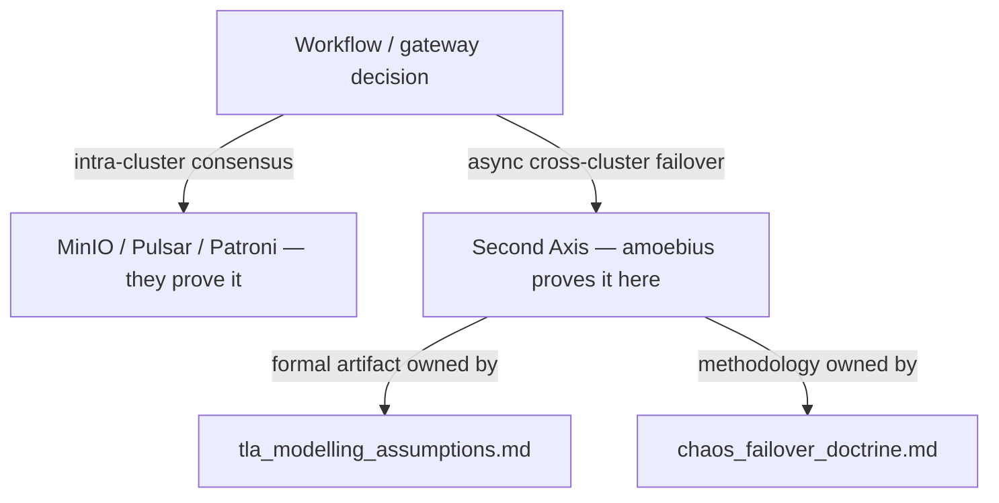

# TLA+ Modelling Assumptions

**Status**: Authoritative source
**Supersedes**: N/A
**Referenced by**: documents/engineering/README.md, documents/engineering/chaos_failover_doctrine.md, documents/engineering/testing_doctrine.md, documents/engineering/gateway_migration_doctrine.md, DEVELOPMENT_PLAN/phase_01_formal_first_dsl_integrity.md
**Generated sections**: none

> **Purpose**: Own the two-tier record for amoebius's async cross-cluster gateway-failover specification — the **design-model tier** (abstract system model, invariant catalog, modelling bounds, verification status), authored **design-first** and model-checked in Phase 1 independent of any implementation; and the **correspondence tier** (variable-to-implementation mapping, known divergences), completed in Phase 9 once the runtime modules exist.

---

## 0. Two tiers — read this first

**The single proof obligation splits into two tiers with different verifiability.** The original framing
deferred the *whole* model until there was a real implementation to correspond to — but that conflated two
separable obligations, and only one of them needs code:

- **Tier 1 — the design model (authored and checked now, Phase 1).** A TLA+ model is a *design* artifact;
  model-checking is a design-first act that needs no runtime — that is its entire value. The abstract system
  model, the invariant catalog, the modelling bounds, and the TLC verification status are authored and
  checked **before any real resource is provisioned**. Once TLC runs green at the declared scope, the design
  invariants are **proven for the model** — a real, available result. The methodology is owned by
  [chaos_failover_doctrine.md](./chaos_failover_doctrine.md); the design-first phase that discharges this
  tier is [DEVELOPMENT_PLAN/phase_01_formal_first_dsl_integrity.md](../../DEVELOPMENT_PLAN/phase_01_formal_first_dsl_integrity.md).
- **Tier 2 — the correspondence (deferred, Phase 9).** Mapping each model variable and action onto a
  *built* Haskell module, daemon loop, or delegated-subsystem mechanism **with real file paths** genuinely
  cannot precede the code. The correspondence table, the known-divergences record, and the model↔code
  refinement stay **UNVERIFIED** until the runtime modules exist.

**Only the correspondence needs code.** The design model is authored and proven-for-the-model in Phase 1;
only Tier 2 waits for the runtime. The sharp boundary, kept throughout this document: *the abstract model is
proven; the running cluster is unverified; the two are not the same theorem.*

Phase order, status, and the acceptance gates are owned by
[DEVELOPMENT_PLAN/README.md](../../DEVELOPMENT_PLAN/README.md) (Phase 1 for the design tier, Phase 9 for the
correspondence tier); this document never restates phase status.

---

## 1. What this document will own (SSoT scope)

This is the **single source of truth** for everything *about the formal model* of the cross-cluster failover
boundary — and only that. Its contents split along the two tiers of [§0](#0-two-tiers--read-this-first):

**Tier 1 — the design model (authored design-first in Phase 1; a green TLC run is a real result now):**

- **Abstract system model** — what the spec includes (clusters, geo-replication lag, the
  gateway-ownership / route53-repoint protocol, partial-sync failure) and what it abstracts
  away.
- **Invariant catalog** — each safety/liveness property the model asserts, in plain terms,
  alongside the concrete failure it prevents.
- **Modelling bounds and limitations** — the bounded constants the model checker is run with,
  what those bounds *prove*, and (just as important) what they do **not** prove.
- **Verification status** — the honest record of what the model checker actually reached, and which
  residue [`io-sim`](./chaos_failover_doctrine.md)/runtime tests still carry (the latter deferred to Tier 2).

**Tier 2 — the correspondence (deferred to Phase 9; cannot be written before the runtime modules exist):**

- **Variable-to-implementation correspondence** — a table mapping each TLA+ variable and
  action to the concrete Haskell module, daemon loop, or Pulsar/MinIO/Postgres mechanism it
  stands for, with file paths.
- **Known divergences and compression points** — every place the model is more abstract,
  more explicit, or simply different from the runtime, recorded honestly so no reader mistakes
  a modelling convenience for a runtime guarantee.

It does **not** own the *methodology* (Extract → Model → Inject, the invariant-confluence
"Second Axis", the proven/tested/assumed ledger) — that is
[chaos_failover_doctrine.md](./chaos_failover_doctrine.md). It does not own the failover
*mechanics* (geo-replication wiring, gateway handoff, DNS repoint, teardown-with-cleanup vs
chaos-failover) — those live in [cluster_lifecycle_doctrine.md](./cluster_lifecycle_doctrine.md)
and [pulumi_iac_doctrine.md](./pulumi_iac_doctrine.md). It does not own the
`GatewayMigration = <Planned | Failover>` taxonomy or the planned/forced migration protocols — those
are owned by [gateway_migration_doctrine.md](./gateway_migration_doctrine.md). This doc references
them; it never duplicates them.

---

## 2. The single proof obligation this model discharges

Most distributed-consensus problems in amoebius are **not amoebius's to prove**. Intra-cluster
consensus — replicated object storage, the message log, the SQL primary — is delegated to
systems that run their own consensus and georeplication and have been hardened far beyond
anything a from-scratch model could claim:

- **MinIO** for replicated/erasure-coded object storage,
- **Pulsar** (BookKeeper) for the durable, ordered message log,
- **Percona/Patroni Postgres** for the SQL primary and its replication.

The doctrine is: delegate the obligation to the system that already discharges it, and do not
re-prove it. (See [platform_services_doctrine.md](./platform_services_doctrine.md) for which
service owns which guarantee.) **Synchronous HA inside one cluster is, by that delegation,
treated as effectively lossless** — those subsystems make it so.

What is left — the *one* place a per-system proof obligation concentrates on amoebius itself —
is the **asynchronous cross-cluster boundary**: geo-replication lag, plus the act of failing the
wild-ingress gateway over to a sibling cluster and repointing DNS. That is the **invariant-
confluence "Second Axis"** named in [chaos_failover_doctrine.md](./chaos_failover_doctrine.md),
and it is the *only* boundary this TLA+ model targets.

**Only one of the two gateway-change branches reaches this boundary.** A gateway-ownership change is a
value of `GatewayMigration = <Planned | Failover>`
([gateway_migration_doctrine.md](./gateway_migration_doctrine.md)). Only the **Failover** branch — an
active that has vanished, promoted from an async-replicated replica — crosses the asynchronous
cross-cluster boundary this model targets. The **Planned** branch is a coordinated *synchronous*
switchover (quiesce → drain → verify-caught-up → cutover): its RPO=0 is an **assumed, argued
design-level property owned by [gateway_migration_doctrine.md](./gateway_migration_doctrine.md)** — it
rests on a runtime-observed catch-up check, not on any result of this model — and it presents no async
divergence to reconcile. This model therefore **does not verify** the Planned branch; excluding it is a
scoping decision, not a verdict about its safety.

---

## 3. The question the model must answer

The worst case, in plain words: a sibling cluster is **mid geo-sync** — it has
accepted some replicated state but not all — and at that instant it goes down, and a gateway
failover *to that very cluster* is attempted. The design model **defines and proves-for-the-model** a
well-defined behaviour for that state in Phase 1 (Tier 1); that the *running* cluster satisfies it is proven
against the built modules in Phase 9 (Tier 2), and remains **UNVERIFIED** until then.

This worst case is specific to the **Failover** branch of `GatewayMigration`
([gateway_migration_doctrine.md](./gateway_migration_doctrine.md)): a mid-geo-sync failover can arise
only when the active has vanished with no chance to freeze and drain. The **Planned** branch reaches
cutover only after writes are frozen and the replica is verified caught-up, so "mid-geo-sync failover"
is not a state its path represents.

This is the motivating problem stated in the project vision: *"what exactly happens if a cluster goes down
mid geo-sync and we try to failover the gateway to that cluster? We need to prove we always have
well-defined behaviour (somehow, and even define what that means)."*

The model's job is therefore two-fold, and the second half is the harder half:

1. **Define "well-defined behaviour"** for a failover into a partially-synced cluster — the
   precise predicate the runtime must satisfy (e.g. failover is *refused* below a freshness
   threshold; or it proceeds and the bounded, self-healing divergence is named and capped by a
   declared **data-loss budget**). The definition is part of the deliverable, not an input to
   it.
2. **Prove the runtime always satisfies it** within the model's bounds — no reachable state
   leaves behaviour undefined (no silent data loss, no split-brain gateway, no two clusters
   both claiming wild ingress with no path back to a single owner).

The Phase 9 acceptance gate ties this to a measurement: *measured loss ≤ the declared data-loss
budget, and the proof artifacts are green*
([DEVELOPMENT_PLAN/README.md → Phase 9](../../DEVELOPMENT_PLAN/README.md)).

---

## 4. Structure

This document mirrors the rigor of the sibling project's analogue
(`prodbox/documents/engineering/tla_modelling_assumptions.md`), adapted from prodbox's
single-cluster gateway model to amoebius's **cross-cluster** failover model. The table of contents below
is split by tier: the **design-first** sections are authored and checked in Phase 1; the **correspondence**
sections stay empty by design until Phase 9 produces a runtime to map onto.

| Section | Tier — authored in | What it records |
|---|---|---|
| Abstract system model | **Tier 1 — Phase 1** | The cluster set, geo-replication lag/queue, gateway-ownership protocol, DNS-repoint gating, and the explicit list of what is abstracted away. |
| Communication model | **Tier 1 — Phase 1** (spec side) | How cross-cluster replication and failover signalling are represented in the spec; the mapping to the concrete Pulsar/MinIO/Postgres + control-plane-singleton runtime is the correspondence-tier row below. |
| Modelling bounds & limitations | **Tier 1 — Phase 1** | Cluster count, lag bound, and message/log-length constants the checker runs with — and what those bounds do **not** prove. |
| Invariant catalog | **Tier 1 — Phase 1** | Each safety/liveness property in plain terms + the concrete failure it prevents (single-gateway-owner, no-write-after-stale-failover, bounded self-healing divergence, …). |
| Impossibility acknowledgment | **Tier 1 — Phase 1** | The CAP/FLP boundary for async partitions, and amoebius's chosen branch (act-and-heal vs refuse-to-write) for *this* boundary — framed against, not duplicating, [chaos_failover_doctrine.md](./chaos_failover_doctrine.md). Records the planned/forced frame: this async model covers only the **Failover** branch; the **Planned** synchronous switchover is out of async scope and owned by [gateway_migration_doctrine.md](./gateway_migration_doctrine.md). |
| Verification status | **Tier 1 — Phase 1** (TLC) + Tier-2 residue | The honest ledger of what the checker actually reached (proven-for-the-model at scope), and where `io-sim`/runtime tests carry the rest (deferred). |
| Variable-to-implementation correspondence | **Tier 2 — Phase 9** | TLA+ variables/actions → Haskell modules, daemon loops, and delegated-subsystem mechanisms, with real file paths. **Empty and UNVERIFIED until the modules exist** — that empty state *is* the inversion. |
| Known divergences & compression points | **Tier 2 — Phase 9** | Every model-vs-runtime gap, recorded honestly (the prodbox analogue keeps a numbered list; this one will too). |

Two adaptation notes carried over from the analogue, so the author does not re-derive them:

- **Tooling.** The proof spans **two** instruments, split across the two tiers: **TLA+/TLC** for bounded-state
  safety of the failover protocol (Tier 1, authored/checked in Phase 1), and **`io-sim`** for the Haskell
  runtime's concurrent behaviour under the same fault assumptions (a Phase-1 in-process design-schedule check
  over the lifted *pure decision core* against hand-built peer stubs; io-sim *against the built runtime* is
  Tier-2, deferred). This document owns the TLA+ half's assumptions and correspondence; the `io-sim` half's
  role in the combined argument is set by [chaos_failover_doctrine.md](./chaos_failover_doctrine.md).
- **Topology honesty.** As in prodbox, partition tolerance is a **capability the model reserves
  for the multi-cluster substrate**, not a property a single root cluster exercises. A
  single-node root control plane (prodbox's behaviour) has no sibling to fail over to and trivially
  self-elects; the cross-cluster invariants describe the *intended* multi-cluster behaviour the
  runtime is built toward. The future author must keep that distinction explicit rather than
  presenting reserved capability as exercised fact.

---

## 5. Honesty marker

Per the [documentation standards](../documentation_standards.md) honesty rule and the
chaos/failover doctrine's proven/tested/assumed discipline, this document keeps the two tiers of
[§0](#0-two-tiers--read-this-first) strictly apart:

- **Tier 1 (design model).** Once Phase 1 authors the spec and TLC runs green at the declared scope, the
  design invariants are **proven for the model** — a real result, bounded by the modelling constants (what
  scope *N* does **not** prove is stated in the modelling-bounds section). This is a proof *about the model*,
  never about the running cluster.
- **Tier 2 (correspondence + runtime).** The variable-to-implementation correspondence, the model↔code
  refinement, and the runtime-enforcement fidelity remain an **open proof obligation** — UNVERIFIED — until
  Phase 9 builds the modules and the live failover gate runs.

The sharp boundary, restated: **the abstract model is proven; the running cluster is unverified; the two are
not the same theorem.** Every claim in this document states the layer it actually reaches — proof
(for-the-model), test evidence, or assumption — and says which; a Tier-1 result is never reported as a
runtime guarantee.

---

## Cross-references

- [Chaos & Failover Doctrine](./chaos_failover_doctrine.md) — the Extract→Model→Inject methodology, the proven/tested/assumed ledger, and the invariant-confluence "Second Axis" (owns the *method*; this doc owns the *model artifact*).
- [Development Plan → Phase 1](../../DEVELOPMENT_PLAN/phase_01_formal_first_dsl_integrity.md) — the design-first phase that authors and model-checks the **Tier 1** design model (before any runtime exists).
- [Gateway Migration Doctrine](./gateway_migration_doctrine.md) — the `GatewayMigration = <Planned | Failover>` taxonomy and both migration protocols; this model targets only the **Failover** branch (the **Planned** branch is a synchronous switchover with no async divergence to prove).
- [Development Plan → Phase 9](../../DEVELOPMENT_PLAN/README.md) — phase order, status, and the failover acceptance gate.
- [Cluster Lifecycle Doctrine](./cluster_lifecycle_doctrine.md) — geo-replication, gateway failover, and teardown-with-cleanup vs chaos-failover mechanics.
- [Platform Services Doctrine](./platform_services_doctrine.md) — which delegated subsystem (MinIO/Pulsar/Patroni) owns which intra-cluster consensus guarantee.
- [Pulumi IaC Doctrine](./pulumi_iac_doctrine.md) — the DNS-failover repoint owner.
- [Documentation Standards](../documentation_standards.md) — header, SSoT, and honesty requirements.
