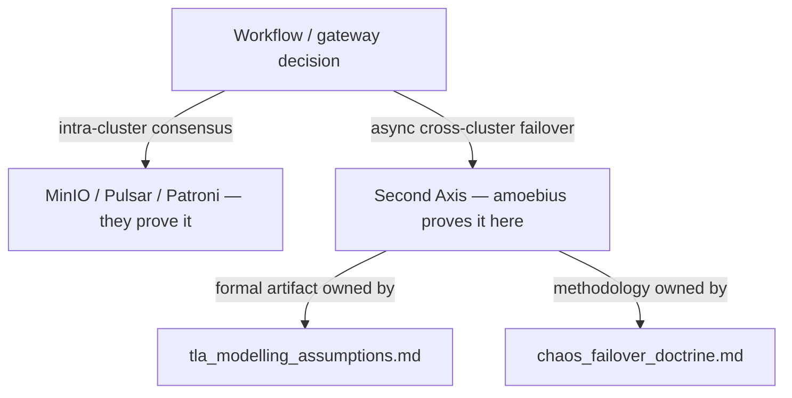

# TLA+ Modelling Assumptions

**Status**: Authoritative source
**Supersedes**: N/A
**Referenced by**: documents/engineering/README.md, documents/engineering/chaos_failover_doctrine.md, documents/engineering/testing_doctrine.md
**Generated sections**: none

> **Purpose**: Own the formal-model assumptions, implementation correspondence, known divergences, and verification boundaries for amoebius's async cross-cluster gateway-failover specification — authored when Phase 9 is reached.

---

## 0. Scheduled stub — read this first

**This is a placeholder, not a finished model.** The TLA+ specification it describes does
not exist yet, and nothing here may be read as a verification result. There is no spec, no
TLC run, no invariant catalog, and therefore nothing **proven**, nothing **tested**, and not
even anything **assumed** about a model — because the model has not been written.

What *does* exist today is a single, sharp **proof obligation** that amoebius has deliberately
deferred until there is a real implementation to correspond to. That obligation, and the
methodology for discharging it, are owned by
[chaos_failover_doctrine.md](./chaos_failover_doctrine.md). This document is the reserved home
for the *artifact* that obligation eventually produces: the formal model and its honest
correspondence ledger.

The model is **Phase 9 work**. Phase order, status, and the acceptance gate are owned by
[DEVELOPMENT_PLAN/README.md → Phase 9](../../DEVELOPMENT_PLAN/README.md); this document never
restates phase status. Authoring begins when Phase 9 (multi-cluster: amoebic spawning +
geo-replication + failover) opens and there is a runtime to model against.

---

## 1. What this document will own (SSoT scope)

When authored, this is the **single source of truth** for everything *about the formal model*
of the cross-cluster failover boundary — and only that. Concretely, it will own:

- **Abstract system model** — what the spec includes (clusters, geo-replication lag, the
  gateway-ownership / route53-repoint protocol, partial-sync failure) and what it abstracts
  away.
- **Variable-to-implementation correspondence** — a table mapping each TLA+ variable and
  action to the concrete Haskell module, daemon loop, or Pulsar/MinIO/Postgres mechanism it
  stands for, with file paths.
- **Known divergences and compression points** — every place the model is more abstract,
  more explicit, or simply different from the runtime, recorded honestly so no reader mistakes
  a modelling convenience for a runtime guarantee.
- **Modelling bounds and limitations** — the bounded constants the model checker is run with,
  what those bounds *prove*, and (just as important) what they do **not** prove.
- **Invariant catalog** — each safety/liveness property the model asserts, in plain terms,
  alongside the concrete failure it prevents.
- **Verification status** — the honest record of what the model checker actually reached.

It does **not** own the *methodology* (Extract → Model → Inject, the invariant-confluence
"Second Axis", the proven/tested/assumed ledger) — that is
[chaos_failover_doctrine.md](./chaos_failover_doctrine.md). It does not own the failover
*mechanics* (geo-replication wiring, gateway handoff, DNS repoint, teardown-with-cleanup vs
chaos-failover) — those live in [cluster_lifecycle_doctrine.md](./cluster_lifecycle_doctrine.md)
and [pulumi_iac_doctrine.md](./pulumi_iac_doctrine.md). This doc references them; it never
duplicates them.

---

## 2. The single proof obligation this model discharges

Most distributed-consensus problems in amoebius are **not ours to prove**. Intra-cluster
consensus — replicated object storage, the message log, the SQL primary — is delegated to
systems that run their own consensus and georeplication and have been hardened far beyond
anything a from-scratch model could claim:

- **MinIO** for replicated/erasure-coded object storage,
- **Pulsar** (BookKeeper) for the durable, ordered message log,
- **Percona/Patroni Postgres** for the SQL primary and its replication.

The doctrine is: delegate the obligation to the system that already discharges it, and do not
re-prove it. (See [platform_services_doctrine.md](./platform_services_doctrine.md) for which
service owns which guarantee.) **Synchronous HA inside one cluster is, by that delegation,
treated as effectively lossless** — those subsystems make it so.

What is left — the *one* place a per-system proof obligation concentrates on amoebius itself —
is the **asynchronous cross-cluster boundary**: geo-replication lag, plus the act of failing the
wild-ingress gateway over to a sibling cluster and repointing DNS. That is the **invariant-
confluence "Second Axis"** named in [chaos_failover_doctrine.md](./chaos_failover_doctrine.md),
and it is the *only* boundary this TLA+ model targets.

---

## 3. The question the model must answer

Lead with the worst case in plain words: a sibling cluster is **mid geo-sync** — it has
accepted some replicated state but not all — and at that instant it goes down, and we try to
fail the gateway over *to that very cluster*. What happens? The honest answer today is *we have
not proven one*, and that is exactly why the model is scheduled.

This is the motivating problem stated in the project vision: *"what exactly happens if a cluster goes down
mid geo-sync and we try to failover the gateway to that cluster? We need to prove we always have
well-defined behaviour (somehow, and even define what that means)."*

The model's job is therefore two-fold, and the second half is the harder half:

1. **Define "well-defined behaviour"** for a failover into a partially-synced cluster — the
   precise predicate the runtime must satisfy (e.g. failover is *refused* below a freshness
   threshold; or it proceeds and the bounded, self-healing divergence is named and capped by a
   declared **data-loss budget**). The definition is part of the deliverable, not an input to
   it.
2. **Prove the runtime always satisfies it** within the model's bounds — no reachable state
   leaves behaviour undefined (no silent data loss, no split-brain gateway, no two clusters
   both claiming wild ingress with no path back to a single owner).

The Phase 9 acceptance gate ties this to a measurement: *measured loss ≤ the declared data-loss
budget, and the proof artifacts are green*
([DEVELOPMENT_PLAN/README.md → Phase 9](../../DEVELOPMENT_PLAN/README.md)).

---

## 4. Planned structure (the skeleton, not the content)

When authored, this document will mirror the rigor of the sibling project's analogue
(`prodbox/documents/engineering/tla_modelling_assumptions.md`), adapted from prodbox's
single-cluster gateway model to amoebius's **cross-cluster** failover model. The sections below
are the reserved table of contents; each is **empty by design** until Phase 9 produces a spec
to fill it.

| Planned section | What it will record |
|---|---|
| Abstract system model | The cluster set, geo-replication lag/queue, gateway-ownership protocol, DNS-repoint gating, and the explicit list of what is abstracted away. |
| Communication model | How cross-cluster replication and failover signalling are represented in the spec vs the concrete Pulsar/MinIO/Postgres + control-plane-singleton runtime. |
| Variable-to-implementation correspondence | TLA+ variables/actions → Haskell modules, daemon loops, and delegated-subsystem mechanisms, with real file paths. |
| Known divergences & compression points | Every model-vs-runtime gap, recorded honestly (the prodbox analogue keeps a numbered list; this one will too). |
| Modelling bounds & limitations | Cluster count, lag bound, and message/log-length constants the checker runs with — and what those bounds do **not** prove. |
| Invariant catalog | Each safety/liveness property in plain terms + the concrete failure it prevents (single-gateway-owner, no-write-after-stale-failover, bounded self-healing divergence, …). |
| Impossibility acknowledgment | The CAP/FLP boundary for async partitions, and amoebius's chosen branch (act-and-heal vs refuse-to-write) for *this* boundary — framed against, not duplicating, [chaos_failover_doctrine.md](./chaos_failover_doctrine.md). |
| Verification status | The honest ledger of what the checker actually reached, and where `io-sim`/runtime tests carry the rest. |

Two adaptation notes carried over from the analogue, so the future author does not re-derive
them:

- **Tooling.** The proof spans **two** instruments, as scheduled by Phase 9: **TLA+/TLC** for
  bounded-state safety of the failover protocol, and **`io-sim`** for the Haskell runtime's
  concurrent behaviour under the same fault assumptions. This document owns the TLA+ half's
  assumptions and correspondence; the `io-sim` half's role in the combined argument is set by
  [chaos_failover_doctrine.md](./chaos_failover_doctrine.md).
- **Topology honesty.** As in prodbox, partition tolerance is a **capability the model reserves
  for the multi-cluster substrate**, not a property a single root cluster exercises. A
  single-node root control plane (prodbox's behaviour) has no sibling to fail over to and trivially
  self-elects; the cross-cluster invariants describe the *intended* multi-cluster behaviour the
  runtime is built toward. The future author must keep that distinction explicit rather than
  presenting reserved capability as exercised fact.

---

## 5. Honesty marker

Per the [documentation standards](../documentation_standards.md) honesty rule and the
chaos/failover doctrine's proven/tested/assumed discipline: until Phase 9 authors the spec and
runs the checker, the cross-cluster failover boundary is an **open proof obligation**, not a
verified property. This document asserts no result. When content lands, every claim here will
state the layer it actually reaches — proof, test evidence, or assumption — and will say which.

---

## Cross-references

- [Chaos & Failover Doctrine](./chaos_failover_doctrine.md) — the Extract→Model→Inject methodology, the proven/tested/assumed ledger, and the invariant-confluence "Second Axis" (owns the *method*; this doc owns the *model artifact*).
- [Development Plan → Phase 9](../../DEVELOPMENT_PLAN/README.md) — phase order, status, and the failover acceptance gate.
- [Cluster Lifecycle Doctrine](./cluster_lifecycle_doctrine.md) — geo-replication, gateway failover, and teardown-with-cleanup vs chaos-failover mechanics.
- [Platform Services Doctrine](./platform_services_doctrine.md) — which delegated subsystem (MinIO/Pulsar/Patroni) owns which intra-cluster consensus guarantee.
- [Pulumi IaC Doctrine](./pulumi_iac_doctrine.md) — the DNS-failover repoint owner.
- [Documentation Standards](../documentation_standards.md) — header, SSoT, and honesty requirements.
