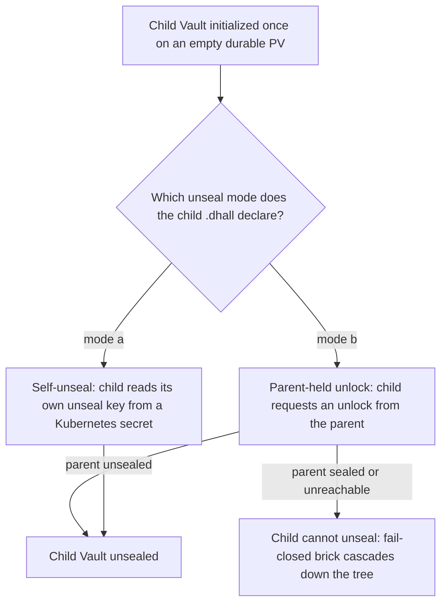
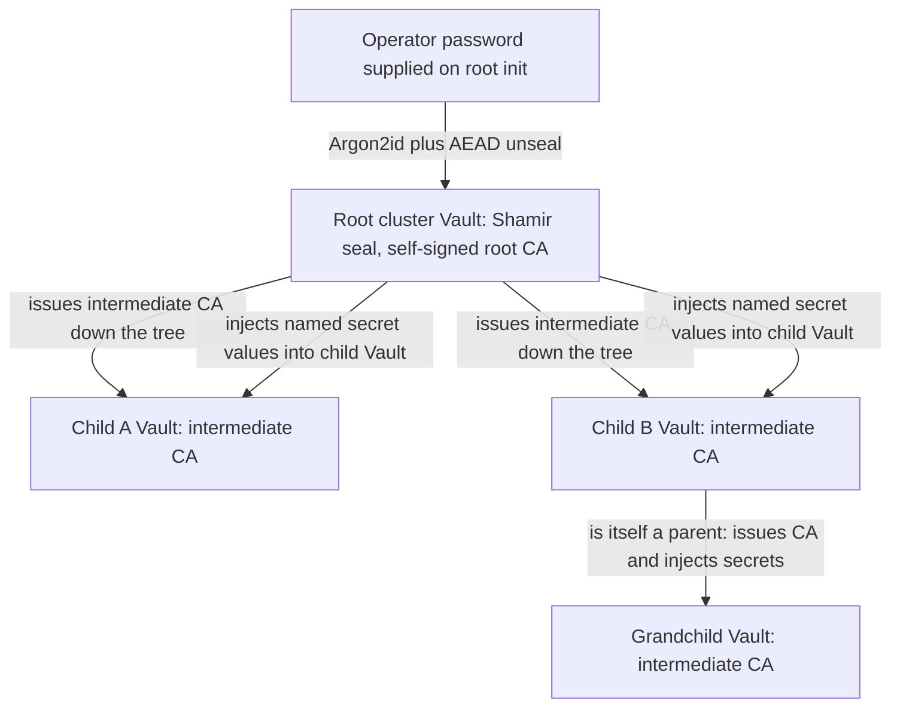

# Vault, PKI & Secret Injection

**Status**: Authoritative source
**Supersedes**: N/A
**Referenced by**: documents/engineering/README.md, documents/engineering/app_vs_deployment_doctrine.md, documents/engineering/chaos_failover_doctrine.md, documents/engineering/cluster_lifecycle_doctrine.md, documents/engineering/daemon_topology_doctrine.md, documents/engineering/dsl_doctrine.md, documents/engineering/host_cluster_comms_doctrine.md, documents/engineering/illegal_state_catalog.md, documents/engineering/image_build_doctrine.md, documents/engineering/manifest_generation_doctrine.md, documents/engineering/platform_services_doctrine.md, documents/engineering/pulumi_iac_doctrine.md, documents/engineering/service_capability_doctrine.md, documents/engineering/storage_lifecycle_doctrine.md, documents/engineering/testing_doctrine.md
**Generated sections**: none

> **Purpose**: Single source of truth for amoebius secrets and trust — Vault as the fail-closed secrets root, the SecretRef-by-name contract, the root cluster's single-node password-encrypted unseal, the two sanctioned parent/child unseal modes, parent-injects-secrets-into-child, and the root-owned PKI trust anchor for the whole forest.

---

## 1. Why this doctrine exists

The DSL holds no secrets — only *names* for them (`amoebius.txt` line 72;
[dsl_doctrine.md §6](./dsl_doctrine.md#6-secrets-are-names-never-values)). That single rule forces a
question this document answers: if the `.dhall` that is composed, diffed, rolled out across an entire
forest of clusters, and stored in an object store carries no secret bytes, then **where do the bytes
live, who puts them there, and what happens when they cannot be reached?** The answer is one subsystem:
an in-cluster Vault per cluster, a tree of trust between those Vaults, and a single human-memorized
password at the root that the whole forest's liveness depends on.

This document owns six things:

1. **Vault as the fail-closed secrets root** — the sole backend for every secret, key, and certificate;
   sealed means *bricked*, never *degraded* (§2).
2. **The SecretRef contract** — the typed *reference* the DSL carries, and the validator that rejects a
   literal secret in a production `.dhall` (§3).
3. **Fail-closed Vault init that follows readiness** — *init Vault, then give it its `.dhall`*
   (`amoebius.txt` line 33), init-once / unseal-on-rebuild (§4).
4. **The root cluster's single-node, password-encrypted unseal** — *root single-node "prodbox"
   behaviour, init to password-encrypted Vault keys* (`amoebius.txt` line 37), human-on-init (§5).
5. **The two parent/child unseal modes and parent secret injection** — self-unseal via a k8s secret
   **or** parent-owns-the-secret-and-the-child-requests-an-unlock, and *parents directly inject the
   secrets into the child's Vault* (`amoebius.txt` lines 66, 72) (§6, §7).
6. **The root-owned PKI trust anchor** — the root cluster owns the self-signed anchor *for everything
   else* (`amoebius.txt` line 66); trust flows down the tree, never sideways (§8).

It does **not** own: the DSL-surface rule that secrets are names not values
([dsl_doctrine.md §6](./dsl_doctrine.md#6-secrets-are-names-never-values)); the fact that Vault is one
of the nine standard services ([platform_services_doctrine.md §5](./platform_services_doctrine.md#5-vault--the-secrets-root-reference-only));
the durable Vault PV and init-once/unseal-on-rebuild *storage* mechanics
([storage_lifecycle_doctrine.md](./storage_lifecycle_doctrine.md)); the cluster bring-up/spawn/teardown
*lifecycle verbs* ([cluster_lifecycle_doctrine.md](./cluster_lifecycle_doctrine.md)); the Pulumi
MinIO-backend Vault-envelope encryption ([pulumi_iac_doctrine.md](./pulumi_iac_doctrine.md)); or the
host-only NodePort comms carve-out ([host_cluster_comms_doctrine.md](./host_cluster_comms_doctrine.md)).
Phase order and status live only in [../../DEVELOPMENT_PLAN/README.md](../../DEVELOPMENT_PLAN/README.md).

> **Honesty.** Everything here is Phase 0 design intent, specified before implementation. The model is
> **proven in the sibling prodbox project** — its `vault_doctrine.md`, `cluster_federation_doctrine.md`,
> and `secret_derivation_doctrine.md` are the realized version of most of this — but that is *evidence
> from a sibling system, not proof in amoebius*, which has not yet built the relevant phases. Read every
> prescriptive statement as the contract amoebius intends to satisfy, never as a tested amoebius result
> ([documentation_standards.md §6](../documentation_standards.md)).

---

## 2. Vault is the fail-closed secrets root

The load-bearing requirement of the whole model: **a sealed Vault bricks the cluster.** There is one
secrets backend and no plaintext fallback, so when Vault is sealed the cluster degrades to an opaque
pile of durable data that reveals nothing.

> A sealed, unreachable, or uninitialized Vault means **no secret resolves** — no KV read, no Transit
> unwrap, no certificate issued. PVs and MinIO objects may still exist, but they yield no secret, no
> in-force config, and no downstream-cluster inventory until Vault is unsealed.

Three invariants make that concrete (generalized from prodbox's `vault_doctrine.md §2` and
`secret_derivation_doctrine.md §3`, lifted from "prodbox-managed cluster" to "every amoebius cluster"):

1. **Sole-backend invariant.** Every secret / credential / key / certificate is a Vault object. There
   is no second store and no plaintext fallback; no secret reconstructs from any non-Vault source.
2. **No-degraded-leak invariant.** When Vault is sealed, no secret resolves, no certificate issues, no
   envelope decrypts, and secret-dependent Pod startup fails its readiness gate
   ([platform_services_doctrine.md §11](./platform_services_doctrine.md#11-bring-up-and-dependency-ordering)).
   Already-running workloads may continue only to the extent they need no *new* Vault operation; a new
   Pod must never reconstruct a secret from a non-Vault source, because none exists.
3. **Metadata-is-secret invariant.** Downstream-cluster names, endpoints, kubeconfigs, and account IDs
   are themselves secret data; a sealed cluster reveals none of them (§6; the federation consequence is
   owned by [cluster_lifecycle_doctrine.md §3](./cluster_lifecycle_doctrine.md#3-amoebic-spawning--the-recursive-forest)).

Every amoebius secret is one of **three Vault object shapes**:

| Shape | Vault subsystem | Used for |
|---|---|---|
| KV v2 secret | `secret/` engine | passwords, API keys, OIDC client secrets, SMTP creds, cloud IAM creds, ACME EAB material |
| Transit key | `transit/` engine | envelope encryption of MinIO objects (in-force config, Pulumi backend state, the content store) — the backend encryption itself is owned by [pulumi_iac_doctrine.md](./pulumi_iac_doctrine.md) and [content_addressing_doctrine.md](./content_addressing_doctrine.md) |
| PKI certificate | `pki/` engine | internal TLS leaf/intermediate certs chaining to the root anchor (§8) |

This *replaces*, rather than extends, any earlier "derive secrets from a seed" scheme: prodbox's
master-seed HMAC-derivation model was retired in favour of exactly this Vault-object model
(`secret_derivation_doctrine.md §1, §4`), and amoebius adopts the finished shape — there is no seed, no
host-side cache, and no chart-template `lookup`+`randAlphaNum` path. A secret is **generated once and
persisted on Vault's durable storage**, then fetched by each consumer (§9). Vault is a singleton HA
platform service on every cluster ([platform_services_doctrine.md §5](./platform_services_doctrine.md#5-vault--the-secrets-root-reference-only)),
and its durable PV is owned by [storage_lifecycle_doctrine.md](./storage_lifecycle_doctrine.md).

---

## 3. The SecretRef contract: a name, never a value

The DSL must be *safe to read* — composed, diffed, rolled out from the root across the whole forest,
and stored. So a sensitive field encodes a typed **reference** to a secret, never the secret itself
([dsl_doctrine.md §6](./dsl_doctrine.md#6-secrets-are-names-never-values) owns the DSL-surface rule;
this section owns the *typed mechanism* it defers to). The reference names *where* a secret will be;
Vault holds *what* it is.

Conceptual Dhall union, imported by every app/cluster schema (adapted from prodbox's proven `SecretRef`
in its `config_doctrine.md` / `vault_doctrine.md §3`):

```dhall
-- Example: shared SecretRef type, imported wherever a sensitive value would otherwise appear
let SecretRef =
      < Vault : { mount : Text, path : Text, field : Text }
      | TransitKey : { name : Text }
      | Prompt : { name : Text, purpose : Text }
      | TestPlaintext : Text
      >

in  SecretRef
```

| Constructor | Production `.dhall` | Notes |
|---|---|---|
| `Vault` / `TransitKey` | Allowed | The target for every in-cluster-consumed secret and every envelope key. |
| `Prompt` | Allowed (CLI only) | One-off elevated operator material (e.g. the cloud-admin credential that mints a least-privilege identity); supplied at the prompt, used, and discarded — never written to disk. |
| `TestPlaintext` | **Rejected** | Accepted only by the test harness, only from a flagged test-secrets file (`amoebius.txt` line 76). |

The contract is enforced by the same **two typed gates** that guard every amoebius `.dhall`
([dsl_doctrine.md §5](./dsl_doctrine.md#5-the-illegal-state-unrepresentable-contract)): Gate 1 (the
Dhall typechecker) admits only a well-typed `SecretRef`, and Gate 2 (the in-process Haskell decoder
under GHC 9.12.4) runs a validator that **rejects any literal secret value and any `TestPlaintext` arm
in production mode**. A plaintext secret in a production config is therefore not "linted later" — it
fails to decode, and an undecoded config is never reconciled. *If it decodes, it carries no secret.*

The corollary — *flagged* test credentials — is a locked amoebius rule: credentials used for test
deployments are specifically flagged so the harness can recognize and clean them up
(`amoebius.txt` line 76). `TestPlaintext` is that flag in the type system; its lifecycle (spin-up →
run → always tear down, elevated-only storage deletion) is owned by
[testing_doctrine.md](./testing_doctrine.md).

---

## 4. Init follows readiness: fail-closed Vault init

**Init never precedes readiness.** Only after the cluster is bootstrapped and all the core services are
up and reachable is it *initialized*: init Vault, then hand it its `.dhall` (`amoebius.txt` line 33).
The bring-up sequence that arrives at "core services reachable" is owned by
[cluster_lifecycle_doctrine.md §2](./cluster_lifecycle_doctrine.md#2-bring-up-and-bootstrap); the
platform-service ordering edge — **Vault initialized and unsealed before any secret-dependent startup**
— is owned by [platform_services_doctrine.md §11](./platform_services_doctrine.md#11-bring-up-and-dependency-ordering).
This section owns the Vault-init contract those two point at.

- **Init-once / unseal-on-rebuild.** The cluster is ephemeral; its storage is not. `vault init` runs
  **exactly once, ever** — the first time the durable Vault PV is empty. Every later bring-up redeploys
  Vault against the existing data and only **unseals** it: no re-init, no key regeneration. A cluster
  rebuild is *not* a fresh Vault. This is the Vault face of the deterministic-rebind guarantee owned by
  [storage_lifecycle_doctrine.md](./storage_lifecycle_doctrine.md) and
  [cluster_lifecycle_doctrine.md §7](./cluster_lifecycle_doctrine.md#7-ephemeral-spin-updown-with-deterministic-rebind):
  because the retained PV survives teardown and rebinds identically, a Vault KV object is as durable
  across rebuilds as any other retained byte.
- **"Give it its `.dhall`" is a fail-closed handoff.** Once unsealed, the cluster receives its in-force
  configuration. The configuration's *at-rest* protection — a Vault-Transit envelope over the MinIO
  backend — is owned by [pulumi_iac_doctrine.md](./pulumi_iac_doctrine.md) and the content store
  ([content_addressing_doctrine.md](./content_addressing_doctrine.md)); the relevant fact here is that
  while Vault is sealed that object is opaque ciphertext, so a sealed cluster reveals nothing about its
  own setup beyond the minimal seal-mode basics it needs to reach and unseal its Vault (§6).
- **The decrypted spec never lands in a cluster-legible store.** The control-plane daemon fetches the
  envelope and **decrypts it in-process, on demand** (prodbox's `Settings.loadConfigFile`-via-
  `Prodbox.Minio.EncryptedObject` pattern); the in-force spec is **never** written to a plaintext
  Kubernetes ConfigMap or to etcd. Any ConfigMap a workload reads may carry only the §6 unencrypted-basics
  floor — never the spec, secrets, or downstream inventory. As defense-in-depth, etcd is configured with
  an `--encryption-provider-config` so even that floor is encrypted at rest. A plaintext spec at rest is
  therefore *unrepresentable* ([illegal_state_catalog.md](./illegal_state_catalog.md)).
- **Ready-before-consumer is absolute.** No consumer of a secret may run before Vault reports
  reachable, initialized, and unsealed. A consumer that reaches a sealed Vault fails closed rather than
  racing it (§2). This generalizes prodbox's `secret_derivation_doctrine.md §7` bootstrap-order rule.

---

## 5. The root cluster: single-node, password-encrypted unseal

The root is the one cluster a human ever unseals, and the reason it can be is its single-node shape.
*Root single-node "prodbox" behaviour … init to password-encrypted Vault keys* (`amoebius.txt` line 37)
is the constituent capability amoebius inherits from prodbox.

**Why single-node makes this work.** A multi-node root bring-up would need secrets — SSH keys or cloud
credentials for the extra nodes — and that would violate secrets-never-in-Dhall before Vault even
exists to hold them (`amoebius.txt` lines 82–84). Constraining the root to a single node lets it
bootstrap with **zero secrets**, so the *only* secret involved in standing up the root Vault is the one
a human types. The single-node-root *bootstrap* decision is owned by
[cluster_lifecycle_doctrine.md §2](./cluster_lifecycle_doctrine.md#2-bring-up-and-bootstrap); the
consequence this section owns is the unseal model that zero-secret bootstrap enables.

The model:

- **Root Vault uses Shamir seal mode.** First-ever `vault init` (§4) produces unseal/recovery keys plus
  the initial root token. amoebius captures that material exactly once and immediately seals it under
  the operator's password into **password-encrypted unlock material** — then never prints raw keys.
- **The password is the sole ephemeral secret.** It is *memorized*, *persisted nowhere*, and supplied
  by a human at the unseal prompt on root init and on every subsequent unseal (`amoebius.txt` line 66:
  *the human provides this password on root cluster init*). It is the single ephemeral root of trust
  for the whole forest.
- **A password is not a hash.** The unlock material is sealed with a real password-based KDF
  (Argon2id) feeding an AEAD (e.g. ChaCha20-Poly1305 / AES-256-GCM) — **never raw SHA-256**, which is a
  hash, not encryption. The password derives the key that *decrypts the unseal keys*; an unsealed Vault
  is then what decrypts and serves everything else.

```text
operator memorized password (entered on init / unseal; stored nowhere persistent)
  -> Argon2id KDF -> AEAD-decrypt the unlock material
  -> recover the root Vault's Shamir unseal keys
  -> submit them -> UNSEAL THE ROOT VAULT
  -> the unsealed root Vault serves every secret, every Transit unwrap, and the PKI anchor (§8),
     and is the unseal authority that lets child clusters come up (§6)
```

The consequence is exactly the §2 brick, viewed from the top: **no password this boot → root Vault
stays sealed → nothing below it can come up.** The concrete realization — a password-AEAD-sealed
*unlock bundle*, where it is stored, and how the bootstrap path reaches it before Vault is up — is
proven in prodbox (`vault_doctrine.md §6`–`§6.1`); amoebius keeps that backend deliberately *pluggable*
(a sealed object in durable MinIO, a host-side `.age` file, a cloud KMS, a TPM/YubiKey identity) behind
one interface, because the load-bearing property is only that the unseal material is **password-AEAD-
sealed and never plaintext at rest**, not which vault holds the ciphertext.

> **Honesty.** The password-encrypted root unseal is *implemented and exercised in prodbox*; in
> amoebius it is design intent for the root-Vault phase. The specific KDF/AEAD primitives and the
> unlock-material backend are pinned by the implementing phase, not fixed here. Status lives only in
> [../../DEVELOPMENT_PLAN/README.md](../../DEVELOPMENT_PLAN/README.md).

---

## 6. Parent/child unseal: two sanctioned modes

Below the root, no human is in the loop — a child must come up on its own. amoebius sanctions **exactly
two** ways a child Vault may unseal, and the choice is a typed field of the child's `.dhall`
(`amoebius.txt` line 66):

| Mode | How the child unseals | Where the unseal authority lives |
|---|---|---|
| **(a) Self-unseal** | The child reads its own unseal key from a Kubernetes secret and unseals itself | A k8s secret on the child cluster |
| **(b) Parent-held unlock** | The child requests an unlock from its parent; the parent owns the unseal secret/authority | The parent cluster's Vault |

Both are legal; neither is a human prompt. Mode (b) is the stricter, fail-closed-by-construction
choice, and it is the mode prodbox realizes in full: a child Vault configured with a transit seal
pointed at its parent, so the child *literally cannot unseal without a live, unsealed parent*, with the
child's recovery keys and initial root token custodied in the parent's Vault KV
(prodbox `cluster_federation_doctrine.md §2`–§3). amoebius treats prodbox's transit-seal tree as the
**evidence-backed realization of mode (b)**, while keeping mode (a) available for clusters that should
hold their own unseal key locally.

The seal mode is one of the few facts a cluster may know about itself *before* its Vault is unsealed —
the minimal, non-revealing basics it needs to reach and unseal its own Vault: its cluster id, its own
Vault address, its seal mode, and (for a child in mode (b)) the parent reference it must contact. These
basics carry nothing about workloads, secrets, or downstream clusters; everything else is behind the
unsealed Vault.



Two encapsulation rules make the forest safe to reason about, and both are owned upstream — recorded
here only because they are *unseal-trust* facts:

- **Children know nothing about siblings.** A child receives only its own subtree's `.dhall`
  (including its own children's) and nothing about siblings or any wider part of the forest
  (`amoebius.txt` line 66; [cluster_lifecycle_doctrine.md §3](./cluster_lifecycle_doctrine.md#3-amoebic-spawning--the-recursive-forest)).
  A child's unseal request reaches *up* to its parent and never *sideways*. A sealed cluster therefore
  cannot be made to reveal whether it even *has* children, how many, or where (§2 metadata invariant).
- **The brick cascades down, by design.** In mode (b), if any parent is sealed or unreachable, its
  children cannot unseal, and their children cannot unseal, down the whole subtree. This is the safety
  property, not a fault: a sealed parent must brick its descendants rather than let them come up with
  secrets recovered from any non-Vault source. Cluster liveness for the entire forest roots in one
  operator unsealing the root (§5). The cascade is depth-generic: it bricks the whole subtree to
  **arbitrary depth**, exactly as the transit-seal trust tree nests parent→child→grandchild.
- **Each child's spec is sliced under its own Transit key.** Need-to-know is not only a *distribution*
  rule (a child receives only its own subtree, above) — it is a *cryptographic* one. Each child's subtree
  spec is enveloped under a **per-child Vault Transit key** (`transit/amoebius-<child-id>-config`) with a
  per-child policy that grants decrypt on that key alone, and the id↔object index is sharded per child. So
  a child cannot decrypt a sibling's subtree **even if its parent's Vault is unsealed** — the horizontal
  need-to-know boundary holds by *key*, not merely by which ciphertext was handed down. The parent
  necessarily holds every child key (it must, to spawn), so the boundary is **horizontal** between
  siblings and **bounded downward** to a node's own subtree, never **upward** to an ancestor. That a
  child's spec value can only *be* its own subtree projection is owned by
  [cluster_lifecycle_doctrine.md §3](./cluster_lifecycle_doctrine.md#3-amoebic-spawning--the-recursive-forest)
  and [dsl_doctrine.md](./dsl_doctrine.md); this section owns the key mechanism. Optionally the parent
  signs each envelope's digest so a child can *attest* it received the intended, untampered spec.

---

## 7. Parent injects secrets into the child's Vault

Section 3 says the DSL holds only a *name*. This section closes the loop: the bytes get into the
child's Vault because **the parent puts them there**. *Parents directly inject the secrets into the
child's Vault* (`amoebius.txt` line 72) — the DSL names *where* a secret will be, and the parent
materializes *what* it is into the child during spawn/reconcile.

The end-to-end path, in order:

1. **The `.dhall` names the secret** (§3) — a `SecretRef` coordinate, no value, safe to roll out from
   the root across the whole tree.
2. **The parent resolves the value from its own (unsealed) Vault** and **injects it into the child's
   Vault** over a trusted parent→child channel established at spawn time. The spawn itself — a Pulumi
   deploy from inside the parent, with a MinIO backend encrypted via Vault Transit — is owned by
   [cluster_lifecycle_doctrine.md §3](./cluster_lifecycle_doctrine.md#3-amoebic-spawning--the-recursive-forest)
   and [pulumi_iac_doctrine.md](./pulumi_iac_doctrine.md); the injection rides that established trust.
3. **In-cluster consumers on the child read it via Vault Kubernetes auth** (§9) — never from a
   Dhall-mounted plaintext fragment, never from an environment variable.

This is why secrets-by-name is not a loophole: there is no point at which a secret value sits in a
file an operator hands around. The value lives only in Vault, injected downward by the parent that
already holds it, and resolved in-cluster by the workload that needs it. A child only ever receives the
secrets for *its own* subtree — the same children-know-nothing-about-siblings boundary as §6, applied
to secret material: injecting a parent's or a sibling's secret into a child is not expressible, because
a child's `.dhall` names only its own.

> **Honesty.** Parent→child secret injection is *specified* here and scheduled with amoebic spawning;
> prodbox proves the adjacent custody flow (a parent writing a child's init keys and downstream
> metadata into the parent's own Vault KV, `cluster_federation_doctrine.md §3`), which is evidence for
> the trust channel but is *not* itself the same "inject arbitrary named secrets into the child's Vault"
> operation. Treat this as design intent, not a tested amoebius result.

---

## 8. The root cluster owns the PKI trust anchor

There is exactly **one** self-signed root of trust in the forest, and it sits at the root cluster: *that
root cluster's kind owns the (self-signed) PKI trust anchor for everything else* (`amoebius.txt`
line 66). Internal trust flows **down** the tree from that anchor; it is never minted independently at a
leaf and never shared sideways between siblings — the same direction as unseal authority (§6).

- **Vault PKI is the anchor.** The root cluster's Vault `pki/` engine holds the self-signed **root
  CA**. As the forest grows, the root issues an **intermediate CA** to each child, the child issues to
  its own children, and so on — a CA hierarchy whose shape mirrors the amoebic forest. Every internal
  certificate (service-to-service TLS, any mesh, in-cluster component certs) chains back to the single
  root anchor, so a workload anywhere in the tree can validate a peer's certificate against a trust
  root it inherited from above.
- **Internal PKI is not public-edge TLS.** Three certificate planes coexist and must not be conflated:
  1. **Internal PKI (this doc):** Vault-PKI certs chaining to the root anchor, for traffic *inside* and
     *between* amoebius clusters.
  2. **Public-edge TLS:** the certificates Keycloak's wild-ingress edge presents to the outside world,
     provisioned via ZeroSSL and DNS (route53). That ACME path — including the EAB material, which is a
     Vault KV secret referenced by `SecretRef` (§2, §3) — is owned by
     [pulumi_iac_doctrine.md](./pulumi_iac_doctrine.md); the single wild-ingress door is owned by
     [platform_services_doctrine.md §9](./platform_services_doctrine.md#9-the-loadbalancer-and-the-single-wild-ingress-path).
  3. **Distro mTLS:** the Kubernetes distro's own self-signed cluster CA for kube-apiserver, over which
     the host amoebius binary talks to the control plane. This is part of the chicken-and-egg floor
     (§10), not something Vault owns — Vault runs *inside* that PKI.
- **The host-comms hop is deliberately not PKI-secured.** Host compute daemons reach in-cluster MinIO
  and Pulsar as **peers over host-only NodePorts with no mTLS** — that hop is safe by being
  localhost-only and unreachable off-box, not by certificate, so the PKI anchor does **not** extend to
  it ([host_cluster_comms_doctrine.md](./host_cluster_comms_doctrine.md);
  [platform_services_doctrine.md §9](./platform_services_doctrine.md#the-sole-exception-host-origin-localhost-only-traffic)).



> **Honesty.** The Vault-PKI-as-root-anchor design is specified here; prodbox uses Vault as its TLS/PKI
> authority with cert-manager driving ZeroSSL and Vault holding the EAB material
> (`vault_doctrine.md §11`), and the native-Vault-PKI internal-CA hierarchy is a deferred,
> live-proof-pending option even there. Read the cross-cluster CA hierarchy as amoebius's intended end
> state, not a tested result.

---

## 9. In-cluster consumers authenticate to Vault directly

There is exactly **one** in-cluster secret-delivery path: a workload authenticates to Vault with its
Kubernetes service account and reads only what its policy grants. This is the amoebius adoption of
prodbox's proven model (`secret_derivation_doctrine.md §5`–§6,
[prodbox `vault_doctrine.md §12`]); the inventory table there is the evidence, not restated here.

- **Vault Kubernetes auth per consumer.** Each component has a service account; a Vault role bound to
  that namespace + service account; a least-privilege policy granting read on exactly its own KV paths
  or Transit keys and nothing else; and it authenticates with the service-account JWT. A leaked grant
  is contained to one consumer's paths.
- **No Secret-mounted plaintext, no env var, no PATH.** There is no Dhall fragment mounted as a k8s
  Secret and no credential read from the environment — consistent with amoebius's locked
  no-environment-variables / no-`PATH` contract ([substrate_doctrine.md](./substrate_doctrine.md)):
  the only inputs a workload reads are its typed config (names, §3) and the Vault objects its policy
  allows.
- **Generated once, never derived.** A secret a chart needs is minted once into Vault (KV) or issued
  by Vault (PKI) at install and persisted on the durable PV (§2, §4); no chart template generates or
  stores a secret value, and there is no seed to derive from.

---

## 10. The chicken-and-egg floor: what stays outside Vault

Vault owns everything except the minimal floor it cannot bootstrap itself from. This is the amoebius
generalization of prodbox's `vault_doctrine.md §17`. The **only** data that may live outside Vault:

1. **The distro's self-signed cluster CA + admin kubeconfig.** Vault runs *inside* this cluster's PKI,
   so it cannot be the thing that mints it (§8 plane 3).
2. **The Vault PV binding itself** — owned by [storage_lifecycle_doctrine.md](./storage_lifecycle_doctrine.md).
3. **Root cluster only:** the operator's memorized unseal password — the sole ephemeral secret (§5).
   The password-AEAD-sealed unlock material it decrypts is not a Vault-owned object; it is what
   *unseals* Vault, and its body is password-sealed regardless of where the ciphertext rests.
4. **Child cluster only:** the bootstrap reference and unseal credential the child uses to reach its
   unseal authority — in mode (b) provisioned and owned by the parent (§6), in mode (a) the local
   Kubernetes secret holding its own unseal key.

Everything else — all generated secrets, cloud creds, OIDC and SMTP material, internal TLS, the
in-force config, the Pulumi backend state, and child custody material — is Vault-owned and
unrecoverable from a sealed cluster.

---

## 11. Error model and no-leak logging

Vault failures are ordinary, typed control flow — not exceptions thrown into a half-applied effect —
and they never carry secret material. A conceptual error type (adapted from prodbox's
`Prodbox.Vault.Client`, `vault_doctrine.md §14`) distinguishes *unavailable / uninitialized / sealed /
policy-missing / secret-missing / decrypt-denied* so a caller can fail closed with an actionable,
non-leaking message.

The logging rule extends the §2 and §6 invariants to output: on a sealed-state path, a log line never
emits a SecretRef-resolved value, a Vault token, child init keys, a downstream-cluster name, or an
exists-vs-absent oracle that would distinguish "this child/secret is present" from "absent" — presence
is itself metadata. Prefer redacted structured logs
(`vault_status=sealed component=child-unseal result=blocked`) over identifying messages. The deployed,
cross-surface proof that *every* sealed surface leaks nothing — the sealed-Vault red-team — is part of
the verification surface owned by [chaos_failover_doctrine.md](./chaos_failover_doctrine.md) and
[testing_doctrine.md](./testing_doctrine.md), and is *evidence-backed in prodbox* (its
`vault_doctrine.md §19` red-team checklist), not yet proven in amoebius.

---

## 12. Planning ownership

This document is normative Vault/PKI/secret-injection doctrine only. Delivery sequencing, completion
status, validation gates, and remaining work are owned by
[../../DEVELOPMENT_PLAN/README.md](../../DEVELOPMENT_PLAN/README.md), never restated here. For
orientation only (the plan is authoritative): **root Vault + the self-signed PKI anchor** land with
platform services in the same phase as the standard service set
([cluster_lifecycle_doctrine.md §10](./cluster_lifecycle_doctrine.md#10-planning-ownership),
[platform_services_doctrine.md §13](./platform_services_doctrine.md#13-planning-ownership)); the
**SecretRef decode-time validator** rides the orchestration-DSL gate phase
([dsl_doctrine.md §10](./dsl_doctrine.md#10-planning-ownership)); and **parent/child unseal, parent
secret injection, and the cross-cluster CA hierarchy** land with amoebic spawning/federation. This doc
states the target shape and links back for status.

---

## Cross-references

- [Engineering Doctrine Index](./README.md)
- [DSL Doctrine](./dsl_doctrine.md) — secrets-are-names-not-values (the DSL-surface rule this doc's mechanism serves)
- [Cluster Lifecycle Doctrine](./cluster_lifecycle_doctrine.md) — single-node-root bootstrap, amoebic spawning, and the child unseal lifecycle
- [Platform Services Doctrine](./platform_services_doctrine.md) — Vault as a standard HA platform service and the Vault-ready ordering edge
- [Storage Lifecycle Doctrine](./storage_lifecycle_doctrine.md) — the retained Vault PV and init-once / unseal-on-rebuild durability
- [Pulumi IaC Doctrine](./pulumi_iac_doctrine.md) — Vault-Transit-envelope encryption of the MinIO Pulumi backend and the public-edge ZeroSSL/route53 path
- [Host ↔ Cluster Comms Doctrine](./host_cluster_comms_doctrine.md) — the host-only NodePort hop that is deliberately not PKI-secured
- [Substrate Doctrine](./substrate_doctrine.md) — the no-environment-variables / no-`PATH` contract
- [Testing Doctrine](./testing_doctrine.md) — flagged test credentials and the elevated-only storage-deletion model
- [Chaos / Failover Doctrine](./chaos_failover_doctrine.md) — the proven/tested/assumed ledger and the sealed-Vault red-team surface
- [Development Plan](../../DEVELOPMENT_PLAN/README.md)
- [Documentation Standards](../documentation_standards.md)
- [Amoebius vision](../../amoebius.txt)
