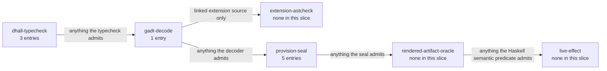

# Illegal States — Capacity & Placement

> **Purpose**: The themed slice of the illegal-state catalog covering capacity folds, placement /
> bin-packing, tolerations / affinity, and accelerator ownership / VRAM — the states a valid `InForceSpec`
> cannot represent, with the honest limit that a type-check proves the *spec composes*, not that the
> *running cluster enforces it*.
> **Read this if**: a resource, placement, or quota state has to be shown impossible rather than merely checked.

Resource states form the largest slice of the catalog, and the one where foreclosure is weakest: a sum is
arithmetic, so most entries here are caught by a total check rather than by having no inhabitant at all. The
entries and their loci are owned here; the numbering belongs to
[illegal_state_catalog.md](./illegal_state_catalog.md) and the arithmetic itself to
[resource_capacity_folds.md](../engineering/resource_capacity_folds.md).

Link-graph metadata

**Status**: Authoritative source
**Supersedes**: N/A
**Referenced by**: DEVELOPMENT_PLAN/later_phases.md, DEVELOPMENT_PLAN/overview.md, DEVELOPMENT_PLAN/phase_09_resource_index.md, DEVELOPMENT_PLAN/phase_28_storage_geometry_folds.md, DEVELOPMENT_PLAN/phase_29_execution_accelerator_folds.md, documents/engineering/README.md, documents/engineering/cluster_topology_doctrine.md, documents/engineering/jit_budget_doctrine.md, documents/engineering/platform_services_doctrine.md, documents/engineering/readiness_ordering_doctrine.md, documents/engineering/resource_capacity_doctrine.md, documents/engineering/resource_capacity_folds.md, documents/engineering/substrate_node_inventory.md, documents/engineering/tenancy_doctrine.md, documents/illegal_state/README.md, documents/illegal_state/illegal_state_catalog.md, documents/illegal_state/illegal_state_lifecycle.md, documents/illegal_state/illegal_state_security.md, documents/illegal_state/illegal_state_techniques.md, documents/illegal_state/illegal_state_topology.md
**Generated sections**: none

> **Historical result (invalidated).** Every phase-run or implementation-result statement in this document is permanently invalidated diagnostic history. It cannot establish or reactivate current status, even if a phase later advances. Target doctrine remains normative; current status is solely in the [tracker](../../DEVELOPMENT_PLAN/README.md).

## Contents
- [1. Scope](#1-scope)
- [2. The capacity & placement illegal states](#2-the-capacity--placement-illegal-states)
- [Related Documents](#related-documents)

---

## 1. Scope

This document is a **themed slice** of the illegal-state catalog. It reproduces the deep treatment of the
capacity / placement / accelerator entries and adds, per entry, the orthogonal **validation-locus** axis.

The material this slice deliberately does **not** restate lives with its owners:

- The **catalog index** (which entries exist, the introductory framing) and the **load-bearing honesty limit**
  (a type-check proves the *spec composes*, not that the *running cluster enforces it*) are owned by
  [`illegal_state_catalog.md`](./illegal_state_catalog.md).
- The **nine typing techniques** ([§4](./illegal_state_techniques.md#4-the-typing-techniques)), the **coverage matrix** ([§5](./illegal_state_techniques.md#5-coverage-matrix--which-technique-forecloses-which-illegal-state)),
  the **three-layer foreclosure** model (type-foreclosed / decode-foreclosed / runtime-checked, [§6](./illegal_state_techniques.md#6-three-layers-of-foreclosure-and-the-honesty-they-force)),
  and the **validation-locus axis** itself are owned by [`illegal_state_techniques.md`](./illegal_state_techniques.md).
  The loci referenced below are defined and enumerated there
  ([§6.1](./illegal_state_techniques.md#61-the-validation-locus-axis--where-each-illegal-state-is-caught-orthogonal-to-the-foreclosure-layer));
  this slice only names, per entry, where each illegal state is caught.

The validation-locus is **orthogonal** to the foreclosure layer: the `**Layer:**` tag says *which of the
three foreclosure strengths* an entry earns (type-foreclosed vs decode-foreclosed vs runtime-checked), while
the `**Validation-locus:**` line says *at which gate in the pipeline* the check actually fires. Everything
below is **design intent** for the type discipline, not a tested amoebius result: a green type-check proves
the spec composes; it does not prove the cluster enforces it ([`illegal_state_techniques.md` §6](./illegal_state_techniques.md#6-three-layers-of-foreclosure-and-the-honesty-they-force)).

---

## 2. The capacity & placement illegal states

*Orientation. Design intent. Where this slice's entries are caught, counted from the primary `**Validation-locus:**` of each entry below; an entry may also name a secondary locus, which this count does not show. Capacity is the slice where foreclosure is weakest: most entries are a sum, so the seal catches what no type can. The axis itself is owned by [illegal_state_techniques.md §6.1](./illegal_state_techniques.md#61-the-validation-locus-axis--where-each-illegal-state-is-caught-orthogonal-to-the-foreclosure-layer).*

### 3.5 Undeployable pods (taints, tolerations & affinity)

**Delivery-owner:** `Phase-9`

**Case-family:** `topology`

**Cells:** `type-foreclosed`×`dhall-typecheck` · `decode-foreclosed`×`provision-seal` · `runtime-checked`×`live-effect`

In raw k8s a nodeSelector / affinity can match **no** node, *or* a taint no workload
tolerates, *or* a toleration for a taint no node declares — the pod is admitted and then never schedules.
amoebius constrains placement so that a workload's substrate/affinity requirement **and** its taint
tolerations are checked against the *declared* node inventory of the cluster spec: post-bind provision requires
at least one inventory node whose capabilities satisfy the requested affinity and whose taints are all covered
by the derived tolerations. Placement is expressed as a capability the
workload *requests* and a node *offers*; an unmatchable request/topology pair is constructible input but
cannot produce `ProvisionedSpec`. A **toleration is never hand-authored** — it is *derived* from a declared node taint (the same "derived, never written" discipline as
NetworkPolicy, [§3.6](./illegal_state_security.md#36-blocking-networkpolicy-services-cant-reach-each-other)), so "a toleration for a taint no node declares" is unrepresentable and "a taint no
workload tolerates" leaves the existence fold with no landable node. This strengthens the original
affinity-only entry to cover taints and tolerations. This entry checks placement *constraints*
(affinity/taints); the complementary *resource-fit* existence check — that a matching node also has enough
allocatable room once every other pod is placed, **and** that any accelerator demand is met by the node's
**wholesale accelerator owner** rather than a per-pod GPU claim — is [§3.27](#327-a-deployment-that-fits-in-aggregate-but-has-no-resource-capable-placement),
and the two compose in `place`'s `podFits`: **substrate/affinity-capability existence** (this entry) ∘
**resource-fit existence** ([§3.27](#327-a-deployment-that-fits-in-aggregate-but-has-no-resource-capable-placement)),
the latter now reading accelerator fit through the wholesale-per-node owner ([§3.28](#328-two-accelerator-owners-on-one-node-or-a-fractional-accelerator-claim)),
never a per-pod `gpu` axis. **Owner:**
[`substrate_doctrine.md`](../engineering/substrate_doctrine.md) (substrate/arch capabilities, the closed node-taint set + node inventory) and [`platform_services_doctrine.md` §9](../engineering/platform_services_doctrine.md#9-the-loadbalancer-and-the-single-wild-ingress-path) (the derived-toleration rule, parallel to derived NetworkPolicy). **Technique:** [§4.2](./illegal_state_techniques.md#42-capability-and-phantom-tenant-tags--cross-tenant-refs-are-uninhabitable) (capability tags) + [§4.3](./illegal_state_techniques.md#43-gadt-indexed-state-machines--only-legal-transitions-are-typed) (a derived toleration handle exists only once its taint edge does) + [§4.4](./illegal_state_techniques.md#44-ownership-indices--single-owner-ssot-structurally) (the node inventory is the single owner of "what substrates and taints exist"), the existence check itself being a [§4.4](./illegal_state_techniques.md#44-ownership-indices--single-owner-ssot-structurally) value-level fold. **Layer:**
decode-foreclosed for the existence fold; the derived-toleration shape is type-foreclosed ([§3.22](#322-a-hand-authored-un-derived-toleration)). The scheduler landing the pod on the witnessed node is `runtime-checked`: an observation, never a fold.
**Validation-locus:** `provision-seal` (the whole-deployment schedulability existence fold returns a
`ProvisionError` before any `ProvisionedSpec` exists when no node satisfies affinity and tolerates every taint) +
`dhall-typecheck` (the derived-toleration shape has no hand-author
constructor, [§3.22](#322-a-hand-authored-un-derived-toleration)) + `live-effect` (residue — that the scheduler actually lands the pod on the
witnessed node).

### 3.17 An over-committed deploy or workload (host / VM / cluster capacity exceeded)

**Delivery-owner:** `Phase-27`

**Case-family:** `capacity`

**Cells:** `type-foreclosed`×`dhall-typecheck` · `decode-foreclosed`×`gadt-decode` · `decode-foreclosed`×`provision-seal` · `runtime-checked`×`live-effect`

Raw k8s can admit a workload whose requests, declared limits, or physical peaks exceed the real target, a VM or host
worker that overdraws its physical host, durable claims larger than their backing, or pod-ephemeral/cache
consumers that double-count one physical disk. Host build CPU/memory/scratch/cache, topology-derived network
fabric, static control-plane process/storage transitions, node OCI content/snapshots, registry/Vault/TSDB
storage, and monitoring evaluation are equally capable of becoming
invisible demand in an incomplete model. Those failures surface later as `Pending`, eviction, OOM, or
a full disk. amoebius instead folds the complete typed demand against the enclosing capacity at every nesting
level: physical host → presentation-derived VM + host workers + host cache; VM → guest node allocatable;
cluster → pods/fabric; each real nodefs/imagefs backing → layout-routed writable/log/volume/image bytes; and
durable backing → presentation-rounded retained claims. `BuildExecutionEnvelope`, the named-process
`EngineSystemReserve` with transition-complete etcd storage, `NetworkFabricSystemDemand`, and
descriptor-derived `MonitoringWorkBudget` cost enter the corresponding host/pod
folds rather than an overhead constant. An in-cluster cache-owner `emptyDir` is a pod-ephemeral consumer, not a second cache-pool
debit.

The scheduler-reservation proof uses CPU, memory, and pod `ephemeral-storage` **reserved** demand — the
declared requests plus any declared compute headroom pad, which is `Zero` on every axis for a workload that
declares none ([§3.72](#372-a-compute-headroom-pad-that-reserves-past-its-own-limit), [§3.73](#373-a-padded-reservation-that-overcommits-allocatable)). A separate
finite-limit/physical-peak proof sums declared memory and pod-ephemeral **limits**, durable caps, native-cache
peak budgets, and other bounded consumers, so requests alone cannot overclaim physical sufficiency. Memory is
a reactive kernel boundary and local ephemeral storage is a kubelet measurement/eviction boundary, not a
synchronous filesystem quota; cache admission and the layout-routed backing provide the corresponding hard
materialization and physical bounds. For an in-cluster cache the proof establishes
`ProvisionedCacheDemand.derivedPeak ≤ CacheBudget ≤ emptyDir.sizeLimit` and
each container's private writable/log allowance fits its own ephemeral request/limit, while
`Σ disk-backed volume sizeLimits + lifecycle-effective private allowances ≤
ownerPod.ephemeralStorage.request ≤ ownerPod.ephemeralStorage.limit`, then charges that pod envelope once to
node ephemeral capacity. Every memory-backed volume names access/persistence; the lifecycle fold assigns one
request carrier per resident volume/epoch, proves unique resident volumes plus live working sets fit the
effective pod request/limit, and checks possible charged accessors' limits. The effective pod memory envelope
is charged once to node memory. OCI index/manifest/config/compressed objects are deduplicated by digest,
snapshotter bytes by chain id, and bounded import workspace is added. The closed kubelet layout routes these
alongside writable roots/logs/volumes to each actual backing while keeping the logical Kubernetes ephemeral
request proof separate; only constructor-required aliases are legal. Durable required-usable bytes pass through
block/filesystem overhead and backing/provider quantum before raw allocation. Storage backings and local pools
carry identity: two consumers may be summed only when they debit the same named physical pool, and declared
disjoint pools must themselves carve within the physical disk. Accelerator
availability/count and accelerator memory are checked in the placement-specific entries [§3.27](#327-a-deployment-that-fits-in-aggregate-but-has-no-resource-capable-placement)
and [§3.30](#330-an-accelerator-memory-envelope-that-cannot-fit-the-selected-devices-or-unified-memory-pool).

Because capacity is a *value*, not a type index (Dhall has no dependent arithmetic), these are **total pure provision checks**, honestly decode-foreclosed — never claimed uninhabitable. The full expansion and fold
must finish after capability binding and before rendering; only success constructs the opaque
`ProvisionedSpec`, so a raw or merely bound deployment cannot bypass capacity admission by calling
deployment-global `renderAll`. The same boundary rejects an execution policy that has no possible progress:
dhall-typecheck preserves raw Deployment `RollingUpdate { maxSurge, maxUnavailable }`, while gadt-decode exposes only the
opaque `DeploymentRolloutPolicy` smart constructor and rejects `{ 0, 0 }`. The legal `{ 1, 0 }` and `{ 0, 1 }`
controls prove this is the Deployment progress invariant, not an accidental both-positive rule. StatefulSet,
DaemonSet, Job, and HostProcess use their own closed policy arms rather than this pair. Consequently the
provision fold never invents a stalled Deployment epoch and `renderAll` cannot emit one.
This entry covers aggregate and named-pool overcommit. The distinct case where totals fit but an atomic pod
has no individually capable node is [§3.27](#327-a-deployment-that-fits-in-aggregate-but-has-no-resource-capable-placement).
**Owner:** [`resource_capacity_doctrine.md`](../engineering/resource_capacity_doctrine.md), consuming physical
inventory from [`substrate_doctrine.md`](../engineering/substrate_doctrine.md), complete workload envelopes
from [`platform_services_doctrine.md` §10](../engineering/platform_services_doctrine.md#10-every-execution-unit-declares-its-complete-resource-envelope),
and durable backing/claim sizes from
[`storage_lifecycle_doctrine.md`](../engineering/storage_lifecycle_doctrine.md). **Technique:**
[§4.6](./illegal_state_techniques.md#46-capacity-accounting--placement-witness-compute-and-summed-demand-within-capacity-storage-checked)
(capacity-accounting total fold). **Layer:** decode-foreclosed. The controller-policy arms refused at authoring are `type-foreclosed` — an illegal rollout pair has no record to write — and staying inside the enforced boundaries at run time is `runtime-checked`.
**Validation-locus:** `dhall-typecheck` (controller-specific closed policy records reject DaemonSet
both-positive rollout fields, unsupported/nonzero StatefulSet partition arms, and a Job without terminal
retention) + `gadt-decode` (the decoder-local zero-progress rolling smart constructor returns
`Left (UnspellableCombination "rollout.rollingProgress")`) + `provision-seal` (the post-bind reservation,
finite-limit/physical-peak, named-pool, nested-host/build/engine, and monitoring-work folds return
`Left Overcommit`/`Left StoragePoolOvercommit` before a `ProvisionedSpec` exists) + `live-effect` (residue —
observed allocatable/backing is cross-checked before mutation, and the running system stays within enforced
boundaries: no `Pending`, eviction, OOM, or full disk). The authored Haskell case declaration named
`illegal_hard_ceiling_overcommit` retains its stable historical name but exercises this
finite-limit/physical-peak relation; any serialized transport is emitted lazily beneath `.build/**`, and the
name does not assert synchronous ephemeral quota enforcement.

### 3.22 A hand-authored (un-derived) toleration

**Delivery-owner:** `Phase-33`

**Case-family:** `topology`

**Cells:** `type-foreclosed`×`dhall-typecheck` · `type-foreclosed`×`gadt-decode` · `decode-foreclosed`×`rendered-artifact-oracle`

A free-text toleration is how a pod "tolerates" a taint no node carries (or fails to tolerate the one it
must). amoebius never lets an operator *write* a toleration: a `Toleration` handle has no exported
constructor and is **projected** only from a declared node taint against the single node inventory — the same
derive-don't-author discipline as NetworkPolicy ([§3.6](./illegal_state_security.md#36-blocking-networkpolicy-services-cant-reach-each-other)). So a toleration for a nonexistent taint is
unrepresentable, and the schedulability existence fold ([§3.5](#35-undeployable-pods-taints-tolerations--affinity)) does the rest. **Owner:**
[`substrate_doctrine.md`](../engineering/substrate_doctrine.md) (the closed `NodeTaintKind` set + node inventory) +
[`platform_services_doctrine.md` §9](../engineering/platform_services_doctrine.md#9-the-loadbalancer-and-the-single-wild-ingress-path) (the derivation rule). **Technique:**
[§4.4](./illegal_state_techniques.md#44-ownership-indices--single-owner-ssot-structurally) (the node inventory is the single owner of what taints exist) + [§4.3](./illegal_state_techniques.md#43-gadt-indexed-state-machines--only-legal-transitions-are-typed) (a `Toleration` handle exists only once its taint edge does). **Layer:** type-foreclosed uninhabitable. The derived toleration appearing correctly in the emitted pod spec is `decode-foreclosed`: a total predicate over rendered output, not an absent inhabitant.
**Validation-locus:** `dhall-typecheck` (the Dhall workload record carries **no** hand-authorable toleration
field at all — a toleration is not a spellable input but a projection from a declared node taint in the
Haskell render layer, so a free-text toleration is unwritable at authoring) + `gadt-decode` (the
`Toleration` handle's constructor opacity is Haskell module-opacity, which Dhall cannot provide — Dhall has no
opaque types ([`illegal_state_techniques.md` §6](./illegal_state_techniques.md#6-three-layers-of-foreclosure-and-the-honesty-they-force)) — so the projection-only discipline's full teeth land
at the GADT decoder) + `rendered-artifact-oracle` (a separately authored Haskell predicate requires the
derived toleration in the emitted pod spec, using the same independent semantic discipline as the derived
NetworkPolicy [§3.6](./illegal_state_security.md#36-blocking-networkpolicy-services-cant-reach-each-other)).
No expected pod-spec bytes are tracked; serialized projections exist only beneath `.build/test-corpora/**`.

### 3.27 A deployment that fits in aggregate but has no resource-capable placement

**Delivery-owner:** `Phase-9`

**Case-family:** `capacity`

**Cells:** `decode-foreclosed`×`provision-seal` · `runtime-checked`×`live-effect`

Raw k8s admits a workload whose demand fits a cluster *in aggregate* but whose individual pods cannot be packed
onto individual nodes — for example, a 5-CPU pod on a cluster of 4-CPU nodes, or a pod whose memory or
`ephemeral-storage` request/limit exceeds every eligible node. It is well-formed and admits, then hangs
`Pending` or fails under pressure, because **pods are atomic and cannot straddle nodes**. Accelerator
capability is another placement predicate: a deployment requiring CUDA has no placement on a target whose
eligible nodes/candidate classes offer no compatible CUDA device, even if its CPU/memory/storage totals fit.
There is no silent CPU fallback; an allowed fallback must be explicit in the pure capability need.

This is the resource-fit generalization of [§3.5](#35-undeployable-pods-taints-tolerations--affinity): [§3.5](#35-undeployable-pods-taints-tolerations--affinity)
asks whether *a node matching affinity + tolerating taints exists*; this entry adds *with enough CPU, memory,
pod-ephemeral capacity, and required accelerator family/count, given everything else placed*. Ordinary
workloads do not author GPU claims: the CUDA need binds to the node's wholesale accelerator owner
([§3.28](#328-two-accelerator-owners-on-one-node-or-a-fractional-accelerator-claim)), whose whole-device
extended-resource allocation is derived. amoebius makes the cluster check a **placement**, not a sum: for a
**fixed** node set post-bind provision computes a concrete pod/accelerator-owner→node witness (`place`) and rejects
`Left Unschedulable` or `Left MissingCapability Cuda` if none exists; for an **elastic** (autoscaled /
`Managed Eks`) set it checks a **sound growth envelope over every declared candidate class** — each atomic
workload fits some compatible candidate, and the worst-case *instance count* (not merely Σ demand at maximum
scale) stays within quota. This is sound but **not** a completeness guarantee: it never admits a spec the
autoscaler cannot grow to satisfy, though it may reject a packable one. The old aggregate-sum
([§3.17](#317-an-over-committed-deploy-or-workload-host--vm--cluster-capacity-exceeded)) does not catch this;
the placement does. **Owner:** [`resource_capacity_folds.md` §4.1](../engineering/resource_capacity_folds.md#41-place-branches-static-proves-a-placement-dynamic-proves-a-growth-envelope)
(the `place` witness/envelope; pod resources are CPU/memory/ephemeral storage and accelerator demand is a
separate discrete capability relation reached through the node's wholesale accelerator owner,
[§3.28](#328-two-accelerator-owners-on-one-node-or-a-fractional-accelerator-claim))
+ [`cluster_topology_doctrine.md`](../engineering/cluster_topology_doctrine.md) (the fixed-vs-elastic `Topology` shape that selects the branch). **Technique:** [§4.6](./illegal_state_techniques.md#46-capacity-accounting--placement-witness-compute-and-summed-demand-within-capacity-storage-checked)
(the placement upgrade of the capacity fold). **Layer:** decode-foreclosed — a checked construction of a placement witness /
envelope proof, **sound-not-complete** (may reject a packable spec, never admits an unplaceable one); runtime-checked
residue — that the scheduler actually reproduces a feasible placement and the autoscaler actually grows, owned
by [`chaos_failover_doctrine.md`](../engineering/chaos_failover_doctrine.md).
**Validation-locus:** `provision-seal` (`place` constructs the whole-deployment pod/owner→node witness or
candidate growth envelope and returns `Left Unschedulable`, `Left MissingCapability Cuda`, or
`Left AcceleratorCountShortage` before any `ProvisionedSpec` exists when no placement exists) + `live-effect` (residue — that observed node offerings
match their declarations, the scheduler reproduces a feasible placement, and the autoscaler actually grows
the elastic set).

### 3.28 Two accelerator owners on one node, or a fractional accelerator claim

**Delivery-owner:** `Phase-29`

**Case-family:** `accelerator`

**Cells:** `type-foreclosed`×`dhall-typecheck` · `decode-foreclosed`×`provision-seal` · `decode-foreclosed`×`rendered-artifact-oracle` · `runtime-checked`×`live-effect`

Raw k8s extended-resource scheduling can distribute a node's integer devices among several pods, while
vendor-specific sharing schemes can expose fractional-looking allocations, so ownership of a node's GPUs can
become diffuse and contended. This round **reframes** a node's accelerators
as owned **wholesale** by that node's **single accelerator worker** (`Cuda` or `AppleMetal`) — every other pod
uses the node's leftover CPU/memory/ephemeral capacity but never its accelerators — and **introduces** a typed **per-node-singleton accelerator-owner worker kind** (a DaemonSet-like node-affinity worker) in the daemon taxonomy, the witness type
the earlier N-replica unelected Deployment model lacked. So "two accelerator owners on one node" and "a per-pod
fractional accelerator claim" have **no authorable constructor**. On Linux CUDA, wholesale ownership is still
made real through a derived Kubernetes integer extended-resource request/limit on that one owner pod's
exactly-once named owner container, normally equal to the selected node's whole device count, plus derived
node/profile affinity on its pod; ordinary pods cannot author that claim. VRAM remains an internal provision
sub-budget because the Kubernetes device allocation is whole-device, not a VRAM scheduler. The one owner
*multiplexes* train + serve + Tier-3 JIT on the node, which is what lets a continuous job train while it serves
([§3.32](./illegal_state_ml_asset.md#332-a-continuous-training-run-with-no-checkpoint-cadence-or-a-feed-with-no-bounded-retention)).
**Owner:** [`daemon_topology_doctrine.md`](../engineering/daemon_topology_doctrine.md) (the worker taxonomy + the per-node singleton kind), consumed by [`resource_capacity_doctrine.md`](../engineering/resource_capacity_doctrine.md) (which this round keeps accelerators separate from `PodResourceVec = { cpu, memory, ephemeralStorage }`). **Technique:** [§4.4](./illegal_state_techniques.md#44-ownership-indices--single-owner-ssot-structurally)
(a per-node ownership index — one owner per node's accelerators) + [§4.2](./illegal_state_techniques.md#42-capability-and-phantom-tenant-tags--cross-tenant-refs-are-uninhabitable)
(the closed accelerator-owner worker-kind union — no fractional-claim arm). **Layer:** split — the
*fractional-claim* arm is **type-foreclosed** (the closed worker-kind union gives it no inhabitant), while
*two owners on one node* is **decode-foreclosed**: it is a constructible pair rejected by the post-bind
ownership fold with a `ProvisionError`, not an absence of inhabitants; runtime-checked residue — that the one
owner actually holds the devices at runtime.
**Validation-locus:** `dhall-typecheck` (the closed accelerator-owner worker-kind union has no ordinary-pod or
fractional-claim arm) + `provision-seal` (the post-bind per-node ownership index returns a `ProvisionError`
before any `ProvisionedSpec` exists on a second owner; success derives one whole-device allocation) +
`rendered-artifact-oracle` (the owner pod's exact integer
extended-resource request/limit and affinity are preserved) + `live-effect` (residue — the device plugin and
runtime actually grant those devices only to the owner).

### 3.29 A host worker whose Demand overflows its physical host

**Delivery-owner:** `Phase-9`

**Case-family:** `capacity`

**Cells:** `decode-foreclosed`×`provision-seal` · `runtime-checked`×`live-effect`

A host-level accelerator worker (an Apple-Metal or Windows-CUDA native subprocess,
[`substrate_doctrine.md` §5](../engineering/substrate_doctrine.md#5-host-worker-nodes-substrate-specific-hardware-that-cannot-be-containerized)) runs beside the Lima/WSL2 VM that backs the in-cluster
node, both drawing on the same **physical host**; raw tooling accounts neither, so a host binary that
over-subscribes surfaces at runtime as thrash or OOM. This round adds a **host → host-worker** arm to the
capacity nesting: a host worker's CPU, memory/unified-memory, and host-cache storage demand folds against its
**physical-host `Capacity`** (distinct from the VM's kube-allocatable) alongside the VM and system-reserved
carves, with its cache charged once to the named native-host-cache carve and the host binary's own footprint
**netted into system-reserved** so it is counted exactly once.
VM-carve + host-worker + cache demand exceeding any physical-host axis fails at `provision-seal` with a
**decode-foreclosed `Left Overcommit`** — the physical-host counterpart of aggregate pod overcommit
([§3.17](#317-an-over-committed-deploy-or-workload-host--vm--cluster-capacity-exceeded)); a host running a host
worker with **no** declared physical-host `Capacity` leaves the Demand unfoldable and is likewise a
decode-foreclosed provision rejection. **Owner:** [`resource_capacity_doctrine.md`](../engineering/resource_capacity_doctrine.md) (the host→host-worker fold arithmetic), consuming the host-worker `Demand` owned by
[`platform_services_doctrine.md` §10](../engineering/platform_services_doctrine.md#10-every-execution-unit-declares-its-complete-resource-envelope)
(extended to "every container **and every host-level worker subprocess**") and the physical-host `Capacity` +
system-reserved netting owned by [`substrate_doctrine.md` §8](../engineering/substrate_doctrine.md#8-the-node-inventory-the-single-owner-of-hosts-capacity-and-taints). **Technique:**
[§4.6](./illegal_state_techniques.md#46-capacity-accounting--placement-witness-compute-and-summed-demand-within-capacity-storage-checked)
(the capacity-accounting total fold, host→host-worker arm). **Layer:** decode-foreclosed — a checked rejection of a
constructible value, never "unrepresentable" (a capacity check is decode-foreclosed, [§2](./illegal_state_catalog.md#2-the-load-bearing-limit-a-type-check-proves-the-spec-composes-not-that-the-cluster-enforces-it));
runtime-checked residue — that the host kernel actually caps the subprocess.
**Validation-locus:** `provision-seal` (the post-bind host→host-worker fold returns `Left Overcommit` before
`ProvisionedSpec` when VM-carve + host-worker Demand exceeds the physical host, and `Left` when a host worker
declares no physical-host `Capacity`) + `live-effect` (residue — that the host kernel actually caps the subprocess).

### 3.30 An accelerator memory envelope that cannot fit the selected devices or unified-memory pool

**Delivery-owner:** `Phase-29`

**Case-family:** `accelerator`

**Cells:** `type-foreclosed`×`dhall-typecheck` · `decode-foreclosed`×`provision-seal` · `runtime-checked`×`live-effect`

Accelerator memory is finite and a serving/training/JIT envelope — weights, KV cache, activations, optimizer
state, batching/context headroom, and workspace — must fit it, but raw execution permits pointing an oversized
workload at a GPU and discovering the shortfall as a runtime OOM. Because the one accelerator worker
owns the node's accelerators wholesale ([§3.28](#328-two-accelerator-owners-on-one-node-or-a-fractional-accelerator-claim)),
accelerator memory is a separate provision dimension, not a pod scalar. A CUDA offering is a non-empty vector
of concrete devices with family/profile, raw VRAM, a mandatory driver/runtime reserve, and net
`allocatableVram`, with `reserve + allocatable ≤ raw`. Only the net quantity is supply; a nominal product
size or raw `memory.total` is not. Owner demand contains an exact identity-keyed source inventory and an
equal-keyed workload map for served models, training jobs, JIT compilations, and accelerator-library work,
plus finite resident/running bounds for every represented workload class. Source/workload keys and both
policy-class domains must agree exactly; an omitted work item, missing class, extra class, authored aggregate,
or caller-selected favorable epoch is rejected. Provisioning derives every coexistence epoch allowed by that
policy and checks the worst one.

Each CUDA workload contains structural residency components. `Unsharded` and `Sharded` residency bytes are
total bytes, while `ReplicatedPerDevice` bytes are charged on every wholesale-owner device. An `Unsharded`
component is indivisible, so two 24-GiB devices still cannot satisfy one 40-GiB component merely because their
aggregate VRAM is 48 GiB. A `Sharded` component has unique shard ids, shard bytes summing exactly to the
component total, and no more shards than owner devices. In every derived epoch, the fold assigns each
component according to its placement, proves the requested interconnect, sums all co-resident components by
device identity, and compares each sum with that device's net allocatable VRAM. Thus aggregate owner bytes
cannot hide a one-short device or an omitted overlapping workload.
Live admission additionally requires observed free-at-admission after surviving claims; unexplained device
use fails closed. Thus both raw-fits/net-allocatable-fails and declared-fits/current-free-fails are explicit
rejections rather than runtime OOM paths.

Apple Metal derives the same identity-complete coexistence epochs but has no separate VRAM pool: every epoch's
co-resident components debit physical unified memory alongside the Lima VM, host worker, system reserve, and
other host demands. CUDA on Linux/Windows uses the discrete device vector and does not invent a fungible
cluster-wide `vram` sum. An undeclared accelerator-memory envelope is rejected rather than passing vacuously;
an Apple host declaring independent VRAM violates the closed unified-memory capacity shape. A producing
node's footprint does **not** transfer as the serving-node demand — fit is recomputed for the chosen
serving/training/JIT placement and replica count.
**Owner:** [`substrate_doctrine.md` §8](../engineering/substrate_doctrine.md#8-the-node-inventory-the-single-owner-of-hosts-capacity-and-taints) (the device-vector versus unified-memory capacity shape) + [`resource_capacity_doctrine.md`](../engineering/resource_capacity_doctrine.md)
(device placement and net usable device-memory arithmetic) +
[`service_capability_doctrine.md`](../engineering/service_capability_doctrine.md) /
[`content_addressing_doctrine.md`](../engineering/content_addressing_doctrine.md) (the immutable workload accelerator-memory envelope). **Technique:**
[§4.6](./illegal_state_techniques.md#46-capacity-accounting--placement-witness-compute-and-summed-demand-within-capacity-storage-checked)
(accelerator-device placement plus aggregate sub-budget) +
[§4.2](./illegal_state_techniques.md#42-capability-and-phantom-tenant-tags--cross-tenant-refs-are-uninhabitable)
(the unified-vs-discrete capacity shape closed by substrate). **Layer:** decode-foreclosed for the declared
device placement/budget;
**runtime-checked** residue — that the model **actually fits in VRAM at runtime** under real batch/context (dynamic
KV-cache / fragmentation), mirroring the `mem` cgroup ceiling behind the `mem` Σ; the unified-pool shape sub-part
is type-foreclosed.
**Validation-locus:** `provision-seal` (the post-bind per-device/sharding and aggregate accelerator-memory
folds return `Left AcceleratorVramShortage` before any `ProvisionedSpec` exists, including the raw-fits/net-fails
boundary, and an undeclared envelope is rejected) + `dhall-typecheck` (an Apple host
declaring a separate `vram` arm fails the closed capacity shape) + `live-effect` (residue — observed devices
and per-device raw/reserved/allocatable/current-free memory match the declaration/residual and the workload
actually fits under real batch/context).

### 3.72 A compute headroom pad that reserves past its own limit

**Delivery-owner:** `Phase-27`

**Case-family:** `capacity`

**Cells:** `type-foreclosed`×`dhall-typecheck` · `decode-foreclosed`×`gadt-decode` · `runtime-checked`×`live-effect`

Declared compute headroom is the one authorable over-reservation in the capacity model
([`resource_capacity_doctrine.md` §3](../engineering/resource_capacity_doctrine.md#3-the-types-quantity-capacity-demand-budget)):
a workload may reserve more of a node than it requires, provided the excess carries a closed
`VerticalGrowth | BurstAbsorption | NeighbourIsolation | DefragmentationReserve` reason. What it may not do is
reserve capacity it could never lawfully consume. The pad is bounded by the workload's own declared ceiling —
`requests + pad ≤ limits` per axis on the pod arm, `reservation + pad ≤ ceiling` on the native-host arm —
strengthening the existing `requests ≤ limits`. A pad exceeding that bound would hold node capacity against a
workload the kernel, cgroup, or supervisor would stop before it ever reached, which is waste with no available
justification rather than headroom.

The bound is what keeps the rest of the fold honest. Because `reserved ≤ limits` holds by construction, the
finite-limit/physical-peak proof of [§3.17](#317-an-over-committed-deploy-or-workload-host--vm--cluster-capacity-exceeded)
already covers the padded reservation on memory and pod ephemeral storage; reservation fit stays independently
load-bearing on CPU alone, whose limits are bounded by `CpuOvercommitPolicy` rather than by allocatable. An
unbounded pad would break that containment and require a fourth compute proof beside the three `place`
returns.

Two adjacent shapes are foreclosed with it. A pad whose axes are all `Zero` has no constructor: "no headroom"
is `Optional None` and has exactly one representation, never a vector of zeroes that a later fold might treat
as a declared-but-empty reserve. And the padded total itself is not authorable anywhere — `requests`,
`limits`, and the pad are declared; `reserved` is minted only by `provision`, exactly as a volume's
`provisionedBytes` is derived from its `requiredUsableBytes` and an author-supplied value rejects.
**Owner:** [`resource_capacity_doctrine.md`](../engineering/resource_capacity_doctrine.md), consuming complete
workload envelopes from
[`platform_services_doctrine.md` §10](../engineering/platform_services_doctrine.md#10-every-execution-unit-declares-its-complete-resource-envelope).
**Technique:**
[§4.1](./illegal_state_techniques.md#41-pvcpv-binding-by-construction)
(binding-by-construction: the pad and the ceiling it must respect are fields of one checked record).
**Layer:** decode-foreclosed. The absent reserved-total field is `type-foreclosed`, and the kubelet reserving exactly the padded request is `runtime-checked`.
**Validation-locus:** `dhall-typecheck` (no schema field carries a reserved/padded total, and the headroom
reason is required rather than defaultable, so an authored reservation has nowhere to be written) +
`gadt-decode` (the smart constructor checks `requests + pad ≤ limits` per axis alongside the existing
`requests ≤ limits`, and the all-`Zero` pad fails `PositiveHeadroomAxisWitness` construction) + `live-effect`
(residue — the rendered `requests` carries the padded total and the kubelet reserves exactly it).

### 3.73 A padded reservation that overcommits allocatable

**Delivery-owner:** `Phase-9`

**Case-family:** `capacity`

**Cells:** `decode-foreclosed`×`provision-seal` · `runtime-checked`×`live-effect`

Declared compute headroom competes for the same node capacity as the requests it extends; there is no separate
pool it is drawn from. A fold that admitted a workload set by summing only the required requests, while the
scheduler ledger debited the padded totals, would overcommit the node by exactly the declared headroom — the
capacity would be held, but nothing would have proven it exists. This is the sibling of the storage rule that
"the padding on smaller ordinals remains reserved": over-reservation is charged, never forgiven.

So the placement's **reservation fit** is stated over `Σ effective reserved`, not `Σ effective requests`, and
the pad participates in the first-fit-decreasing bin-pack that produces the `place` witness. A declared pad
therefore genuinely reduces how many pods share a node, which is the entire point of the `NeighbourIsolation`
and `DefragmentationReserve` reasons — a pad that did not change packing would be decoration.

The reservation ledger carries the same obligation across time. The three pad axes sit beside the request and
limit debits rather than folded into them, so the required and reserved components stay separable on the row:
release and terminal retention partition all nine compute scalars exactly, and a partition that returned a
row's request while keeping its pad would leak headroom against a workload that no longer exists. On
reconcile, surviving amoebius rows contribute their reserved total for the same reason — a row that
surrendered its pad would let a second workload pack into space the first still holds. Foreign and system pods
have no envelope and therefore no pad, and continue to contribute their observed requests.
**Owner:** [`resource_capacity_doctrine.md`](../engineering/resource_capacity_doctrine.md), consuming physical
inventory from [`substrate_doctrine.md`](../engineering/substrate_doctrine.md). **Technique:**
[§4.6](./illegal_state_techniques.md#46-capacity-accounting--placement-witness-compute-and-summed-demand-within-capacity-storage-checked)
(capacity-accounting total fold over the reserved demand). **Layer:** decode-foreclosed. Re-folding the reservation ledger against re-observed residual capacity is `runtime-checked`.
**Validation-locus:** `provision-seal` (the post-bind reservation fit sums effective reserved and returns
`Left Overcommit` before a `ProvisionedSpec` exists, including the requests-fit/reserved-fails boundary) +
`live-effect` (residue — each pre-Binding CAS re-folds the whole reservation ledger, pad included, against
re-observed residual capacity, and the pad is never added as a numeric delta to a cached residual).

---

## Related Documents
- [`illegal_state_catalog.md`](./illegal_state_catalog.md) — the parent catalog: the full entry index, the
  introductory framing, and the load-bearing honesty limit ([§6](./illegal_state_techniques.md#6-three-layers-of-foreclosure-and-the-honesty-they-force)).
- [`illegal_state_techniques.md`](./illegal_state_techniques.md) — the nine typing techniques ([§4](./illegal_state_techniques.md#4-the-typing-techniques)),
  the coverage matrix ([§5](./illegal_state_techniques.md#5-coverage-matrix--which-technique-forecloses-which-illegal-state)), the three-layer foreclosure model ([§6](./illegal_state_techniques.md#6-three-layers-of-foreclosure-and-the-honesty-they-force)),
  and the **validation-locus axis** the per-entry `**Validation-locus:**` lines above draw on.
- [`dsl_doctrine.md`](../engineering/dsl_doctrine.md) — the DSL surface and the contract that a valid `InForceSpec` cannot
  represent illegal state.
- [`resource_capacity_doctrine.md`](../engineering/resource_capacity_doctrine.md) — the capacity-accounting folds and the
  `place` witness / growth-envelope (owner of [§3.17](#317-an-over-committed-deploy-or-workload-host--vm--cluster-capacity-exceeded), [§3.27](#327-a-deployment-that-fits-in-aggregate-but-has-no-resource-capable-placement), [§3.29](#329-a-host-worker-whose-demand-overflows-its-physical-host), and the device/unified-memory placement arithmetic for [§3.30](#330-an-accelerator-memory-envelope-that-cannot-fit-the-selected-devices-or-unified-memory-pool)).
- [`substrate_doctrine.md`](../engineering/substrate_doctrine.md) — substrate/arch capabilities, the closed node-taint set +
  node inventory, per-host `Capacity` (including [§8](../engineering/substrate_doctrine.md#8-the-node-inventory-the-single-owner-of-hosts-capacity-and-taints) physical-host pools and accelerator device vectors) cited by [§3.5](#35-undeployable-pods-taints-tolerations--affinity),
  [§3.17](#317-an-over-committed-deploy-or-workload-host--vm--cluster-capacity-exceeded),
  [§3.22](#322-a-hand-authored-un-derived-toleration), [§3.29](#329-a-host-worker-whose-demand-overflows-its-physical-host), and [§3.30](#330-an-accelerator-memory-envelope-that-cannot-fit-the-selected-devices-or-unified-memory-pool).
- [`platform_services_doctrine.md`](../engineering/platform_services_doctrine.md) — the derived-toleration rule (parallel to derived NetworkPolicy) and the complete execution-unit resource-envelope rule ([§10](../engineering/platform_services_doctrine.md#10-every-execution-unit-declares-its-complete-resource-envelope), extended to host-level worker subprocesses), cited by [§3.5](#35-undeployable-pods-taints-tolerations--affinity),
  [§3.17](#317-an-over-committed-deploy-or-workload-host--vm--cluster-capacity-exceeded),
  [§3.22](#322-a-hand-authored-un-derived-toleration), and [§3.29](#329-a-host-worker-whose-demand-overflows-its-physical-host).
- [`storage_lifecycle_doctrine.md`](../engineering/storage_lifecycle_doctrine.md) — the PV sizes consumed by the aggregate
  overcommit fold ([§3.17](#317-an-over-committed-deploy-or-workload-host--vm--cluster-capacity-exceeded)).
- [`cluster_topology_doctrine.md`](../engineering/cluster_topology_doctrine.md) — the fixed-vs-elastic `Topology` shape that
  selects the `place` branch ([§3.27](#327-a-deployment-that-fits-in-aggregate-but-has-no-resource-capable-placement)).
- [`daemon_topology_doctrine.md`](../engineering/daemon_topology_doctrine.md) — the worker taxonomy and the per-node-singleton
  accelerator-owner worker kind ([§3.28](#328-two-accelerator-owners-on-one-node-or-a-fractional-accelerator-claim)).
- [`service_capability_doctrine.md`](../engineering/service_capability_doctrine.md) /
  [`content_addressing_doctrine.md`](../engineering/content_addressing_doctrine.md) — the per-workload
  accelerator-memory envelope consumed by [§3.30](#330-an-accelerator-memory-envelope-that-cannot-fit-the-selected-devices-or-unified-memory-pool).
- [`chaos_failover_doctrine.md`](../engineering/chaos_failover_doctrine.md) — the runtime-enforcement proof for the
  placement / capacity residue (the scheduler reproducing a feasible placement, the autoscaler growing), owed by
  [§3.27](#327-a-deployment-that-fits-in-aggregate-but-has-no-resource-capable-placement).
