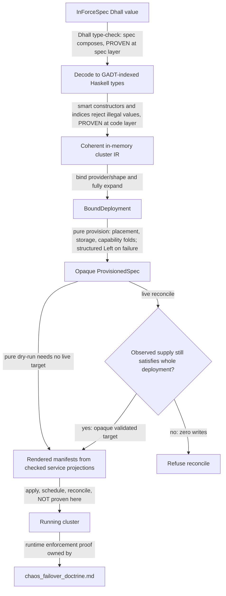

# The Illegal-State Catalog — Index

**Status**: Authoritative source
**Supersedes**: N/A
**Referenced by**: DEVELOPMENT_PLAN/later_phases.md, DEVELOPMENT_PLAN/overview.md, DEVELOPMENT_PLAN/phase_04_dhall_gate1_schema.md, DEVELOPMENT_PLAN/phase_05_gadt_decoder_gate2.md, DEVELOPMENT_PLAN/phase_06_illegal_state_corpus.md, DEVELOPMENT_PLAN/phase_07_capacity_topology_folds.md, DEVELOPMENT_PLAN/phase_08_capability_binder.md, DEVELOPMENT_PLAN/phase_09_render_manifest_goldens.md, DEVELOPMENT_PLAN/phase_21_keycloak_ingress.md, DEVELOPMENT_PLAN/phase_23_app_tenancy.md, DEVELOPMENT_PLAN/phase_24_pulsar_client.md, DEVELOPMENT_PLAN/phase_26_release_lifecycle.md, DEVELOPMENT_PLAN/phase_30_provider_clusters.md, DEVELOPMENT_PLAN/phase_31_determinism_kernel.md, DEVELOPMENT_PLAN/phase_32_jitbuild_engine_cache.md, DEVELOPMENT_PLAN/substrates.md, DEVELOPMENT_PLAN/system_components.md, documents/README.md, documents/engineering/README.md, documents/engineering/app_vs_deployment_doctrine.md, documents/engineering/bootstrap_sequence_doctrine.md, documents/engineering/capability_extension_doctrine.md, documents/engineering/chaos_failover_doctrine.md, documents/engineering/cluster_lifecycle_doctrine.md, documents/engineering/cluster_topology_doctrine.md, documents/engineering/conformance_harness_doctrine.md, documents/engineering/content_addressing_doctrine.md, documents/engineering/dsl_doctrine.md, documents/engineering/gateway_migration_doctrine.md, documents/engineering/gateway_migration_model_doctrine.md, documents/engineering/host_cluster_comms_doctrine.md, documents/engineering/image_build_doctrine.md, documents/engineering/inforcespec_migration_doctrine.md, documents/engineering/manifest_generation_doctrine.md, documents/engineering/monitoring_doctrine.md, documents/engineering/namespace_layout_doctrine.md, documents/engineering/platform_services_doctrine.md, documents/engineering/pulsar_client_doctrine.md, documents/engineering/pulumi_iac_doctrine.md, documents/engineering/readiness_ordering_doctrine.md, documents/engineering/release_lifecycle_doctrine.md, documents/engineering/resource_capacity_doctrine.md, documents/engineering/service_capability_doctrine.md, documents/engineering/single_logical_data_plane_doctrine.md, documents/engineering/storage_lifecycle_doctrine.md, documents/engineering/tenancy_doctrine.md, documents/engineering/testing_doctrine.md, documents/engineering/vault_pki_doctrine.md, documents/illegal_state/illegal_state_capability_messaging.md, documents/illegal_state/illegal_state_capacity.md, documents/illegal_state/illegal_state_lifecycle.md, documents/illegal_state/illegal_state_ml_asset.md, documents/illegal_state/illegal_state_multicluster.md, documents/illegal_state/illegal_state_security.md, documents/illegal_state/illegal_state_storage.md, documents/illegal_state/illegal_state_techniques.md, documents/illegal_state/illegal_state_topology.md
**Generated sections**: none

> **Purpose**: The index to the catalog of illegal and unsafe cluster states amoebius makes
> unrepresentable — the themed map of *which* states are foreclosed (deep treatment in the eight themed
> sub-catalogs), a pointer to the seven typing techniques + coverage matrix + foreclosure layers
> ([`illegal_state_techniques.md`](./illegal_state_techniques.md)), and the honest limits: a type-check
> proves the *spec composes*, not that the *running cluster enforces it*, and the catalog is *enumerated,
> not proven exhaustive*.

---

## 1. Illegal states fail to type-check

In raw Kubernetes a Deployment can mount a PVC no PV will ever
bind, a NetworkPolicy can strand a service from the database it needs, or an Ingress can quietly route
around the identity provider. The YAML is well-formed; the apiserver admits it; the
defect surfaces at runtime as a pod stuck in `Pending`, a 502, or a backdoor.

amoebius lifts that whole class of failure from *runtime surprise* to *does not type-check*. The DSL is
Dhall — a **total** configuration language (no general recursion, no arbitrary I/O, every expression fully
evaluates), so a spec the type-checker accepts is a finite value amoebius has already inspected end to end.
The contract, stated by [`dsl_doctrine.md`](../engineering/dsl_doctrine.md): **a valid `InForceSpec`
cannot represent illegal state**. This document is the companion to that
contract — the *enumerated* list of what "illegal state" means, and the *typing techniques* that make each
entry uninhabitable.

**SSoT split (which doctrine to cite for what).**

- [`dsl_doctrine.md`](../engineering/dsl_doctrine.md) owns the **DSL surface and the contract** ("a valid spec cannot
  represent illegal state") as a property of the language.
- **This document** is the **index** for the catalog: it owns the framing ([§1](#1-illegal-states-fail-to-type-check)), the
  load-bearing honesty limit ([§2](#2-the-load-bearing-limit-a-type-check-proves-the-spec-composes-not-that-the-cluster-enforces-it)), and the **themed map** ([§3](#3-the-catalog--states-a-valid-spec-cannot-represent)) of *which* states are illegal. The
  *deep treatment* of each entry lives in one of the eight themed sub-catalogs; the *how* — the seven
  typing techniques, the coverage matrix, the three foreclosure layers, and the validation-locus axis —
  lives in [`illegal_state_techniques.md`](./illegal_state_techniques.md). Together they are the SSoT for
  **which platform invariants are type-enforced** (the question
  [`platform_services_doctrine.md` §10](../engineering/platform_services_doctrine.md#10-every-container-declares-cpu-and-ram) defers here).
- The *normative rule* behind each catalog entry lives in that entry's owning doctrine
  (storage, gateway/ingress, secrets, …). The catalog names the owner and never restates its content.

Everything below is **design intent**, not a tested amoebius result: the **type discipline** it describes (the
spec composes; no illegal value is constructible) is **validated in-process** by the pre-cluster gates (Register 1/2 —
Dhall typecheck + Haskell decoder + property/compile-fail corpus), while its **runtime enforcement** remains a
**live-cluster** concern (Register 3 — the orchestration DSL + the `replicas=1` control-plane singleton that renders and
reconciles a live cluster). Status and gates live only in
[`../../DEVELOPMENT_PLAN/README.md`](../../DEVELOPMENT_PLAN/README.md); per
[`documentation_standards.md` §6](../documentation_standards.md#6-honesty-the-proventestedassumed-discipline) this doc states the target shape and links
back for status.

---

## 2. The load-bearing limit: a type-check proves the spec composes, not that the cluster enforces it

**The types prove that the
*specification* composes into something internally coherent. They do not prove that the *running
deployment* enforces it.** Conflating the two proves the wrong theorem.

Applied to the three correctness layers from the chaos/failover doctrine
([`chaos_failover_doctrine.md`](../engineering/chaos_failover_doctrine.md), generalized from prodbox's
`chaos_hardening_doctrine.md`):

- **What a green type-check *is*.** A Dhall type-check (and the GADT-indexed Haskell decode behind it,
  [`illegal_state_techniques.md`](./illegal_state_techniques.md))
  is a **Decision-layer** proof: the spec value is well-formed, every reference resolves, every required
  field is present, every composition the user wrote has an inhabitant. When implemented as specified, that
  is a real proof — at the *spec* layer, in code, the cheapest and strongest of the three. It is the type
  system doing the "Extract the decision" move for free.
- **What it is *not*.** It says **nothing** about whether the interpreter renders the spec to correct
  manifests, whether the apiserver admits those manifests, whether the scheduler places the pods, whether the LB actually
  comes up, or whether two geo-replicated clusters converge after a partition. Those are the **Protocol**
  and **Runtime** layers, and by the *blindness property* (`chaos_failover_doctrine.md` [§4](../engineering/chaos_failover_doctrine.md#4-two-traditions-and-the-quiet-third)) a Decision-layer
  proof is structurally blind to them.

So the catalog's promise is exact: *a PVC that cannot bind a PV is unrepresentable in the spec* — meaning
no such spec can be written and type-check. It is **not** the claim that *the running cluster's PVC
is bound*; that is a reconcile-time fact whose verification is owned by
[`chaos_failover_doctrine.md`](../engineering/chaos_failover_doctrine.md) and the testing doctrine. Amoebius **defers the
runtime-enforcement proof there on purpose**, and never reports it here. In the register model this is
exactly the split: the spec-composition proof is a **Register 1/2** (pre-cluster, in-process) property, front-loaded
to the pre-cluster gates, while the cluster-enforcement claim is **Register 3** (live-infrastructure integrity, deferred to the
real-resource phases).

> **Honesty.** "When implemented as specified, the type-check is a proof" is itself a claim about a design
> not yet built — a **Register 1/2** (pre-cluster / in-process) property targeted for in-process validation,
> not the live-cluster half. Read every "unrepresentable" below as *design intent for the type discipline*,
> never as a tested amoebius behaviour.

---

## 3. The catalog — states a valid spec cannot represent

This section is the **themed map**. Each illegal state is treated in depth in exactly one
of the eight themed sub-catalogs below; the *how* — the seven typing techniques, the coverage matrix, and
the foreclosure layers — is owned by [`illegal_state_techniques.md`](./illegal_state_techniques.md). Each
entry: the **failure** (how it goes wrong in raw k8s), the **owning doctrine** (the SSoT for the rule), the
**technique** that forecloses it, and its **validation-locus** tag.

**Two honesty axes bound this catalog** (both are load-bearing; neither is decorative):

1. **Spec-vs-cluster** ([§2](#2-the-load-bearing-limit-a-type-check-proves-the-spec-composes-not-that-the-cluster-enforces-it)). A green type-check proves the *spec* composes, never that the *running cluster*
   enforces it. Every "unrepresentable" is design intent for the type discipline, not a tested runtime fact.
2. **Enumerated, not exhaustive.** This list is the *best-known* set of foreclosed states, not a
   closed-world proof that no other illegal state exists. "Deployable" is **not denotationally defined**, so
   the catalog cannot claim completeness — it is an enumerated corpus that the pre-cluster gates hold as
   regressions, extended whenever a new illegal shape is found. The [`dsl_doctrine.md` §5](../engineering/dsl_doctrine.md#5-the-illegal-state-unrepresentable-contract)
   slogan "if it decodes, it is deployable" must always be read with this qualifier: *deployable* names the
   enumerated-and-foreclosed set, not a proven-total denotation.

**The validation-locus axis.** Orthogonal to *which foreclosure layer* catches a state (type-reject vs
decode-reject vs runtime-check — [`illegal_state_techniques.md`](./illegal_state_techniques.md#6-three-layers-of-foreclosure-and-the-honesty-they-force)) is *where in the toolchain* the failure surfaces. Every
sub-catalog entry carries a **Validation-locus** tag drawn from five values, defined in
[`illegal_state_techniques.md`](./illegal_state_techniques.md#6-three-layers-of-foreclosure-and-the-honesty-they-force): `Gate-1-editor` (fails `dhall type` at authoring time),
`Gate-2-decoder` (the total decoder returns `Left`), `provision-seal` (post-bind Phase-8 provision returns a
`ProvisionError` before any `ProvisionedSpec` exists), `rendered-output-golden` (caught by a golden test on the
*rendered* manifest, no cluster required), and `live-effect` (only observable at reconcile/runtime — the residue
Register 3 owns). Most entries name a primary locus plus a live-effect residue.

### Storage — [`illegal_state_storage.md`](./illegal_state_storage.md)

- [§3.1](./illegal_state_storage.md#31-bad--illegal-durable-storage) — Bad / illegal durable storage
- [§3.2](./illegal_state_storage.md#32-pvcs-that-dont-bind-pvs) — PVCs that don't bind PVs
- [§3.18](./illegal_state_storage.md#318-unbounded-storage-anywhere) — Unbounded storage anywhere
- [§3.19](./illegal_state_storage.md#319-an-application-consuming-more-storage-than-its-backing-minio-and-pulsar) — An application consuming more storage than its backing (MinIO and Pulsar)
- [§3.20](./illegal_state_storage.md#320-a-pulsar-topic-without-a-bounded--tiered--retained-lifecycle) — A Pulsar topic without a bounded / tiered / retained lifecycle
- [§3.21](./illegal_state_storage.md#321-capacity-growth-without-an-amoebius-owned-scaling-policy) — Capacity growth without an amoebius-owned scaling policy

### Cluster topology — [`illegal_state_topology.md`](./illegal_state_topology.md)

- [§3.13](./illegal_state_topology.md#313-a-compute-engine-incompatible-with-its-substrates-managed-providers-first-class) — A compute engine incompatible with its substrates (managed providers first-class)
- [§3.14](./illegal_state_topology.md#314-rke2kind-on-a-host-with-no-linux-node-applewindows-without-an-interposed-linux-vm) — rke2/kind on a host with no Linux node
- [§3.15](./illegal_state_topology.md#315-a-multi-node-kind-cluster-not-on-a-single-linux-host) — A multi-node kind cluster not on a single Linux host
- [§3.16](./illegal_state_topology.md#316-a-multi-node-rke2-cluster-with-fewer-linux-hosts-than-nodes-or-a-host-reused) — A multi-node rke2 cluster with fewer Linux hosts than nodes (or a host reused)
- [§3.24](./illegal_state_topology.md#324-an-evenzero-server-rke2-control-plane-no-etcd-quorum--split-brain) — An even/zero-server rke2 control plane (no etcd quorum / split-brain)
- [§3.37](./illegal_state_topology.md#337-a-full-stretched-node-on-a-managed-eks-control-plane-without-a-provider-native-hybrid-arm) — A full stretched node on a managed EKS control plane without a provider-native hybrid arm
- [§3.39](./illegal_state_topology.md#339-a-split-site-etcd-quorum) — A split-Site etcd quorum

### Capacity & placement — [`illegal_state_capacity.md`](./illegal_state_capacity.md)

- [§3.5](./illegal_state_capacity.md#35-undeployable-pods-taints-tolerations--affinity) — Undeployable pods (taints, tolerations & affinity)
- [§3.17](./illegal_state_capacity.md#317-an-over-committed-deploy-or-workload-host--vm--cluster-capacity-exceeded) — An over-committed deploy or workload (host / VM / cluster capacity exceeded)
- [§3.22](./illegal_state_capacity.md#322-a-hand-authored-un-derived-toleration) — A hand-authored (un-derived) toleration
- [§3.27](./illegal_state_capacity.md#327-a-schedulable-in-aggregate-but-unplaceable-workload-atomic-pod--gpu-bin-packing) — A deployment that fits in aggregate but has no resource-capable placement
- [§3.28](./illegal_state_capacity.md#328-two-accelerator-owners-on-one-node-or-a-fractional-accelerator-claim) — Two accelerator owners on one node, or a fractional accelerator claim
- [§3.29](./illegal_state_capacity.md#329-a-host-worker-whose-demand-overflows-its-physical-host) — A host worker whose Demand overflows its physical host
- [§3.30](./illegal_state_capacity.md#330-a-served-model-whose-vram-footprint-exceeds-node-vram) — An accelerator memory envelope that cannot fit the selected devices or unified-memory pool

### Security, ingress & secrets — [`illegal_state_security.md`](./illegal_state_security.md)

- [§3.3](./illegal_state_security.md#33-misconfigured-gateway) — Misconfigured gateway
- [§3.4](./illegal_state_security.md#34-dns-that-binds-to-the-wrong-ip) — DNS that binds to the wrong IP
- [§3.6](./illegal_state_security.md#36-blocking-networkpolicy-services-cant-reach-each-other) — Blocking NetworkPolicy (services can't reach each other)
- [§3.7](./illegal_state_security.md#37-accidental-insecure--backdoor-ingress) — Accidental insecure / backdoor ingress
- [§3.8](./illegal_state_security.md#38-cross-tenant-references-and-literal-secrets) — Cross-tenant references and literal secrets
- [§3.9](./illegal_state_security.md#39-a-plaintext-spec-at-rest) — A plaintext spec at rest
- [§3.10](./illegal_state_security.md#310-a-child-spec-that-reaches-beyond-its-own-subtree) — A child spec that reaches beyond its own subtree
- [§3.11](./illegal_state_security.md#311-an-unsafe-workload-no-resource-limits-no-hardened-securitycontext) — An unsafe or incompletely provisioned workload
- [§3.40](./illegal_state_security.md#340-a-secure-gateway-reach-collapsing-into-wild-ingress) — A secure-gateway reach collapsing into wild ingress
- [§3.42](./illegal_state_security.md#342-an-admin-mutation-without-a-root-token-capability--an-unsealed-vault-witness) — An admin mutation without a root-token capability + an unsealed-Vault witness
- [§3.45](./illegal_state_security.md#345-a-cross-tenant-or-hand-authored-rbac-binding) — A cross-tenant or hand-authored RBAC binding

### Capability & messaging — [`illegal_state_capability_messaging.md`](./illegal_state_capability_messaging.md)

- [§3.12](./illegal_state_capability_messaging.md#312-an-app-that-names-a-product-instead-of-a-capability) — An app that names a product instead of a capability
- [§3.23](./illegal_state_capability_messaging.md#323-a-non-cbor-pulsar-payload) — A non-CBOR Pulsar payload

### ML assets & training — [`illegal_state_ml_asset.md`](./illegal_state_ml_asset.md)

- [§3.25](./illegal_state_ml_asset.md#325-an-ml-asset-named-by-arbitrary-url-or-an-unready--unlanded-model) — An ML asset named by arbitrary URL (or an unready / unlanded model)
- [§3.32](./illegal_state_ml_asset.md#332-a-continuous-training-run-with-no-checkpoint-cadence-or-a-feed-with-no-bounded-retention) — A continuous training run with no checkpoint cadence, or a feed with no bounded retention
- [§3.33](./illegal_state_ml_asset.md#333-a-multi-partition-training-feed-with-no-defined-merge-order) — A multi-partition training feed with no defined merge order
- [§3.34](./illegal_state_ml_asset.md#334-an-app-serving-or-continuing-another-apps-model-without-a-grant) — An app serving or continuing another app's model without a grant

### Multi-cluster & fabric — [`illegal_state_multicluster.md`](./illegal_state_multicluster.md)

- [§3.31](./illegal_state_multicluster.md#331-a-capacity-or-workload-fold-spanning-two-clusters) — A capacity or workload fold spanning two clusters
- [§3.35](./illegal_state_multicluster.md#335-a-stretched-host-worker-with-no-declared-networking-capability) — A stretched host worker with no declared networking capability
- [§3.36](./illegal_state_multicluster.md#336-a-declared-remote-full-agent-with-no-control-plane-witness) — A declared-remote full agent with no control-plane witness
- [§3.38](./illegal_state_multicluster.md#338-a-host-worker-granted-a-control-plane-witness-or-treated-as-a-member) — A host worker granted a control-plane witness or treated as a member
- [§3.44](./illegal_state_multicluster.md#344-a-session-that-cannot-rebind-on-gateway-migration) — A session that cannot rebind on gateway migration
- [§3.47](./illegal_state_multicluster.md#347-a-failover-data-loss-budget-authored-below-the-replication-lag-bound) — A failover data-loss budget authored below the replication-lag bound
- [§3.48](./illegal_state_multicluster.md#348-a-geo-replication-pair-whose-active-and-standby-are-the-same-cluster) — A geo-replication pair whose active and standby are the same cluster
- [§3.49](./illegal_state_multicluster.md#349-a-child-spec-that-authors-its-own-gateway-failover-pairing) — A child spec that authors its own gateway-failover pairing
- [§3.50](./illegal_state_multicluster.md#350-a-standing-spec-that-authors-an-emergency-failover-as-desired-state) — A standing spec that authors an emergency Failover as desired state
- [§3.51](./illegal_state_multicluster.md#351-an-operator-authored-confluent-cross-boundary-disposition) — An operator-authored Confluent cross-boundary disposition

### Readiness, promotion & monitoring — [`illegal_state_lifecycle.md`](./illegal_state_lifecycle.md)

- [§3.26](./illegal_state_lifecycle.md#326-an-unverified-environment-promotion-promote--prod-without-the-required-evidence) — An unverified environment promotion (promote → prod without the required evidence)
- [§3.41](./illegal_state_lifecycle.md#341-a-duration-gated--hand-ordered-bring-up-sequence-a-readiness-race) — A duration-gated / hand-ordered bring-up sequence (a readiness race)
- [§3.43](./illegal_state_lifecycle.md#343-an-unmonitored-workflow-or-extension-or-an-unauthenticated-monitoring-surface) — An unmonitored workflow or extension (or an unauthenticated monitoring surface)
- [§3.46](./illegal_state_lifecycle.md#346-a-chaos-fault-targeting-a-component-the-spec-never-declared) — A chaos fault targeting a component the spec never declared

---

## 4. Planning ownership

This catalog is a **doctrine** artifact: it enumerates the target shape of the type discipline and names, per
entry, the owning doctrine and foreclosing technique. It states no status and no schedule. The gate at which
each foreclosure is first *validated* — the pre-cluster Dhall/decoder/property corpus for the type- and
decode-foreclosed entries, the rendered-output goldens for the manifest-shaped entries, and the
live-infrastructure registers for the runtime residue — is owned exclusively by
[`../../DEVELOPMENT_PLAN/README.md`](../../DEVELOPMENT_PLAN/README.md). Per
[`documentation_standards.md` §6](../documentation_standards.md#6-honesty-the-proventestedassumed-discipline)
the catalog links back there for status and never restates it.

---

## Cross-references

- [`dsl_doctrine.md`](../engineering/dsl_doctrine.md) — the DSL surface and the contract this catalog enumerates.
- [`illegal_state_techniques.md`](./illegal_state_techniques.md) — the seven typing techniques, the coverage
  matrix, the three foreclosure layers, and the validation-locus axis.
- The eight themed sub-catalogs — the deep treatment of each entry:
  [`illegal_state_storage.md`](./illegal_state_storage.md),
  [`illegal_state_topology.md`](./illegal_state_topology.md),
  [`illegal_state_capacity.md`](./illegal_state_capacity.md),
  [`illegal_state_security.md`](./illegal_state_security.md),
  [`illegal_state_capability_messaging.md`](./illegal_state_capability_messaging.md),
  [`illegal_state_ml_asset.md`](./illegal_state_ml_asset.md),
  [`illegal_state_multicluster.md`](./illegal_state_multicluster.md),
  [`illegal_state_lifecycle.md`](./illegal_state_lifecycle.md).
- [`chaos_failover_doctrine.md`](../engineering/chaos_failover_doctrine.md) — the runtime-enforcement proof this catalog defers.
- [`../README.md`](../README.md) — the top-level documentation index (the engineering and illegal-state families).
- [`../../DEVELOPMENT_PLAN/README.md`](../../DEVELOPMENT_PLAN/README.md) — status and gates.
