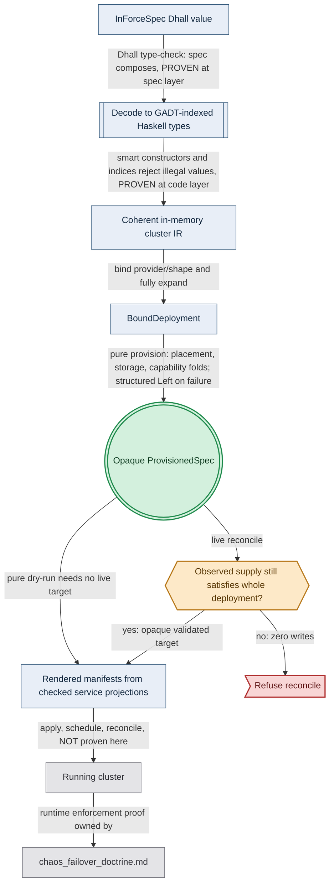

# The Illegal-State Catalog — Index

> **Purpose**: The index to the catalog of illegal and unsafe cluster states amoebius makes
> unrepresentable — the themed map of *which* states are foreclosed (deep treatment in the nine themed
> sub-catalogs), a pointer to the nine typing techniques + coverage matrix + foreclosure layers
> ([`illegal_state_techniques.md`](./illegal_state_techniques.md)), and the honest limits: a type-check
> proves the *spec composes*, not that the *running cluster enforces it*, and the catalog is a *covering over
> a declared taxonomy*, exhaustive only relative to the axes that taxonomy names.
> **Read this if**: a specific illegal state has to be located, or a new one has to be added to the enumeration.

This document is the index of the illegal-state enumeration: it holds the numbering and the themed map, while
the entries themselves live in the slices it links. It does not own the techniques that foreclose them, owned
by [illegal_state_techniques.md](./illegal_state_techniques.md). An entry is cited by this file's name and
resolved to the slice that holds its heading, which is the one sanctioned case of a citation naming a
different file than its target.

Link-graph metadata

**Status**: Authoritative source
**Supersedes**: N/A
**Referenced by**: DEVELOPMENT_PLAN/later_phases.md, DEVELOPMENT_PLAN/overview.md, DEVELOPMENT_PLAN/phase_09_resource_index.md, DEVELOPMENT_PLAN/phase_26_dhall_schema_generation.md, DEVELOPMENT_PLAN/phase_27_gadt_decode_ir.md, DEVELOPMENT_PLAN/phase_28_illegal_state_covering.md, DEVELOPMENT_PLAN/phase_29_storage_geometry_folds.md, DEVELOPMENT_PLAN/phase_30_execution_accelerator_folds.md, DEVELOPMENT_PLAN/phase_31_capability_bind.md, DEVELOPMENT_PLAN/phase_32_provision_seal.md, DEVELOPMENT_PLAN/phase_33_inference_accelerator_provision.md, DEVELOPMENT_PLAN/phase_34_render_manifest_oracles.md, DEVELOPMENT_PLAN/phase_65_keycloak_ingress.md, DEVELOPMENT_PLAN/phase_68_pulsar_client.md, DEVELOPMENT_PLAN/phase_72_release_lifecycle.md, DEVELOPMENT_PLAN/phase_78_provider_child_bringup.md, DEVELOPMENT_PLAN/phase_81_determinism_jitcache.md, DEVELOPMENT_PLAN/substrates.md, documents/README.md, documents/engineering/README.md, documents/engineering/app_vs_deployment_doctrine.md, documents/engineering/bootstrap_sequence_doctrine.md, documents/engineering/capability_extension_doctrine.md, documents/engineering/chaos_failover_doctrine.md, documents/engineering/cluster_lifecycle_doctrine.md, documents/engineering/cluster_topology_doctrine.md, documents/engineering/content_addressing_determinism.md, documents/engineering/content_addressing_doctrine.md, documents/engineering/diagram_conventions.md, documents/engineering/dsl_doctrine.md, documents/engineering/extension_conformance_doctrine.md, documents/engineering/gateway_migration_doctrine.md, documents/engineering/gateway_migration_model_doctrine.md, documents/engineering/host_cluster_comms_doctrine.md, documents/engineering/image_build_doctrine.md, documents/engineering/inforcespec_migration_doctrine.md, documents/engineering/lift_and_compose_doctrine.md, documents/engineering/manifest_generation_doctrine.md, documents/engineering/migration_doctrine.md, documents/engineering/monitoring_doctrine.md, documents/engineering/namespace_layout_doctrine.md, documents/engineering/platform_services_doctrine.md, documents/engineering/pulsar_client_doctrine.md, documents/engineering/pulumi_iac_doctrine.md, documents/engineering/readiness_ordering_doctrine.md, documents/engineering/release_lifecycle_doctrine.md, documents/engineering/resource_capacity_doctrine.md, documents/engineering/resource_capacity_folds.md, documents/engineering/resource_capacity_sources.md, documents/engineering/service_capability_doctrine.md, documents/engineering/single_logical_data_plane_doctrine.md, documents/engineering/storage_lifecycle_doctrine.md, documents/engineering/tenancy_doctrine.md, documents/engineering/testing_doctrine.md, documents/engineering/vault_pki_doctrine.md, documents/glossary.md, documents/illegal_state/README.md, documents/illegal_state/illegal_state_capability_messaging.md, documents/illegal_state/illegal_state_capacity.md, documents/illegal_state/illegal_state_lifecycle.md, documents/illegal_state/illegal_state_ml_asset.md, documents/illegal_state/illegal_state_multicluster.md, documents/illegal_state/illegal_state_security.md, documents/illegal_state/illegal_state_storage.md, documents/illegal_state/illegal_state_techniques.md, documents/illegal_state/illegal_state_tenancy.md, documents/illegal_state/illegal_state_topology.md, documents/reading_order.md
**Generated sections**: none

> **Historical result (invalidated).** Every phase-run or implementation-result statement in this document is permanently invalidated diagnostic history. It cannot establish or reactivate current status, even if a phase later advances. Target doctrine remains normative; current status is solely in the [tracker](../../DEVELOPMENT_PLAN/README.md).

---

## 1. Illegal states fail to type-check

In raw Kubernetes a Deployment can mount a PVC no PV will ever
bind, a NetworkPolicy can strand a service from the database it needs, or an Ingress can quietly route
around the identity provider. The YAML is well-formed; the apiserver admits it; the
defect surfaces at runtime as a pod stuck in `Pending`, a 502, or a backdoor.

amoebius lifts that whole class of failure from *runtime surprise* to *does not type-check*. The DSL is
Dhall — a **total** configuration language (no general recursion, no arbitrary I/O, every expression fully
evaluates), so a spec the type-checker accepts is a finite value amoebius has already inspected end to end.
The contract, stated by [`dsl_doctrine.md`](../engineering/dsl_doctrine.md): **a valid `InForceSpec` cannot represent illegal state**. This document is the companion to that
contract — the *enumerated* list of what "illegal state" means, and the *typing techniques* that make each
entry uninhabitable.

**SSoT split (which doctrine to cite for what).**

- [`dsl_doctrine.md`](../engineering/dsl_doctrine.md) owns the **DSL surface and the contract** ("a valid spec cannot represent illegal state") as a property of the language.
- **This document** is the **index** for the catalog: it owns the framing ([§1](#1-illegal-states-fail-to-type-check)), the
  load-bearing honesty limit ([§2](#2-the-load-bearing-limit-a-type-check-proves-the-spec-composes-not-that-the-cluster-enforces-it)), and the **themed map** ([§3](#3-the-catalog--states-a-valid-spec-cannot-represent)) of *which* states are illegal. The
  *deep treatment* of each entry lives in one of the nine themed sub-catalogs; the *how* — the nine
  typing techniques, the coverage matrix, the three foreclosure layers, and the validation-locus axis —
  lives in [`illegal_state_techniques.md`](./illegal_state_techniques.md). Together they are the SSoT for
  **which platform invariants are type-enforced** (the question
  [`platform_services_doctrine.md` §10](../engineering/platform_services_doctrine.md#10-every-execution-unit-declares-its-complete-resource-envelope) defers here).
- The *normative rule* behind each catalog entry lives in that entry's owning doctrine
  (storage, gateway/ingress, secrets, …). The catalog names the owner and never restates its content.

Phase 26 must validate the dhall-typecheck subset in-process: its eight canonical no-arm/required-field negatives,
three image/process negatives, one plaintext-secret negative, and two import-policy negatives fail at their
authored reasons against the closed Dhall schema, while four paired positive surfaces pass. Independent shape
oracles must catch 525 required-field deletions, 176 type substitutions, four special-resource mutations, and the
extra capability arm. Its Phase-25 projection derives nineteen extension obligations but deliberately leaves
all extension semantics UNVERIFIED; it is not catalog foreclosure evidence. Phase 27 must validate the focused
gadt-decode subset: distinct schema/domain/unspellable/plaintext-secret refinement
classes, tenant/state/owner compile indices, full positive-tree retention, a five-calculus composition
projection, and fail-closed import/exception
handling. Phase 28 must validate the exhaustive catalog projection: all 97 entries and 121 named subcases must
reconcile, the 43 reached dhall-typecheck/gadt-decode subcases must discharge through direct and explicit
Phase-8/9 predecessor obligations, and the remaining 78 subcases must retain exact later owners. The
[Phase 9 gate](../../DEVELOPMENT_PLAN/phase_09_resource_index.md) must supply exact-locus evidence for
eight of 11 Phase-9-owned subcases: seven compile-time index pairs and the direct base capacity/topology
provision-seal fixtures; 15 negative/twin pairs, two positives, four sampled properties, and 19 mutants must
distinguish the subject.
mutants. The three Dhall-typecheck foreclosures remain deferred to Phase 26. The
[Phase 29 gate](../../DEVELOPMENT_PLAN/phase_29_storage_geometry_folds.md) must supply exact-locus evidence for all
five Phase-29-owned subcases: two dhall-typecheck bounded-training barriers and 27 storage-geometry variant/twin rows
cover logical/physical fit, backup-medium fit, disjoint capacity pools, and restore-target fit; six sampled
properties and 31 mutants must distinguish the subject. The
[Phase 30 gate](../../DEVELOPMENT_PLAN/phase_30_execution_accelerator_folds.md) must supply the two owned
accelerator loci plus 37 exact execution/runtime-storage/accelerator/provider-root negative/twin variants,
two composed positives, seven sampled properties, 45 mutants, and a 128-unit five-calculus projection. These
are target checked rejections at the pure `provision-seal` fold boundary;
the added one-axis cases cover accelerator interconnect and the build, engine, monitoring and Pulumi envelopes.
[Phase 31](../../DEVELOPMENT_PLAN/phase_31_capability_bind.md) must validate capability binding across all nine
arms and both shapes: three dhall-typecheck and four gadt-decode cases must retain exact reasons, the 29-entry
locus set must be exact, and four mutants must turn red.
[Phase 32](../../DEVELOPMENT_PLAN/phase_32_provision_seal.md) must validate whole-deployment post-bind sealing:
ten distinct provision errors must retain their exact reasons, both boundary properties and all ten paired
mutants must distinguish the subject, and every entry in the 40-row provision-seal locus set must be observed.
Extension-astcheck, rendered output, and live-effect entries remain unverified at their later loci.
Runtime enforcement remains a **live-cluster** concern (Register 3 — the orchestration DSL + the
`replicas=1` control-plane daemon that renders and reconciles a live cluster). Status and gates live only in
[`../../DEVELOPMENT_PLAN/README.md`](../../DEVELOPMENT_PLAN/README.md); per
[`documentation_standards.md` §6](../documentation_standards.md#6-honesty-the-proventestedassumed-discipline) this doc states the target shape and links
back for status.

---

## 2. The load-bearing limit: a type-check proves the spec composes, not that the cluster enforces it

**The types prove that the *specification* composes into something internally coherent. They do not prove that the *running deployment* enforces it.** Conflating the two proves the wrong theorem.

Applied to the three correctness layers from the chaos/failover doctrine
([`chaos_failover_doctrine.md`](../engineering/chaos_failover_doctrine.md), re-derived against the shape `prodbox` shows in its `chaos_hardening_doctrine.md`):

- **What a green type-check *is*.** A Dhall type-check (and the GADT-indexed Haskell decode behind it,
  [`illegal_state_techniques.md`](./illegal_state_techniques.md))
  is a **Decision-layer** proof: the spec value is well-formed, every reference resolves, every required
  field is present, every composition the user wrote has an inhabitant. When implemented as specified, that
  is a real proof — at the *spec* layer, in code, the cheapest and strongest of the three. It is the type
  system doing the "Extract the decision" move for free.
- **What it is *not*.** It says **nothing** about whether the interpreter renders the spec to correct
  manifests, whether the apiserver admits those manifests, whether the scheduler places the pods, whether the LB actually
  comes up, or whether two geo-replicated clusters converge after a partition. Those are the **Protocol**
  and **Runtime** layers, and by the *blindness property* (`chaos_failover_doctrine.md` [§4](../engineering/chaos_failover_doctrine.md#4-two-traditions-and-the-quiet-third)) a Decision-layer
  proof is structurally blind to them.

So the catalog's promise is exact: *a PVC that cannot bind a PV is unrepresentable in the spec* — meaning
no such spec can be written and type-check. It is **not** the claim that *the running cluster's PVC
is bound*; that is a reconcile-time fact whose verification is owned by
[`chaos_failover_doctrine.md`](../engineering/chaos_failover_doctrine.md) and the testing doctrine. amoebius **defers the runtime-enforcement proof there on purpose**, and never reports it here. In the register model this is
exactly the split: the spec-composition proof is a **Register 1/2** (pre-cluster, in-process) property, front-loaded
to the pre-cluster gates, while the cluster-enforcement claim is **Register 3** (live-infrastructure integrity, deferred to the
real-resource phases). This is the same split that
[`illegal_state_techniques.md` §6](./illegal_state_techniques.md#6-three-layers-of-foreclosure-and-the-honesty-they-force)
draws in tier vocabulary: **Register 1/2** here is its **Tier-1** (design-time / in-process) band, and **Register 3** is its
**Tier-2** runtime-enforcement residue (Phase 66).

Diagram vocabulary: [diagram_conventions.md](../engineering/diagram_conventions.md).

```mermaid
flowchart TD
%% register: algebra
  spec[InForceSpec Dhall value]:::intent -->|Dhall type-check: spec composes, PROVEN at spec layer| decode[[Decode to GADT-indexed Haskell types]]:::intent
  decode -->|smart constructors and indices reject illegal values, PROVEN at code layer| ir[Coherent in-memory cluster IR]:::intent
  ir -->|bind provider/shape and fully expand| bound[BoundDeployment]:::intent
  bound -->|pure provision: placement, storage, capability folds; structured Left on failure| provisioned((("Opaque ProvisionedSpec"))):::seal
  provisioned -->|pure dry-run needs no live target| render[Rendered manifests from checked service projections]:::intent
  provisioned -->|live reconcile| preflight{{"Observed supply still satisfies whole deployment?"}}:::gate
  preflight -->|yes: opaque validated target| render
  preflight -->|no: zero writes| refuse>Refuse reconcile]:::refuse
  render -->|apply, schedule, reconcile, NOT proven here| live[Running cluster]:::runtime
  live -->|runtime enforcement proof owned by| chaos[chaos_failover_doctrine.md]:::runtime
  classDef intent   fill:#e8eef7,stroke:#33587a,color:#12283f,stroke-width:1px
  classDef gate     fill:#fde9c8,stroke:#b8791b,color:#5c3a06,stroke-width:2px
  classDef seal     fill:#d3f0dd,stroke:#1f8a4c,color:#0c3a1f,stroke-width:2px
  classDef refuse   fill:#f8d6d6,stroke:#b23636,color:#5c1414,stroke-width:2px
  classDef runtime  fill:#e4e4e7,stroke:#71717a,color:#2f2f35,stroke-width:1px
```
*Design intent, Tier-1. The foreclosure spine from an authored spec to rendered manifests, each edge naming the layer its gate reaches. Everything from the live-reconcile preflight rightward is runtime-checked and is not established here. Vocabulary: [diagram_conventions.md](../engineering/diagram_conventions.md).*

This is the reference instance of the diagram scheme — node shape encodes the functional-programming role and colour encodes the honesty band; it depicts design intent, not a built or tested amoebius result.

> **Honesty.** The exact dhall-typecheck and focused gadt-decode subsets linked above are now Register-1 results. Every
> catalog entry outside those enumerated corpora remains design intent until its assigned validation locus;
> none of these in-process results establishes the live-cluster half. Read "unrepresentable" as tested only
> where a committed gate/ledger names the entry, never as blanket runtime behaviour.

---

## 3. The catalog — states a valid spec cannot represent

This section is the **themed map**. Each illegal state is treated in depth in exactly one
of the nine themed sub-catalogs below; the *how* — the nine typing techniques, the coverage matrix, and
the foreclosure layers — is owned by [`illegal_state_techniques.md`](./illegal_state_techniques.md). Each
entry: the **failure** (how it goes wrong in raw k8s), the **owning doctrine** (the SSoT for the rule), the
**technique** that forecloses it, and its **validation-locus** tag.

**Two honesty axes bound this catalog** (both are load-bearing; neither is decorative):

1. **Spec-vs-cluster** ([§2](#2-the-load-bearing-limit-a-type-check-proves-the-spec-composes-not-that-the-cluster-enforces-it)). A green type-check proves the *spec* composes, never that the *running cluster*
   enforces it. Every "unrepresentable" is design intent for the type discipline, not a tested runtime fact.
2. **A covering, exhaustive only relative to its declared axes.** The catalog is not a list that grows by
   whoever last thought of something: it is a covering over the taxonomy declared in [`README.md`](./README.md),
   in which every cell holds an entry or a stated reason why none can, and an unjustified empty cell is a
   defect. That makes the gap *countable* — the property a bare enumeration never had, and the reason this
   axis replaces the "enumerated, not exhaustive" framing that stood here before. What it does not supply is a
   ground truth: the axes are a human choice, so a hazard lying along a dimension nobody declared stays
   outside the claim ([`illegal_state_techniques.md` §6.2](./illegal_state_techniques.md#62-the-covering-obligation--exhaustive-relative-to-a-declared-taxonomy),
   [`../documentation_standards.md` §16](../documentation_standards.md#16-the-illegal-state-catalogue-is-a-covering-not-a-list)).
   The [`dsl_doctrine.md` §5](../engineering/dsl_doctrine.md#5-the-illegal-state-unrepresentable-contract)
   slogan "if it decodes, it is deployable" must always be read with that qualifier.

**The validation-locus axis.** Orthogonal to *which foreclosure layer* catches a state (type-reject vs
decode-reject vs runtime-check — [`illegal_state_techniques.md`](./illegal_state_techniques.md#6-three-layers-of-foreclosure-and-the-honesty-they-force)) is *where in the toolchain* the failure surfaces. Every
sub-catalog entry carries a **Validation-locus** tag drawn from the six values the axis declares, each
defined in [`illegal_state_techniques.md` §6.1](./illegal_state_techniques.md#61-the-validation-locus-axis--where-each-illegal-state-is-caught-orthogonal-to-the-foreclosure-layer),
the SSoT for the axis. Most entries name a primary locus plus a live-effect residue.

### Storage — [`illegal_state_storage.md`](./illegal_state_storage.md)

- [§3.1](./illegal_state_storage.md#31-bad--illegal-durable-storage) — Bad / illegal durable storage
- [§3.2](./illegal_state_storage.md#32-pvcs-that-dont-bind-pvs) — PVCs that don't bind PVs
- [§3.18](./illegal_state_storage.md#318-unbounded-storage-anywhere) — Unbounded storage anywhere
- [§3.19](./illegal_state_storage.md#319-an-application-consuming-more-storage-than-its-backing-minio-and-pulsar) — An application consuming more storage than its backing (MinIO and Pulsar)
- [§3.20](./illegal_state_storage.md#320-a-pulsar-topic-without-a-bounded--tiered--retained-lifecycle) — A Pulsar topic without a bounded / tiered / retained lifecycle
- [§3.21](./illegal_state_storage.md#321-capacity-growth-without-an-amoebius-owned-scaling-policy) — Capacity growth without an amoebius-owned scaling policy
- [§3.53](./illegal_state_storage.md#353-a-backup-larger-than-its-bounded-medium) — A backup larger than its bounded medium
- [§3.54](./illegal_state_storage.md#354-deleting-a-backup-in-an-append-only-system) — Deleting a backup in an append-only system
- [§3.55](./illegal_state_storage.md#355-amoebius-holding-a-credential-that-can-delete-a-backup) — amoebius holding a credential that can delete a backup
- [§3.56](./illegal_state_storage.md#356-automatically-recovering-from-a-manual-air-gapped-medium) — Automatically recovering from a manual air-gapped medium
- [§3.57](./illegal_state_storage.md#357-a-restore-that-overwrites-live-durable-bytes) — A restore that overwrites live durable bytes
- [§3.58](./illegal_state_storage.md#358-unbounded-backup-history) — Unbounded backup history
- [§3.59](./illegal_state_storage.md#359-a-backup-in-the-same-failure-domain-as-its-source) — A backup in the same failure domain as its source
- [§3.60](./illegal_state_storage.md#360-backup-bytes-double-counted-as-live-durable-capacity) — Backup bytes double-counted as live durable capacity
- [§3.61](./illegal_state_storage.md#361-a-plaintext-backup-at-rest) — A plaintext backup at rest
- [§3.62](./illegal_state_storage.md#362-a-backup-whose-decryption-key-is-escrowed-only-in-the-domain-it-protects) — A backup whose decryption key is escrowed only in the domain it protects
- [§3.63](./illegal_state_storage.md#363-a-restore-from-an-unverified-backup-artifact) — A restore from an unverified backup artifact
- [§3.64](./illegal_state_storage.md#364-a-cross-tenant-or-re-tagged-backup-or-restore) — A cross-tenant or re-tagged backup or restore
- [§3.65](./illegal_state_storage.md#365-an-air-gapped-medium-carrying-a-live-network-credential) — An air-gapped medium carrying a live network credential
- [§3.66](./illegal_state_storage.md#366-retention-lowered-below-the-currently-retained-generations-on-an-append-only-medium) — Retention lowered below the currently-retained generations on an append-only medium
- [§3.67](./illegal_state_storage.md#367-a-restore-into-a-target-smaller-than-or-presentation-incompatible-with-the-backup-extent) — A restore into a target smaller than or presentation-incompatible with the backup extent
- [§3.68](./illegal_state_storage.md#368-two-conflicting-backup-policies-on-one-coordinate) — Two conflicting backup policies on one coordinate
- [§3.85](./illegal_state_storage.md#385-a-spec-verb-that-destroys-durable-bytes) — A spec verb that destroys durable bytes
- [§3.86](./illegal_state_storage.md#386-a-new-generation-that-orphans-a-retained-coordinate) — A new generation that orphans a retained coordinate

### Cluster topology — [`illegal_state_topology.md`](./illegal_state_topology.md)

- [§3.13](./illegal_state_topology.md#313-a-compute-engine-incompatible-with-its-substrates-managed-providers-first-class) — A compute engine incompatible with its substrates (managed providers first-class)
- [§3.14](./illegal_state_topology.md#314-rke2kind-on-a-host-with-no-linux-node-applewindows-without-an-interposed-linux-vm) — rke2/kind on a host with no Linux node
- [§3.15](./illegal_state_topology.md#315-a-multi-node-kind-cluster-not-on-a-single-linux-host) — A multi-node kind cluster not on a single Linux host
- [§3.16](./illegal_state_topology.md#316-a-multi-node-rke2-cluster-with-fewer-linux-hosts-than-nodes-or-a-host-reused) — A multi-node rke2 cluster with fewer Linux hosts than nodes (or a host reused)
- [§3.24](./illegal_state_topology.md#324-an-evenzero-server-rke2-control-plane-no-etcd-quorum--split-brain) — An even/zero-server rke2 control plane (no etcd quorum / split-brain)
- [§3.37](./illegal_state_topology.md#337-a-full-stretched-node-on-a-managed-eks-control-plane-without-a-provider-native-hybrid-arm) — A full stretched node on a managed EKS control plane without a provider-native hybrid arm
- [§3.39](./illegal_state_topology.md#339-a-split-site-etcd-quorum) — A split-Site etcd quorum

### Capacity & placement — [`illegal_state_capacity.md`](./illegal_state_capacity.md)

- [§3.5](./illegal_state_capacity.md#35-undeployable-pods-taints-tolerations--affinity) — Undeployable pods (taints, tolerations & affinity)
- [§3.17](./illegal_state_capacity.md#317-an-over-committed-deploy-or-workload-host--vm--cluster-capacity-exceeded) — An over-committed deploy or workload (host / VM / cluster capacity exceeded)
- [§3.22](./illegal_state_capacity.md#322-a-hand-authored-un-derived-toleration) — A hand-authored (un-derived) toleration
- [§3.27](./illegal_state_capacity.md#327-a-deployment-that-fits-in-aggregate-but-has-no-resource-capable-placement) — A deployment that fits in aggregate but has no resource-capable placement
- [§3.28](./illegal_state_capacity.md#328-two-accelerator-owners-on-one-node-or-a-fractional-accelerator-claim) — Two accelerator owners on one node, or a fractional accelerator claim
- [§3.29](./illegal_state_capacity.md#329-a-host-worker-whose-demand-overflows-its-physical-host) — A host worker whose Demand overflows its physical host
- [§3.30](./illegal_state_capacity.md#330-an-accelerator-memory-envelope-that-cannot-fit-the-selected-devices-or-unified-memory-pool) — An accelerator memory envelope that cannot fit the selected devices or unified-memory pool
- [§3.72](./illegal_state_capacity.md#372-a-compute-headroom-pad-that-reserves-past-its-own-limit) — A compute headroom pad that reserves past its own limit
- [§3.73](./illegal_state_capacity.md#373-a-padded-reservation-that-overcommits-allocatable) — A padded reservation that overcommits allocatable
- [§3.98](./illegal_state_capacity.md#398-a-ledger-charge-authored-beside-the-capacity-figure-it-is-derived-from) — A ledger charge authored beside the capacity figure it is derived from

### Security, ingress & secrets — [`illegal_state_security.md`](./illegal_state_security.md)

- [§3.3](./illegal_state_security.md#33-misconfigured-gateway) — Misconfigured gateway
- [§3.4](./illegal_state_security.md#34-dns-that-binds-to-the-wrong-ip) — DNS that binds to the wrong IP
- [§3.6](./illegal_state_security.md#36-blocking-networkpolicy-services-cant-reach-each-other) — Blocking NetworkPolicy (services can't reach each other)
- [§3.7](./illegal_state_security.md#37-accidental-insecure--backdoor-ingress) — Accidental insecure / backdoor ingress
- [§3.8](./illegal_state_security.md#38-cross-tenant-references-and-literal-secrets) — Cross-tenant references and literal secrets
- [§3.9](./illegal_state_security.md#39-a-plaintext-spec-at-rest) — A plaintext spec at rest
- [§3.10](./illegal_state_security.md#310-a-child-spec-that-reaches-beyond-its-own-subtree) — A child spec that reaches beyond its own subtree
- [§3.11](./illegal_state_security.md#311-an-unsafe-workload-no-resource-limits-no-hardened-securitycontext) — An unsafe or incompletely provisioned workload
- [§3.40](./illegal_state_security.md#340-a-secure-gateway-reach-collapsing-into-wild-ingress) — A secure-gateway reach collapsing into wild ingress
- [§3.42](./illegal_state_security.md#342-an-admin-mutation-without-a-root-token-capability--an-unsealed-vault-witness) — An admin mutation without a root-token capability + an unsealed-Vault witness
- [§3.45](./illegal_state_security.md#345-a-cross-tenant-or-hand-authored-rbac-binding) — A cross-tenant or hand-authored RBAC binding
- [§3.79](./illegal_state_security.md#379-a-ui-action-whose-server-authorization-does-not-match-its-declaration) — A UI action whose server authorization does not match its declaration
- [§3.80](./illegal_state_security.md#380-a-subject-resolving-or-mutating-another-subjects-resource-without-a-grant) — A subject resolving or mutating another subject's resource without a grant
- [§3.81](./illegal_state_security.md#381-a-ui-value-flowing-to-an-incompatible-tenant-subject-or-audience-scope) — A UI value flowing to an incompatible tenant, subject, or audience scope
- [§3.83](./illegal_state_security.md#383-a-ui-plan-executed-after-an-authority-bearing-source-changed) — A UI plan executed after an authority-bearing source changed

### Tenancy, scope & authentication — [`illegal_state_tenancy.md`](./illegal_state_tenancy.md)

- [§3.91](./illegal_state_tenancy.md#391-an-unauthenticated-route-whose-scope-comes-from-the-request) — An unauthenticated route whose scope comes from the request
- [§3.92](./illegal_state_tenancy.md#392-a-scope-filter-whose-absent-value-means-every-scope) — A scope filter whose absent value means every scope
- [§3.93](./illegal_state_tenancy.md#393-a-locally-reconstructed-session-bearing-the-type-of-an-attested-one) — A locally reconstructed session bearing the type of an attested one
- [§3.94](./illegal_state_tenancy.md#394-two-same-typed-scope-identifiers-exchangeable-at-a-call-site) — Two same-typed scope identifiers exchangeable at a call site
- [§3.95](./illegal_state_tenancy.md#395-a-replay-key-that-does-not-name-its-scope) — A replay key that does not name its scope
- [§3.96](./illegal_state_tenancy.md#396-a-scope-column-that-admits-null) — A scope column that admits null
- [§3.97](./illegal_state_tenancy.md#397-a-scope-key-whose-rendering-is-not-injective) — A scope key whose rendering is not injective

### Capability & messaging — [`illegal_state_capability_messaging.md`](./illegal_state_capability_messaging.md)

- [§3.12](./illegal_state_capability_messaging.md#312-an-app-that-names-a-product-instead-of-a-capability) — An app that names a product instead of a capability. Phase 31 owns target validation that the `Minio` constructor is absent at dhall-typecheck; live provider behavior is unverified.
- [§3.23](./illegal_state_capability_messaging.md#323-a-non-cbor-pulsar-payload) — A non-CBOR Pulsar payload
- [§3.82](./illegal_state_capability_messaging.md#382-a-browser-effect-or-provider-call-escaping-the-server-mediated-capability-boundary) — A browser effect or provider call escaping the server-mediated capability boundary

### ML assets & training — [`illegal_state_ml_asset.md`](./illegal_state_ml_asset.md)

- [§3.25](./illegal_state_ml_asset.md#325-an-ml-asset-named-by-arbitrary-url-or-an-unready--unlanded-model) — An ML asset named by arbitrary URL (or an unready / unlanded model). Phase 31 owns target validation that the URL arm is absent at dhall-typecheck; Phase 33 owns target validation of the offering/family relation and eight accelerator provision refusals at the post-bind seal. Readiness, landing, live resolution, and cross-lane load fidelity remain deferred.
- [§3.32](./illegal_state_ml_asset.md#332-a-continuous-training-run-with-no-checkpoint-cadence-or-a-feed-with-no-bounded-retention) — A continuous training run with no checkpoint cadence, or a feed with no bounded retention
- [§3.33](./illegal_state_ml_asset.md#333-a-multi-partition-training-feed-with-no-defined-merge-order) — A multi-partition training feed with no defined merge order
- [§3.34](./illegal_state_ml_asset.md#334-an-app-serving-or-continuing-another-apps-model-without-a-grant) — An app serving or continuing another app's model without a grant
- [§3.84](./illegal_state_ml_asset.md#384-a-model-output-used-as-an-authority-bearing-command-or-identity) — A model output used as an authority-bearing command or identity

### Multi-cluster & fabric — [`illegal_state_multicluster.md`](./illegal_state_multicluster.md)

- [§3.31](./illegal_state_multicluster.md#331-a-capacity-or-workload-fold-spanning-two-clusters) — A capacity or workload fold spanning two clusters
- [§3.35](./illegal_state_multicluster.md#335-a-stretched-host-worker-with-no-declared-networking-capability) — A stretched host worker with no declared networking capability
- [§3.36](./illegal_state_multicluster.md#336-a-declared-remote-full-agent-with-no-control-plane-witness) — A declared-remote full agent with no control-plane witness
- [§3.38](./illegal_state_multicluster.md#338-a-host-worker-granted-a-control-plane-witness-or-treated-as-a-member) — A host worker granted a control-plane witness or treated as a member
- [§3.44](./illegal_state_multicluster.md#344-a-session-that-cannot-rebind-on-gateway-migration) — A session that cannot rebind on gateway migration
- [§3.47](./illegal_state_multicluster.md#347-a-failover-data-loss-budget-authored-below-the-replication-lag-bound) — A failover data-loss budget authored below the replication-lag bound
- [§3.48](./illegal_state_multicluster.md#348-a-geo-replication-pair-whose-active-and-standby-are-the-same-cluster) — A geo-replication pair whose active and standby are the same cluster
- [§3.49](./illegal_state_multicluster.md#349-a-child-spec-that-authors-its-own-gateway-failover-pairing) — A child spec that authors its own gateway-failover pairing
- [§3.50](./illegal_state_multicluster.md#350-a-standing-spec-that-authors-an-emergency-failover-as-desired-state) — A standing spec that authors an emergency Failover as desired state
- [§3.51](./illegal_state_multicluster.md#351-an-operator-authored-confluent-cross-boundary-disposition) — An operator-authored Confluent cross-boundary disposition
- [§3.52](./illegal_state_multicluster.md#352-a-gateway-failover-graph-reusing-one-cluster-across-two-dns-records) — A gateway-failover graph reusing one cluster across two DNS records
- [§3.69](./illegal_state_multicluster.md#369-a-cold-seeded-secondary-taking-the-gateway-without-proven-freshness) — A cold-seeded secondary taking the gateway without proven freshness
- [§3.70](./illegal_state_multicluster.md#370-a-coldseedfrombackup-whose-freshness-bound-is-below-the-backup-cadence) — A `ColdSeedFromBackup` whose freshness bound is below the backup cadence
- [§3.71](./illegal_state_multicluster.md#371-a-freshness-watermark-asserted-rather-than-derived-from-captured-content) — A freshness watermark asserted rather than derived from captured content
- [§3.88](./illegal_state_multicluster.md#388-a-planned-gateway-migration-resting-with-no-owner) — A `Planned` gateway migration resting with no owner

### Readiness, promotion & monitoring — [`illegal_state_lifecycle.md`](./illegal_state_lifecycle.md)

- [§3.26](./illegal_state_lifecycle.md#326-an-unverified-environment-promotion-promote--prod-without-the-required-evidence) — An unverified environment promotion (promote → prod without the required evidence)
- [§3.41](./illegal_state_lifecycle.md#341-a-duration-gated--hand-ordered-bring-up-sequence-a-readiness-race) — A duration-gated / hand-ordered bring-up sequence (a readiness race)
- [§3.43](./illegal_state_lifecycle.md#343-an-unmonitored-workflow-or-extension-or-an-unauthenticated-monitoring-surface) — An unmonitored workflow or extension (or an unauthenticated monitoring surface)
- [§3.46](./illegal_state_lifecycle.md#346-a-chaos-fault-targeting-a-component-the-spec-never-declared) — A chaos fault targeting a component the spec never declared
- [§3.74](./illegal_state_lifecycle.md#374-a-container-image-amoebius-did-not-generate) — A container image amoebius did not generate
- [§3.75](./illegal_state_lifecycle.md#375-a-container-whose-process-is-unnamed) — A container whose process is unnamed
- [§3.89](./illegal_state_lifecycle.md#389-a-one-shot-command-run-holding-a-daemon-role) — A one-shot command run holding a daemon role
- [§3.90](./illegal_state_lifecycle.md#390-a-role-whose-cardinality-contradicts-it) — A role whose cardinality contradicts it
- [§3.76](./illegal_state_lifecycle.md#376-a-build-stage-whose-content-is-unmodeled) — A build stage whose content is unmodeled
- [§3.77](./illegal_state_lifecycle.md#377-a-worker-naming-an-extension-its-own-binary-does-not-link) — A worker naming an extension its own binary does not link
- [§3.78](./illegal_state_lifecycle.md#378-extension-source-that-reaches-outside-the-sanctioned-api) — Extension source that reaches outside the sanctioned API
- [§3.87](./illegal_state_lifecycle.md#387-an-execution-unit-with-no-monitoring-obligation) — An execution unit with no monitoring obligation

---

## 4. Planning ownership

This catalog is a **doctrine** artifact: it enumerates the target shape of the type discipline and names, per
entry, the owning doctrine and foreclosing technique. It states no status and no schedule. The gate at which
each foreclosure is first *validated* — the pre-cluster Dhall/decoder/property corpus for the type- and
decode-foreclosed entries, the rendered-output semantic oracles for the manifest-shaped entries, and the
live-infrastructure registers for the runtime residue — is owned exclusively by
[`../../DEVELOPMENT_PLAN/README.md`](../../DEVELOPMENT_PLAN/README.md). Per
[`documentation_standards.md` §6](../documentation_standards.md#6-honesty-the-proventestedassumed-discipline)
the catalog links back there for status and never restates it.

---

## Related Documents
- [`dsl_doctrine.md`](../engineering/dsl_doctrine.md) — the DSL surface and the contract this catalog enumerates.
- [`illegal_state_techniques.md`](./illegal_state_techniques.md) — the nine typing techniques, the coverage
  matrix, the three foreclosure layers, and the validation-locus axis.
- The nine themed sub-catalogs — the deep treatment of each entry:
  [`illegal_state_storage.md`](./illegal_state_storage.md),
  [`illegal_state_topology.md`](./illegal_state_topology.md),
  [`illegal_state_capacity.md`](./illegal_state_capacity.md),
  [`illegal_state_security.md`](./illegal_state_security.md),
  [`illegal_state_tenancy.md`](./illegal_state_tenancy.md),
  [`illegal_state_capability_messaging.md`](./illegal_state_capability_messaging.md),
  [`illegal_state_ml_asset.md`](./illegal_state_ml_asset.md),
  [`illegal_state_multicluster.md`](./illegal_state_multicluster.md),
  [`illegal_state_lifecycle.md`](./illegal_state_lifecycle.md).
- [`chaos_failover_doctrine.md`](../engineering/chaos_failover_doctrine.md) — the runtime-enforcement proof this catalog defers.
- [`../README.md`](../README.md) — the top-level documentation index (the engineering, illegal-state, and extension-contract families).
- [`../../DEVELOPMENT_PLAN/README.md`](../../DEVELOPMENT_PLAN/README.md) — status and gates.
