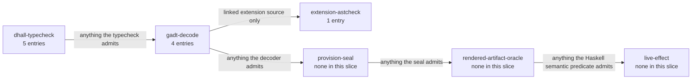

# Illegal States — Readiness, Promotion & Monitoring

> **Purpose**: The themed slice of the illegal-state catalog covering the lifecycle band — the readiness
> race (condition, never duration), unverified environment promotion, unmonitored workflows/extensions, a
> chaos fault targeting an undeclared component, and the build/link band (a foreign image, an unnamed
> container process, an unmodeled build stage, a worker naming an unlinked extension, and extension source
> reaching outside the sanctioned API) — with the honest limit that a type-check proves the *spec composes*,
> not that the *running cluster enforces it*.
> **Read this if**: a bring-up, teardown, or reconcile state has to be shown impossible to express.

Lifecycle entries are about order and transition rather than shape: what may follow what, and what may never
be observed as having happened. The numbering belongs to
[illegal_state_catalog.md](./illegal_state_catalog.md), and the reconcile loop these entries constrain to
[cluster_lifecycle_doctrine.md §9](../engineering/cluster_lifecycle_doctrine.md#9-how-bring-up-and-teardown-are-implemented-the-reconciler-not-a-state-machine).

Link-graph metadata

**Status**: Authoritative source
**Supersedes**: N/A
**Referenced by**: DEVELOPMENT_PLAN/phase_25_dhall_schema_generation.md, DEVELOPMENT_PLAN/phase_26_gadt_decode_ir.md, DEVELOPMENT_PLAN/phase_34_chain_kernel_boundary.md, DEVELOPMENT_PLAN/phase_56_base_image_registry.md, DEVELOPMENT_PLAN/phase_71_release_lifecycle.md, documents/engineering/chaos_failover_doctrine.md, documents/engineering/platform_services_doctrine.md, documents/engineering/readiness_ordering_doctrine.md, documents/engineering/release_lifecycle_doctrine.md, documents/illegal_state/README.md, documents/illegal_state/illegal_state_catalog.md, documents/illegal_state/illegal_state_ml_asset.md, documents/illegal_state/illegal_state_security.md, documents/illegal_state/illegal_state_techniques.md
**Generated sections**: none

> **Historical result (invalidated).** Every phase-run or implementation-result statement in this document is permanently invalidated diagnostic history. It cannot establish or reactivate current status, even if a phase later advances. Target doctrine remains normative; current status is solely in the [tracker](../../DEVELOPMENT_PLAN/README.md).

## Contents
- [1. Scope](#1-scope)
- [2. The readiness, promotion & monitoring illegal states](#2-the-readiness-promotion--monitoring-illegal-states)
- [Related Documents](#related-documents)

---

*Orientation. Design intent. Where this slice's entries are caught, counted from the primary `**Validation-locus:**` of each entry below; an entry may also name a secondary locus, which this count does not show. Lifecycle is the only slice reaching the extension-source check, and no entry has the provisioning seal as its primary locus. The axis itself is owned by [illegal_state_techniques.md §6.1](./illegal_state_techniques.md#61-the-validation-locus-axis--where-each-illegal-state-is-caught-orthogonal-to-the-foreclosure-layer).*

## 1. Scope

This document is a **themed slice** of the illegal-state catalog: the lifecycle illegal states — the
duration-gated / hand-ordered bring-up race ([§3.41](#341-a-duration-gated--hand-ordered-bring-up-sequence-a-readiness-race)),
the unverified environment promotion ([§3.26](#326-an-unverified-environment-promotion-promote--prod-without-the-required-evidence)),
the unmonitored workflow or extension ([§3.43](#343-an-unmonitored-workflow-or-extension-or-an-unauthenticated-monitoring-surface)),
and a chaos fault targeting a component the spec never declared ([§3.46](#346-a-chaos-fault-targeting-a-component-the-spec-never-declared)) —
plus the **build/link band**, where the same discipline reaches the artifact an app ships as rather than the
spec it is described by: a foreign container image ([§3.74](#374-a-container-image-amoebius-did-not-generate)),
an unnamed container process ([§3.75](#375-a-container-whose-process-is-unnamed)), an unmodeled build stage
([§3.76](#376-a-build-stage-whose-content-is-unmodeled)), a worker naming an extension its binary does not
link ([§3.77](#377-a-worker-naming-an-extension-its-own-binary-does-not-link)), and extension source reaching
outside the sanctioned API ([§3.78](#378-extension-source-that-reaches-outside-the-sanctioned-api)).
It owns nothing of the catalog's framing.

- The **catalog index** and the **load-bearing honesty limit** (a type-check proves the spec composes, not
  that the cluster enforces it) are owned by
  [`illegal_state_catalog.md`](./illegal_state_catalog.md) — referenced, not restated.
- The **nine typing techniques**, the **coverage matrix**, the **three foreclosure layers**, and
  the **validation-locus axis**, whose members [`illegal_state_techniques.md` §6.1](./illegal_state_techniques.md#61-the-validation-locus-axis--where-each-illegal-state-is-caught-orthogonal-to-the-foreclosure-layer) declares and this slice does not restate, are owned by
  [`illegal_state_techniques.md`](./illegal_state_techniques.md) — referenced, not restated.
- The *normative rule* behind each entry lives in that entry's owning doctrine (readiness/ordering, release
  lifecycle, monitoring, …). This doc names the owner and never restates its content.

Everything below is **design intent** for the type discipline, per the honesty limit owned by
[`illegal_state_catalog.md` §2](./illegal_state_catalog.md#2-the-load-bearing-limit-a-type-check-proves-the-spec-composes-not-that-the-cluster-enforces-it)
(restated by [`illegal_state_techniques.md` §6](./illegal_state_techniques.md#6-three-layers-of-foreclosure-and-the-honesty-they-force)) —
referenced, not restated: a type-check proves the *spec composes*, not that the *running cluster enforces it*. Read every "unrepresentable" and
"uninhabitable" below as design intent for the type discipline, never as a tested amoebius behaviour; the
runtime-enforcement proof is deferred on purpose to
[`chaos_failover_doctrine.md`](../engineering/chaos_failover_doctrine.md) and the testing tier.

Each entry keeps its **original catalog number and heading** verbatim — inbound links depend on the slug — and
adds one new **Validation-locus** line naming where the illegal state is caught along the validation-locus axis.

---

## 2. The readiness, promotion & monitoring illegal states

### 3.41 A duration-gated / hand-ordered bring-up sequence (a readiness race)

**Delivery-owner:** `Phase-34`

**Case-family:** `lifecycle`

**Cells:** `type-foreclosed`×`gadt-decode` · `decode-foreclosed`×`gadt-decode` · `runtime-checked`×`live-effect`

Raw tooling makes the bring-up race the default: a chart assumes its database is up, an initContainer polls a
port in a `sleep`-loop, a bootstrap script runs `sleep 30 && kubectl apply` and hopes the apiserver answered —
each substituting a **duration** for a **condition**, so it passes on a fast host and flakes on a slow one, then
strands a half-applied cluster. amoebius forecloses the *shape* that races on two axes. **(a) The gate is a condition, never a duration.** The sanctioned sequencing gate carries a typed `Readiness` (`Reachable | Serving |
Condition | Unsealed | Committed`) with **no `AfterDuration` arm**, so "wait N then assume ready" has no
constructor — the same no-illegal-arm idiom as `Rke2Servers`/`StorageBacking`/`Growable`
([§3.24](./illegal_state_topology.md#324-an-evenzero-server-rke2-control-plane-no-etcd-quorum--split-brain), [§3.18](./illegal_state_storage.md#318-unbounded-storage-anywhere), [§3.21](./illegal_state_storage.md#321-capacity-growth-without-an-amoebius-owned-scaling-policy)). **(b) The order is a derived, acyclic readiness DAG.** Bring-up edges are *derived* from the declared dependency graph — a dependent's start-handle
exists only once its dependency's `Ready` edge does — never hand-sequenced per installer, the same
derive-don't-author discipline as NetworkPolicy ([§3.6](./illegal_state_security.md#36-blocking-networkpolicy-services-cant-reach-each-other))
and tolerations ([§3.22](./illegal_state_capacity.md#322-a-hand-authored-un-derived-toleration)); a total `mkBringUpOrder` fold rejects a
cycle or an undeclared dependency at decode. The honest limit (the [§2](./illegal_state_catalog.md#2-the-load-bearing-limit-a-type-check-proves-the-spec-composes-not-that-the-cluster-enforces-it) limit, applied to readiness): the type **cannot** prove a port is responsive — that the observed condition
becomes true, in bounded time, is `runtime-checked`, owned by the reconciler and the chaos doctrine. The special
**initial-bootstrap** case (before the in-cluster SSA/Pulsar machinery exists) is closed by the host tier's local
observed primitives — the three-valued `discover` (Present/Absent/Unreachable, `Unreachable → refuse`) and the
`RuntimeWitness` file/socket facts — never a timer. **Owner:**
[`readiness_ordering_doctrine.md`](../engineering/readiness_ordering_doctrine.md) (the readiness-edge discipline) reading the
bring-up edges of [`platform_services_doctrine.md` §11](../engineering/platform_services_doctrine.md#11-bring-up-and-dependency-ordering)
and enacted by the reconciler of [`cluster_lifecycle_doctrine.md` §9](../engineering/cluster_lifecycle_doctrine.md#9-how-bring-up-and-teardown-are-implemented-the-reconciler-not-a-state-machine).
**Technique:** [§4.2](./illegal_state_techniques.md#42-capability-and-phantom-tenant-tags--cross-tenant-refs-are-uninhabitable) (closed `Readiness` union — no duration arm) + [§4.3](./illegal_state_techniques.md#43-gadt-indexed-state-machines--only-legal-transitions-are-typed)
(a start-handle exists only once its dependency's readiness edge does) + [§4.4](./illegal_state_techniques.md#44-ownership-indices--single-owner-ssot-structurally)
(the dependency graph is the single owner of order) + [§4.6](./illegal_state_techniques.md#46-capacity-accounting--placement-witness-compute-and-summed-demand-within-capacity-storage-checked)-shape
total fold (`mkBringUpOrder` acyclic/complete). **Layer:** `type-foreclosed` for the no-duration-arm gate shape
and the derived-edge handle; `decode-foreclosed` for the acyclic/complete DAG fold; `runtime-checked` residue —
that the observed condition actually resolves (owned by [`readiness_ordering_doctrine.md` §6](../engineering/readiness_ordering_doctrine.md#6-the-runtime-enactor-the-reconciler-observes-never-sleeps), [`cluster_lifecycle_doctrine.md` §9](../engineering/cluster_lifecycle_doctrine.md#9-how-bring-up-and-teardown-are-implemented-the-reconciler-not-a-state-machine), and [`chaos_failover_doctrine.md`](../engineering/chaos_failover_doctrine.md)). *(Honesty: the `type-foreclosed` claim scopes to the sanctioned `Readiness`-typed surface, not the whole `IO` monad — a raw `threadDelay` is caught one layer out by the [`daemon_topology_doctrine.md` §6](../engineering/daemon_topology_doctrine.md#6-the-shared-daemon-spine) ban, a `runtime-checked` discipline.)*

**Validation-locus:** `gadt-decode` (the closed `Readiness` union with no `AfterDuration` arm is a Haskell
`data` type on the Phase-34 surface, and bring-up order is *derived*, never Dhall-authored — so no `dhall
type` fixture can exercise it. A tracked Haskell negative declaration materializes the attempted "wait N then
assume ready" module only beneath `.build/test-corpora/**` and requires GHC to reject it for the separately
pinned Haskell diagnostic identity; this is not an editor-time `dhall type` failure, per the
dhall-typecheck-vs-gadt-decode caveat of [`illegal_state_techniques.md` §6](./illegal_state_techniques.md#6-three-layers-of-foreclosure-and-the-honesty-they-force); a
start-handle likewise exists only once its dependency's `Ready` edge does, and the total `mkBringUpOrder` fold
returns `Left` on a cycle or an undeclared dependency) + `live-effect` (that the observed condition actually
resolves in bounded time — the port becomes responsive — owned by the reconciler and the chaos doctrine). Per
the validation-locus axis of [`illegal_state_techniques.md`](./illegal_state_techniques.md), orthogonal to the
foreclosure layer above.

### 3.26 An unverified environment promotion (promote → prod without the required evidence)

**Delivery-owner:** `Phase-71`

**Case-family:** `lifecycle`

**Cells:** `type-foreclosed`×`gadt-decode` · `runtime-checked`×`live-effect`

Raw delivery permits pointing prod at any build — tested, untested, or actively red. amoebius makes
`Environment = < Dev | Staging | Prod >` advance through a typed `PromotionGate`: advancing an environment's
ETag-CAS pointer to a `Release` **requires** that the `Release`'s test-topology ledger
([`testing_doctrine.md`](../engineering/testing_doctrine.md) proven/tested/assumed) meet that environment's required evidence
strength (Prod requires the chaos layer). The advance constructor demands an **evidence witness**, so
"promote-unverified → prod" has no inhabitant — the same constructor-gating shape as the `.ready`-gated
`ArtifactRef` ([§3.25](./illegal_state_ml_asset.md#325-an-ml-asset-named-by-arbitrary-url-or-an-unready--unlanded-model)), applied to release evidence rather than model bytes. **Owner:**
[`release_lifecycle_doctrine.md` §4](../engineering/release_lifecycle_doctrine.md#4-promotiongate-promote-unverifiedprod-is-unrepresentable) (the `PromotionGate` precondition + the immutable release ledger). **Technique:** [§4.3](./illegal_state_techniques.md#43-gadt-indexed-state-machines--only-legal-transitions-are-typed) (a promotion handle exists only once its evidence edge does).
**Layer:** type-foreclosed uninhabitable; runtime-checked residue — that the tests actually ran and that prod actually converged
on the promoted `Release`, owned by [`chaos_failover_doctrine.md`](../engineering/chaos_failover_doctrine.md) and the testing
doctrine.

**Validation-locus:** `gadt-decode` (the `PromotionGate` advance constructor demands an evidence witness; the
total decoder returns `Left` when the `Release`'s test-topology ledger fails to meet the target environment's
required evidence strength — a value-level ledger fold, not a Dhall type index) + `live-effect` (that the tests
actually ran and that prod actually converged on the promoted `Release`, owned by the chaos and testing
doctrines). Per the validation-locus axis of [`illegal_state_techniques.md`](./illegal_state_techniques.md),
orthogonal to the foreclosure layer above.

**Phase-71 target instance — NOT VALIDATED:** the gate must compile the closed
`Environment`/opaque-`EvidenceWitness` boundary and exercise it live. Runtime- and Protocol-missing fixtures
must return their specific refusal tags and produce no pointer mutation; the Runtime witness must produce the
only Prod advance. Even successful live wiring would be tested, never proven; Phase 48 owns only the pure
test-workflow/evidence algebra, while Phase 90 owns later live topology derivation and execution after the
Phase-49 barrier.

### 3.43 An unmonitored workflow or extension (or an unauthenticated monitoring surface)

**Delivery-owner:** `Phase-31`

**Case-family:** `capacity`

**Cells:** `type-foreclosed`×`dhall-typecheck` · `decode-foreclosed`×`gadt-decode` · `decode-foreclosed`×`provision-seal` · `decode-foreclosed`×`rendered-artifact-oracle` · `runtime-checked`×`live-effect`

Raw k8s treats monitoring as an optional add-on: a Deployment can run with no scrape target, no alert rule, and
no dashboard, and a metrics or debug endpoint can be published to the wild with no authentication — so a
workflow compiles, deploys, and then emits no monitoring signal, and a monitoring surface can leak. amoebius makes monitoring a
**mandatory, non-vacuous property of the workflow and extension types**: a `Workflow` requires a
`WorkflowMonitor`, every `RouteEntry` requires a `Liveness`, and an `ExtensionSpec` requires a `NonEmpty`
`extMonitoring` (jitML → TensorBoard) — each an absent-arm required field, so an unmonitored workflow or
extension has no inhabitant. Every renderable surface carries a mandatory `AccessScope` with **no** `Public`
arm — the same `ExposeToWild`-only-Keycloak discipline as [§3.7](./illegal_state_security.md#37-accidental-insecure--backdoor-ingress) —
so an unauthenticated monitoring surface is uninhabitable (`AccessScope` is `AdminGlobal`, the single admin
identity; `SubjectScoped`, a Keycloak-minted `(tenant, owner)` filter; or `TenantRoleScoped`, a derived
tenant→role projection). Coverage of the derived rules/panels across a
workflow's topics and non-vacuousness of the SLO bounds are total decoder folds; whole-deployment feasibility
(freshness ≥ scrape interval, Σ rule cost ≤ the `Observability` workload's `Capacity`) is a post-bind provision
fold. **Owner:**
[`monitoring_doctrine.md`](../engineering/monitoring_doctrine.md) (the obligation types, derivation, access model, and parent-monitoring posture) + [`pulsar_client_doctrine.md` §6](../engineering/pulsar_client_doctrine.md#6-the-declarative-topology-algebra) (the `validateTopology` fold that carries it). **Technique:** [§4.1](./illegal_state_techniques.md#41-pvcpv-binding-by-construction) (the mandatory `monitor` / `liveness` / `extMonitoring` fields + the absent `Off`/`Public` arms — no forever-unmonitored arm) +
[§4.7](./illegal_state_techniques.md#47-compatibility--topology-relations-by-construction-over-a-collection) (the coverage fold over the workflow/topic collection) + [§4.6](./illegal_state_techniques.md#46-capacity-accounting--placement-witness-compute-and-summed-demand-within-capacity-storage-checked)
(the recording-rule feasibility Σ). **Layer:** `type-foreclosed` for the mandatory-field presence, the absent
`Off`/`Public` arms, and the `NonEmpty` lists; `decode-foreclosed` for coverage, non-vacuousness, feasibility,
and the `routes[].workflow`-vs-`name` reconciliation; `runtime-checked` residue — that the SLO is actually met, the alert fires, the named `/metrics` series exists, and a `SubjectScoped` filter actually excludes another subject's data — owned by [`chaos_failover_doctrine.md`](../engineering/chaos_failover_doctrine.md) and the review tier.

**Validation-locus:** `dhall-typecheck` (the mandatory `monitor` / `liveness` / `extMonitoring` fields, the
`NonEmpty` `extMonitoring` list, and the absent `Off`/`Public` arms fail `dhall type` at authoring time) +
`gadt-decode` (the coverage and non-vacuousness folds and the `routes[].workflow`-vs-`name` reconciliation return `Left` at decode) + `provision-seal` (the monitoring feasibility Σ fold returns a `ProvisionError`
after binding and before any `ProvisionedSpec` exists) + `rendered-artifact-oracle` (that the emitted monitoring surface renders
behind the Keycloak-owned edge with no `Public` listener — the no-backdoor-ingress analog of
[§3.7](./illegal_state_security.md#37-accidental-insecure--backdoor-ingress), checked by a separately reviewed
Haskell semantic predicate over the rendered object projection rather than by tracked expected bytes or a
cluster) + `live-effect` (that the SLO is actually met, the alert fires, the named `/metrics` series exists, and
a `SubjectScoped` filter actually excludes another subject's data). Per the validation-locus axis of
[`illegal_state_techniques.md`](./illegal_state_techniques.md), orthogonal to the foreclosure layer above.

---

### 3.46 A chaos fault targeting a component the spec never declared

**Delivery-owner:** `Phase-34`

**Case-family:** `lifecycle`

**Cells:** `type-foreclosed`×`gadt-decode` · `runtime-checked`×`live-effect`

Raw fault-injection tooling lets a scenario name any target: a test can script "partition the VPN" or "kill the
broker" against a cluster that runs neither, so the scenario is meaningless — or, worse, asserts an invariant no
declared component upholds. amoebius makes the fault schedule a **typed projection over the enclosing `InForceSpec`'s declared components**: `ChaosSchedule = NonEmpty FaultInjection`, and each `FaultInjection`'s
`FaultTarget` is a reference that resolves **only** against a component the spec actually declares — the same
derive-don't-author discipline that makes tolerations, `NetworkPolicy`, and the readiness DAG projections of the
spec rather than hand-authored fields ([`readiness_ordering_doctrine.md`](../engineering/readiness_ordering_doctrine.md)).
A fault on a component the spec never declared — "a VPN partition with no VPN," "a broker kill with no Pulsar" —
therefore has **no inhabitant**. The chaos schedule is a deployment-rules layer invisible to the app under test
([`app_vs_deployment_doctrine.md`](../engineering/app_vs_deployment_doctrine.md)), and each `FaultKind` is bound
to the invariant it stresses. **Owner:**
[`chaos_failover_doctrine.md` §11.1](../engineering/chaos_failover_doctrine.md#111-the-typed-fault-schedule-chaosschedule--faulttarget)
(the typed shape + the `FaultKind`→invariant map) + [`testing_doctrine.md`](../engineering/testing_doctrine.md)
(the harness that runs it). **Technique:** [§4.2](./illegal_state_techniques.md#42-capability-and-phantom-tenant-tags--cross-tenant-refs-are-uninhabitable)
(a phantom-typed reference that cannot name a component outside the enclosing spec) +
[§4.1](./illegal_state_techniques.md#41-pvcpv-binding-by-construction) (the `NonEmpty` schedule).
**Layer:** `type-foreclosed` at the Haskell IR — a `FaultTarget` referencing an undeclared component has no
inhabitant. A tracked Haskell negative declaration generates the attempted module beneath
`.build/test-corpora/**` and checks the exact GHC refusal, using the same discipline as the cross-tenant
[§3.8](./illegal_state_security.md#38-cross-tenant-references-and-literal-secrets). The only
`runtime-checked` residue is that the injected fault *actually* perturbs the live component as modeled.

**Validation-locus:** `gadt-decode` — because Dhall has no opaque or dependent types (the caveat of
[`illegal_state_techniques.md` §6](./illegal_state_techniques.md#6-three-layers-of-foreclosure-and-the-honesty-they-force)),
the cross-field "target ∈ declared components" constraint cannot be a Dhall type index; the total decoder
resolving the `FaultTarget` against the declared component set returns `Left` on an undeclared target, and the
Haskell-IR "no inhabitant" teeth land there — plus `live-effect` (that the injected fault perturbs the live
component as the drill assumes). Per the validation-locus axis of
[`illegal_state_techniques.md`](./illegal_state_techniques.md), orthogonal to the foreclosure layer above.

### 3.74 A container image amoebius did not generate

**Delivery-owner:** `Phase-56`

**Case-family:** `image`

**Cells:** `type-foreclosed`×`dhall-typecheck` · `decode-foreclosed`×`rendered-artifact-oracle`

Every other byte the cluster runs is accounted for — a baked binary, a linked library, a content-addressed
asset — but an image reference was, until now, a free digest. `ImageArtifact` constrained *bytes*
exhaustively (image manifest digest, config digest, per-layer blob digests) and
*identity* not at all, so any digest inhabited it and an app could name a container amoebius neither built
nor inspected. Making `identity : ImageIdentity` a required field closes it: the union's three arms are
named catalog identities — the host-pulled `KindNode` image, the architecture-qualified `Base` image, and a `Runtime`
variant keyed by the reviewed trusted-adapter set linked into it — with **no `Foreign`, free-digest, or `Url` arm**. An app therefore has no image to name; its checked UI program is immutable release data interpreted by
that generic runtime. Only a new trusted Haskell adapter can mint another runtime variant. This is
the same closure `EngineRuntime` already carries against an operator-supplied engine address, applied one
layer out. **Owner:** [`image_build_doctrine.md` §5](../engineering/image_build_doctrine.md#5-what-the-image-identity-is-given-that-the-tag-is-an-address)
(the closed identity) + [`resource_capacity_doctrine.md`](../engineering/resource_capacity_doctrine.md) (the `ImageArtifact` field). **Technique:** [§4.7](./illegal_state_techniques.md#47-compatibility--topology-relations-by-construction-over-a-collection)
(a relation over a closed named catalog) + [§4.1](./illegal_state_techniques.md#41-pvcpv-binding-by-construction)
(identity as a required field, not an optional annotation). **Layer:** `type-foreclosed` — a foreign image
reference has no constructor, with a `rendered-artifact-oracle` residue that the *deployed* image is the one
named (and a live containerd inspection independently confirms the pulled digest). That residue is `decode-foreclosed`: the deployed reference is a rendered value a total predicate reads.

**Validation-locus:** `dhall-typecheck` — the union is closed in the Dhall schema, so naming a foreign image
fails `dhall type` before any binary runs, exactly as an engine named by URL does.

### 3.75 A container whose process is unnamed

**Delivery-owner:** `Phase-56`

**Case-family:** `image`

**Cells:** `type-foreclosed`×`dhall-typecheck` · `decode-foreclosed`×`gadt-decode`

A `ContainerEnvelope` named an image, a lifecycle, and a complete resource envelope — and never said what
the container *executes*. No `command`, no `args`, no `entrypoint` field existed anywhere in the type layer,
so the running process was whatever the image's `ENTRYPOINT` happened to be: a fact about bytes, invisible
to every fold that reasons about the deployment. A required `process : ContainerProcess` closes it, and the
union has exactly two arms because exactly two things legitimately run in an amoebius pod — the linked
binary in a closed `InClusterRole`, or a binary some `BakeStep` installed, named by `BakedBinaryId`. The role
arm carries its parameters too: `Worker` takes a `WorkerKind`, so a pod cannot say it is a worker without
saying which kind, and `InClusterRole` has no host-daemon arm, so a *container* cannot claim a context that by
definition runs outside one. Two
relations make the pairing coherent rather than merely present: an `AmoebiusRole` container must run an
image whose identity is the `Runtime` arm, and a `BakedService`'s binary must be installed by a `BakeStep`
in that identity's own build content — so a container cannot name an executable no stage put in its image.
**Owner:** [`resource_capacity_doctrine.md`](../engineering/resource_capacity_doctrine.md) (the field and the relations) + [`daemon_topology_doctrine.md` §2](../engineering/daemon_topology_doctrine.md#2-context--role-an-orthogonal-grid)
(the closed role union). **Technique:** [§4.1](./illegal_state_techniques.md#41-pvcpv-binding-by-construction)
(required field) + [§4.7](./illegal_state_techniques.md#47-compatibility--topology-relations-by-construction-over-a-collection)
(process↔image and binary↔bake-content relations over the enclosing build). **Layer:** `type-foreclosed` for
the field's presence and the union's closedness; the two cross-references are `gadt-decode` folds. Those two folds are `decode-foreclosed` — a cross-field relation rejects a value that was constructible.

**Validation-locus:** `dhall-typecheck` — a `ContainerEnvelope` missing `process`, or naming a role outside
the closed union, does not type-check; the image↔process and binary↔content relations are cross-field and so
land at the decoder, per the validation-locus axis of
[`illegal_state_techniques.md`](./illegal_state_techniques.md).

### 3.76 A build stage whose content is unmodeled

**Delivery-owner:** `Phase-56`

**Case-family:** `image`

**Cells:** `type-foreclosed`×`dhall-typecheck` · `decode-foreclosed`×`rendered-artifact-oracle`

`BuildStageDemand` typed a build stage's *resources* totally — CPU reservation and ceiling, memory
reservation and ceiling, peak intermediate bytes, peak cache-write bytes, and its `dependsOn` edges — and
its *content* not at all. What a stage installed lived in a hand-authored `ARG`/`RUN` Dockerfile: text that
becomes a filesystem only after string interpolation, with nothing checking the result until the image runs.
That is precisely the defect amoebius refuses one layer up, where a Go-templated chart becomes YAML only
after interpolation and no type inspects the result
([`manifest_generation_doctrine.md` §1](../engineering/manifest_generation_doctrine.md#1-why-this-doctrine-exists-types-render-manifests-helm-does-not)).
A required `content : NonEmpty BakeStep` closes it, and the union's arms are the doctrine's own preference
ladder — `AptPackage`, `OfficialTarball`, `SourceBuild` — plus the two intra-build moves, with **no `RunShell : Text` arm and no `Url` arm**. The Dockerfile stops being committed source and becomes a
generated projection of that data. **Owner:**
[`image_build_doctrine.md` §6](../engineering/image_build_doctrine.md#6-host-build-vs-in-pod-build--development_plan-decision-recommended-default-host-builder-for-v1)
(the typed content) + [`generated_artifacts_doctrine.md`](../engineering/generated_artifacts_doctrine.md)
(the renderer). **Technique:** [§4.1](./illegal_state_techniques.md#41-pvcpv-binding-by-construction)
(a `NonEmpty` required field) + [§4.5](./illegal_state_techniques.md#45-content-address-totality--names-are-total-functions-of-content)
(a pinned identity per step rather than a fetched address). **Layer:** `type-foreclosed` — an interpolated
shell fragment has no constructor — with a `rendered-artifact-oracle` residue applying a separately reviewed
Haskell semantic predicate to the emitted Dockerfile. No expected Dockerfile bytes are tracked; any serialized
projection is materialized only beneath `.build/test-corpora/**`. The total predicate is `decode-foreclosed`.

**Validation-locus:** `dhall-typecheck` — the absent `RunShell`/`Url` arms are a generated Dhall-schema
closure, so an external/untracked operator value containing a shell fragment fails `dhall type` with no live
infrastructure; the Haskell negative declaration and oracle remain the tracked sources.

### 3.77 A worker naming an extension its own binary does not link

**Delivery-owner:** `Phase-56`

**Case-family:** `image`

**Cells:** `decode-foreclosed`×`gadt-decode` · `runtime-checked`×`live-effect`

A trusted linked extension creates a pairing that did not previously exist: a worker Pod names the
`WorkerKind` it runs, that kind names the `ExtensionId` whose library handles its work, and the Pod's image
links some particular set of extensions. Nothing forced those two to agree, so a Web-service host could be
scheduled for an app whose code its own binary does not carry — a "handler not found" discovered when the
first request arrives. The membership relation closes it: a `WorkerKind`'s `ExtensionId` must be a member of
its container's `ImageIdentity.Runtime.linkedAdapters` set. Runtime variants declare their exact reviewed
adapter set rather than assuming every image carries every adapter; ordinary UI programs are immutable
release data and do not create image variants ([§3.74](#374-a-container-image-amoebius-did-not-generate)).
The membership check is therefore a real constraint rather than a tautology. **Owner:**
[`daemon_topology_doctrine.md` §4](../engineering/daemon_topology_doctrine.md#4-worker-daemons--n-unelected)
(the dispatch wire and the relation). **Technique:**
[§4.7](./illegal_state_techniques.md#47-compatibility--topology-relations-by-construction-over-a-collection)
(a relation over the enclosing linked set) + [§4.4](./illegal_state_techniques.md#44-ownership-indices--single-owner-ssot-structurally)
(one owning image identity per worker). **Layer:** `decode-foreclosed` — the relation is cross-field, so it is a total
decoder fold rather than a Dhall type index — with a `runtime-checked` residue that the linked handler
actually serves.

**Validation-locus:** `gadt-decode` — Dhall carries no dependent types, so "this id is in that set" is
resolved by the total decoder, which returns `Left` when it is not — with a `live-effect` residue,
that the linked handler actually serves the extension the worker names.

### 3.78 Extension source that reaches outside the sanctioned API

**Delivery-owner:** `Phase-34`

**Case-family:** `lifecycle`

**Cells:** `type-foreclosed`×`extension-astcheck`

Gates 1 and 2 prove things about a *value*; neither constrains the Haskell linked beside it. An
`ExtensionSpec`'s `extChain` carries a `stepRun :: cfg -> IO ()`, and `IO ()` is a type, not a bound — so
extension source could open a socket, shell out, `unsafeCoerce`, or read a file, in the same process as the
role holding cluster-wide secret authority. While the linked set was closed at two vendored ML libraries
this was covered by review, and review is not a mechanism; with the `App` tier open it is not covered at
all. extension-astcheck closes it: a custom AST checker admits source against a closed `SanctionedApi`, rejecting an
unsanctioned import, raw `IO`, an FFI call, an `unsafe*` operation, Template Haskell, or an orphan instance
with a located diagnostic. Its `Accepted` arm carries an opaque, constructor-private
`CheckedExtensionSource` that only the checker produces and only the linker consumes, so "link unchecked
source" has no more syntax than "render an unprovisioned spec". **Owner:**
[`dsl_doctrine.md` §5](../engineering/dsl_doctrine.md#5-the-illegal-state-unrepresentable-contract) (the gate) + [`dsl_doctrine.md` §8](../engineering/dsl_doctrine.md#8-the-haskell-extension-dsl--the-constrained-surface-extension-astcheck-admits)
(the constrained surface). **Technique:**
[§4.3](./illegal_state_techniques.md#43-gadt-indexed-state-machines--only-legal-transitions-are-typed)
(an opaque checked value as the only linkable state) + [§4.4](./illegal_state_techniques.md#44-ownership-indices--single-owner-ssot-structurally)
(one producer of that value). **Layer:** `type-foreclosed` at the link boundary — unchecked source has no
linkable representation — with the honest limit that the checker bounds what code may *reach*, never what it
computes: that checked source terminates, respects its budgets, or serves correctly is `runtime-checked`
residue claimed by no gate.

**Validation-locus:** `extension-astcheck` — a new locus on the same axis as dhall-typecheck/gadt-decode, fired at build
time over extension source before link, per the validation-locus axis of
[`illegal_state_techniques.md`](./illegal_state_techniques.md).

### 3.87 An execution unit with no monitoring obligation

**Delivery-owner:** `Phase-31`

**Case-family:** `capacity`

**Cells:** `type-foreclosed`×`dhall-typecheck` · `decode-foreclosed`×`gadt-decode` · `decode-foreclosed`×`provision-seal` · `runtime-checked`×`live-effect`

[§3.43](#343-an-unmonitored-workflow-or-extension-or-an-unauthenticated-monitoring-surface) binds the
workflow surface — a `Workflow`, a `RouteEntry`, an `ExtensionSpec`. It leaves everything else a spec
deploys with no monitoring obligation at all: an ordinary Deployment/StatefulSet/DaemonSet workload, each of
the eight cluster-invariant platform capabilities, the Envoy/Keycloak edge, a copy/schema/Pulumi/ACME Job, a
controller child or admission webhook, a host process or host worker, and the topology-derived
network-fabric roles. Such a deployment decodes, provisions, renders, and runs with nothing observing it —
and reads as covered, because its *workflows* are fully monitored. amoebius closes this the same way it
closed the parallel resource obligation, where no pod is exempt from its `ResourceEnvelope`: every
`BoundExecutionUnit` carries a mandatory `UnitMonitor`, whose `MonitorProvenance` has no `Exempt`/`None` arm,
so the binder cannot construct a unit without one and an operator cannot hand-author a derived capability's
monitor. "Monitored deployment" and "deployment" therefore have the same inhabitants.
**Owner:** [`monitoring_doctrine.md` §2.4](../engineering/monitoring_doctrine.md#24-per-execution-unit-obligation--boundexecutionunitmonitor)
(the obligation and its provenance union) + [`platform_services_doctrine.md` §10](../engineering/platform_services_doctrine.md#10-every-execution-unit-declares-its-complete-resource-envelope)
(the no-pod-is-exempt precedent it parallels).
**Technique:** [§4.1](./illegal_state_techniques.md#41-pvcpv-binding-by-construction) (required field by construction, plus the absent exempt arm) + [§4.6](./illegal_state_techniques.md#46-capacity-accounting--placement-witness-compute-and-summed-demand-within-capacity-storage-checked)
(the derived rule/series cost of the enlarged monitored population folded against the finite
`MonitoringWorkBudget`).
**Layer:** `type-foreclosed` for field presence and the absent `Exempt` arm; `decode-foreclosed` for
non-vacuousness of each unit's bounds and for the execution-set coverage fold; `provision-seal` for
feasibility, since universal monitoring can exceed the observability workload's capacity where workflow-only
monitoring did not; `runtime-checked` residue — that each unit's declared series actually exists on the
endpoint it names.
**Validation-locus:** `dhall-typecheck` (the mandatory `monitor` field and the absent `Exempt` arm fail
`dhall type` at authoring) + `gadt-decode` (non-vacuousness and coverage folds return `Left`) +
`provision-seal` (the enlarged monitoring feasibility Σ returns a `ProvisionError` before any
`ProvisionedSpec` exists) + `live-effect` residue (the named series exists and is scraped). Per the
validation-locus axis of [`illegal_state_techniques.md`](./illegal_state_techniques.md), orthogonal to the
foreclosure layer above.

---

### 3.89 A one-shot command run holding a daemon role

**Delivery-owner:** `Phase-55`

**Case-family:** `topology`

**Cells:** `type-foreclosed`×`dhall-typecheck`

Context and role are orthogonal axes
([`daemon_topology_doctrine.md` §2](../engineering/daemon_topology_doctrine.md#2-context--role-an-orthogonal-grid)),
but not every pairing exists: a CLI run is not a daemon, and a host daemon is not a container process. Held as
two independent fields, those empty cells are writable — a `FrameConfig` could say "command mode" and
"control-plane daemon" at once, and nothing in the type layer would object, so the binary would be left to
notice at run time that its own configuration described something that cannot exist. amoebius closes it by
making the *legal cell* the constructor rather than the pair: `Process` has a `HostCommand` arm carrying no
role, a `HostDaemon` arm carrying a `HostRole`, and an `InCluster` arm carrying an `InClusterRole`. The
CLI row's blanks then have no inhabitant to write down. Each arm answers the same question — what this
process *is* — so the supervised host-level worker has a home rather than being squeezed out by a payload
describing its supervisor's children.
**Layer:** `type-foreclosed` for the CLI row — a one-shot run has no role field to fill, so the empty cells
have no constructor. The host-daemon and in-cluster rows are foreclosed by their own arms carrying a
`HostRole` and an `InClusterRole` respectively; no runtime-checked residue remains.
**Owner:** [`daemon_topology_doctrine.md` §1](../engineering/daemon_topology_doctrine.md#1-one-runtime-binary-three-contexts)
(the contexts) + [§2](../engineering/daemon_topology_doctrine.md#2-context--role-an-orthogonal-grid) (the grid
and the closed unions).
**Technique:** [§4.3](./illegal_state_techniques.md#43-gadt-indexed-state-machines--only-legal-transitions-are-typed)
(the legal pairing indexed into the constructor, rather than two independent fields whose product is larger
than the set of real cells).

**Validation-locus:** `dhall-typecheck` — a value naming a role its context cannot hold has no constructor, so
it does not type-check.

### 3.90 A role whose cardinality contradicts it

**Delivery-owner:** `Phase-55`

**Case-family:** `topology`

**Cells:** `type-foreclosed`×`dhall-typecheck` · `runtime-checked`×`live-effect`

"Exactly one writer" is the whole content of the control-plane daemon
([`daemon_topology_doctrine.md` §3](../engineering/daemon_topology_doctrine.md#3-the-control-plane-daemon)),
and a replica count stated *beside* the role can contradict it: a Deployment naming
`ControlPlaneDaemon` with `replicas = 3` is writable, and the contradiction is caught — if at all — by a
validation function rather than by the type. The same holds for the capacity scheduler, which is also exactly
one. amoebius closes it by indexing cardinality on the role: the arms that are exactly-one carry no replica
field at all, and only `Worker` — the arm that is *N*, unelected — admits a count. A control-plane daemon with three
replicas is then not rejected but unsayable.
**Owner:** [`daemon_topology_doctrine.md` §3](../engineering/daemon_topology_doctrine.md#3-the-control-plane-daemon)
(the exactly-one property and its delegation to k8s/etcd) +
[§4](../engineering/daemon_topology_doctrine.md#4-worker-daemons--n-unelected) (the unelected *N*).
**Technique:** [§4.3](./illegal_state_techniques.md#43-gadt-indexed-state-machines--only-legal-transitions-are-typed)
(the field's availability indexed by the arm, so the contradictory pairing has no shape).

**Layer:** `type-foreclosed` — the replica field exists only on the arm that admits *N*, so the
contradictory pairing has no shape to be written in; no runtime-checked residue remains.
**Validation-locus:** `dhall-typecheck` — the schema gives `ControlPlaneDaemon` and `CapacityScheduler` no
replica field, so a count beside either is a type error in the editor, not a rejection at decode.

## Related Documents
- [The Illegal-State Catalog](./illegal_state_catalog.md) — the catalog index and the load-bearing honesty
  limit this slice inherits ([§1](#1-scope) framing, [§2](#2-the-readiness-promotion--monitoring-illegal-states) the honesty limit, [§6](illegal_state_techniques.md#6-three-layers-of-foreclosure-and-the-honesty-they-force) the three foreclosure layers)
- [Illegal States — Typing Techniques](./illegal_state_techniques.md) — the nine typing techniques, the
  coverage matrix, the foreclosure layers, and the **validation-locus axis** each entry above cites
- [DSL Doctrine](../engineering/dsl_doctrine.md) — the contract this catalog enumerates (a valid `InForceSpec` cannot represent illegal state)
- [Readiness Ordering Doctrine](../engineering/readiness_ordering_doctrine.md) — [§3.41](#341-a-duration-gated--hand-ordered-bring-up-sequence-a-readiness-race)
  the readiness-edge discipline (readiness is a condition/edge, not a wait)
- [Platform Services Doctrine](../engineering/platform_services_doctrine.md) — the bring-up/dependency ordering
  ([§11](../engineering/platform_services_doctrine.md#11-bring-up-and-dependency-ordering)) and the derived-rules / wild-ingress edge
- [Cluster Lifecycle Doctrine](../engineering/cluster_lifecycle_doctrine.md) — the reconciler that enacts bring-up
  ([§9](../engineering/cluster_lifecycle_doctrine.md#9-how-bring-up-and-teardown-are-implemented-the-reconciler-not-a-state-machine))
- [Daemon Topology Doctrine](../engineering/daemon_topology_doctrine.md) — the shared daemon spine and the `threadDelay` ban
  ([§6](../engineering/daemon_topology_doctrine.md#6-the-shared-daemon-spine))
- [Release Lifecycle Doctrine](../engineering/release_lifecycle_doctrine.md) — [§3.26](#326-an-unverified-environment-promotion-promote--prod-without-the-required-evidence)
  the `PromotionGate` precondition + the immutable release ledger
- [Testing Doctrine](../engineering/testing_doctrine.md) — the proven/tested/assumed test-topology ledger the `PromotionGate`
  evidence witness reads
- [Monitoring Doctrine](../engineering/monitoring_doctrine.md) — [§3.43](#343-an-unmonitored-workflow-or-extension-or-an-unauthenticated-monitoring-surface)
  the obligation types, derivation, access model (`AccessScope`), and parent-monitoring posture
- [Pulsar Client Doctrine](../engineering/pulsar_client_doctrine.md) — the `validateTopology` fold
  ([§6](../engineering/pulsar_client_doctrine.md#6-the-declarative-topology-algebra)) that carries the monitoring coverage check
- [Content Addressing Doctrine](../engineering/content_addressing_doctrine.md) — the `.ready`-gated `ArtifactRef` whose
  constructor-gating shape [§3.26](#326-an-unverified-environment-promotion-promote--prod-without-the-required-evidence) mirrors
- [Chaos / Failover Doctrine](../engineering/chaos_failover_doctrine.md) — the runtime-enforcement proof (the honest limit)
  every `runtime-checked` / `live-effect` residue above defers to
