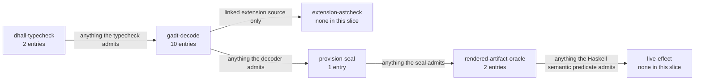

# Illegal States — Security, Ingress & Secrets

> **Purpose**: The themed slice of the illegal-state catalog covering gateway/DNS/NetworkPolicy wiring,
> backdoor ingress, cross-tenant references and literal secrets, plaintext-at-rest, unsafe workloads, the
> secure-gateway reach, admin mutations, derived RBAC bindings, and the low-code UI authorization, ownership,
> information-flow, and plan-freshness boundary — the states amoebius makes unrepresentable so that ingress,
> secrets, data access, and authority-bearing UI actions cannot be misconfigured into a leak.
> **Read this if**: an authority, ingress, or isolation boundary has to be shown impossible to cross by construction.

Security entries are the ones where a runtime residue is least acceptable, so each records not only what
cannot be expressed but where an escape would surface if it could. Their numbering belongs to
[illegal_state_catalog.md](./illegal_state_catalog.md), and the construction patterns behind them to
[illegal_state_techniques.md](./illegal_state_techniques.md). The ingress boundary several of them protect is
owned by [platform_services_doctrine.md](../engineering/platform_services_doctrine.md).

Link-graph metadata

**Status**: Authoritative source
**Supersedes**: N/A
**Referenced by**: DEVELOPMENT_PLAN/phase_08_scope_index.md, DEVELOPMENT_PLAN/phase_09_resource_index.md, DEVELOPMENT_PLAN/phase_25_dhall_schema_generation.md, DEVELOPMENT_PLAN/phase_27_illegal_state_covering.md, DEVELOPMENT_PLAN/phase_28_storage_geometry_folds.md, DEVELOPMENT_PLAN/phase_29_execution_accelerator_folds.md, DEVELOPMENT_PLAN/phase_33_render_manifest_oracles.md, DEVELOPMENT_PLAN/phase_38_ui_authorization_kernel.md, DEVELOPMENT_PLAN/phase_40_ui_plan_compiler.md, DEVELOPMENT_PLAN/phase_43_ui_server_boundary.md, DEVELOPMENT_PLAN/phase_64_keycloak_ingress.md, DEVELOPMENT_PLAN/phase_66_app_tenancy.md, DEVELOPMENT_PLAN/phase_68_user_tenant_isolation_live.md, DEVELOPMENT_PLAN/phase_82_ui_multi_tenant_live.md, documents/engineering/bootstrap_sequence_doctrine.md, documents/engineering/dsl_doctrine.md, documents/engineering/extension_conformance_security.md, documents/engineering/extension_conformance_transactions.md, documents/engineering/inforcespec_migration_doctrine.md, documents/engineering/manifest_generation_doctrine.md, documents/engineering/monitoring_doctrine.md, documents/engineering/namespace_layout_doctrine.md, documents/engineering/platform_services_doctrine.md, documents/engineering/readiness_ordering_doctrine.md, documents/engineering/service_capability_doctrine.md, documents/engineering/tenancy_doctrine.md, documents/illegal_state/README.md, documents/illegal_state/illegal_state_capacity.md, documents/illegal_state/illegal_state_catalog.md, documents/illegal_state/illegal_state_lifecycle.md, documents/illegal_state/illegal_state_ml_asset.md, documents/illegal_state/illegal_state_multicluster.md, documents/illegal_state/illegal_state_storage.md, documents/illegal_state/illegal_state_techniques.md, documents/illegal_state/illegal_state_tenancy.md
**Generated sections**: none

> **Historical result (invalidated).** Every phase-run or implementation-result statement in this document is permanently invalidated diagnostic history. It cannot establish or reactivate current status, even if a phase later advances. Target doctrine remains normative; current status is solely in the [tracker](../../DEVELOPMENT_PLAN/README.md).

## Contents
- [1. Scope](#1-scope)
- [2. The security, ingress & secrets illegal states](#2-the-security-ingress--secrets-illegal-states)
- [Related Documents](#related-documents)

---

## 1. Scope

This document is a **themed slice** of the illegal-state catalog: the security, ingress, and secrets entries
drawn from [`illegal_state_catalog.md`](./illegal_state_catalog.md) and reorganized as their own doc,
reproducing each entry body faithfully. What this slice **authoritatively owns** is the per-entry
**Validation-locus** classification it adds to each entry below. The **catalog index** (which states are illegal, in full) and the **load-bearing honesty limit** (a type-check proves the *spec composes*, not that the *running cluster enforces it*) are owned
by [`illegal_state_catalog.md`](./illegal_state_catalog.md). The **nine typing techniques** ([§4](./illegal_state_techniques.md#4-the-typing-techniques)), the
**coverage matrix** ([§5](./illegal_state_techniques.md#5-coverage-matrix--which-technique-forecloses-which-illegal-state)), the **three foreclosure layers** ([§6](./illegal_state_techniques.md#6-three-layers-of-foreclosure-and-the-honesty-they-force)), and the **validation-locus axis** (the orthogonal `dhall-typecheck` / `gadt-decode` / `provision-seal` / `rendered-artifact-oracle` / `live-effect` classification each entry below carries) are owned by [`illegal_state_techniques.md`](./illegal_state_techniques.md). This slice
**references** those; it does not restate them.

Everything below is **design intent**, not a tested amoebius result. Per the honesty limit ([§6](./illegal_state_techniques.md#6-three-layers-of-foreclosure-and-the-honesty-they-force)),
a green type-check is a **Decision-layer** proof that the specification composes into something internally
coherent — no illegal value is constructible — and it says nothing about whether the interpreter renders
correct manifests, whether the apiserver admits them, or whether the running cluster enforces them. Read every
"unrepresentable" below as *design intent for the type discipline*, never as a proven runtime behaviour.

---

## 2. The security, ingress & secrets illegal states

Each entry keeps its **original catalog number and heading** (inbound links depend on the slug). The
**Validation-locus** line added to each entry places it on the orthogonal validation-locus axis defined in
[`illegal_state_techniques.md` §6.1](./illegal_state_techniques.md#61-the-validation-locus-axis--where-each-illegal-state-is-caught-orthogonal-to-the-foreclosure-layer), which is the axis's single owner and enumerates its members.

*Orientation. Design intent. Where this slice's entries are caught, counted from the primary `**Validation-locus:**` of each entry below; an entry may also name a secondary locus, which this count does not show. Security concentrates at the decoder, and carries two of the corpus's three rendered-artifact-oracle entries. The axis itself is owned by [illegal_state_techniques.md §6.1](./illegal_state_techniques.md#61-the-validation-locus-axis--where-each-illegal-state-is-caught-orthogonal-to-the-foreclosure-layer).*

### 3.3 Misconfigured gateway

**Delivery-owner:** `Phase-27`

**Case-family:** `security`

**Cells:** `type-foreclosed`×`gadt-decode` · `decode-foreclosed`×`rendered-artifact-oracle` · `runtime-checked`×`live-effect`

A hand-written Gateway/HTTPRoute can listen on a port nothing serves, terminate TLS with a cert for the
wrong host, or route to a backend that doesn't exist. In amoebius the gateway is not free-form: routes are
emitted from the same value that declares the service, so a route to a non-existent backend, or a listener
with no matching service, cannot be written. **Owner:**
[`platform_services_doctrine.md` §9](../engineering/platform_services_doctrine.md#9-the-loadbalancer-and-the-single-wild-ingress-path) (Envoy + Gateway API, the single wild-ingress path). **Technique:** [§4.3](./illegal_state_techniques.md#43-gadt-indexed-state-machines--only-legal-transitions-are-typed) (GADT-indexed: a route is constructed *from* a live service handle)
+ [§4.5](./illegal_state_techniques.md#45-content-address-totality--names-are-total-functions-of-content) totality (the cert/host name is a function of the declared identity, not a free string).

**Layer:** type-foreclosed at the Haskell IR — a route to a non-existent backend has no constructor; runtime-checked residue — that the live gateway actually routes. The emitted listeners and backends the oracle compares are `decode-foreclosed`.
**Validation-locus:** `gadt-decode` (a route is constructed only *from* a live service handle, and the
cert/host name is a total function of the declared identity — a route to a non-existent backend or a listener
with no matching service has no inhabitant) + `rendered-artifact-oracle` (the emitted Gateway/HTTPRoute
listeners and backends match the declaring service) + `live-effect` residue (that the LoadBalancer comes up
and TLS actually terminates).

### 3.4 DNS that binds to the wrong IP

**Delivery-owner:** `Phase-33`

**Case-family:** `security`

**Cells:** `type-foreclosed`×`gadt-decode` · `decode-foreclosed`×`rendered-artifact-oracle` · `runtime-checked`×`live-effect`

Route53 (or any DNS) records are strings; nothing prevents pointing `app.example.com` at an address the
cluster never owned. amoebius never lets the operator *type* the target IP: a DNS binding is a **total function of the allocated LoadBalancer address** — a name binds to a *service handle*, and the address is
computed from the realized LB, not supplied. A record pointing at an unowned address therefore has no
representation. **Owner:** [`pulumi_iac_doctrine.md`](../engineering/pulumi_iac_doctrine.md) (route53 + zerossl) and
[`platform_services_doctrine.md` §9](../engineering/platform_services_doctrine.md#9-the-loadbalancer-and-the-single-wild-ingress-path). **Technique:** [§4.5](./illegal_state_techniques.md#45-content-address-totality--names-are-total-functions-of-content) (content-address totality, applied to the name→address map).

**Layer:** type-foreclosed at the Haskell IR — a name binds only to an allocated address, so an unowned target has no constructor; runtime-checked residue — that DNS actually resolves to it. The emitted record targeting the allocated address is `decode-foreclosed`.
**Validation-locus:** `gadt-decode` (the DNS binding is a total function of a service handle — there is no
free string in which to type an unowned target IP) + `rendered-artifact-oracle` (the emitted DNS record targets
the allocated LB address) + `live-effect` residue (the realized LoadBalancer address is what is actually bound
at reconcile — the enforcement half the type cannot reach).

### 3.6 Blocking NetworkPolicy (services can't reach each other)

**Delivery-owner:** `Phase-33`

**Case-family:** `security`

**Cells:** `type-foreclosed`×`gadt-decode` · `decode-foreclosed`×`rendered-artifact-oracle` · `runtime-checked`×`live-effect`

NetworkPolicies are deny-by-omission: a forgotten egress rule silently severs a service from
its database, with no error anywhere. amoebius does not let operators hand-author allow/deny rules at all.
Connectivity is **derived** from the declared dependency graph — if service A declares it consumes service
B, the policy permitting A→B is generated, and a declared dependency can never be a connection the
policy blocks. The "service stranded from a dependency it declared" state is not expressible because the
human never writes the policy. **Owner:**
[`platform_services_doctrine.md`](../engineering/platform_services_doctrine.md). **Technique:** [§4.4](./illegal_state_techniques.md#44-ownership-indices--single-owner-ssot-structurally) (the dependency graph is the single owner of connectivity) + [§4.3](./illegal_state_techniques.md#43-gadt-indexed-state-machines--only-legal-transitions-are-typed) (a consumer handle only exists once the dependency edge does).

**Layer:** type-foreclosed at the Haskell IR — NetworkPolicies are derived from the declared dependency graph and never hand-authored, so a severing policy has no constructor; runtime-checked residue — that the live CNI actually admits the traffic. Exact edge-set equality over the emitted policies is `decode-foreclosed`.
**Validation-locus:** `rendered-artifact-oracle` (the oracle compares the derived NetworkPolicy with the emitted objects —
a declared dependency is never a connection the policy blocks; Phase 33 owns target validation of exact set
equality against the separately authored Haskell
`expectedNetworkPolicyEdges :: InForceSpec -> Set ServiceEdge`, which does not call the production policy
renderer; no encoded edge oracle is tracked) + `gadt-decode` (the consumer handle exists
only once the dependency edge does; the ownership fold over the dependency graph) + `live-effect` residue
(that the CNI actually admits the derived flow). Phase 64 owns the `linux-cpu` residue challenge with an
independent scratch Pod: absent edge must deny, adding `scratch→minio` must admit, and removing it must deny
again; the Haskell policy-swap mutant must fail `expectedNetworkPolicyEdges`. Any rendered policy or encoded
comparison corpus is materialized only beneath `.build/test-corpora/**`.

### 3.7 Accidental insecure / backdoor ingress

**Delivery-owner:** `Phase-27`

**Case-family:** `security`

**Cells:** `type-foreclosed`×`dhall-typecheck` · `type-foreclosed`×`gadt-decode` · `decode-foreclosed`×`rendered-artifact-oracle` · `runtime-checked`×`live-effect`

The highest-severity entry: a chart that opens its own NodePort to the wild, or an Ingress that skips Keycloak, so
an unauthenticated path exists that nobody meant to ship. amoebius enforces **Keycloak owns all wild ingress** structurally: an app cannot publish its own wild ingress, because the
only constructor that yields a wild-reachable endpoint routes through the Keycloak-owned edge. The sole
carve-out — host-origin, localhost-only NodePorts with no mTLS — is a *different type* of endpoint
(`HostLocalPeer`, not `WildIngress`), reachable only from the host and never from WAN/LAN, owned by
[`host_cluster_comms_doctrine.md`](../engineering/host_cluster_comms_doctrine.md). There is no constructor that turns a
host-local peer into a wild endpoint, and none that exposes a workload to the wild without the edge.
**Owner:** [`platform_services_doctrine.md` §9](../engineering/platform_services_doctrine.md#9-the-loadbalancer-and-the-single-wild-ingress-path). **Technique:** [§4.2](./illegal_state_techniques.md#42-capability-and-phantom-tenant-tags--cross-tenant-refs-are-uninhabitable)
(capability: only the edge holds the "expose-to-wild" capability) + [§4.3](./illegal_state_techniques.md#43-gadt-indexed-state-machines--only-legal-transitions-are-typed) (endpoint kinds are distinct indices that do not interconvert).

**Layer:** type-foreclosed at the Haskell IR — only the Keycloak edge holds the expose-to-wild capability and endpoint kinds do not interconvert; runtime-checked residue — that the running cluster in fact exposes no unauthenticated path. The no-backdoor semantic predicate over the emitted objects is `decode-foreclosed`.
**Validation-locus:** `dhall-typecheck` (the application schema exposes no authorable wild-ingress or raw
NodePort arm) + `rendered-artifact-oracle` (the no-backdoor-ingress semantic predicate on the emitted objects — no wild
NodePort or Keycloak-skipping Ingress in the rendered manifest, whose target Register-1 validation is owned by Phase 33) + `gadt-decode` (only the edge holds
the expose-to-wild capability, and endpoint kinds are distinct non-interconverting indices — a self-published
wild endpoint has no constructor) + `live-effect` residue (that the running cluster in fact exposes no
unauthenticated path). Phase 64 owns the `linux-cpu` residue challenge: the sole LoadBalancer must be the
Keycloak/Envoy edge, a tracked Haskell NodePort mutant must lazily render its raw object beneath
`.build/test-corpora/**`, turn the scanner red, and leave the clean projection green; no raw NodePort seed is
version controlled. The only allowed `HostLocalPeer` NodePort must succeed on node loopback while an actual
WAN-Pod source is denied.

### 3.8 Cross-tenant references and literal secrets

**Delivery-owner:** `Phase-27`

**Case-family:** `security`

**Cells:** `type-foreclosed`×`gadt-decode` · `runtime-checked`×`live-effect`

Two locked invariants ride together here. **(a) Secrets are names only** — a literal secret value in Dhall
is unrepresentable; the spec carries a `SecretRef` (a name), and the parent injects the actual material
into the child's Vault. **(b) Tenant isolation** — a child cluster knows
*nothing* about its siblings, so a spec for child *X* must not be able to name
child *Y*'s resources or secrets. Both are foreclosed the same way: references are **tenant-tagged**, and
there is no function that re-tags a reference from one tenant to another ([§4.2](./illegal_state_techniques.md#42-capability-and-phantom-tenant-tags--cross-tenant-refs-are-uninhabitable)). A `SecretRef` is a name
under *this* tenant's tag; a cross-tenant reference has no inhabitant. **Owner:**
[`vault_pki_doctrine.md`](../engineering/vault_pki_doctrine.md) (the `SecretRef`-by-name contract, parent→child injection, the trust tree). **Technique:** [§4.2](./illegal_state_techniques.md#42-capability-and-phantom-tenant-tags--cross-tenant-refs-are-uninhabitable) (phantom tenant tags + capabilities).

**Layer:** type-foreclosed at the Haskell IR — phantom tenant tags admit no re-tagging function and a literal secret value has no constructor; runtime-checked residue — that the parent actually injects the referenced material.
**Validation-locus:** `gadt-decode` (phantom tenant tags — a literal secret value and a cross-tenant
reference have no inhabitant; a `SecretRef` is only ever a name under *this* tenant's tag, and no function
re-tags across tenants) + `live-effect` residue (that the parent actually injects the referenced material into
the child's Vault at runtime).

### 3.9 A plaintext spec at rest

**Delivery-owner:** `Phase-61`

**Case-family:** `security`

**Cells:** `type-foreclosed`×`gadt-decode` · `runtime-checked`×`live-effect`

The `InForceSpec` is sensitive even when it holds no secret *values* — it is the cluster's whole topology.
So the spec has **no plaintext-at-rest representation**: a cluster never holds its own spec as a plaintext
value, only the means to fetch and decrypt it; at runtime the control-plane daemon decrypts the
Vault-Transit MinIO envelope **in-process** and never writes it to a plaintext ConfigMap or to etcd. A spec
materialized to a cluster-legible store is therefore not something a workload's typed inputs can even name
(a workload reads only the unencrypted-basics floor plus the Vault objects its policy allows). **Owner:**
[`vault_pki_doctrine.md` §4](../engineering/vault_pki_doctrine.md#4-init-follows-readiness-fail-closed-vault-init) (decrypt-in-process, never-plaintext) and
[`pulumi_iac_doctrine.md` §2](../engineering/pulumi_iac_doctrine.md#2-the-backend-every-byte-of-state-is-a-vault-enveloped-object-in-minio) (the enveloped backend). **Technique:** [§4.5](./illegal_state_techniques.md#45-content-address-totality--names-are-total-functions-of-content)
(an envelope/handle, not a plaintext value) — note this row's *enforcement* is partly runtime (per the [§2](./illegal_state_catalog.md#2-the-load-bearing-limit-a-type-check-proves-the-spec-composes-not-that-the-cluster-enforces-it) limit); the type only removes any plaintext-spec input.

**Layer:** type-foreclosed at the Haskell IR — a workload's typed inputs can name only an envelope or handle; runtime-checked residue — that the bytes at rest are in fact enveloped.
**Validation-locus:** `gadt-decode` (a workload's typed inputs can only name an envelope/handle, never a
plaintext-spec value — the plaintext-at-rest input has no inhabitant) + `live-effect` residue (that the
control-plane daemon decrypts the Vault-Transit MinIO envelope in-process and never writes plaintext to a
ConfigMap or etcd — this row's enforcement is explicitly the runtime half).

### 3.10 A child spec that reaches beyond its own subtree

**Delivery-owner:** `Phase-27`

**Case-family:** `security`

**Cells:** `type-foreclosed`×`gadt-decode` · `runtime-checked`×`live-effect`

A child cluster's spec is, by construction, a projection of **exactly its own subtree** (its own config
including its children's). There is no field in a `ChildInForceSpec` in which a sibling or ancestor-only branch can
appear, so a parent cannot hand a child anything wider than its subtree, and a child cannot name a sibling's
resources — the [§3.8](#38-cross-tenant-references-and-literal-secrets) tenant-isolation invariant lifted to the whole spec tree, reinforced cryptographically
by per-child Transit keys (a child cannot even *decrypt* a sibling's subtree). **Owner:**
[`cluster_lifecycle_doctrine.md` §3](../engineering/cluster_lifecycle_doctrine.md#3-amoebic-spawning--the-recursive-forest) (the `project(subtree)` handoff),
[`dsl_doctrine.md`](../engineering/dsl_doctrine.md) (the `ChildInForceSpec` type), and
[`vault_pki_doctrine.md` §6](../engineering/vault_pki_doctrine.md#6-parentchild-unseal-two-sanctioned-modes) (per-child keys). **Technique:** [§4.2](./illegal_state_techniques.md#42-capability-and-phantom-tenant-tags--cross-tenant-refs-are-uninhabitable) (phantom tenant/subtree tags) + [§4.4](./illegal_state_techniques.md#44-ownership-indices--single-owner-ssot-structurally) (ownership indices).

**Layer:** type-foreclosed at the Haskell IR — a `ChildInForceSpec` has no field in which a sibling or ancestor-only branch can appear; runtime-checked residue — that the running child reaches no further.
**Validation-locus:** `gadt-decode` (phantom subtree tags + ownership indices — a `ChildInForceSpec` has no
field in which a sibling or ancestor-only branch can appear) + `live-effect` residue (per-child Transit keys —
a child cannot even *decrypt* a sibling's subtree at runtime, the cryptographic reinforcement beyond the type
shape).

### 3.11 An unsafe workload (no resource limits, no hardened securityContext)

**Delivery-owner:** `Phase-25`

**Case-family:** `security`

**Cells:** `type-foreclosed`×`dhall-typecheck` · `decode-foreclosed`×`provision-seal` · `decode-foreclosed`×`rendered-artifact-oracle` · `runtime-checked`×`live-effect`

In raw k8s a Deployment may omit resource requests/limits — a noisy-neighbour or OOM-the-node risk — and run
as root with a writable root filesystem and full Linux capabilities. amoebius **generates** every workload
object from a typed record that *requires* a complete resource envelope: refined non-zero CPU, memory, and
pod `ephemeral-storage` requests+limits for every app/sidecar/init container, plus per-container private
writable/log allowances covered by that container's ephemeral request/limit and, with shared volume bounds, by
the effective pod request. That same record fixes the storage envelope: a size bound for every disk-backed
scratch/cache volume; writer-indexed memory-backed volumes with access/persistence and exactly one reservation
carrier per resident lifecycle epoch; platform-specific OCI content/snapshot/import metadata routed by the
node's closed filesystem layout and finite pull policy; and checked durable claim presentation/usable/raw
sizes. For the accelerator-owner pod it derives an integer extended-resource request/limit on its named owner
container plus the pod's required affinity. It also attaches a hardened (non-root, no-privilege-escalation,
dropped-capabilities, read-only-root-by-default) `securityContext`. Binding and
provisioning must first construct the opaque whole-deployment `ProvisionedSpec`; only deployment-global
`renderAll :: ProvisionedSpec -> [K8sObject]` crosses the seal, so neither an incomplete resource projection nor an unprovisionable target/workload pair can reach manifest generation. There is nothing to lint because there was never a renderable value to lint. The complete-resource-envelope rule is owned by [`platform_services_doctrine.md` §10](../engineering/platform_services_doctrine.md#10-every-execution-unit-declares-its-complete-resource-envelope);
the generation discipline that makes the unsafe shape unconstructible is owned by
[`manifest_generation_doctrine.md` §3](../engineering/manifest_generation_doctrine.md#3-best-practice-by-construction-an-unsafe-manifest-is-not-constructible). **Owner:**
[`manifest_generation_doctrine.md`](../engineering/manifest_generation_doctrine.md) (best-practice-by-construction) +
[`platform_services_doctrine.md`](../engineering/platform_services_doctrine.md) (the complete resource-envelope rule) + [`resource_capacity_doctrine.md`](../engineering/resource_capacity_doctrine.md) (the private checked provision boundary). **Technique:** [§4.1](./illegal_state_techniques.md#41-pvcpv-binding-by-construction)
(required-field-by-construction — a record without the field has no inhabitant).

**Layer:** split — the missing-envelope and un-hardened-`securityContext` shapes are type-foreclosed (required fields, closed arms), while the capacity half is decode-foreclosed at the provision seal; runtime-checked residue — that the kubelet actually enforces the rendered limits.
**Validation-locus:** `dhall-typecheck` (a workload record missing its mandatory resource envelope fails
`dhall type` at authoring) + `provision-seal` (the post-bind resource/capability fold must construct the opaque
whole-deployment `ProvisionedSpec`, returning a `ProvisionError` before that seal when the selected target
cannot supply any demand) +
`rendered-artifact-oracle` (the hardened non-root / no-privilege-escalation / dropped-capabilities /
read-only-root `securityContext` and the exact checked resource projection are present in the emitted
manifest, whose target validation across all nine capability arms and both shapes is owned by Phase 33) + `live-effect` residue (the running pod actually enforces the hardened context and resource
ceilings).

### 3.40 A secure-gateway reach collapsing into wild ingress

**Delivery-owner:** `Phase-33`

**Case-family:** `security`

**Cells:** `type-foreclosed`×`gadt-decode` · `decode-foreclosed`×`rendered-artifact-oracle` · `runtime-checked`×`live-effect`

The new `Gateway` networking arm (`SecureGatewayReach c`, the authenticated secure-gateway wire a non-member host
worker uses to reach the data plane + Vault) must not become a back-door into the wild — "Keycloak owns all wild
ingress" ([§3.7](#37-accidental-insecure--backdoor-ingress)) must survive it. `SecureGatewayReach` is a **distinct `network_fabric` endpoint index** alongside `FabricPeer`/`ControlPlanePeer`/`HostLocalPeer`/`WildIngress`, with
**no constructor into `WildIngress`**, so a gateway reach cannot collapse into a wild endpoint — the same
endpoint-kinds-do-not-interconvert shape as the host-local-peer carve-out ([§3.7](#37-accidental-insecure--backdoor-ingress)).
The wild-ingress gateway (Keycloak/Envoy) stays wild-only. **Owner:**
[`network_fabric_doctrine.md`](../engineering/network_fabric_doctrine.md) (the endpoint indices) +
[`host_cluster_comms_doctrine.md`](../engineering/host_cluster_comms_doctrine.md) (channel 2 generalized to localhost / authenticated fabric / authenticated secure gateway). **Technique:**
[§4.2](./illegal_state_techniques.md#42-capability-and-phantom-tenant-tags--cross-tenant-refs-are-uninhabitable) (only the wild edge holds the `ExposeToWild` capability — a `SecureGatewayReach` value cannot produce a wild endpoint) +
[§4.3](./illegal_state_techniques.md#43-gadt-indexed-state-machines--only-legal-transitions-are-typed) (endpoint kinds are distinct indices that do not interconvert). **Layer:** type-foreclosed uninhabitable. *(The K1 `Gateway`-arm authentication constructor itself is design intent this round names but defers — the witness type `FabricMember c` via `fabricMemberViaGateway` is named, the constructor not yet inhabited.)* The emitted objects carrying no gateway-derived wild endpoint is `decode-foreclosed`, and the authenticated wire staying non-wild at run time is `runtime-checked`.

**Validation-locus:** `gadt-decode` (only the wild edge holds the `ExposeToWild` capability, and
`SecureGatewayReach` is a distinct endpoint index with no constructor into `WildIngress` — the collapse has no
inhabitant) + `rendered-artifact-oracle` (the emitted objects carry no wild endpoint derived from the gateway
reach) + `live-effect` residue (that the authenticated secure-gateway wire actually stays non-wild at
runtime).

### 3.42 An admin mutation without a root-token capability + an unsealed-Vault witness

**Delivery-owner:** `Phase-61`

**Case-family:** `security`

**Cells:** `type-foreclosed`×`gadt-decode` · `runtime-checked`×`live-effect`

Raw k8s hands anyone with a kubeconfig a mutating control surface — a new manifest, a config change — with no
proof of authority beyond the cert, and no ordering against secret readiness. amoebius routes **all post-bootstrap admin through the control-plane daemon's REST API** (the control-plane daemon being a Deployment `replicas=1` with no
leader election) ([`bootstrap_sequence_doctrine.md` §5](../engineering/bootstrap_sequence_doctrine.md#5-the-admin-control-plane-the-cli--the-control-plane-daemon-rest-api)),
and the mutating endpoint (`dhall update`) is constructed **only** from a `RootToken` capability **and** an
`Unsealed`-Vault witness — so "push a new spec to an unsealed-less or unauthenticated cluster" has no
constructor, the same capability + edge-gated-handle discipline as the `PromotionGate`
([§3.26](./illegal_state_lifecycle.md#326-an-unverified-environment-promotion-promote--prod-without-the-required-evidence)) and the
`Readiness` edge ([§3.41](./illegal_state_lifecycle.md#341-a-duration-gated--hand-ordered-bring-up-sequence-a-readiness-race)). Its sibling
— an admin action **bypassing** the control-plane daemon — is foreclosed too: channel 1 (host binary ↔ kube-apiserver) is
a **bootstrap-only** privilege with no exported control verb after the host-daemon→control-plane daemon handoff, so the
only control-surface constructor is an admin-REST call — and retiring channel 1 does **not** make that surface
*remotely* reachable: the admin-REST call still traverses the control-plane daemon's **node-local/private admin channel**
([`bootstrap_sequence_doctrine.md` §5](../engineering/bootstrap_sequence_doctrine.md#5-the-admin-control-plane-the-cli--the-control-plane-daemon-rest-api) admin-plane reach class), never the wild edge. **Owner:**
[`bootstrap_sequence_doctrine.md`](../engineering/bootstrap_sequence_doctrine.md) (the admin control plane) +
[`vault_pki_doctrine.md` §4](../engineering/vault_pki_doctrine.md#4-init-follows-readiness-fail-closed-vault-init) (the unsealed-Vault precondition). **Technique:** [§4.2](./illegal_state_techniques.md#42-capability-and-phantom-tenant-tags--cross-tenant-refs-are-uninhabitable)
(the `RootToken` capability — an admin verb has no inhabitant without it) + [§4.3](./illegal_state_techniques.md#43-gadt-indexed-state-machines--only-legal-transitions-are-typed)
(a `dhall update` handle exists only once its `Unsealed`-Vault edge does; channel-1 verbs do not survive the
handoff transition). **Layer:** `type-foreclosed` for the cap-and-witness-gated mutation and the retired
channel-1 verb; `runtime-checked` residue — that the control-plane daemon (a Deployment `replicas=1`, no election) actually holds *sole* authority
(no split-brain admin), owned by [`daemon_topology_doctrine.md` §5](../engineering/daemon_topology_doctrine.md#5-single-instance-and-coordination--delegated-not-elected)
and [`chaos_failover_doctrine.md`](../engineering/chaos_failover_doctrine.md).

**Validation-locus:** `gadt-decode` (the `RootToken` capability plus the `Unsealed`-Vault edge-gated `dhall
update` handle — an unauthenticated or unsealed-less mutation has no inhabitant, and channel-1 control verbs do
not survive the host-daemon→control-plane daemon handoff) + `live-effect` residue (that the control-plane daemon — a Deployment
`replicas=1` with no election — actually holds *sole* admin authority, no split-brain).

### 3.45 A cross-tenant or hand-authored RBAC binding

**Delivery-owner:** `Phase-31`

**Case-family:** `capability-provision`

**Cells:** `type-foreclosed`×`gadt-decode` · `decode-foreclosed`×`provision-seal` · `decode-foreclosed`×`rendered-artifact-oracle` · `runtime-checked`×`live-effect`

Raw k8s (and Keycloak, Vault, Pulsar, and MinIO alongside it) lets an operator hand-write a `RoleBinding`,
a realm-role grant, a Vault policy, a Pulsar ACL, or a bucket policy that grants one tenant reach into
another's resources — or simply mis-scopes a grant — with nothing to catch it but review. amoebius has **no DSL surface with which to author a grant at all**: every concrete provider policy is the image of one **total function of the typed tenant→role graph**
(`deriveTenantPolicies :: TenantSpec -> TenantPolicyDerivation`). This is an intermediate, never a renderer:
it carries exact policy outputs plus the source-linked Keycloak SQL/WAL, Vault Raft, Pulsar ZooKeeper, MinIO
system-metadata, and Kubernetes API/etcd persistence operands, along with exact provider action/executor
identities and bounded execution cost, through whole-deployment provision. The pure executor attachment is only
`Dedicated | SharedControlPlaneRole`, never a concrete target. One plural binder resolves and coalesces every
tenant's actions/deltas by target, debits a shared base once, and seals only private provisioned execution
references/capacity witnesses. MinIO policy metadata is globally grouped and may resolve only to a retained
MinIO backing; static reserve is once per store. Desired and observed outputs carry normalized content digests,
so same-size/different-content is `Replace`, never `NoOp`. Observed old state remains charged with rollback/
executor overlap until verified cleanup. A
hand-authored, un-derived binding is not a value that function can return, and
a *cross-tenant* binding has no inhabitant for the same reason [§3.8](#38-cross-tenant-references-and-literal-secrets)'s
cross-tenant reference does — references are tenant-tagged and no function re-tags a grant from one tenant to
another. This is the RBAC lift of the derived-not-authored discipline that [§3.22](./illegal_state_capacity.md#322-a-hand-authored-un-derived-toleration)
applies to tolerations and [§3.6](#36-blocking-networkpolicy-services-cant-reach-each-other) applies to
connectivity: the human never writes the policy, so the mis-scoped policy is unrepresentable. **Owner:**
[`tenancy_doctrine.md` §5](../engineering/tenancy_doctrine.md#5-rbac-is-derived-never-authored) (RBAC is derived, never authored) + [`vault_pki_doctrine.md`](../engineering/vault_pki_doctrine.md) (the per-tenant policy envelope). **Technique:**
[§4.2](./illegal_state_techniques.md#42-capability-and-phantom-tenant-tags--cross-tenant-refs-are-uninhabitable) (phantom tenant tags — a grant is tagged under *this* tenant and no function re-tags it) + [§4.4](./illegal_state_techniques.md#44-ownership-indices--single-owner-ssot-structurally)
(the typed tenant→role graph is the single owner of every derived grant). **Layer:** `type-foreclosed`
uninhabitable for the hand-authored and cross-tenant binding (no constructor); `runtime-checked` residue — that
the derived Keycloak/Vault/Pulsar/MinIO policies *actually* refuse a live cross-tenant access. Source/key-set
equality also makes an output/action whose persistence demand was dropped `decode-foreclosed` at whole
provision ([resource_capacity_storage.md §5.1](../engineering/resource_capacity_storage.md#51-durable-demand-is-logical-first-physical-only-after-geometry)); only private `ProvisionedSpec` projections
paired with the exact observation-bound `ValidatedLiveTarget` may render or act.

**Validation-locus:** `gadt-decode` (every provider policy is the image of one total derivation of the typed
tenant→role graph, and grants are phantom-tenant-tagged — a hand-authored, un-derived, or cross-tenant binding
has no inhabitant) + `provision-seal` (whole-deployment source equality requires exact policy outputs and their four-store plus
API/etcd demands and executor actions share a source and exact nested identities; independent wrong-digest,
equal-cardinality key-swap, extra-entry, nested-id mismatch, omitted action/executor/old-state, one-short,
drop-demand-while-action-remains, duplicate-target (`DuplicateTenantPolicyExecutionTarget`), uncoalesced-delta
(`UncoalescedTenantPolicyExecutionDelta`), double-base (`TenantPolicyBaseExecutionDoubleDebit`), split-MinIO-
group (`TenantPolicyMinioGroupMismatch`), provider-quota supply
(`UnsupportedTenantPolicyProviderObjectQuota`), MinIO static/dynamic drop/double-add
(`MinioMetadataComponentMismatch`), and same-size/different-content (`PolicyContentDigestMismatch`) mutants
reject before effects) +
`rendered-artifact-oracle` (only private provisioned projections emit a policy set matching the tenant→role
graph, with no grant crossing a tenant tag) + `live-effect` residue (provider-state/action readback matches
normalized content digests, one coalesced target/base witness, store-global MinIO components, and the sealed
transition high-water; the policies refuse a live cross-tenant read).

**Permanently invalidated Phase-66 run report.** The Register-3 gate derives 18 qualified actions for two equal-shaped tenants and reads
the resulting Keycloak, Vault, Pulsar, MinIO, Kubernetes, and Postgres administrative objects through six
separated observers. The hand-authored-grant and outer/inner-tenant-mismatch twins have zero provider effects;
`drop_provider_arm` and `collapse_tenant_key` both turn the unchanged gate red, and complete target inventories
return to preflight. The actual cross-subject/cross-tenant request refusal remains the Phase-68 live-effect
residue, not a Phase-66 claim. Ledger `external-run-reference`.

### 3.79 A UI action whose server authorization does not match its declaration

**Delivery-owner:** `Phase-38`

**Case-family:** `ui`

**Cells:** `type-foreclosed`×`dhall-typecheck` · `decode-foreclosed`×`gadt-decode` · `decode-foreclosed`×`provision-seal` · `decode-foreclosed`×`rendered-artifact-oracle` · `runtime-checked`×`live-effect`

A hidden or disabled control is presentation, never authorization. If the SPA can name a raw endpoint, if an
action has no policy, or if its client-visible permission differs from the server handler's enforced permission,
an attacker can call the endpoint directly and bypass the UX. The low-code surface therefore has no
`RawHttp`, handler-only, policy-optional, or visibility-as-auth arm. One closed port registry inside the
`BoundUiProgram` owns each `PortId`, typed public contracts, bound server handler, effect class, non-optional
`AuthPolicyRef`, scope requirement, and audit metadata; `ClientPlan`, `UiServerPlan`, and edge projections are
derived from that value. Only the public `ClientPlan` and allowlisted client assets have browser routes; the
private server-plan manifest and its dispatch/policy bytes do not. Construction of an authorized invocation requires both the authenticated trusted
request context and the matching current policy witness. A total exact-key fold rejects missing, extra,
duplicate, handler-mismatched, or policy-mismatched projections, and the default for an absent policy is refusal
rather than allow. **Owner:**
[`low_code_ui_runtime_doctrine.md` §8](../engineering/low_code_ui_runtime_doctrine.md#8-effects-are-typed-ports-not-network-operations)
(the single action registry and exact-key fold) +
[`low_code_ui_runtime_doctrine.md` §9](../engineering/low_code_ui_runtime_doctrine.md#9-routes-identity-authorization-and-the-edge)
(independent server authorization and the edge).
**Technique:**
[§4.4](./illegal_state_techniques.md#44-ownership-indices--single-owner-ssot-structurally) (one port-registry owner plus exact-key parity) +
[§4.3](./illegal_state_techniques.md#43-gadt-indexed-state-machines--only-legal-transitions-are-typed)
(`Validated` becomes `Authorized` only through current request-context and policy witnesses) +
[§4.2](./illegal_state_techniques.md#42-capability-and-phantom-tenant-tags--cross-tenant-refs-are-uninhabitable)
(the authority to execute is a server-held, tenant/subject-scoped capability).

**Layer:** `type-foreclosed` for raw/optional-policy action shapes and for executing anything other than an
authorized invocation; `decode-foreclosed` at the post-bind seal for the cross-projection exact-key fold;
`runtime-checked` residue — that the running gateway and UI server enforce the sealed policy on every request.
**Validation-locus:** `dhall-typecheck` (a raw endpoint or route/port without its non-optional `AuthPolicyRef` has
no Dhall arm) + `gadt-decode` (the referenced policy and public contracts resolve and type-check locally) +
`provision-seal` (the normalized `PortId`, public contracts, handler, effect class, `AuthPolicyRef`, and scope
tuples must match across the expanded gateway, server-dispatch, authorization, and audit projections before any
plan is sealed) +
`rendered-artifact-oracle` (the emitted public routes terminate at the authenticated UI server, match the exact
public-asset allowlist, and carry neither a handler-only bypass nor a private server-plan path) + `live-effect`
residue (a direct unauthorized request and private-manifest fetch are denied).

**Independent oracle and mutants.** The executable action inventory is the Haskell `ActionRegistry`; Markdown
and serialized tables are never registries. A separate Haskell checker derives expected normalized action
tuples from independently authored Haskell expectations and extracts enforced tuples from the sealed server
policy and rendered routes, then requires exact set equality without calling the production projection.
Generated routes and encoded comparisons exist only beneath `.build/test-corpora/**`. Haskell mutants delete
one policy, add a handler-only route, swap two equal-cardinality permissions, duplicate an action id, mark a control hidden while leaving its handler
unguarded, change a handler id without changing the policy, and serve the private server-plan manifest as a
client asset; each must fail before effects or private disclosure. Black-box direct action and manifest
requests are the live oracle, not a click-visibility test.

**Permanently invalidated Phase-38 run report.** The Register-1 gate matches five normalized registry tuples and byte-equal client/server
projections against an independent extractor, matches six allow/deny rows and four exact stale-epoch failures,
requires every denial to leave an empty pure effect trace, and kills both `default_allow` and
`visibility_is_authorization` at distinct loci. Nine generated classes meet their floor, the real five-calculus
projection composes counts `5,6,8,9,2` to `5,30,0,0`, all 15 metrics match, and 46 surfaces join to 63 items.
Live gateway, UI-server, identity-provider, and provider-policy enforcement is still UNVERIFIED. See
[Phase 38](../../DEVELOPMENT_PLAN/phase_38_ui_authorization_kernel.md).

**Permanently invalidated Phase-43 run report.** The Register-2 `serve-ui` process derives tenant, subject, permission, grant, and epoch
from a signed credential minted by a separate authority process. Own-scope read/mutation reaches a separate
capability-guarded handler, while foreign, forged-header, revoked, wrong-origin, and stale twins produce zero
handler bytes; startup, private-plan, idempotency, and WebSocket pairs also pass, and nine mutants turn red.
The startup battery now includes an extra unreferenced linked handler, and the real five-calculus projection
accounts for 80 units.
Live Keycloak, edge exclusivity, provider policy, cluster deployment, and HA remain UNVERIFIED. See
[Phase 43](../../DEVELOPMENT_PLAN/phase_43_ui_server_boundary.md).

### 3.80 A subject resolving or mutating another subject's resource without a grant

**Delivery-owner:** `Phase-8`

**Case-family:** `ui`

**Cells:** `type-foreclosed`×`gadt-decode` · `decode-foreclosed`×`provision-seal` · `decode-foreclosed`×`rendered-artifact-oracle` · `runtime-checked`×`live-effect`

Checking only that a resource identifier exists creates an insecure direct-object-reference path: two subjects
inside one tenant can see one another's rows, or a subject can submit another tenant's identifier. Every request
is decoded under `RequestContext tenant subject`, and a browser identifier resolves only to a private
`Handle scope kind` through a server resolver that simultaneously applies tenant, subject/audience, and
explicit-grant predicates. Provider operations accept that scoped handle, never a globally resolved
`ResourceId`; a handler has no API that performs “lookup by id, authorize later.” Tenant-wide, role-shared, and
subject-owned resources remain representable through a closed `Audience` and a policy-derived `Grant` witness.
The single-tenant architecture retains the tenant index and supplies one fixed witness, so switching deployment
mode cannot erase the isolation proof needed by the multi-tenant arm. Derived SQL row policies, object prefixes,
topic namespaces, workflow references, and cache keys preserve the same scope as defense in depth.
**Owner:**
[`low_code_ui_runtime_doctrine.md` §10.2](../engineering/low_code_ui_runtime_doctrine.md#102-multi-tenant-mode)
(scope epochs and grants) +
[`low_code_ui_runtime_doctrine.md` §11](../engineering/low_code_ui_runtime_doctrine.md#11-data-forms-and-storage)
(server-injected tenant/subject constraints). **Technique:**
[§4.2](./illegal_state_techniques.md#42-capability-and-phantom-tenant-tags--cross-tenant-refs-are-uninhabitable)
(`RequestContext`/`Handle` phantom scope, with no re-tag function) +
[§4.4](./illegal_state_techniques.md#44-ownership-indices--single-owner-ssot-structurally) (one ownership/grant fold resolves every reference).

**Layer:** `type-foreclosed` in the Haskell server IR for a provider operation over an unscoped/global id;
`decode-foreclosed` for a declared data binding whose owner/audience has no matching grant; `runtime-checked`
residue — that the database, object store, message bus, caches, and live handler enforce the derived predicates.
**Validation-locus:** `gadt-decode` (the public data/form algebra cannot construct a trusted scope, owner,
grant, or opaque handle, and its declared scope kinds must agree) + `provision-seal` (ownership/grant resolution
must succeed, and each bound data operation and provider policy must share the exact tenant, audience, resource,
and action source) + `rendered-artifact-oracle` (derived row policies/prefixes/namespaces carry the scoped
predicates) + `live-effect` residue (cross-subject and cross-tenant probes return refusal without revealing
existence).

**Independent oracle and mutants.** Tracked Haskell negative declarations materialize attempts to pass a raw
`ResourceId` to a handler or provider operation only beneath `.build/test-corpora/**` and require their exact
GHC refusals; no foreign fixture module or encoded diagnostic is tracked. A separately implemented Haskell
two-tenant/two-subject oracle creates equal-shaped resources,
then swaps identifiers across subjects in one tenant and across tenants while exercising read, update, delete,
workflow resume, object download, topic subscription, and cache lookup. Mutants drop only the subject predicate,
drop only the tenant predicate, trust a browser-supplied tenant, key a cache by resource id alone, or retain a
grant after revocation; every cross-scope result must be indistinguishable from an unavailable resource and no
mutation may occur.

**Permanently invalidated Phase-8 run report.** The Register-1 scope gate matches six owner/grant joins and the exact same-tenant
`OwnerMismatch` and cross-tenant `TenantMismatch` swaps. Legal twins compile while raw `ResourceId`
construction, scope retagging, request-index escape, and request-scope forgery fail at pinned compiler reasons;
the registry-backed owner-equality mutant makes both swaps red. Provider enforcement remains the live residue.
See [Phase 8](../../DEVELOPMENT_PLAN/phase_08_scope_index.md).

**Permanently invalidated Phase-68 run report.** The Register-3 gate authenticates and introspects three real Keycloak credentials across
two tenants, then drives a constructor-private Haskell request context through paired own/foreign Postgres RLS,
derived MinIO-key, and derived Pulsar-namespace operations. Independent provider and CNI observations find no
foreign state, message, cursor, or network effect; exact teardown passes. `drop_user_predicate` and
`accept_body_tenant` each turn the matrix red. Browser tenant switching, cross-cluster isolation, and complete
provider-audit-log correspondence remain `UNVERIFIED`. Ledger
`dynamically-resolved`.

### 3.81 A UI value flowing to an incompatible tenant, subject, or audience scope

**Delivery-owner:** `Phase-8`

**Case-family:** `ui`

**Cells:** `type-foreclosed`×`gadt-decode` · `decode-foreclosed`×`gadt-decode` · `decode-foreclosed`×`provision-seal` · `decode-foreclosed`×`rendered-artifact-oracle` · `runtime-checked`×`live-effect`

A page may read a correctly authorized value and still leak it through a broader response, log, topic, model
prompt, cache, export, or downstream workflow. Every data source and sink therefore carries a
`FlowLabel tenant audience integrity`; transforms preserve or restrict confidentiality and propagate the least
trusted integrity of their inputs. A sink consumes `Labeled label a` only with a `CanFlowTo label sink` witness.
There is no general label erasure or declassification operation. Audience widening is possible only through a
closed, named release/grant action whose own authorization, purpose, audit class, and target audience are
policy-derived. Browser input and model output begin untrusted and cannot flow into an authority-bearing sink
until an action-specific validator produces the required integrity witness. A total graph fold checks indirect
paths as well as adjacent edges, so a formatter, join, workflow step, cache, or observability projection cannot
silently discard the label. **Owner:**
[`low_code_ui_runtime_doctrine.md` §10.3](../engineering/low_code_ui_runtime_doctrine.md#103-information-flow-labels).
**Technique:**
[§4.2](./illegal_state_techniques.md#42-capability-and-phantom-tenant-tags--cross-tenant-refs-are-uninhabitable)
(phantom tenant/audience and integrity tags, with no general re-tag) +
[§4.7](./illegal_state_techniques.md#47-compatibility--topology-relations-by-construction-over-a-collection)
(a total compatibility relation over the complete source→sink graph).

**Layer:** `type-foreclosed` where a typed sink requires a compatible flow witness; `decode-foreclosed` where
the complete graph's dynamic labels and release edges are checked; `runtime-checked` residue — that provider
policies and the running renderer preserve the sealed scopes. **Validation-locus:** `gadt-decode` (the total
information-flow fold returns every incompatible direct or transitive path) + `provision-seal` (late-bound data,
workflow, model, messaging, storage, cache, and observability sinks must all be included before the flow graph is
sealed) + `rendered-artifact-oracle` (responses and provider policies contain no wider projection) + `live-effect`
residue (cross-audience probes and telemetry inspection reveal no protected value).

**Independent oracle and mutants.** An independent graph checker computes transitive reachability from authored
sources to rendered/provider sinks and applies the label relation without consuming the compiler's flow
witnesses. Mutants re-tag tenant A as tenant B, widen `Subject` to `Tenant`, route a private field through a
formatter into a public response, log a labelled secret, key a cache without its audience, publish to a broader
topic, and feed untrusted model/browser text into an authority sink; each must identify the complete offending
path before effects.

**Permanently invalidated Phase-8 run report.** The Register-1 flow gate matches four independently authored direct/transitive decisions
and exact subject-mismatch, cycle, missing-member, and missing-path diagnostic rows. Nine generated rejection
classes meet their floors, general declassification fails at its pinned compiler reason, and the total checker
reports transitive leaks with complete paths. Live sink behavior remains `UNVERIFIED`. See
[Phase 8](../../DEVELOPMENT_PLAN/phase_08_scope_index.md).

### 3.83 A UI plan executed after an authority-bearing source changed

**Delivery-owner:** `Phase-40`

**Case-family:** `ui`

**Cells:** `type-foreclosed`×`gadt-decode` · `decode-foreclosed`×`provision-seal` · `decode-foreclosed`×`rendered-artifact-oracle` · `runtime-checked`×`live-effect`

A compiled SPA plan becomes unsafe when authorization policy, tenant-role membership, handler schema, workflow
contract, resource generation, or referenced model provenance changes while an old browser bundle or server
cache continues to execute it. The paired `ClientPlan`/`UiServerPlan` projections of a sealed `BoundUiProgram`
have a constructor-private identity computed from the complete authority-bearing source set: UI program, action
registry, policy graph, tenant-role graph, schemas, workflow/data contracts, resolved trusted external-link
subset, and model-artifact provenance.
Exact source-key equality rejects an omitted input; the generation/digest is derived rather than authored, and
no function re-tags an old sealed plan as current.
Each release atomically names the content identities of both the public client plan and serializable private
server-plan manifest. A missing half or A-client/B-server mix has no admitted pair identity and is refused
before handler lookup; release publication cannot make either half current independently.
The browser may send a public action id and observed plan version, but never a serialized capability or trusted
plan. The server resolves the action in its current sealed plan and checks the current policy/membership epoch
immediately before effects; a mismatch is a fail-closed reload/conflict response. **Owner:**
[`low_code_ui_runtime_doctrine.md` §15](../engineering/low_code_ui_runtime_doctrine.md#15-versioning-rollout-and-generated-artifacts)
(plan and contract compatibility), with request-time epoch validation owned by
[`low_code_ui_runtime_doctrine.md` §13](../engineering/low_code_ui_runtime_doctrine.md#13-generic-purescript-client-and-amoebius-ui-server).
**Technique:**
[§4.5](./illegal_state_techniques.md#45-content-address-totality--names-are-total-functions-of-content) (plan identity is a total function of the complete source set) +
[§4.3](./illegal_state_techniques.md#43-gadt-indexed-state-machines--only-legal-transitions-are-typed) (only a current-generation authorized action crosses the effect edge) +
[§4.4](./illegal_state_techniques.md#44-ownership-indices--single-owner-ssot-structurally) (exact source/key ownership).

**Layer:** `type-foreclosed` for re-tagging a sealed plan across generations; `decode-foreclosed` at plan sealing
for incomplete or mismatched sources; currentness at request arrival is necessarily `runtime-checked`, because a
type cannot prove that external policy or membership has not changed. **Validation-locus:** `gadt-decode`
(a sealed plan carries its generation as an index, so no function re-tags one across generations) +
`provision-seal`
(complete-source digest and exact-key equality must hold before a plan exists) + `rendered-artifact-oracle` (the
bundle and server projection carry the same non-authoritative plan identifier) + `live-effect` (the server
compares against current authority immediately before execution and refuses an old plan/action without side
effects).

**Independent oracle and mutants.** The replay oracle seals plan P under authority snapshot A, independently
changes exactly one source to snapshot B, and retries P's action against B; it observes provider state as well as
the HTTP refusal to verify zero observed effects. Mutants omit each source class from the digest in turn, compare only the
UI-program digest, reuse an authorization decision across a membership epoch, accept an action removed from the
current registry, publish only one plan half, swap equal-shaped client/server generations, or trust the
browser's claimed generation. Every stale or mixed replay must fail closed; a cosmetic-only change outside the
declared source set remains executable, preventing an oracle that merely rejects all old bundles.

**Permanently invalidated Phase-40 run report.** The Register-1 compiler matches four logical projections, four canonical JSON goldens,
four run-time-derived SHA-256 identities, and six finite-demand cells. The logical rows, not the same-commit
regression goldens, provide the independent semantic relation. An independently assembled authority-source
list detects both change and omission, opposite insertion orders in fresh processes are byte-identical, and all
six projection/digest mutants turn red at exact loci. The real five-calculus composition accounts for 32 units.
Request-time freshness and live release pairing remain UNVERIFIED. See
[Phase 40](../../DEVELOPMENT_PLAN/phase_40_ui_plan_compiler.md).

---

## Related Documents
- [`illegal_state_catalog.md`](./illegal_state_catalog.md) — the authoritative catalog: the full index of
  illegal states and the load-bearing honesty limit ([§2](./illegal_state_catalog.md#2-the-load-bearing-limit-a-type-check-proves-the-spec-composes-not-that-the-cluster-enforces-it)). This slice is carved from it.
- [`illegal_state_techniques.md`](./illegal_state_techniques.md) — owns the nine typing techniques ([§4](./illegal_state_techniques.md#4-the-typing-techniques)), the
  coverage matrix ([§5](./illegal_state_techniques.md#5-coverage-matrix--which-technique-forecloses-which-illegal-state)), the foreclosure layers, and the **validation-locus axis** each entry above is
  classified against.
- [`dsl_doctrine.md`](../engineering/dsl_doctrine.md) — the DSL surface and the contract ("a valid `InForceSpec` cannot represent illegal state") these entries instantiate.
Owning doctrines cited by the entries in this slice:
- [`platform_services_doctrine.md`](../engineering/platform_services_doctrine.md) — the LoadBalancer + single wild-ingress
  path, derived NetworkPolicy, and the complete resource-envelope rule ([§3.3](#33-misconfigured-gateway), [§3.4](#34-dns-that-binds-to-the-wrong-ip), [§3.6](#36-blocking-networkpolicy-services-cant-reach-each-other), [§3.7](#37-accidental-insecure--backdoor-ingress), [§3.11](#311-an-unsafe-workload-no-resource-limits-no-hardened-securitycontext)).
- [`pulumi_iac_doctrine.md`](../engineering/pulumi_iac_doctrine.md) — route53 + zerossl, and the Vault-enveloped backend
  ([§3.4](#34-dns-that-binds-to-the-wrong-ip), [§3.9](#39-a-plaintext-spec-at-rest)).
- [`host_cluster_comms_doctrine.md`](../engineering/host_cluster_comms_doctrine.md) — the host-local-peer carve-out and
  the channel taxonomy ([§3.7](#37-accidental-insecure--backdoor-ingress), [§3.40](#340-a-secure-gateway-reach-collapsing-into-wild-ingress)).
- [`vault_pki_doctrine.md`](../engineering/vault_pki_doctrine.md) — the `SecretRef`-by-name contract, parent→child
  injection, per-child keys, the fail-closed unsealed-Vault precondition, and the per-tenant policy envelope
  ([§3.8](#38-cross-tenant-references-and-literal-secrets), [§3.9](#39-a-plaintext-spec-at-rest), [§3.10](#310-a-child-spec-that-reaches-beyond-its-own-subtree), [§3.42](#342-an-admin-mutation-without-a-root-token-capability--an-unsealed-vault-witness), [§3.45](#345-a-cross-tenant-or-hand-authored-rbac-binding)).
- [`tenancy_doctrine.md`](../engineering/tenancy_doctrine.md) — RBAC is derived, never authored; the typed tenant→role
  graph as the single owner of every derived grant ([§3.45](#345-a-cross-tenant-or-hand-authored-rbac-binding)).
- [`low_code_ui_runtime_doctrine.md`](../engineering/low_code_ui_runtime_doctrine.md) — the single action
  registry, server-side authorization, subject/tenant scope, information-flow labels, and freshness-bound
  client/server plans ([§3.79](#379-a-ui-action-whose-server-authorization-does-not-match-its-declaration), [§3.80](#380-a-subject-resolving-or-mutating-another-subjects-resource-without-a-grant), [§3.81](#381-a-ui-value-flowing-to-an-incompatible-tenant-subject-or-audience-scope), [§3.83](#383-a-ui-plan-executed-after-an-authority-bearing-source-changed)).
- [`cluster_lifecycle_doctrine.md`](../engineering/cluster_lifecycle_doctrine.md) — the `project(subtree)` handoff
  ([§3.10](#310-a-child-spec-that-reaches-beyond-its-own-subtree)).
- [`manifest_generation_doctrine.md`](../engineering/manifest_generation_doctrine.md) — best-practice-by-construction, the
  unconstructible unsafe manifest ([§3.11](#311-an-unsafe-workload-no-resource-limits-no-hardened-securitycontext)).
- [`network_fabric_doctrine.md`](../engineering/network_fabric_doctrine.md) — the endpoint indices, including
  `SecureGatewayReach` ([§3.40](#340-a-secure-gateway-reach-collapsing-into-wild-ingress)).
- [`bootstrap_sequence_doctrine.md`](../engineering/bootstrap_sequence_doctrine.md) — the admin control plane and the
  control-plane daemon REST API ([§3.42](#342-an-admin-mutation-without-a-root-token-capability--an-unsealed-vault-witness)).
- [`daemon_topology_doctrine.md`](../engineering/daemon_topology_doctrine.md) and
  [`chaos_failover_doctrine.md`](../engineering/chaos_failover_doctrine.md) — the runtime-checked residue that the
  control-plane daemon holds sole admin authority ([§3.42](#342-an-admin-mutation-without-a-root-token-capability--an-unsealed-vault-witness)).
