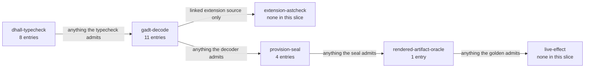

# Illegal States — Storage

> **Purpose**: The themed slice of the illegal-state catalog covering durable storage, bounded backing, and
> Pulsar retention — the states a valid `InForceSpec` cannot represent for how data is stored, sized, and
> retained.
> **Read this if**: a volume, backing, or retention state has to be shown impossible to express.

Storage carries the entries where the cost of being wrong is unrecoverable, so several are foreclosed twice —
once in the type and again by a total check before any effect. The enumeration's numbering is held by
[illegal_state_catalog.md](./illegal_state_catalog.md); the lifetimes these entries protect are owned by
[storage_lifecycle_doctrine.md](../engineering/storage_lifecycle_doctrine.md).

Link-graph metadata

**Status**: Authoritative source
**Supersedes**: N/A
**Referenced by**: DEVELOPMENT_PLAN/later_phases.md, DEVELOPMENT_PLAN/phase_00_documentation_suite.md, DEVELOPMENT_PLAN/phase_25_dhall_schema_generation.md, DEVELOPMENT_PLAN/phase_27_illegal_state_covering.md, DEVELOPMENT_PLAN/phase_09_resource_index.md, DEVELOPMENT_PLAN/phase_28_storage_geometry_folds.md, DEVELOPMENT_PLAN/phase_29_execution_accelerator_folds.md, documents/engineering/backup_recovery_doctrine.md, documents/engineering/content_addressing_doctrine.md, documents/engineering/extension_conformance_transactions.md, documents/engineering/monitoring_doctrine.md, documents/engineering/pulsar_client_doctrine.md, documents/engineering/readiness_ordering_doctrine.md, documents/engineering/resource_capacity_doctrine.md, documents/engineering/resource_capacity_storage.md, documents/engineering/storage_lifecycle_doctrine.md, documents/illegal_state/README.md, documents/illegal_state/illegal_state_catalog.md, documents/illegal_state/illegal_state_lifecycle.md, documents/illegal_state/illegal_state_ml_asset.md, documents/illegal_state/illegal_state_techniques.md, documents/illegal_state/illegal_state_topology.md
**Generated sections**: none

## Contents
- [1. Scope](#1-scope)
- [2. The storage illegal states](#2-the-storage-illegal-states)
- [3. The backup & recovery illegal states](#3-the-backup--recovery-illegal-states)
- [Related Documents](#related-documents)

---

*Orientation. Design intent. Where this slice's entries are caught, counted from the primary `**Validation-locus:**` of each entry below; an entry may also name a secondary locus, which this count does not show. Storage is the largest slice and the one caught earliest, with 79 per cent foreclosed before any provisioning fold runs. The axis itself is owned by [illegal_state_techniques.md §6.1](./illegal_state_techniques.md#61-the-validation-locus-axis--where-each-illegal-state-is-caught-orthogonal-to-the-foreclosure-layer).*

## 1. Scope

This document is a **themed slice** of the illegal-state catalog: the durable-storage, bounded-backing, and
Pulsar-retention entries, faithfully reproduced with their original numbers and headings so inbound links
stay stable. It is not self-contained framing — it owns only the deep treatment of its entries.

- The **catalog index** (which states are illegal, the full [§3](#3-the-backup--recovery-illegal-states).x list) and the **honesty limit** (a type-check proves the *spec composes*, not that the *running cluster enforces it*) are owned by
  [`illegal_state_catalog.md`](./illegal_state_catalog.md) — referenced here, not restated.
- The **nine typing techniques** ([§4](./illegal_state_techniques.md#4-the-typing-techniques)), the **coverage matrix** ([§5](./illegal_state_techniques.md#5-coverage-matrix--which-technique-forecloses-which-illegal-state)), the **three-layer foreclosure**
  ([§6](./illegal_state_techniques.md#6-three-layers-of-foreclosure-and-the-honesty-they-force)), and the **validation-locus axis**, whose members [`illegal_state_techniques.md` §6.1](./illegal_state_techniques.md#61-the-validation-locus-axis--where-each-illegal-state-is-caught-orthogonal-to-the-foreclosure-layer) declares and this slice does not restate, are owned by
  [`illegal_state_techniques.md`](./illegal_state_techniques.md) — referenced here, not restated.

Everything below is **design intent** (per [`illegal_state_techniques.md` §6](./illegal_state_techniques.md#6-three-layers-of-foreclosure-and-the-honesty-they-force)):
the catalog-owned honesty limit, instantiated for storage — a type-check proves the spec composes into
something internally coherent; it does **not** prove the running
cluster's PVC is bound, its disk is unfilled, or its bookies are healthy. Each entry names a **Layer** (the
foreclosure layer, from [`illegal_state_techniques.md`](./illegal_state_techniques.md) [§6](./illegal_state_techniques.md#6-three-layers-of-foreclosure-and-the-honesty-they-force)) and a
**Validation-locus** (the new orthogonal axis — where authoring/decoding/provisioning/rendering/runtime catches it).

---

## 2. The storage illegal states

### 3.1 Bad / illegal durable storage

**Delivery-owner:** `Phase-60`

**Case-family:** `storage`

Raw k8s permits mixing arbitrary storage classes, dynamic provisioners, and unsized claims, so "durable"
data can quietly live on an ephemeral, auto-provisioned volume that vanishes with the node. amoebius admits
**only** `no-provisioner`, explicitly-sized, retained PVs — the dynamic-provisioner
path, the unsized claim, and the un-selected default storage class are simply not constructible.
**Owner:** [`storage_lifecycle_doctrine.md`](../engineering/storage_lifecycle_doctrine.md). **Technique:** [§4.1](./illegal_state_techniques.md#41-pvcpv-binding-by-construction)
(PVC↔PV binding by construction) + refined non-zero sizes.
**Layer:** type-foreclosed — the dynamic-provisioner path, the unsized claim, and the un-selected default class have no constructor at the Dhall layer; runtime-checked residue — that the retained PV actually binds at reconcile.
**Validation-locus:** `dhall-typecheck` (the dynamic-provisioner path, the unsized claim, and the un-selected
default class are non-constructible — required-field / no-arm shapes that fail `dhall type` at authoring) +
`live-effect` residue (that the retained PV actually binds at reconcile, owned by the runtime-enforcement proof).

### 3.2 PVCs that don't bind PVs

**Delivery-owner:** `Phase-27`

**Case-family:** `storage`

The canonical k8s silent-failure hazard: a StatefulSet's `volumeClaimTemplate` and the cluster's PVs are two independent
objects that bind only if their sizes, access modes, and selectors happen to match — and a typo means a pod
hangs in `Pending` forever. amoebius removes the independence: there is no way to declare a claim *without*
its exactly-matching PV ([§4.1](./illegal_state_techniques.md#41-pvcpv-binding-by-construction)). The mismatched pair has no inhabitant. **Owner:**
[`storage_lifecycle_doctrine.md`](../engineering/storage_lifecycle_doctrine.md). **Technique:** [§4.1](./illegal_state_techniques.md#41-pvcpv-binding-by-construction).
**Layer:** type-foreclosed at the Haskell IR — a bare PVC or free-floating PV has no constructor once decoded — with its concrete rejection stage at gadt-decode, since Dhall has no opaque types; runtime-checked residue — that the PVC actually binds its PV.
**Validation-locus:** `gadt-decode` (the exactly-matching-PV pairing is a Haskell smart-constructor / GADT
discipline whose teeth Dhall cannot hold — Dhall has no opaque types to hide the raw claim and PV record
constructors ([`illegal_state_techniques.md` §6](./illegal_state_techniques.md#6-three-layers-of-foreclosure-and-the-honesty-they-force)), so the mismatched pair is a compile-fail
golden pinned at Phase 27, not a `dhall type` failure at authoring) + `live-effect` residue (that the running
PVC actually binds its PV at reconcile, owned by the runtime-enforcement proof).

### 3.18 Unbounded storage anywhere

**Delivery-owner:** `Phase-25`

**Case-family:** `storage`

Raw k8s lets a volume grow until it fills the disk; "unbounded" is the default. amoebius admits storage that
is **either** host-level (bounded by a physical disk) **or** cloud (bounded by a quota) — the closed
`StorageBacking` union has **no unbounded arm**, so unbounded storage has no syntax, and the aggregate
`Σ(PV provisionedBytes) ≤ backing` fold bounds the final raw claim plan. Logical BookKeeper/MinIO demand is
first expanded through replication/erasure/recovery/healing/orphan headroom, then
`VolumePresentation` overhead, backing/provider minimum+quantum, and uniform StatefulSet claim rounding; a
logical-byte sum is not that plan. **Owner:**
[`storage_lifecycle_doctrine.md` §5.2](../engineering/storage_lifecycle_doctrine.md#52-the-storage-backing-is-bounded--the-closed-storagebacking-union) (the union shape) +
[`resource_capacity_doctrine.md`](../engineering/resource_capacity_doctrine.md) (the aggregate). **Technique:** [§4.2](./illegal_state_techniques.md#42-capability-and-phantom-tenant-tags--cross-tenant-refs-are-uninhabitable)
(closed `StorageBacking` union — type-foreclosed) + [§4.6](./illegal_state_techniques.md#46-capacity-accounting--placement-witness-compute-and-summed-demand-within-capacity-storage-checked) (aggregate backing fold — decode-foreclosed). **Layer:** decode-foreclosed aggregate;
the union shape is type-foreclosed.
**Validation-locus:** `dhall-typecheck` (the closed `StorageBacking` union with no unbounded arm fails
`dhall type` at authoring) + `provision-seal` (the post-bind aggregate `Σ(sizes) ≤ backing` fold returns a
`ProvisionError` before any `ProvisionedSpec` exists).

### 3.19 An application consuming more storage than its backing (MinIO and Pulsar)

**Delivery-owner:** `Phase-28`

**Case-family:** `storage`

Even with each volume bounded, an app's logical object usage or a topic's retained hot bytes can expand past
the physical backing. amoebius derives **per-bookie** BookKeeper write-quorum/recovery demand and
**per-drive** MinIO erasure/healing/metadata usable demand, includes bounded concurrent writes and failed-write
orphans until a positive GC horizon, applies block/filesystem overhead and backing/provider allocation
quantum, and rounds each StatefulSet claim-template group to its maximum provisioned size before folding raw
claims against `StorageBacking`. Provider S3 uses its explicitly declared
logical/billed quota instead of invented internal geometry. "Unbounded" is representable only through a
`Growable` scaling policy whose ceiling is itself a quota ([§3.21](#321-capacity-growth-without-an-amoebius-owned-scaling-policy)). **Owner:**
[`resource_capacity_doctrine.md`](../engineering/resource_capacity_doctrine.md) +
[`content_addressing_doctrine.md`](../engineering/content_addressing_doctrine.md) (the MinIO store) +
[`pulsar_client_doctrine.md`](../engineering/pulsar_client_doctrine.md) (topic retention). **Technique:** [§4.6](./illegal_state_techniques.md#46-capacity-accounting--placement-witness-compute-and-summed-demand-within-capacity-storage-checked)
(logical→physical per-backing placement fold) + [§4.2](./illegal_state_techniques.md#42-capability-and-phantom-tenant-tags--cross-tenant-refs-are-uninhabitable) (the `Growable` arm gates unboundedness). **Layer:** decode-foreclosed.
**Validation-locus:** `provision-seal` (logical-fit/usable-or-raw overflow, dropped recovery/healing scenario,
orphan horizon, presentation/quantum, and uniform-claim-skew cases return a `ProvisionError` after binding and
before any `ProvisionedSpec` exists) +
`dhall-typecheck` (the `Growable` arm that gates
unboundedness is a closed union checked at authoring).

### 3.20 A Pulsar topic without a bounded / tiered / retained lifecycle

**Delivery-owner:** `Phase-25`

**Case-family:** `storage`

Raw Pulsar lets a topic keep bytes forever, or offload on a **time-only** trigger that never bounds the hot
tier — so if ingest outpaces the offload lag, BookKeeper fills, bookies go read-only, and the topic (often
the broker) goes **unavailable**. amoebius makes a topic's `RetentionPolicy` a **mandatory, non-optional**
field with a **mandatory size-triggered S3 offload** (time may offload *sooner* for cost but is never the
sole trigger — a time-only policy is uninhabitable), and folds two ceilings: the hot-tier cap **plus required open-ledger/in-flight/deletion headroom** through BookKeeper write-quorum placement and every derived
re-replication scenario against each bookie backing (the availability fit), and the retained total against the offload
target (the durability fit). A mandatory backlog quota is the runtime fail-safe. **Owner:**
[`pulsar_client_doctrine.md` §6](../engineering/pulsar_client_doctrine.md#6-the-declarative-topology-algebra) (the policy shape) + [`resource_capacity_doctrine.md`](../engineering/resource_capacity_doctrine.md) (the two-ceiling fold).
**Technique:** [§4.1](./illegal_state_techniques.md#41-pvcpv-binding-by-construction) (mandatory `RetentionPolicy` + mandatory size offload — no forever-local arm) + [§4.6](./illegal_state_techniques.md#46-capacity-accounting--placement-witness-compute-and-summed-demand-within-capacity-storage-checked)
(retention-budget room-fit). **Layer:** type-foreclosed for the mandatory shape; decode-foreclosed for both room-fits; runtime-checked residue
— the burst back-pressure actually holding.
**Validation-locus:** `dhall-typecheck` (the mandatory `RetentionPolicy` with a mandatory size-triggered
offload — no forever-local / time-only arm — fails `dhall type` at authoring) + `provision-seal` (both
room-fit ceilings, the availability fit and the durability fit, are post-bind provision folds that return a
`ProvisionError` before any `ProvisionedSpec` exists) + `live-effect`
residue (the burst back-pressure and backlog quota actually holding at runtime).

### 3.21 Capacity growth without an amoebius-owned scaling policy

**Delivery-owner:** `Phase-25`

**Case-family:** `storage`

An unbounded autoscaling ceiling is how a bounded budget becomes unbounded. amoebius makes growth
representable **only** through a `Growable = Bounded | Autoscaled ScalingPolicy` union with **no bare-unbounded arm**: the sole path past a fixed cap carries a typed `ScalingPolicy` (capacity thresholds,
instance price-shopping, a quota cap), and amoebius owns that logic. The fold re-runs against the grown bound,
so "unbounded" storage/compute exists only behind a policy whose ceiling is a quota. **Owner:**
[`resource_capacity_doctrine.md`](../engineering/resource_capacity_doctrine.md) (with enaction owned by [`cluster_lifecycle_doctrine.md` §8](../engineering/cluster_lifecycle_doctrine.md#8-dynamic-node-provisioning) and [`pulumi_iac_doctrine.md` §4](../engineering/pulumi_iac_doctrine.md#4-what-pulumi-provisions-the-resource-catalog)).
**Technique:** [§4.2](./illegal_state_techniques.md#42-capability-and-phantom-tenant-tags--cross-tenant-refs-are-uninhabitable) (closed `Growable` union, no unbounded arm). **Layer:** type-foreclosed representation; runtime-checked that
the autoscaler actually grows capacity and the cloud honors the quota.
**Validation-locus:** `dhall-typecheck` (the closed `Growable = Bounded | Autoscaled ScalingPolicy` union with
no bare-unbounded arm fails `dhall type` at authoring) + `live-effect` residue (that the autoscaler actually
grows capacity and the cloud honors the quota).

---

## 3. The backup & recovery illegal states

These entries are owned by [`backup_recovery_doctrine.md`](../engineering/backup_recovery_doctrine.md). A
backup is a bounded, put-only, verified-before-it-counts copy in a distinct failure domain; the states below
are the "looks like a backup but is unsafe" shapes a valid `InForceSpec` cannot represent. The gateway
cold-seed entries live in the multi-cluster slice ([§3.69](./illegal_state_multicluster.md#369-a-cold-seeded-secondary-taking-the-gateway-without-proven-freshness)–[§3.71](./illegal_state_multicluster.md#371-a-freshness-watermark-asserted-rather-than-derived-from-captured-content)).

### 3.53 A backup larger than its bounded medium

**Delivery-owner:** `Phase-28`

**Case-family:** `storage`

A backup that writes more bytes than its target medium holds is the storage-overcommit hazard displaced onto
the backup destination. amoebius folds the projected working set, the copy/verify Job workspace, and the full
bounded retained generation set against the medium's `StorageBacking` before any `ProvisionedSpec` exists; one
byte short returns a `ProvisionError` and cannot render. Under `AppendOnly`, generations cannot be deleted to
reclaim space, so `cadence × window` bytes must fit the bounded quota or declare a `Growable` whose ceiling is
itself a quota. **Owner:** [`backup_recovery_doctrine.md` §5](../engineering/backup_recovery_doctrine.md#5-sizing-and-the-no-overcommit-fold)
(fold owned by [`resource_capacity_doctrine.md`](../engineering/resource_capacity_doctrine.md)). **Technique:**
[§4.6](./illegal_state_techniques.md#46-capacity-accounting--placement-witness-compute-and-summed-demand-within-capacity-storage-checked)
(summed demand within capacity). **Layer:** decode-foreclosed (a checked rejection of constructible values;
Dhall has no dependent arithmetic). **Validation-locus:** `provision-seal` + `live-effect` residue (that the
medium physically caps bytes at runtime).

### 3.54 Deleting a backup in an append-only system

**Delivery-owner:** `Phase-34`

**Case-family:** `backup`

An `AppendOnly` backup medium is write-once; a verb that deleted or overwrote an existing generation would
break the WORM guarantee the regime exists to provide. The backup surface exposes no delete/overwrite verb at
all — the closed-union / no-arm shape that gives the `StorageMutation` surface no `Delete` arm — so
"delete this backup" has no inhabitant, and the medium's object-lock enforces the same within its lock window.
**Owner:** [`backup_recovery_doctrine.md` §4](../engineering/backup_recovery_doctrine.md#4-the-write-but-never-delete-credential-boundary).
**Technique:** [§4.2](./illegal_state_techniques.md#42-capability-and-phantom-tenant-tags--cross-tenant-refs-are-uninhabitable)
(closed union, no delete arm) + [§4.3](./illegal_state_techniques.md#43-gadt-indexed-state-machines--only-legal-transitions-are-typed).
**Layer:** type-foreclosed representation + runtime-enforced object-lock. **Validation-locus:** `dhall-typecheck`
+ `live-effect` residue (that the medium honors WORM).

### 3.55 amoebius holding a credential that can delete a backup

**Delivery-owner:** `Phase-34`

**Case-family:** `backup`

Retention and deletion of backups are out of band; amoebius must never authenticate as an actor that can
delete one. The write credential is a `CloudAccountMutationCapability` whose `allowedActions` is a closed
put-only record — there is no field into which a `DeleteObject`/`ExpireObject`/`PutBucketLifecycle` action
could be placed — so a delete-capable backup credential is not constructible, mirroring the create-but-not-
delete durable-storage boundary. **Owner:** [`backup_recovery_doctrine.md` §4](../engineering/backup_recovery_doctrine.md#4-the-write-but-never-delete-credential-boundary)
(credential classes owned by [`pulumi_ebs_credential_model.md` §6](../engineering/pulumi_ebs_credential_model.md#6-the-ebs-create-vs-delete-credential-model)).
**Technique:** [§4.6](./illegal_state_techniques.md#46-capacity-accounting--placement-witness-compute-and-summed-demand-within-capacity-storage-checked)
(scoped mutation capability). **Layer:** decode-foreclosed credential shape + runtime-enforced at the cloud
API. **Validation-locus:** `gadt-decode` + `live-effect` residue (that the cloud account actually denies
delete).

### 3.56 Automatically recovering from a manual air-gapped medium

**Delivery-owner:** `Phase-34`

**Case-family:** `backup`

An air-gapped medium whose `handling = Manual` requires a human to physically load media before it can be
read; an unattended reconcile that "restored automatically" would either hang or act on absent media. Obtaining
the `MediumOnline` restore phase for a `Manual` medium is possible only through a `MediaLoadedWitness` that a
recorded human action mints; no constructor manufactures it automatically, so automatic recovery from a manual
air-gap medium has no inhabitant. **Owner:** [`backup_recovery_doctrine.md` §7](../engineering/backup_recovery_doctrine.md#7-recovery-restore-seeds-a-fresh-coordinate).
**Technique:** [§4.2](./illegal_state_techniques.md#42-capability-and-phantom-tenant-tags--cross-tenant-refs-are-uninhabitable)
(phantom `Handling` index) + [§4.3](./illegal_state_techniques.md#43-gadt-indexed-state-machines--only-legal-transitions-are-typed)
(phase-gated restore). **Layer:** type-foreclosed transition. **Validation-locus:** `gadt-decode`.

### 3.57 A restore that overwrites live durable bytes

**Delivery-owner:** `Phase-34`

**Case-family:** `backup`

A restore that wrote into an occupied durable coordinate would be a data-destruction verb by another name,
and would contradict the no-destruction contract. Restore only ever targets a fresh (empty) coordinate — a
new backing or a newly stood-up cluster's backing — and there is no constructor for restore-into-occupied-
backing, so restore can never denote "overwrite these bytes." This is also why restore does not contradict the
retained-rebind guarantee: rebind reattaches bytes that were never deleted; restore populates a coordinate that
is empty because its backing was lost. **Owner:** [`backup_recovery_doctrine.md` §7](../engineering/backup_recovery_doctrine.md#7-recovery-restore-seeds-a-fresh-coordinate)
(no-destruction verb union owned by [`inforcespec_migration_doctrine.md` §3](../engineering/inforcespec_migration_doctrine.md#3-the-dsl-exposes-no-destructive-verb--the-closed-storagemutation-union)).
**Technique:** [§4.1](./illegal_state_techniques.md#41-pvcpv-binding-by-construction) + [§4.3](./illegal_state_techniques.md#43-gadt-indexed-state-machines--only-legal-transitions-are-typed).
**Layer:** type-foreclosed. **Validation-locus:** `gadt-decode`.

### 3.58 Unbounded backup history

**Delivery-owner:** `Phase-34`

**Case-family:** `backup`

Keeping every backup indefinitely is how a bounded medium becomes unbounded storage. `BackupRetention` is a
closed `KeepN | KeepWindow | Growable` union with no keep-forever arm, so backup history is bounded by the same
discipline the Pulsar retention surface uses; the only path past a fixed bound is a `Growable` whose ceiling is
a quota. **Owner:** [`backup_recovery_doctrine.md` §2](../engineering/backup_recovery_doctrine.md#2-the-backup-surface--a-closed-backuppolicy-deployment-rule).
**Technique:** [§4.2](./illegal_state_techniques.md#42-capability-and-phantom-tenant-tags--cross-tenant-refs-are-uninhabitable)
(closed union, no unbounded arm). **Layer:** type-foreclosed. **Validation-locus:** `dhall-typecheck`.

### 3.59 A backup in the same failure domain as its source

**Delivery-owner:** `Phase-34`

**Case-family:** `backup`

A "remote" backup whose backing resolves to the same host disk, cluster, EBS availability zone, or cloud
account as the data it protects is not a backup — the event that destroys the source destroys the copy. The
decoder folds the medium's `FailureDomain` against the source's and rejects a shared domain, the same
distinctness technique that rejects a cluster reused as active and standby in the gateway migration graph.
**Owner:** [`backup_recovery_doctrine.md` §3](../engineering/backup_recovery_doctrine.md#3-the-three-strategies).
**Technique:** [§4.4](./illegal_state_techniques.md#44-ownership-indices--single-owner-ssot-structurally)
(distinctness fold) + [§4.7](./illegal_state_techniques.md#47-compatibility--topology-relations-by-construction-over-a-collection).
**Layer:** decode-foreclosed. **Validation-locus:** `gadt-decode`.

### 3.60 Backup bytes double-counted as live durable capacity

**Delivery-owner:** `Phase-28`

**Case-family:** `storage`

A plan that let the same physical bytes satisfy both the live-data budget and the backup budget could appear
to fit when it does not. The backup medium is a distinct `StorageBacking`, disjoint from the source's durable
backing and from node ephemeral/cache pools, so the capacity fold cannot spend one pool's bytes twice.
**Owner:** [`backup_recovery_doctrine.md` §5](../engineering/backup_recovery_doctrine.md#5-sizing-and-the-no-overcommit-fold)
(disjoint-pool rule owned by [`storage_lifecycle_doctrine.md` §5.2](../engineering/storage_lifecycle_doctrine.md#52-the-storage-backing-is-bounded--the-closed-storagebacking-union)).
**Technique:** [§4.6](./illegal_state_techniques.md#46-capacity-accounting--placement-witness-compute-and-summed-demand-within-capacity-storage-checked)
(named-pool disjointness). **Layer:** decode-foreclosed. **Validation-locus:** `provision-seal`.

### 3.61 A plaintext backup at rest

**Delivery-owner:** `Phase-33`

**Case-family:** `backup`

A backup of durable data written unencrypted to a medium — especially one that leaves the trust boundary —
exposes secrets and content at rest, the same hazard as a plaintext spec at rest ([§3.9](./illegal_state_security.md#39-a-plaintext-spec-at-rest)).
A backup is written Vault-Transit-enveloped like the control-plane state object, its key a `SecretRef` and
never inline; a constructor that emitted plaintext bytes to the medium has no inhabitant. **Owner:**
[`backup_recovery_doctrine.md` §4](../engineering/backup_recovery_doctrine.md#4-the-write-but-never-delete-credential-boundary)
(envelope owned by [`vault_pki_doctrine.md` §3](../engineering/vault_pki_doctrine.md#3-the-secretref-contract-a-name-never-a-value)).
**Technique:** [§4.5](./illegal_state_techniques.md#45-content-address-totality--names-are-total-functions-of-content)
(envelope handle). **Layer:** decode-foreclosed handle + runtime decrypt-in-process. **Validation-locus:**
`rendered-artifact-oracle` + `live-effect`.

### 3.62 A backup whose decryption key is escrowed only in the domain it protects

**Delivery-owner:** `Phase-34`

**Case-family:** `backup`

A backup of Vault (or of secrets) whose only decryption key lives in the very coordinate the backup would
restore is a self-defeating loop: the disaster that requires the restore also destroys the key. The restore
path requires a key-availability witness independent of the restored coordinate; the human-gated,
password-encrypted unseal path supplies it for the Vault-seed case. **Owner:** [`backup_recovery_doctrine.md` §4](../engineering/backup_recovery_doctrine.md#4-the-write-but-never-delete-credential-boundary)
(unseal owned by [`vault_pki_doctrine.md`](../engineering/vault_pki_doctrine.md)). **Technique:**
[§4.4](./illegal_state_techniques.md#44-ownership-indices--single-owner-ssot-structurally) (independence witness).
**Layer:** decode-foreclosed structural half + `assumed` key-independence premise, stated honestly.
**Validation-locus:** `gadt-decode` + `live-effect` residue.

### 3.63 A restore from an unverified backup artifact

**Delivery-owner:** `Phase-34`

**Case-family:** `backup`

Seeding from a backup that never proved its own integrity would silently propagate a corrupt or partial copy.
A restore constructor demands a `BackupArtifact 'Verified`; a backup whose copy did not verify emits no such
artifact, fails loud, and is never a valid restore source — the same `.ready`-gated discipline as the ML
`ArtifactRef` and the verified-shrink `ReclaimEligible`. **Owner:** [`backup_recovery_doctrine.md` §6](../engineering/backup_recovery_doctrine.md#6-the-verified-content-addressed-backupartifact).
**Technique:** [§4.3](./illegal_state_techniques.md#43-gadt-indexed-state-machines--only-legal-transitions-are-typed)
(phase-indexed artifact). **Layer:** type-foreclosed (the unverified artifact has no restore constructor) +
`live-effect` residue (that the verified bytes actually match). **Validation-locus:** `gadt-decode` +
`live-effect`.

### 3.64 A cross-tenant or re-tagged backup or restore

**Delivery-owner:** `Phase-34`

**Case-family:** `backup`

Restoring one tenant's backup into another, or re-tagging a backup's owning identity, would let a spec reach a
foreign tenant's data. A backup's `source` is a phantom-tagged `Ref tenant DurableCoordinate`, and there is no
`Ref t1 → Ref t2` coercion, so a cross-tenant backup or restore has no inhabitant; sharing a backup is the
append-only revocable capability edge, never a re-tag. **Owner:** [`backup_recovery_doctrine.md` §6](../engineering/backup_recovery_doctrine.md#6-the-verified-content-addressed-backupartifact)
(tenant tag owned by [`vault_pki_doctrine.md`](../engineering/vault_pki_doctrine.md), sharing edge by [`inforcespec_migration_doctrine.md` §7](../engineering/inforcespec_migration_doctrine.md#7-sanctioned-sharing-is-an-append-only-revocable-capability-edge)).
**Technique:** [§4.2](./illegal_state_techniques.md#42-capability-and-phantom-tenant-tags--cross-tenant-refs-are-uninhabitable)
(phantom tenant tags). **Layer:** type-foreclosed. **Validation-locus:** `gadt-decode`.

### 3.65 An air-gapped medium carrying a live network credential

**Delivery-owner:** `Phase-34`

**Case-family:** `backup`

An "air-gapped" medium that is actually reachable over the network is a contradiction — it is not air-gapped.
The `AirGapMedia` arm carries no credential field; only `RemoteObjectStore` does, so a network-reachable
air-gap medium has no inhabitant, and egress to and ingress from air-gap media is a witnessed handoff rather
than a live credential. **Owner:** [`backup_recovery_doctrine.md` §3](../engineering/backup_recovery_doctrine.md#3-the-three-strategies).
**Technique:** [§4.2](./illegal_state_techniques.md#42-capability-and-phantom-tenant-tags--cross-tenant-refs-are-uninhabitable)
(closed union, arm without a credential field). **Layer:** type-foreclosed. **Validation-locus:** `dhall-typecheck`.

### 3.66 Retention lowered below the currently-retained generations on an append-only medium

**Delivery-owner:** `Phase-34`

**Case-family:** `backup`

Lowering a backup's retention below what is already retained on an append-only medium cannot be honored:
amoebius holds no delete authority, so it cannot expire the excess generations to comply. A `dhall update`
whose new retention floor falls below the currently-retained span is rejected, the same retention-floor fold
that rejects shrinking a topic's retention below its live data. **Owner:** [`backup_recovery_doctrine.md` §4](../engineering/backup_recovery_doctrine.md#4-the-write-but-never-delete-credential-boundary)
(retention-floor fold owned by [`inforcespec_migration_doctrine.md` §5](../engineering/inforcespec_migration_doctrine.md#5-the-decode-time-no-orphan-fold)).
**Technique:** [§4.4](./illegal_state_techniques.md#44-ownership-indices--single-owner-ssot-structurally)
(diff-over-a-collection fold). **Layer:** decode-foreclosed structural half + `live-effect` retained-state
probe. **Validation-locus:** `gadt-decode` + `live-effect`.

### 3.67 A restore into a target smaller than or presentation-incompatible with the backup extent

**Delivery-owner:** `Phase-28`

**Case-family:** `storage`

A restore into a coordinate too small for the backed-up bytes, or of the wrong presentation (a Block backup
into a Filesystem target), would truncate or fail mid-restore. The seed target is created new, sized from the
artifact's witnessed extent, and its presentation is proven compatible before any bytes are written; an
under-sized or presentation-mismatched restore is rejected before render. **Owner:** [`backup_recovery_doctrine.md` §7](../engineering/backup_recovery_doctrine.md#7-recovery-restore-seeds-a-fresh-coordinate)
(sizing owned by [`resource_capacity_doctrine.md`](../engineering/resource_capacity_doctrine.md)). **Technique:**
[§4.6](./illegal_state_techniques.md#46-capacity-accounting--placement-witness-compute-and-summed-demand-within-capacity-storage-checked)
+ [§4.1](./illegal_state_techniques.md#41-pvcpv-binding-by-construction). **Layer:** decode-foreclosed.
**Validation-locus:** `provision-seal`.

### 3.68 Two conflicting backup policies on one coordinate

**Delivery-owner:** `Phase-34`

**Case-family:** `backup`

Two backup policies on one durable coordinate — for example one `AppendOnly` and one `RetainManaged` — would
give a single datum two owners of its backup regime, and the single-source-of-truth would rot. A coordinate has
exactly one `BackupPolicy` owner under a total ownership-index fold; a double-claim is a decode-time rejection.
**Owner:** [`backup_recovery_doctrine.md` §2](../engineering/backup_recovery_doctrine.md#2-the-backup-surface--a-closed-backuppolicy-deployment-rule).
**Technique:** [§4.4](./illegal_state_techniques.md#44-ownership-indices--single-owner-ssot-structurally)
(single-owner ownership index). **Layer:** decode-foreclosed. **Validation-locus:** `gadt-decode`.

### 3.85 A spec verb that destroys durable bytes

**Delivery-owner:** `Phase-34`

**Case-family:** `storage`

Every imperative infrastructure surface offers the destructive verb directly — `DROP`, `TRUNCATE`,
`kubectl delete pvc`, a lifecycle rule that expires objects — so "no data loss" rests on the migration
author's discipline and on review. amoebius removes the verb instead of guarding it: the only mutations a
spec may author over an existing durable coordinate (a PV, a bucket, a topic, a schema, a registry backend)
live in a closed `StorageMutation = Retain | Offload | Grow | Shrink` union with no `Delete`/`Drop`/`Erase`/
`Truncate` arm, and `Shrink` is *defined* as the verified create-new → migrate → retire-old pipeline rather
than a truncation. "Discard these bytes" therefore has no syntax and no inhabitant anywhere the spec can
reach; physical reclaim of a retired backing is an external privileged operator act, outside the spec and
outside every reconciler.
**Owner:** [`inforcespec_migration_doctrine.md` §3](../engineering/inforcespec_migration_doctrine.md#3-the-dsl-exposes-no-destructive-verb--the-closed-storagemutation-union)
(the verb union) + [`storage_lifecycle_doctrine.md` §7](../engineering/storage_lifecycle_doctrine.md#7-deleting-durable-data-is-forbidden-under-normal-operation)
(the posture the arms preserve) + [`migration_doctrine.md` §2](../engineering/migration_doctrine.md#2-the-law)
(the general law's clause 2).
**Technique:** [§4.2](./illegal_state_techniques.md#42-capability-and-phantom-tenant-tags--cross-tenant-refs-are-uninhabitable)
(closed union with the arm absent).
**Layer:** type-foreclosed for the absent arm — no `.dhall` value denotes destruction; runtime-checked residue
— that the verified copy's bytes match and that the retired backing is still intact are observations, not
type facts.
**Validation-locus:** `dhall-typecheck` (a `Delete`/`Truncate` constructor does not exist, so the value fails
`dhall type` at authoring time) + `live-effect` residue (copy equivalence and the non-destructive retirement
transition). Per the validation-locus axis of [`illegal_state_techniques.md`](./illegal_state_techniques.md),
orthogonal to the foreclosure layer above.

### 3.86 A new generation that orphans a retained coordinate

**Delivery-owner:** `Phase-71`

**Case-family:** `storage`

Removing the destructive verb ([§3.85](#385-a-spec-verb-that-destroys-durable-bytes)) leaves one way to
destroy data by **omission**: upload a generation that simply stops naming a retained volume, bucket, topic,
or schema the prior generation named. Nothing in either generation's *type* is wrong, and Dhall cannot compare
two whole specs, so this residue is caught by a decode-time fold over the old→new diff. A `dhall update` is
rejected when the diff drops a retained coordinate with no data-preserving disposition — a `Retain`, an
`Offload`, or a `Shrink` carrying its verified-migrate — and likewise when it contracts a retention span below
the currently-retained span without an offload-first phase. A silent drop is not a value the update accepts.
**Owner:** [`inforcespec_migration_doctrine.md` §5](../engineering/inforcespec_migration_doctrine.md#5-the-decode-time-no-orphan-fold).
**Technique:** [§4.7](./illegal_state_techniques.md#47-compatibility--topology-relations-by-construction-over-a-collection)
(a relation over the two generations' coordinate collections, which per that section degrades to a
decode-foreclosed fold and is never type-foreclosed) + [§4.4](./illegal_state_techniques.md#44-ownership-indices--single-owner-ssot-structurally)
(the coordinate identity the fold joins on).
**Layer:** decode-foreclosed for the structural half — the diff either carries a disposition for every dropped
coordinate or returns `Left`; runtime-checked for the hybrid half — whether a dropped coordinate still holds
live data may require consulting live retained state, and that half is never reported as a compile-time
impossibility.
**Validation-locus:** `gadt-decode` (the old→new orphan and retention-floor folds return `Left` at decode)
+ `live-effect` residue (the retained-state consultation). Per the validation-locus axis of
[`illegal_state_techniques.md`](./illegal_state_techniques.md), orthogonal to the foreclosure layer above.

---

## Related Documents
- [`illegal_state_catalog.md`](./illegal_state_catalog.md) — the authoritative catalog index (the full [§3](./illegal_state_catalog.md#3-the-catalog--states-a-valid-spec-cannot-represent).x list) and the load-bearing honesty limit (a type-check proves the spec composes, not that the cluster enforces it); this document is the storage slice carved from it.
- [`illegal_state_techniques.md`](./illegal_state_techniques.md) — the nine typing techniques ([§4](./illegal_state_techniques.md#4-the-typing-techniques)), the
  coverage matrix ([§5](./illegal_state_techniques.md#5-coverage-matrix--which-technique-forecloses-which-illegal-state)), the three-layer foreclosure ([§6](./illegal_state_techniques.md#6-three-layers-of-foreclosure-and-the-honesty-they-force)), and the validation-locus axis referenced by every
  entry above.
- [`dsl_doctrine.md`](../engineering/dsl_doctrine.md) — the DSL surface and the contract that a valid `InForceSpec`
  cannot represent illegal state.
- [`storage_lifecycle_doctrine.md`](../engineering/storage_lifecycle_doctrine.md) — owner of the no-provisioner /
  explicitly-sized / retained-PV rule and the PVC↔PV binding-by-construction discipline ([§3.1](#31-bad--illegal-durable-storage), [§3.2](#32-pvcs-that-dont-bind-pvs)),
  and the closed `StorageBacking` union shape ([§3.18](#318-unbounded-storage-anywhere)).
- [`resource_capacity_doctrine.md`](../engineering/resource_capacity_doctrine.md) — owner of the aggregate `Σ ≤ backing`
  capacity-accounting folds and the `Growable` scaling-policy discipline ([§3.18](#318-unbounded-storage-anywhere), [§3.19](#319-an-application-consuming-more-storage-than-its-backing-minio-and-pulsar), [§3.20](#320-a-pulsar-topic-without-a-bounded--tiered--retained-lifecycle), [§3.21](#321-capacity-growth-without-an-amoebius-owned-scaling-policy)).
- [`content_addressing_doctrine.md`](../engineering/content_addressing_doctrine.md) — owner of the MinIO content store
  whose per-bucket usage the storage fold sums ([§3.19](#319-an-application-consuming-more-storage-than-its-backing-minio-and-pulsar)).
- [`pulsar_client_doctrine.md`](../engineering/pulsar_client_doctrine.md) — owner of topic retention and the
  `RetentionPolicy` shape with its mandatory size-triggered offload ([§3.19](#319-an-application-consuming-more-storage-than-its-backing-minio-and-pulsar), [§3.20](#320-a-pulsar-topic-without-a-bounded--tiered--retained-lifecycle)).
- [`cluster_lifecycle_doctrine.md`](../engineering/cluster_lifecycle_doctrine.md) and
  [`pulumi_iac_doctrine.md`](../engineering/pulumi_iac_doctrine.md) — owners of the enaction of a `ScalingPolicy` (dynamic node provisioning, the provisioned resource catalog) that [§3.21](#321-capacity-growth-without-an-amoebius-owned-scaling-policy) gates.
