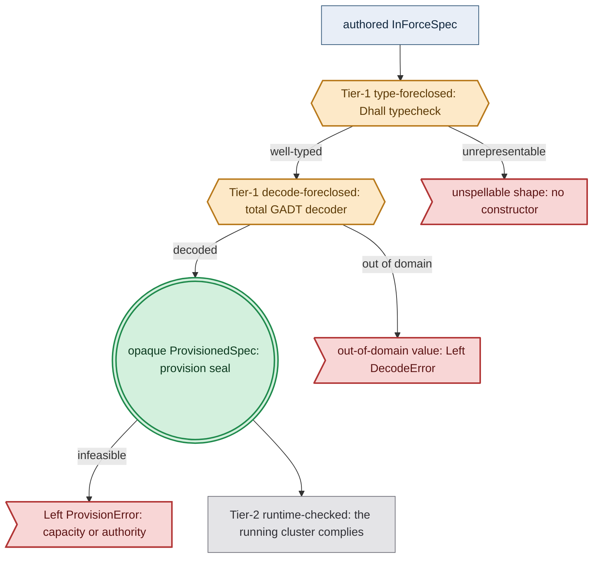

# Illegal-State Techniques, Coverage & Foreclosure Layers

**Status**: Authoritative source
**Supersedes**: N/A
**Referenced by**: DEVELOPMENT_PLAN/phase_00_documentation_suite.md, DEVELOPMENT_PLAN/phase_05_gadt_decoder_gate2.md, DEVELOPMENT_PLAN/phase_06_illegal_state_corpus.md, DEVELOPMENT_PLAN/phase_07_capacity_core_folds.md, DEVELOPMENT_PLAN/phase_08_storage_geometry_folds.md, DEVELOPMENT_PLAN/phase_09_execution_accelerator_folds.md, DEVELOPMENT_PLAN/phase_12_inference_accelerator_provision.md, DEVELOPMENT_PLAN/phase_13_render_manifest_goldens.md, DEVELOPMENT_PLAN/phase_27_app_tenancy.md, documents/README.md, documents/engineering/README.md, documents/engineering/backup_recovery_doctrine.md, documents/engineering/bootstrap_sequence_doctrine.md, documents/engineering/capability_extension_doctrine.md, documents/engineering/cluster_topology_doctrine.md, documents/engineering/content_addressing_doctrine.md, documents/engineering/diagram_conventions.md, documents/engineering/dsl_doctrine.md, documents/engineering/gateway_migration_doctrine.md, documents/engineering/host_cluster_comms_doctrine.md, documents/engineering/inforcespec_migration_doctrine.md, documents/engineering/manifest_generation_doctrine.md, documents/engineering/monitoring_doctrine.md, documents/engineering/network_fabric_doctrine.md, documents/engineering/preflight_validation_doctrine.md, documents/engineering/pulsar_client_doctrine.md, documents/engineering/readiness_ordering_doctrine.md, documents/engineering/resource_capacity_doctrine.md, documents/engineering/service_capability_doctrine.md, documents/engineering/single_logical_data_plane_doctrine.md, documents/engineering/storage_lifecycle_doctrine.md, documents/engineering/substrate_doctrine.md, documents/engineering/tenancy_doctrine.md, documents/illegal_state/README.md, documents/illegal_state/illegal_state_capability_messaging.md, documents/illegal_state/illegal_state_capacity.md, documents/illegal_state/illegal_state_catalog.md, documents/illegal_state/illegal_state_lifecycle.md, documents/illegal_state/illegal_state_ml_asset.md, documents/illegal_state/illegal_state_multicluster.md, documents/illegal_state/illegal_state_security.md, documents/illegal_state/illegal_state_storage.md, documents/illegal_state/illegal_state_topology.md
**Generated sections**: none

> **Purpose**: The mechanism slice of the illegal-state catalog — the seven reusable typing techniques that
> foreclose each illegal state, the coverage matrix mapping every state to its technique(s), the three-layer
> foreclosure model (type- / decode- / runtime-foreclosed), and the orthogonal validation-locus axis that names
> *where* each illegal state is caught — with the honest limit that a type-check proves the *spec composes*, not
> that the *running cluster enforces it*.

---

## 1. Scope

This document is the **techniques** slice of the illegal-state catalog. It owns the seven reusable typing
techniques ([§4](#4-the-typing-techniques)), the coverage matrix ([§5](#5-coverage-matrix--which-technique-forecloses-which-illegal-state)),
the three-layer foreclosure model ([§6](#6-three-layers-of-foreclosure-and-the-honesty-they-force)), and — new in
this doc — the **validation-locus axis** (defined in [§6.1](#61-the-validation-locus-axis--where-each-illegal-state-is-caught-orthogonal-to-the-foreclosure-layer))
that classifies each illegal state by *where in the pipeline it is caught*, orthogonally to the foreclosure layer.

The **catalog index** — the enumerated `### 3.x` illegal-state entries themselves — and the load-bearing honesty
limit (a type-check proves the *spec composes*, not that the *running cluster enforces it*) are owned by
[`illegal_state_catalog.md`](./illegal_state_catalog.md); this document *references* them and does **not** restate
them. The DSL surface and the contract "a valid spec cannot represent illegal state" are owned by
[`dsl_doctrine.md`](../engineering/dsl_doctrine.md); the *normative rule* behind each catalog entry lives in that entry's owning
doctrine (storage, gateway/ingress, secrets, capacity, topology, …), named — never restated — where the techniques
below cite it.

Everything here is **design intent**, not a tested amoebius result: the type discipline it describes (the spec
composes; no illegal value is constructible) is a **Tier-1** (design-time / in-process) property targeted for
in-process validation in the **pre-cluster gates (Phases 4–13)** (Dhall Gate 1 `dhall type` + the Haskell decoder Gate 2 + QuickCheck), while
its **runtime enforcement** remains **Phase 26** (Tier 2). Status and gates live only in
[`../../DEVELOPMENT_PLAN/README.md`](../../DEVELOPMENT_PLAN/README.md).

---

## 4. The typing techniques

The catalog is foreclosed by seven reusable techniques operating across **two type layers**:

- **The Dhall layer** gives totality, sum types (unions), required fields, and a DSL prelude of *smart
  constructors* — functions that only ever produce valid values, so the user composes from a vocabulary
  with no illegal words. (The DSL surface is owned by [`dsl_doctrine.md`](../engineering/dsl_doctrine.md).)
- **The Haskell layer** (GHC 9.12.4; pin owned by
  [`../../DEVELOPMENT_PLAN/README.md`](../../DEVELOPMENT_PLAN/README.md)) decodes that value into
  **GADT-indexed** types carrying phantom tags and ownership indices, so the in-memory IR the interpreter
  walks has the same illegal-states-absent property as the spec it came from.

The seven techniques follow. Each leads with the principle, then the mechanism. Techniques [§4.6](#46-capacity-accounting--placement-witness-compute-and-summed-demand-within-capacity-storage-checked) and [§4.7](#47-compatibility--topology-relations-by-construction-over-a-collection) were
added for the capacity / topology / bounded-storage block ([§3.13](./illegal_state_topology.md#313-a-compute-engine-incompatible-with-its-substrates-managed-providers-first-class)–[§3.22](./illegal_state_capacity.md#322-a-hand-authored-un-derived-toleration)); [§4.6](#46-capacity-accounting--placement-witness-compute-and-summed-demand-within-capacity-storage-checked) is the one technique that is
**irreducibly decode-foreclosed** ([§2](./illegal_state_catalog.md#2-the-load-bearing-limit-a-type-check-proves-the-spec-composes-not-that-the-cluster-enforces-it), [§6](#6-three-layers-of-foreclosure-and-the-honesty-they-force)).

### 4.1 PVC↔PV binding by construction

*Principle:* don't declare two things and hope they match — declare **one** thing that emits the matched
pair. *Mechanism:* a single `BoundVolume` smart constructor takes one private `ProvisionedVolumeDemand`,
already derived from required usable bytes through presentation overhead and backing allocation
minimum/quantum, and emits *both* the StatefulSet claim request and the exactly-matching `no-provisioner` PV.
They share its backing-rounded `provisionedBytes`, presentation/access mode, and deterministic
`<namespace>/<statefulset>/pv_<integer>` identity. There is no constructor for a bare PVC and
none for a free-floating PV, so [§3.1](./illegal_state_storage.md#31-bad--illegal-durable-storage) and [§3.2](./illegal_state_storage.md#32-pvcs-that-dont-bind-pvs) have no inhabitants. The *binding* is the value. The retain,
sizing, and deterministic-rebind rules are owned by
[`storage_lifecycle_doctrine.md`](../engineering/storage_lifecycle_doctrine.md); this doc owns only the
*pairing-by-construction* technique.

### 4.2 Capability and phantom tenant tags — cross-tenant refs are uninhabitable

*Principle:* the right to do or reference a thing is a *token that must be held*, and the tenant a reference
belongs to is *baked into its type* — so the dangerous operation is not "discouraged," it is *unconstructable*
by anyone without the token. *Mechanism:* a reference is `Ref tenant a`, phantom-tagged by a tenant index;
the only constructors that produce a `Ref t a` demand a capability scoped to `t`, and crucially **there is
no function `Ref t1 a -> Ref t2 a`**. A child spec is decoded under its own tenant tag, so it cannot even
*name* a sibling's resources ([§3.8](./illegal_state_security.md#38-cross-tenant-references-and-literal-secrets)). The same shape forecloses [§3.7](./illegal_state_security.md#37-accidental-insecure--backdoor-ingress): only the Keycloak edge holds the
`ExposeToWild` capability, so no app-authored value can produce a wild endpoint. This is the type-level form
of the locked rules "secrets are names only / parents inject into child Vault" and "Keycloak owns all wild
ingress."

### 4.3 GADT-indexed state machines — only legal transitions are typed

*Principle:* a thing that moves through phases (a volume that is `Unbound` then `Bound`; an endpoint that is
host-local vs wild; a route that needs a live backend) should make the *illegal* transition simply have no
constructor. *Mechanism:* a GADT indexed by phase, where each operation's type names its precondition phase
and its postcondition phase. An operation that requires a `Bound` volume cannot be applied to an `Unbound`
one; a wild route can only be built *from* a constructed service handle, so [§3.3](./illegal_state_security.md#33-misconfigured-gateway)'s "route to a non-existent
backend" and [§3.6](./illegal_state_security.md#36-blocking-networkpolicy-services-cant-reach-each-other)'s "consumer with no provider" cannot be written; endpoint kinds (`WildIngress` vs
`HostLocalPeer`, [§3.7](./illegal_state_security.md#37-accidental-insecure--backdoor-ingress)) are distinct indices that do not interconvert. The illegal transition is not rejected
at runtime — it was never a value. The same distinct-index discipline carries the stretched-cluster wires added
this round: a `SecureGatewayReach` (the authenticated secure-gateway arm of `Networking = Gateway | Vpn`) is a
distinct endpoint index with **no** constructor into `WildIngress` ([§3.40](./illegal_state_security.md#340-a-secure-gateway-reach-collapsing-into-wild-ingress)),
and a stretched node's `Reach` sum is kind-indexed so a host worker has no constructor into the control-plane
witness ([§3.38](./illegal_state_multicluster.md#338-a-host-worker-granted-a-control-plane-witness-or-treated-as-a-member)).

### 4.4 Ownership indices — single-owner SSoT, structurally

*Principle:* every resource has **exactly one** owner; "two owners" and "no owner" should both be impossible,
because shared ownership is how SSoT rots. *Mechanism:* resources are aggregated through an *ownership index*
— building the cluster IR is a total fold from resource to its single owner. A node-inventory owns "which
substrates exist" (so [§3.5](./illegal_state_capacity.md#35-undeployable-pods-taints-tolerations--affinity)'s unmatchable affinity is caught against one authoritative list), and the declared
dependency graph owns connectivity (so [§3.6](./illegal_state_security.md#36-blocking-networkpolicy-services-cant-reach-each-other)'s NetworkPolicies are *derived*, never hand-authored). Where the
index is type-level (distinct owner keys), a double-claim fails to type-check; where it is value-level, the
fold is a **total decode-time check** that rejects a duplicate or missing owner. (That distinction is exactly
the [§6](#6-three-layers-of-foreclosure-and-the-honesty-they-force) honesty layer — amoebius does not pretend a decode-time check is a type-inhabitance proof.) This is the
amoebius generalization of the prodbox single-owner SSoT discipline, lifted into the type/decode layer.

### 4.5 Content-address totality — names are total functions of content

*Principle:* a name that doesn't correspond to a real thing is the root of dangling pointers, wrong-IP DNS,
and stale image refs — so make the name a *computed function of the content*, never a free string an operator
types. *Mechanism:* `contentAddress :: Manifest -> Digest` is a total pure function; the only way to obtain a
reference is to hash an actual artifact, so a dangling reference has no inhabitant. Applied to DNS ([§3.4](./illegal_state_security.md#34-dns-that-binds-to-the-wrong-ip)): a
name binds to an *allocated LB address* computed from the realized service, not a typed IP, so "DNS bound to
the wrong/unowned IP" cannot be expressed. The content-addressed MinIO store (pointers → manifests → blobs)
and the `experimentHash` identity are owned by
[`content_addressing_doctrine.md`](../engineering/content_addressing_doctrine.md); this doc owns only the *totality
technique* — names are derived, never asserted.

### 4.6 Capacity accounting — placement witness (compute) and summed demand within capacity (storage), checked

*Principle:* every provision axis keeps the arithmetic and placement semantics of the physical thing it
represents; there is no misleading scalar called merely “resources” or “storage.” An aggregate
`Σ demand ≤ Σ capacity` is **necessary but not sufficient** for atomic workloads — pods cannot straddle nodes,
and an unsharded accelerator demand cannot straddle arbitrary devices. A cluster of 4-CPU nodes does not fit a
5-CPU pod; two 24-GiB GPUs do not fit an unsharded 40-GiB demand. Conversely, genuinely shared byte pools are
checked by sums, but only after every consumer is assigned to the named physical pool it actually debits.

*Mechanism:* the final check runs after capability/provider/shape expansion and before rendering. It consumes
the entire bound deployment and target inventory, and success alone constructs a private
`ProvisionedSpec`; `renderAll` cannot accept a raw or merely bound spec.

- **Pod reservation and placement:** the effective pod request covers CPU, memory, and pod
  `ephemeral-storage`, including init-container maxima and declared pod overhead. A **fixed** node set produces
  a concrete pod/owner→node witness honoring allocatable resources, affinity/taints, anti-affinity, and
  accelerator capability. An **elastic** set proves that every atomic workload fits at least one compatible
  candidate class and that the worst-case instance count stays within quota.
- **Finite limits and physical peaks:** memory and pod-ephemeral limits are folded separately from scheduler
  requests. This prevents a requests-only proof from claiming physical sufficiency. Memory remains a reactive
  kernel boundary; pod ephemeral storage remains a kubelet measurement/eviction boundary, while owner
  admission and routed backing capacity provide hard materialization/physical bounds.
- **Storage pools:** disk-backed pod volumes, OCI content/snapshots, native host-worker cache, durable claims,
  and system/VM reserve are assigned to typed pool/backing identities. A closed kubelet layout routes pod/image
  operands to the real nodefs/imagefs identities; only its required aliases are legal. Consumers of one pool
  sum together; declared disjoint pools must carve within the physical disk. The in-cluster cache owner proves
  `ProvisionedCacheDemand.derivedPeak ≤ CacheBudget ≤ emptyDir.sizeLimit`, while its disk-backed volume bounds plus writable/log
  headroom fit `ownerPod.ephemeralStorage.request ≤ ownerPod.ephemeralStorage.limit`; that pod envelope is
  charged once to node ephemeral storage, never another pool sum. Durable cloud backing remains distinct from
  node-root or instance-ephemeral storage. Logical durable demand is not compared directly to a disk:
  BookKeeper write-quorum/recovery and MinIO erasure/healing/metadata geometry, bounded in-flight/orphan
  exposure, filesystem presentation overhead, backing/provider allocation quantum, and uniform
  claim-template rounding first produce per-backing raw claims with witnessed usable capacity. Fault cases are
  derived exhaustively from finite policy bounds, not caller-selected.
- **Host/engine/fabric work:** image builds declare CPU/memory reservation+ceiling, scratch, cache, and
  concurrency; engine reserve is the sum of required named static processes plus enforceable
  backend/max-WAL/snapshot-save/defrag and Event/audit/runtime-log retention; the exact peer graph and finite
  traffic/queue policy derive network CPU/memory/log demand. None is an invisible host allowance.
- **Monitoring/registry/Vault:** complete source operands derive Prometheus CPU/memory and TSDB storage,
  registry resident/upload/failed-partial peaks, and Vault Raft/audit peaks. Fixed resources or caller-authored
  aggregates cannot bypass those costs.
- **Accelerators:** demand and offering form an explicit relation over family/profile and whole-device count.
  CUDA demand on a target with no compatible CUDA offering returns `Left MissingCapability Cuda`; there is no
  implicit CPU fallback. CUDA memory is placed against a concrete per-device raw/reserved/net-allocatable
  VRAM vector (and live current-free residual) plus any explicit
  supported sharding plan. Apple Metal debits the same physical unified-memory pool as the VM and host worker.
- **Nesting:** the same discipline composes physical host → VM + host workers + cache/system reserve,
  VM → guest node allocatable, cluster → workloads, accelerator owner → serving/training/JIT envelopes, and
  storage backing → claims. It re-runs after any `Growable` policy changes a bound.

The two topology shapes are specified by
[`resource_capacity_doctrine.md §4.1`](../engineering/resource_capacity_doctrine.md#41-place-branches-static-proves-a-placement-dynamic-proves-a-growth-envelope).
Distinct from [§4.4](#44-ownership-indices--single-owner-ssot-structurally), which proves ownership rather than
fit. **Honesty:** this technique is **irreducibly decode-foreclosed** — Dhall has no dependent arithmetic, so
“a feasible placement exists,” device placement, and every `Σ ≤ cap` are checked rejections of constructible
values, never an absence of inhabitants. The fixed placement heuristic and elastic envelope may conservatively
reject a feasible deployment but must never admit an infeasible one. The model
(`ResourceEnvelope`/`Capacity`, `podFits`/`place`, named storage pools/backings, accelerator offerings,
per-device memory, `ProvisionedSpec`, `Growable`, and the declared-vs-observed pre-mutation cross-check) is
owned by [`resource_capacity_doctrine.md`](../engineering/resource_capacity_doctrine.md); this document owns
only the technique. It forecloses
[§3.17](./illegal_state_capacity.md#317-an-over-committed-deploy-or-workload-host--vm--cluster-capacity-exceeded)–[§3.21](./illegal_state_storage.md#321-capacity-growth-without-an-amoebius-owned-scaling-policy),
[§3.27](./illegal_state_capacity.md#327-a-deployment-that-fits-in-aggregate-but-has-no-resource-capable-placement),
and [§3.29](./illegal_state_capacity.md#329-a-host-worker-whose-demand-overflows-its-physical-host)–[§3.30](./illegal_state_capacity.md#330-an-accelerator-memory-envelope-that-cannot-fit-the-selected-devices-or-unified-memory-pool).

### 4.7 Compatibility / topology relations by construction over a collection

*Principle:* a cluster is not a bag of settings — it is a *collection of nodes*, and "which engine may sit on
which substrate" is a *relation* that should have no illegal pair. *Mechanism:* a `Topology` is a fold over a
`NonEmpty Node`; only a compatible `(engine, substrate-indexed LinuxHost | hostless Provider)` pair has a
constructor ([§4.3](#43-gadt-indexed-state-machines--only-legal-transitions-are-typed) gating + [§4.2](#42-capability-and-phantom-tenant-tags--cross-tenant-refs-are-uninhabitable) phantom index), and the cluster-wide check is a **total elementwise fold**
([§4.4](#44-ownership-indices--single-owner-ssot-structurally)) that returns the full list of incompatible nodes. Because it is elementwise, a **heterogeneous
multi-substrate cluster stays legal** while an incompatible pairing has no inhabitant. Cardinality (`node ==
host` list length) is type-foreclosed by construction; distinctness ("one host per node, no reuse") is the part
Dhall cannot express as a type and degrades to a decode-foreclosed fold. This composes [§4.2](#42-capability-and-phantom-tenant-tags--cross-tenant-refs-are-uninhabitable)/[§4.3](#43-gadt-indexed-state-machines--only-legal-transitions-are-typed)/[§4.4](#44-ownership-indices--single-owner-ssot-structurally) applied to a
**binary relation over a collection**, and reads the single node inventory owned by
[`substrate_doctrine.md`](../engineering/substrate_doctrine.md). The types are owned by
[`cluster_topology_doctrine.md`](../engineering/cluster_topology_doctrine.md); this doc owns the *relation technique*. The
same **binary-relation-over-a-collection** shape covers the **model↔engine** relation ([§3.25](./illegal_state_ml_asset.md#325-an-ml-asset-named-by-arbitrary-url-or-an-unready--unlanded-model)): a `ModelArtifact`
is servable only by an `EngineRuntime` present on the **serving substrate lane** (where inference runs, not where
the model was produced), so an unmatched model has no landing engine — a decode-foreclosed total fold exactly like
the engine↔substrate check, owned by
[`content_addressing_doctrine.md`](../engineering/content_addressing_doctrine.md) and
[`service_capability_doctrine.md`](../engineering/service_capability_doctrine.md). And the rke2 **server/agent** inventory
([§3.24](./illegal_state_topology.md#324-an-evenzero-server-rke2-control-plane-no-etcd-quorum--split-brain), [§3.16](./illegal_state_topology.md#316-a-multi-node-rke2-cluster-with-fewer-linux-hosts-than-nodes-or-a-host-reused)) is this same collection shape with a *closed-cardinality* server set (`Rke2Servers`, type-foreclosed)
plus `Rke2AgentPool = Fixed [LinuxHost] | Autoscaled { floor, policy }`; host-distinctness runs over
`servers ∪ agentFloor` (a decode-foreclosed fold), while future autoscaled nodes are covered by compatible
candidate templates and a finite quota rather than fictitious concrete host identities.
This round extends the same **relation-over-a-collection** shape to two further collections. **(i)** The
**wholesale accelerator owner** is a per-node ownership index ([§4.4](#44-ownership-indices--single-owner-ssot-structurally))
over the node's accelerators, so two owners on one node or a per-pod fractional claim has no inhabitant
([§3.28](./illegal_state_capacity.md#328-two-accelerator-owners-on-one-node-or-a-fractional-accelerator-claim)). **(ii)** A **stretched
cluster** is one `Topology` whose `NonEmpty Node` (and a parallel host-worker inventory) span two `Site`s: a
**total `Site` fold over each collection** classifies stretchedness and routes a declared-remote entity to a
demanding constructor — the node fold to `mkStretchedAgent` (minting `ReachesControlPlane c`,
[§3.36](./illegal_state_multicluster.md#336-a-declared-remote-full-agent-with-no-control-plane-witness)) and the host-worker-inventory fold to
the attach carrier (minting `FabricMember c`, [§3.35](./illegal_state_multicluster.md#335-a-stretched-host-worker-with-no-declared-networking-capability))
— with a per-kind `witness` dispatch whose uninhabited cells (a host worker as a member
[§3.38](./illegal_state_multicluster.md#338-a-host-worker-granted-a-control-plane-witness-or-treated-as-a-member), a full node on a managed EKS
control plane [§3.37](./illegal_state_topology.md#337-a-full-stretched-node-on-a-managed-eks-control-plane-without-a-provider-native-hybrid-arm))
are the closed-union no-arm idiom, and a `Site`-indexed `Rke2Servers (s)` forcing a co-located etcd quorum
([§3.39](./illegal_state_topology.md#339-a-split-site-etcd-quorum)). Folding such a cluster's capacity as *two* `Topology`s is the
[§3.31](./illegal_state_multicluster.md#331-a-capacity-or-workload-fold-spanning-two-clusters) cross-cluster fold that has no constructor.
Forecloses [§3.13](./illegal_state_topology.md#313-a-compute-engine-incompatible-with-its-substrates-managed-providers-first-class)–[§3.16](./illegal_state_topology.md#316-a-multi-node-rke2-cluster-with-fewer-linux-hosts-than-nodes-or-a-host-reused), [§3.24](./illegal_state_topology.md#324-an-evenzero-server-rke2-control-plane-no-etcd-quorum--split-brain), and the model↔engine relation of [§3.25](./illegal_state_ml_asset.md#325-an-ml-asset-named-by-arbitrary-url-or-an-unready--unlanded-model).

---

## 5. Coverage matrix — which technique forecloses which illegal state

| Illegal state ([§3](./illegal_state_catalog.md#3-the-catalog--states-a-valid-spec-cannot-represent)) | Technique(s) ([§4](#4-the-typing-techniques)) | Owning doctrine |
|---|---|---|
| 3.1 Bad / illegal durable storage | 4.1 binding-by-construction + refined sizes | [storage_lifecycle](../engineering/storage_lifecycle_doctrine.md) |
| 3.2 PVCs that don't bind PVs | 4.1 binding-by-construction | [storage_lifecycle](../engineering/storage_lifecycle_doctrine.md) |
| 3.3 Misconfigured gateway | 4.3 GADT route-from-service + 4.5 totality | [platform_services §9](../engineering/platform_services_doctrine.md#9-the-loadbalancer-and-the-single-wild-ingress-path) |
| 3.4 Wrong-IP DNS | 4.5 content-address totality | [pulumi_iac](../engineering/pulumi_iac_doctrine.md), [platform_services §9](../engineering/platform_services_doctrine.md#9-the-loadbalancer-and-the-single-wild-ingress-path) |
| 3.5 Undeployable taints/tolerations/affinity | 4.2 capability tags + 4.4 node-inventory existence fold | [substrate](../engineering/substrate_doctrine.md), [platform_services](../engineering/platform_services_doctrine.md) |
| 3.6 Blocking NetworkPolicy | 4.4 dependency-graph owner + 4.3 consumer handle | [platform_services](../engineering/platform_services_doctrine.md) |
| 3.7 Accidental insecure ingress | 4.2 `ExposeToWild` capability + 4.3 endpoint indices | [platform_services §9](../engineering/platform_services_doctrine.md#9-the-loadbalancer-and-the-single-wild-ingress-path) |
| 3.8 Cross-tenant refs / literal secrets | 4.2 phantom tenant tags + capabilities | [vault_pki](../engineering/vault_pki_doctrine.md) |
| 3.9 Plaintext spec at rest | 4.5 envelope handle (+ runtime decrypt-in-process) | [vault_pki §4](../engineering/vault_pki_doctrine.md#4-init-follows-readiness-fail-closed-vault-init), [pulumi_iac §2](../engineering/pulumi_iac_doctrine.md#2-the-backend-every-byte-of-state-is-a-vault-enveloped-object-in-minio) |
| 3.10 Child spec beyond its subtree | 4.2 subtree/tenant tags + 4.4 ownership indices | [cluster_lifecycle §3](../engineering/cluster_lifecycle_doctrine.md#3-amoebic-spawning--the-recursive-forest), [dsl_doctrine](../engineering/dsl_doctrine.md), [vault_pki §6](../engineering/vault_pki_doctrine.md#6-parentchild-unseal-two-sanctioned-modes) |
| 3.11 Unsafe/incompletely provisioned workload | 4.1 required envelope + private provisioned-render boundary | [manifest_generation](../engineering/manifest_generation_doctrine.md), [platform_services §10](../engineering/platform_services_doctrine.md#10-every-execution-unit-declares-its-complete-resource-envelope), [resource_capacity](../engineering/resource_capacity_doctrine.md) |
| 3.12 App names a product not a capability | 4.2 closed capability union | [service_capability](../engineering/service_capability_doctrine.md) |
| 3.13 Engine incompatible w/ substrates; managed provider first-class | 4.7 relation-over-collection + 4.2 closed union + 4.4 node inventory | [cluster_topology](../engineering/cluster_topology_doctrine.md) |
| 3.14 rke2/kind on a host with no Linux node / no VM | 4.3 `LinuxHost` witness | [cluster_topology](../engineering/cluster_topology_doctrine.md), [substrate §4](../engineering/substrate_doctrine.md#4-virtualized-substrates-synthesizing-a-linux-host-where-the-host-is-not-linux) |
| 3.15 Multi-node kind not on a single host | 4.1 one `host` field | [cluster_topology](../engineering/cluster_topology_doctrine.md) |
| 3.16 Multi-node rke2 w/ fewer hosts than nodes / host reused | 4.1 `node==host` + 4.4 distinctness fold | [cluster_topology](../engineering/cluster_topology_doctrine.md) |
| 3.17 Over-committed host / VM / cluster / storage pool | 4.6 reservation + finite-limit/physical-peak + named-pool folds | [resource_capacity](../engineering/resource_capacity_doctrine.md) |
| 3.18 Unbounded storage anywhere | 4.2 closed `StorageBacking` + 4.6 aggregate | [storage_lifecycle §5.2](../engineering/storage_lifecycle_doctrine.md#52-the-storage-backing-is-bounded--the-closed-storagebacking-union), [resource_capacity](../engineering/resource_capacity_doctrine.md) |
| 3.19 App consuming more storage than backing (MinIO & Pulsar) | 4.6 cumulative fold + 4.2 Growable gate | [resource_capacity](../engineering/resource_capacity_doctrine.md), [content_addressing](../engineering/content_addressing_doctrine.md), [pulsar_client](../engineering/pulsar_client_doctrine.md) |
| 3.20 Pulsar topic w/o bounded/tiered/retained policy | 4.1 mandatory RetentionPolicy + size offload + 4.6 room-fit | [pulsar_client §6](../engineering/pulsar_client_doctrine.md#6-the-declarative-topology-algebra), [resource_capacity](../engineering/resource_capacity_doctrine.md) |
| 3.21 Capacity growth w/o an amoebius scaling policy | 4.2 closed `Growable` union | [resource_capacity](../engineering/resource_capacity_doctrine.md) |
| 3.22 Hand-authored (un-derived) toleration | 4.4 node-inventory owner + 4.3 derived handle | [substrate](../engineering/substrate_doctrine.md), [platform_services §9](../engineering/platform_services_doctrine.md#9-the-loadbalancer-and-the-single-wild-ingress-path) |
| 3.23 Non-CBOR Pulsar payload | 4.2 closed codec + 4.3 constructor-gating | [pulsar_client §3.1](../engineering/pulsar_client_doctrine.md#31-payloads-are-exclusively-cbor), [content_addressing](../engineering/content_addressing_doctrine.md) |
| 3.24 Even/zero-server rke2 control plane (no etcd quorum) | 4.2 closed `Rke2Servers` union (no even/zero arm) | [cluster_topology](../engineering/cluster_topology_doctrine.md) |
| 3.25 ML asset fetched/built at startup; unready or unlanded model | 4.2 closed `EngineRuntime` (no `Url` arm) + 4.3 `.ready`-gated `ArtifactRef` + 4.7 model↔engine relation | [content_addressing](../engineering/content_addressing_doctrine.md), [service_capability](../engineering/service_capability_doctrine.md) |
| 3.26 Unverified environment promotion (promote→prod) | 4.3 evidence-gated `PromotionGate` handle | [release_lifecycle](../engineering/release_lifecycle_doctrine.md) |
| 3.27 Aggregate-fit deployment with no capable placement | 4.6 pod/device witness or candidate growth envelope | [resource_capacity §4.1](../engineering/resource_capacity_doctrine.md#41-place-branches-static-proves-a-placement-dynamic-proves-a-growth-envelope), [cluster_topology](../engineering/cluster_topology_doctrine.md) |
| 3.28 Two accelerator owners / ordinary or fractional claim | 4.4 per-node ownership index + derived whole-device projection | [daemon_topology](../engineering/daemon_topology_doctrine.md), [resource_capacity](../engineering/resource_capacity_doctrine.md) |
| 3.29 Host worker/VM/cache demand overflowing its physical host | 4.6 physical-host carve across CPU/memory/unified-memory/storage | [resource_capacity](../engineering/resource_capacity_doctrine.md), [substrate](../engineering/substrate_doctrine.md), [platform_services §10](../engineering/platform_services_doctrine.md#10-every-execution-unit-declares-its-complete-resource-envelope) |
| 3.30 Accelerator memory envelope cannot fit devices/unified memory | 4.6 per-device/sharding placement + aggregate/unified-memory debit | [substrate](../engineering/substrate_doctrine.md), [resource_capacity](../engineering/resource_capacity_doctrine.md), [service_capability](../engineering/service_capability_doctrine.md) |
| 3.31 Capacity/workload fold spanning two clusters | 4.7 single-`Topology` arity (no cross-cluster fold) | [resource_capacity](../engineering/resource_capacity_doctrine.md), [single_logical_data_plane](../engineering/single_logical_data_plane_doctrine.md) |
| 3.32 Continuous run w/o cadence / feed w/o bounded retention | 4.2 closed `TrainBudget`/`Feed` unions + 4.6 retention room-fit | [content_addressing](../engineering/content_addressing_doctrine.md), [resource_capacity](../engineering/resource_capacity_doctrine.md), [pulsar_client §6](../engineering/pulsar_client_doctrine.md#6-the-declarative-topology-algebra) |
| 3.33 Non-deterministic multi-partition training feed | 4.2 merge-witness union + 4.3 `Feed` handle gating | [content_addressing](../engineering/content_addressing_doctrine.md), [pulsar_client §6](../engineering/pulsar_client_doctrine.md#6-the-declarative-topology-algebra) |
| 3.34 App serving/continuing another app's model w/o a grant | 4.4 per-app ownership index + 4.2 app-scoped tags | [content_addressing](../engineering/content_addressing_doctrine.md), [vault_pki](../engineering/vault_pki_doctrine.md) |
| 3.35 Stretched host worker w/o declared networking | 4.1 mandatory `Networking` field + 4.7 host-worker `Site` fold | [single_logical_data_plane](../engineering/single_logical_data_plane_doctrine.md), [network_fabric](../engineering/network_fabric_doctrine.md), [substrate](../engineering/substrate_doctrine.md) |
| 3.36 Declared-remote full agent w/o control-plane witness | 4.7 node `Site` fold + 4.6 `render()` + 4.3 witness gating | [cluster_topology](../engineering/cluster_topology_doctrine.md), [network_fabric](../engineering/network_fabric_doctrine.md) |
| 3.37 Full stretched node on Managed EKS w/o provider-native hybrid arm | 4.2 closed provider-arm union (absent hybrid arm) | [cluster_topology](../engineering/cluster_topology_doctrine.md), [cluster_lifecycle](../engineering/cluster_lifecycle_doctrine.md), [pulumi_iac](../engineering/pulumi_iac_doctrine.md) |
| 3.38 Host worker granted control-plane / treated as member | 4.3 kind-indexed `Reach` + 4.7 `witness` dispatch | [cluster_topology](../engineering/cluster_topology_doctrine.md), [single_logical_data_plane](../engineering/single_logical_data_plane_doctrine.md) |
| 3.39 Split-`Site` etcd quorum | 4.3 phantom-`Site` unification + 4.7 servers collection | [cluster_topology](../engineering/cluster_topology_doctrine.md), [substrate](../engineering/substrate_doctrine.md) |
| 3.40 Secure-gateway reach collapsing into wild ingress | 4.2 `ExposeToWild` capability + 4.3 distinct endpoint indices | [network_fabric](../engineering/network_fabric_doctrine.md), [host_cluster_comms](../engineering/host_cluster_comms_doctrine.md) |
| 3.41 Duration-gated / hand-ordered bring-up (readiness race) | 4.2 no-duration `Readiness` union + 4.3 derived readiness edge + 4.4 dep-graph owner + 4.6 `mkBringUpOrder` fold | [readiness_ordering](../engineering/readiness_ordering_doctrine.md), [platform_services §11](../engineering/platform_services_doctrine.md#11-bring-up-and-dependency-ordering) |
| 3.42 Admin mutation without root-token cap + unsealed-Vault witness | 4.2 `RootToken` capability + 4.3 `Unsealed`-edge-gated `dhall update` handle (channel-1 verb retired at handoff) | [bootstrap_sequence](../engineering/bootstrap_sequence_doctrine.md), [vault_pki §4](../engineering/vault_pki_doctrine.md#4-init-follows-readiness-fail-closed-vault-init) |
| 3.43 Unmonitored workflow/extension or unauthenticated monitoring surface | 4.1 mandatory monitor/liveness/extMonitoring + absent Off/Public arms + 4.7 coverage fold + 4.6 rule-feasibility Σ | [monitoring](../engineering/monitoring_doctrine.md), [pulsar_client §6](../engineering/pulsar_client_doctrine.md#6-the-declarative-topology-algebra) |
| 3.44 A session that cannot rebind on gateway migration | 4.3 migration GADT (decommission handle only from a drain-complete index) | [gateway_migration](../engineering/gateway_migration_doctrine.md) |
| 3.45 A cross-tenant or hand-authored RBAC binding | 4.2 phantom tenant tags + 4.4 tenant→role ownership index (every grant is the image of one total function of the typed tenant→role graph) | [tenancy §5](../engineering/tenancy_doctrine.md#5-rbac-is-derived-never-authored), [vault_pki](../engineering/vault_pki_doctrine.md) |
| 3.46 A chaos fault targeting a component the spec never declared | 4.2 phantom-typed `FaultTarget` reference (resolves only against a declared component) + 4.1 `NonEmpty` schedule | [chaos_failover §11.1](../engineering/chaos_failover_doctrine.md#111-the-typed-fault-schedule-chaosschedule--faulttarget), [testing](../engineering/testing_doctrine.md) |
| 3.47 Failover data-loss budget authored below the replication-lag bound | 4.1 binding-by-construction (RPO derived = lag; no separate field) | [consistency_pacelc](../engineering/consistency_pacelc_doctrine.md), [chaos_failover §18](../engineering/chaos_failover_doctrine.md#18-the-rules-scale-to-the-boundary) |
| 3.48 Geo-replication pair whose active == standby | 4.4 distinctness fold (`active ≠ standby`) | [consistency_pacelc](../engineering/consistency_pacelc_doctrine.md), [gateway_migration](../engineering/gateway_migration_doctrine.md) |
| 3.49 Child-authored gateway-failover pairing | 4.4 parent-scope ownership index + 4.2 phantom scope tag | [gateway_migration](../engineering/gateway_migration_doctrine.md), [consistency_pacelc](../engineering/consistency_pacelc_doctrine.md) |
| 3.50 Standing spec authoring an emergency `Failover` | 4.3 mode-is-an-observed-edge + 4.1 no `mode` field | [consistency_pacelc](../engineering/consistency_pacelc_doctrine.md), [gateway_migration](../engineering/gateway_migration_doctrine.md) |
| 3.51 Operator-authored `Confluent` disposition | 4.2 closed union w/o `Confluent` arm | [consistency_pacelc](../engineering/consistency_pacelc_doctrine.md), [chaos_failover §17](../engineering/chaos_failover_doctrine.md#17-the-boundary-and-its-classifier) |
| 3.52 Gateway-failover graph reusing one cluster across two DNS records | 4.4 distinctness fold over cluster identities across the migration graph (resource independence) | [gateway_migration_model §5](../engineering/gateway_migration_model_doctrine.md#5-one-and-done-plus-a-per-inforcespec-structural-fit), [consistency_pacelc §3.3](../engineering/consistency_pacelc_doctrine.md#33-the-ir-and-its-decode-foreclosures-haskell-gate-2) |
| 3.53 A backup larger than its bounded medium | 4.6 summed backup demand (working set + Job + retained generations) ≤ medium backing | [backup_recovery](../engineering/backup_recovery_doctrine.md), [resource_capacity](../engineering/resource_capacity_doctrine.md) |
| 3.54 Deleting a backup in an append-only system | 4.2 closed union with no delete arm + 4.3 (medium object-lock at runtime) | [backup_recovery](../engineering/backup_recovery_doctrine.md), [inforcespec_migration](../engineering/inforcespec_migration_doctrine.md) |
| 3.55 amoebius holding a credential that can delete a backup | 4.6 scoped `CloudAccountMutationCapability` with a put-only closed `allowedActions` (no delete field) | [backup_recovery](../engineering/backup_recovery_doctrine.md), [pulumi_iac §6](../engineering/pulumi_iac_doctrine.md#6-the-ebs-create-vs-delete-credential-model) |
| 3.56 Automatically recovering from a manual air-gapped medium | 4.2 phantom `Handling` index + 4.3 phase-gated restore (no automatic `MediumOnline` constructor for `Manual`) | [backup_recovery](../engineering/backup_recovery_doctrine.md) |
| 3.57 A restore that overwrites live durable bytes | 4.1 fresh-coordinate binding + 4.3 (no restore-into-occupied constructor) | [backup_recovery](../engineering/backup_recovery_doctrine.md), [inforcespec_migration §3](../engineering/inforcespec_migration_doctrine.md#3-the-dsl-exposes-no-destructive-verb--the-closed-storagemutation-union) |
| 3.58 Unbounded backup history | 4.2 closed `BackupRetention` union with no keep-forever arm | [backup_recovery](../engineering/backup_recovery_doctrine.md) |
| 3.59 A backup in the same failure domain as its source | 4.4 distinctness fold + 4.7 relation over the failure-domain collection | [backup_recovery](../engineering/backup_recovery_doctrine.md) |
| 3.60 Backup bytes double-counted as live durable capacity | 4.6 named-pool disjointness (backup backing disjoint from durable/ephemeral/cache) | [backup_recovery](../engineering/backup_recovery_doctrine.md), [storage_lifecycle §5.2](../engineering/storage_lifecycle_doctrine.md#52-the-storage-backing-is-bounded--the-closed-storagebacking-union) |
| 3.61 A plaintext backup at rest | 4.5 envelope handle (+ runtime decrypt-in-process); `SecretRef` key | [backup_recovery](../engineering/backup_recovery_doctrine.md), [vault_pki §3](../engineering/vault_pki_doctrine.md#3-the-secretref-contract-a-name-never-a-value) |
| 3.62 A backup whose decryption key is escrowed only in the domain it protects | 4.4 key-independence witness (+ assumed key-independence premise) | [backup_recovery](../engineering/backup_recovery_doctrine.md), [vault_pki](../engineering/vault_pki_doctrine.md) |
| 3.63 A restore from an unverified backup artifact | 4.3 phase-indexed `BackupArtifact 'Verified` (the `.ready`-gated artifact idiom) | [backup_recovery](../engineering/backup_recovery_doctrine.md), [content_addressing §4.5](../engineering/content_addressing_doctrine.md#45-the-ml-asset-lifecycle-one-bounded-content-addressed-cache-resolved-on-first-miss) |
| 3.64 A cross-tenant or re-tagged backup or restore | 4.2 phantom tenant tag (no `Ref t1 → Ref t2`); sharing is an append-only edge | [backup_recovery](../engineering/backup_recovery_doctrine.md), [inforcespec_migration §7](../engineering/inforcespec_migration_doctrine.md#7-sanctioned-sharing-is-an-append-only-revocable-capability-edge) |
| 3.65 An air-gapped medium carrying a live network credential | 4.2 closed union — the `AirGapMedia` arm has no credential field | [backup_recovery](../engineering/backup_recovery_doctrine.md) |
| 3.66 Retention lowered below the currently-retained generations on an append-only medium | 4.4 retention-floor diff fold (hybrid decode + live-retained probe) | [backup_recovery](../engineering/backup_recovery_doctrine.md), [inforcespec_migration §5](../engineering/inforcespec_migration_doctrine.md#5-the-decode-time-no-orphan-fold) |
| 3.67 A restore into a target smaller than or presentation-incompatible with the backup extent | 4.6 capacity fit + 4.1 presentation-matched sizing | [backup_recovery](../engineering/backup_recovery_doctrine.md), [resource_capacity](../engineering/resource_capacity_doctrine.md) |
| 3.68 Two conflicting backup policies on one coordinate | 4.4 single-owner ownership index over the coordinate's `BackupPolicy` | [backup_recovery](../engineering/backup_recovery_doctrine.md) |
| 3.69 A cold-seeded secondary taking the gateway without proven freshness | 4.3 gateway-take handle only from a `FreshnessProven` index (`NoTakeWithoutProvenFreshness`) | [gateway_migration_model](../engineering/gateway_migration_model_doctrine.md), [backup_recovery §8](../engineering/backup_recovery_doctrine.md#8-the-gateway-dovetail-seed-from-backup-under-consistency-over-availability) |
| 3.70 A `ColdSeedFromBackup` whose freshness bound is below the backup cadence | 4.1 binding-by-construction (`freshnessBound ≥ cadence` decode fold) | [backup_recovery](../engineering/backup_recovery_doctrine.md), [consistency_pacelc §3.5](../engineering/consistency_pacelc_doctrine.md#35-the-upload-time-feasibility-push-back) |
| 3.71 A freshness watermark asserted rather than derived from captured content | 4.5 content-address totality (watermark is a total function of content) | [backup_recovery](../engineering/backup_recovery_doctrine.md), [content_addressing §4.5](../engineering/content_addressing_doctrine.md#45-the-ml-asset-lifecycle-one-bounded-content-addressed-cache-resolved-on-first-miss) |

---

## 6. Three layers of foreclosure (and the honesty they force)

Not every entry above is foreclosed the *same* way, and saying otherwise would violate the
proven/tested/assumed discipline ([`documentation_standards.md` §6](../documentation_standards.md#6-honesty-the-proventestedassumed-discipline)). There
are three layers, and a conformant claim names which one it is reaching:

Diagram vocabulary: [diagram_conventions.md](../engineering/diagram_conventions.md).

*Design intent. The two gate layers foreclose at decode; the opaque seal is the provision-seal locus; the runtime layer is observed, never asserted as a type proof.*

1. **`type-foreclosed` — uninhabitable by type.** The illegal value has *no constructor* — the strongest layer. A cross-tenant
   reference ([§3.8](./illegal_state_security.md#38-cross-tenant-references-and-literal-secrets)) and a bare PVC ([§3.2](./illegal_state_storage.md#32-pvcs-that-dont-bind-pvs)) are meant to live here. The "proof" is type-inhabitance, checked
   by Dhall + GHC at the spec/code layer.
2. **`decode-foreclosed` — rejected by a total pure construction check before effects.** This historical
   layer name covers constructible values rejected by a **total** smart constructor or fold: some checks run
   in the Gate-2 decoder, while whole-deployment/resource checks run only after bind/expand at the
   `provision-seal` locus. A value-level ownership double-claim ([§4.4](#44-ownership-indices--single-owner-ssot-structurally))
   or a size refinement may be local to Gate 2; `Σ demand ≤ capacity` is not. This remains a *spec-layer*
   guarantee — the value never reaches the interpreter — but it is a *checked rejection*, not an absence of
   inhabitants. Always name the concrete validation locus so “decode-foreclosed” is never misread as
   "`Dhall.inputFile` performed whole-deployment provisioning."
3. **`runtime-checked` — enforced only at reconcile/runtime.** Some invariants (whether the LB actually comes up, whether the pod
   actually schedules, whether two clusters converge after a partition) cannot be settled by inspecting the
   spec at all. These are **not** in this catalog's promise; their verification is owned by
   [`chaos_failover_doctrine.md`](../engineering/chaos_failover_doctrine.md) and the testing doctrine ([§2](./illegal_state_catalog.md#2-the-load-bearing-limit-a-type-check-proves-the-spec-composes-not-that-the-cluster-enforces-it)).

**The two-tier mapping.** (This *Tier* vocabulary is the same split the plan and the catalog name in *Register*
terms: **Tier-1 corresponds to Registers 1–2** and **Tier-2 to Register 3** — one pre-cluster/runtime boundary
under two names.) Layers 1–2 (`type-foreclosed` + `decode-foreclosed`) are the **Tier-1** design-time /
in-process integrity band — the spec composes and the type discipline holds in the abstract — validated
**in-process in the pre-cluster gates (Phases 4–13)** (Dhall Gate 1, Haskell decoder Gate 2, QuickCheck,
bind/expand, the opaque provision seal, and `renderAll` goldens). Layer 3
(`runtime-checked`) is **Tier-2** runtime-enforcement integrity — that the running cluster enforces what the spec
composed — and stays **deferred and UNVERIFIED** until its live real-resource phase (owned by
[`chaos_failover_doctrine.md`](../engineering/chaos_failover_doctrine.md) and the testing doctrine).

**Gate-1 vs Gate-2 caveat (Dhall has no opaque types).** The binding-by-construction and phantom-index / GADT
foreclosures ([§4.1](#41-pvcpv-binding-by-construction)–[§4.3](#43-gadt-indexed-state-machines--only-legal-transitions-are-typed))
are only **partially** `type-foreclosed` at Gate 1: Dhall has no opaque types, so it cannot hide a record's or
union's constructors, and the full "no illegal constructor" teeth land only at the Haskell **GADT** decoder (Gate 2,
`Dhall.inputFile`). So the Phase-6 corpus must **split** its negative fixtures into *Gate-1-must-fail-`dhall type`*
(illegal already at the Dhall layer) and *Gate-2-must-fail-decode* (well-typed Dhall the decoder rejects), and never
bill a Gate-2-only foreclosure as a Gate-1 type-check failure.

Worked example of the discipline: **every execution unit declares a complete resource envelope**
([`platform_services_doctrine.md` §10](../engineering/platform_services_doctrine.md#10-every-execution-unit-declares-its-complete-resource-envelope)). As specified, a workload value
*requires* a `ResourceEnvelope`: refined non-zero CPU, memory, and pod-ephemeral requests/limits for every
container; explicit size bounds and single-debit nesting for disk-backed in-cluster scratch/cache; typed
durable/native-host-cache backing; and an
accelerator family/count/memory envelope where applicable. Missing fields fail Gate 1; incompatibility with
the selected target fails at the post-bind `provision-seal` locus; only the resulting private `ProvisionedSpec`
may render. What the catalog does **not** claim is that the running kernel, kubelet, device plugin, storage
driver, or cloud quota honors those declarations — that is runtime-checked. Stating the layer is what
separates “illegal state is impossible” as an unqualified claim from a defensible boundary.

Second worked example, the one the [§3.13](./illegal_state_topology.md#313-a-compute-engine-incompatible-with-its-substrates-managed-providers-first-class)–[§3.22](./illegal_state_capacity.md#322-a-hand-authored-un-derived-toleration) block turns on: **capacity sums/placements are the canonical checked-rejection case, at the post-bind
`provision-seal` locus, and saying they are uninhabitable or caught by `Dhall.inputFile` is dishonest.**
`Σ demand ≤ capacity` ([§3.17](./illegal_state_capacity.md#317-an-over-committed-deploy-or-workload-host--vm--cluster-capacity-exceeded)), final physical `Σ(PV caps) ≤ backing` ([§3.18](./illegal_state_storage.md#318-unbounded-storage-anywhere)),
the logical→physical store placement ([§3.19](./illegal_state_storage.md#319-an-application-consuming-more-storage-than-its-backing-minio-and-pulsar)), the Pulsar room-fit ([§3.20](./illegal_state_storage.md#320-a-pulsar-topic-without-a-bounded--tiered--retained-lifecycle)), and the rke2 host-distinctness check ([§3.16](./illegal_state_topology.md#316-a-multi-node-rke2-cluster-with-fewer-linux-hosts-than-nodes-or-a-host-reused)) are
all **total pure provisioning rejections of constructible values** — because capacity is a *value*, not a type
index, and Dhall has no dependent arithmetic to make `Σ ≤ cap` a statement about inhabitance ([§4.6](#46-capacity-accounting--placement-witness-compute-and-summed-demand-within-capacity-storage-checked)). By
contrast, the type-foreclosed "no constructor" examples are the topology *witnesses* ([§3.14](./illegal_state_topology.md#314-rke2kind-on-a-host-with-no-linux-node-applewindows-without-an-interposed-linux-vm) `LinuxHost`, [§3.15](./illegal_state_topology.md#315-a-multi-node-kind-cluster-not-on-a-single-linux-host)
one-host `Kind`), the *derived* toleration ([§3.22](./illegal_state_capacity.md#322-a-hand-authored-un-derived-toleration)), the mandatory-shape unions ([§3.20](./illegal_state_storage.md#320-a-pulsar-topic-without-a-bounded--tiered--retained-lifecycle) non-optional
`RetentionPolicy` + size offload, [§3.21](./illegal_state_storage.md#321-capacity-growth-without-an-amoebius-owned-scaling-policy) `Growable` with no unbounded arm), and the CBOR-only payload codec
([§3.23](./illegal_state_capability_messaging.md#323-a-non-cbor-pulsar-payload), whose *consume*-side decode is a decode-foreclosed total check like CRC32C). A single catalog entry may mix
layers ([§3.13](./illegal_state_topology.md#313-a-compute-engine-incompatible-with-its-substrates-managed-providers-first-class), [§3.16](./illegal_state_topology.md#316-a-multi-node-rke2-cluster-with-fewer-linux-hosts-than-nodes-or-a-host-reused), [§3.18](./illegal_state_storage.md#318-unbounded-storage-anywhere), [§3.20](./illegal_state_storage.md#320-a-pulsar-topic-without-a-bounded--tiered--retained-lifecycle)): it is then assigned to its **weaker layer**, and the split is stated in
the entry. And the physical residues — the host actually capping bytes/cgroups, the broker actually
offloading to S3, the pod actually scheduling, the Lima/WSL2 VM actually interposing, the autoscaler actually
growing capacity, and the cloud honoring the quota — are always runtime-checked, owned by
[`chaos_failover_doctrine.md`](../engineering/chaos_failover_doctrine.md) and the testing doctrine, never asserted here.

> **Honesty.** amoebius has built no phase yet. Every `type-foreclosed` and `decode-foreclosed` claim above is the *intended*
> **Tier-1** (design-time / in-process) property of the type discipline — targeted for in-process validation in the **pre-cluster gates (Phases 4–13)**,
> not a tested result; the **Tier-2** `runtime-checked` residue is explicitly deferred to its live phase. Where a technique
> generalizes a behaviour proven in prodbox (single-owner SSoT, Keycloak-owns-ingress), that proof is
> evidence from a sibling system, not proof in amoebius.

### 6.1 The validation-locus axis — where each illegal state is caught (orthogonal to the foreclosure layer)

The three foreclosure **layers** above classify *what kind of proof* forecloses an illegal state: type-inhabitance
(`type-foreclosed`), a total pure pre-effect rejection (`decode-foreclosed`, whose concrete locus may be
Gate 2 or the provision seal), or reconcile/runtime enforcement
(`runtime-checked`). A **second, orthogonal axis** — the **validation-locus** — classifies *where in the pipeline*
the illegal state is actually caught, i.e. the concrete gate at which a test would observe the rejection. The two
axes are independent: the *layer* answers "by what kind of check," the *locus* answers "at which stage a fixture
must fail." Every catalog entry names a **primary locus**, and almost every entry also names a **`live-effect`
residue** — the physical fact the spec-layer check structurally cannot settle. Each `### 3.x` entry in
[`illegal_state_catalog.md`](./illegal_state_catalog.md) carries a **`Validation-locus:`** line naming its loci,
derived from — but not identical to — its `Layer:` tag.

The five loci:

1. **`Gate-1-editor` — fails `dhall type` at authoring time.** The illegal spec is rejected by the Dhall
   type-checker *in the editor*, before any binary runs. This is where the **closed-union / no-arm**, **required-field**,
   and **`NonEmpty`** foreclosures surface — a product engine name ([§3.12](./illegal_state_capability_messaging.md#312-an-app-that-names-a-product-instead-of-a-capability)),
   an even/zero `Rke2Servers` arm ([§3.24](./illegal_state_topology.md#324-an-evenzero-server-rke2-control-plane-no-etcd-quorum--split-brain)),
   a workload missing its `Resources` field ([§3.11](./illegal_state_security.md#311-an-unsafe-workload-no-resource-limits-no-hardened-securitycontext)),
   an empty `extMonitoring` list ([§3.43](./illegal_state_lifecycle.md#343-an-unmonitored-workflow-or-extension-or-an-unauthenticated-monitoring-surface)).
   It is the editor-time face of the `type-foreclosed` layer — subject to the Gate-1-vs-Gate-2 caveat above (Dhall
   has no opaque types, so a foreclosure that *reads* as type-level may only fully bite at Gate 2).
2. **`Gate-2-decoder` — the total decoder returns `Left`.** Well-typed Dhall the Haskell **GADT** decoder or a
   local smart constructor rejects at `Dhall.inputFile` time: the phantom-index / GADT constructor-gating whose teeth Dhall
   cannot express ([§4.1](#41-pvcpv-binding-by-construction)–[§4.3](#43-gadt-indexed-state-machines--only-legal-transitions-are-typed)),
   local refinements, and decoder-local ownership rejection
   ([§4.4](#44-ownership-indices--single-owner-ssot-structurally)).
   It is the decoder-time face of `decode-foreclosed`, and — because Dhall exposes constructors — also where the
   residual teeth of the [§4.1](#41-pvcpv-binding-by-construction)–[§4.3](#43-gadt-indexed-state-machines--only-legal-transitions-are-typed)
   `type-foreclosed` foreclosures actually land.
3. **`provision-seal` — post-bind whole-deployment provisioning returns `Left`.** Gate 2 has already produced
   decoded, unprovisioned declarations. Phase 10 expands the complete source set and `provision` runs every
   capacity, placement, storage/retention, provider-quota, accelerator-count, and net-VRAM fold against the
   exact target inventory. Failure returns `ProvisionError`; success alone constructs the opaque
   `ProvisionedSpec`. This is the concrete locus for the whole-deployment face of `decode-foreclosed`.
4. **`rendered-output-golden` — caught by a golden test on the rendered manifest, not a cluster.** Some invariants are
   properties of the **emitted objects**, observable after
   decode→bind/expand→plan/resolve-infrastructure→provision→renderAll but before any apply: that every generated
   workload carries the **hardened securityContext and exact checked resource projection**
   ([§3.11](./illegal_state_security.md#311-an-unsafe-workload-no-resource-limits-no-hardened-securitycontext)),
   that the **NetworkPolicy set derived** from the declared dependency graph matches those edges
   ([§3.6](./illegal_state_security.md#36-blocking-networkpolicy-services-cant-reach-each-other)), that **no emitted object opens a backdoor wild
   ingress** ([§3.7](./illegal_state_security.md#37-accidental-insecure--backdoor-ingress)). These are verified by a **golden test over the rendered
   manifest** — the "the generator only ever produces safe objects" claim, checked against the output artifact, never
   against a running cluster.
5. **`live-effect` — observable only at reconcile/runtime.** The `runtime-checked` residue: whether the LB comes up,
   the pod schedules, etcd forms and holds quorum, the Lima/WSL2 VM interposes, the autoscaler grows, the broker
   offloads to S3, the `drain-complete` edge is truthfully observed. **Not** in this catalog's promise; owned by
   [`chaos_failover_doctrine.md`](../engineering/chaos_failover_doctrine.md) and the testing doctrine.

Because the axes are orthogonal, a single entry commonly names several loci at once — e.g.
[§3.43](./illegal_state_lifecycle.md#343-an-unmonitored-workflow-or-extension-or-an-unauthenticated-monitoring-surface) is `Gate-1-editor` (the mandatory
monitor field, the absent `Off`/`Public` arms), `Gate-2-decoder` (the coverage / feasibility folds),
`provision-seal` (whole-deployment resource feasibility),
`rendered-output-golden` (the derived rules/panels in the emitted objects), and `live-effect` (that the alert actually
fires) — and the foreclosure *layer* of each part is stated separately in the entry. The loci also map loosely onto
the two-tier band: `Gate-1-editor`, `Gate-2-decoder`, `provision-seal`, and `rendered-output-golden` are
**Tier-1** design-time / in-process gates (validated in the **pre-cluster band, Phases 4–13**), while
`live-effect` is the **Tier-2** runtime-enforcement residue
deferred to its live phase.

### 6.2 The enumeration limit — the catalog is enumerated, not proven exhaustive

The catalog is an **enumeration**, not a completeness proof. amoebius lists the illegal states it has identified and
names the technique that forecloses each; it does **not** prove that the list is *exhaustive*, because there is **no
denotational definition of "deployable"** against which exhaustiveness could be measured. "Deployable" is
characterized *extensionally* — by the enumerated set of states declared illegal and foreclosed — not *denotationally*
by a semantic predicate over all possible cluster states.

Consequently a green Gate-1 / Gate-2 pass proves two things and not a third: (a) a well-typed spec **composes** into
an internally coherent value, and (b) **each enumerated** illegal state is unrepresentable or decode-rejected. It does
**not** prove (c) that **every conceivable** unsafe cluster state has a catalog entry. New illegal states are added to
the catalog as they are identified; the honesty discipline ([§6](#6-three-layers-of-foreclosure-and-the-honesty-they-force),
[`documentation_standards.md` §6](../documentation_standards.md#6-honesty-the-proventestedassumed-discipline)) forbids reading
the enumeration as a closed proof of safety, just as it forbids reading a `type-foreclosed` claim as a statement
about the running cluster ([§2](./illegal_state_catalog.md#2-the-load-bearing-limit-a-type-check-proves-the-spec-composes-not-that-the-cluster-enforces-it)).

---

## Cross-references

- [The Illegal-State Catalog](./illegal_state_catalog.md) — the enumerated `### 3.x` illegal-state entries, the catalog index, and the load-bearing honesty limit ([§1](./illegal_state_catalog.md#1-illegal-states-fail-to-type-check)–[§2](./illegal_state_catalog.md#2-the-load-bearing-limit-a-type-check-proves-the-spec-composes-not-that-the-cluster-enforces-it)) this doc's techniques foreclose
- [DSL Doctrine](../engineering/dsl_doctrine.md) — the DSL surface and the contract ("a valid spec cannot represent illegal state") these techniques implement
- [Storage Lifecycle Doctrine](../engineering/storage_lifecycle_doctrine.md) — PVC↔PV binding, sizing, retained PVs ([§4.1](#41-pvcpv-binding-by-construction))
- [Platform Services Doctrine](../engineering/platform_services_doctrine.md) — gateway / ingress /
  NetworkPolicy, complete execution-unit resource envelopes, and the derived-toleration rule
- [Vault / PKI Doctrine](../engineering/vault_pki_doctrine.md) — `SecretRef`-by-name, parent→child injection, tenant trust tree ([§4.2](#42-capability-and-phantom-tenant-tags--cross-tenant-refs-are-uninhabitable))
- [Substrate Doctrine](../engineering/substrate_doctrine.md) — the node inventory / taints the [§4.4](#44-ownership-indices--single-owner-ssot-structurally)/[§4.7](#47-compatibility--topology-relations-by-construction-over-a-collection) folds read
- [Resource Capacity Doctrine](../engineering/resource_capacity_doctrine.md) — the [§4.6](#46-capacity-accounting--placement-witness-compute-and-summed-demand-within-capacity-storage-checked) capacity / placement folds
- [Cluster Topology Doctrine](../engineering/cluster_topology_doctrine.md) — the [§4.7](#47-compatibility--topology-relations-by-construction-over-a-collection) compute-engine / topology relation
- [Content Addressing Doctrine](../engineering/content_addressing_doctrine.md) — pointers→manifests→blobs totality ([§4.5](#45-content-address-totality--names-are-total-functions-of-content)), the `EngineRuntime` / `ModelArtifact` tiers
- [Service Capability Doctrine](../engineering/service_capability_doctrine.md) — the capability abstraction and the engine as a substrate-selected capability
- [Release Lifecycle Doctrine](../engineering/release_lifecycle_doctrine.md) — the evidence-gated `PromotionGate` handle ([§4.3](#43-gadt-indexed-state-machines--only-legal-transitions-are-typed))
- [Pulumi IaC Doctrine](../engineering/pulumi_iac_doctrine.md) — route53 / zerossl name→address binding ([§4.5](#45-content-address-totality--names-are-total-functions-of-content))
- [Chaos / Failover Doctrine](../engineering/chaos_failover_doctrine.md) — the `runtime-checked` / `live-effect` residue (the honest limit)
- [documentation_standards.md §6](../documentation_standards.md#6-honesty-the-proventestedassumed-discipline) — proven/tested/assumed honesty discipline
- [Development Plan](../../DEVELOPMENT_PLAN/README.md) — status, gates, and the Tier-1 (Phases 4–13) / Tier-2 (Phase 26) tier split
- [Engineering Doctrine Index](../engineering/README.md)
