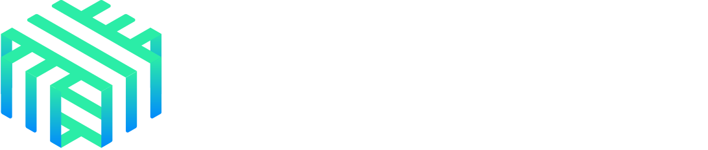
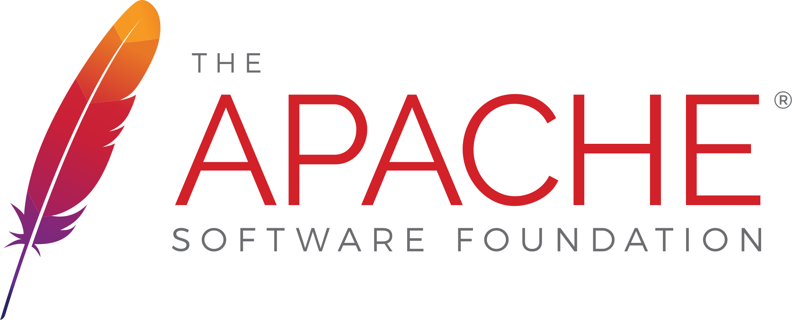
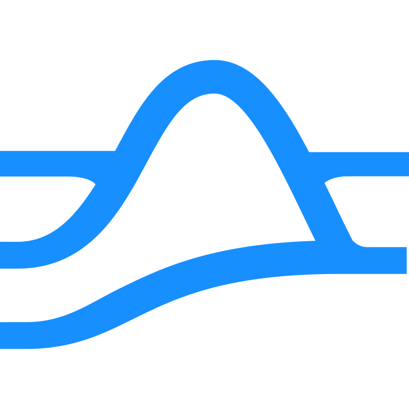

# Amoebius
## Multi-Cloud Resilient Computing Platform

**Autonomous failover and recovery across geographically distributed environments**

---

## Why Kubernetes for Systematic Trading?

<p style="text-align: center; margin: 0.5em 0;">
  
  <strong>Amoebius supercharges Kubernetes</strong>
</p>

**A distributed crypto trading firm needs:**

- 🏢 **Multi-Datacenter Deployment**: Colocation in NYC, London, Singapore for latency
- 📊 **Real-Time Event Processing**: Price feeds, order books, risk calculations at scale
- 🔄 **Dynamic Workload Scaling**: Spin up backtesting jobs, scale trading algorithms
- 🛡️ **Security Isolation**: Separate strategies, comply with regional regulations
- ⚡ **Container Orchestration**: Deploy identical trading stacks across locations

### **Kubernetes delivers this... but with limitations**

*What happens when your London colo needs to failover to AWS at 2:00 AM Eastern?*

---

## The Problem

**Even with Kubernetes, you're still constrained by:**

- **Single Cloud Region**: AKS/EKS/GKE clusters fail when their region goes down
- **Vendor Lock-in**: Each cluster tied to one cloud provider's services
- **Manual Failover**: No automatic cross-cloud disaster recovery
- **Centralized Secrets**: Keys stored in single cloud KMS create security risks
- **Network Dependencies**: Clusters become isolated during connectivity failures

---

## Systematic Crypto Trading Challenges

**Operating systematic trading at scale requires:**

- 🔐 **Provable Private Key Security**: No single person can extract keys
- 🌍 **Geographic Data Boundaries**: Regulatory compliance across jurisdictions
- ⚡ **Low-Latency + Security Balance**: Fast execution with cryptographic safety
- 🔄 **Seamless Failover**: Automatic recovery when critical systems fail
- 📊 **Real-Time Data Streaming**: Event-driven architecture at global scale

**Traditional solutions force you to choose between security and performance**

---

## The Colocation Dilemma

### **The Problem:**
You need **microsecond execution** for competitive advantage, but your private keys must remain **cryptographically secure**.

### **The Conflict:**
- 🏢 **Colocation Centers**: Ultra-low latency, but physical security risks
- ☁️ **Cloud Security**: Hardware Security Modules (HSMs), but network latency
- 🔑 **Key Management**: Vault rituals vs. real-time signing requirements

### **What Happens When It Fails:**
*Your volatility book needs dynamic hedging every 100ms. The colo box crashes at 2 AM.*

**Without failover**: Positions accumulate risk until manual intervention  
**With Amoebius**: Automatic failover to backup region continues hedging

---

## Amoebius Solution

**Multi-cloud computing platform with:**

- ✅ **Zero-downtime failover** between geolocations
- ✅ **Autonomous operation** when disconnected from parent clusters
- ✅ **Federated data synchronization** via MinIO clusters
- ✅ **Hierarchical secret management** with Vault
- ✅ **Infrastructure as Code** with Terraform
- ✅ **Service mesh** for secure cross-cluster communication

### **For Systematic Trading:**
- 🔐 **Distributed Key Ceremonies**: No single point of key extraction
- 🌍 **Geographic Data Sovereignty**: Provable compliance boundaries
- ⚡ **Multi-Tier Execution**: Colo for speed + cloud for security
- 📊 **Event Streaming at Scale**: Apache Pulsar over traditional solutions

---

## Technology Stack

<div class="logo-grid">
  <div class="logo-item">
    
    <strong>Kubernetes</strong>
    <small>Container Orchestration</small>
  </div>
  <div class="logo-item">
    
    <strong>HashiCorp Vault</strong>
    <small>Secret Management</small>
  </div>
  <div class="logo-item">
    
    <strong>RKE2</strong>
    <small>Kubernetes Distribution</small>
  </div>
  <div class="logo-item">
    
    <strong>Linkerd</strong>
    <small>Service Mesh</small>
  </div>
  <div class="logo-item">
    
    <strong>Terraform</strong>
    <small>Infrastructure as Code</small>
  </div>
  <div class="logo-item">
    
    <strong>MinIO</strong>
    <small>Object Storage</small>
  </div>
</div>

---

## Event Streaming: Kafka → Pulsar

**Apache Foundation Projects**

**Kafka** - Single-datacenter excellence

**Pulsar** - Multi-datacenter native

### **Why Pulsar for Trading:**
- **Native geo-replication** eliminates complex Kafka mirror setups
- **BookKeeper separation** enables zero-downtime storage failover
- **Multi-tenant isolation** per trading strategy with guaranteed resources

**Result: Consistent millisecond feeds across continents**

---

## Private Key Security Model

### **Traditional Approach:**
- 🔑 Single HSM or key server
- 👤 Admin access = complete key extraction risk
- 🏢 Physical security as primary defense

### **Amoebius Distributed Approach:**
- 🔐 **Shamir Secret Sharing**: Master keys split into shares; configurable quorum required for unsealing
- 🎭 **Ceremony-Based Access**: Multi-party computation for key operations
- ☁️ **Cloud-Native HSMs**: AWS CloudHSM, Azure Dedicated HSM integration
- 📋 **Zero-Knowledge Proofs**: Prove key security without revealing keys

### **Compliance Benefits:**
- ✅ **Auditability**: Cryptographic proof of key isolation
- ✅ **SOC2/ISO27001**: Built-in compliance frameworks
- ✅ **Geographic Boundaries**: Keys never leave specified jurisdictions

---

## Architecture Overview

```
┌─────────────────┐    VPN    ┌─────────────────┐    VPN    ┌─────────────────┐
│   Region A      │◄─────────►│   Region B      │◄─────────►│   Region C      │
│                 │           │                 │           │                 │
│ ┌─────────────┐ │           │ ┌─────────────┐ │           │ ┌─────────────┐ │
│ │ K8s Cluster │ │           │ │ K8s Cluster │ │           │ │ K8s Cluster │ │
│ │   + RKE2    │ │           │ │   + RKE2    │ │           │ │   + RKE2    │ │
│ └─────────────┘ │           │ └─────────────┘ │           │ └─────────────┘ │
│                 │           │                 │           │                 │
│ ┌─────────────┐ │           │ ┌─────────────┐ │           │ ┌─────────────┐ │
│ │    Vault    │ │           │ │    Vault    │ │           │ │    Vault    │ │
│ └─────────────┘ │           │ └─────────────┘ │           │ └─────────────┘ │
│                 │           │                 │           │                 │
│ ┌─────────────┐ │           │ ┌─────────────┐ │           │ ┌─────────────┐ │
│ │    MinIO    │◄┼───────────┼►│    MinIO    │◄┼───────────┼►│    MinIO    │ │
│ │ (Federated) │ │           │ │ (Federated) │ │           │ │ (Federated) │ │
│ └─────────────┘ │           │ └─────────────┘ │           │ └─────────────┘ │
└─────────────────┘           └─────────────────┘           └─────────────────┘
```

---

## Hierarchical Cluster Spawning

```
                    ┌─────────────────┐
                    │   Root Cluster  │
                    │    (Region A)   │
                    └─────────┬───────┘
                              │
                    ┌─────────▼───────┐
                    │   Spawns Child  │
                    │    Clusters     │
                    └─────┬─────┬─────┘
                          │     │
              ┌───────────▼─┐ ┌─▼───────────┐
              │  Child 1    │ │   Child 2   │
              │ (Region B)  │ │ (Region C)  │
              └─────────────┘ └─────────────┘
```

**Each cluster can:**
- Spawn new child clusters
- Operate autonomously when disconnected
- Reconnect and synchronize automatically

---

## Secret Management: Zen of Amoebius

**Hierarchical Trust Model:**
- Parent clusters are completely trusted by their children
- Children retain permission to use secrets when parents are unreachable
- Secrets expire automatically (never manually revoked)
- Permanent secrets stored as ciphertext only
- Bootstrap secrets in cleartext only for initialization

**Key Principles:**
- Secrets cannot be unseen, only expired
- Short-expiring secrets preferred over permanent ones
- Minimal necessary permissions always

---

## The Amoebius Advantage

### **AKS/EKS/GKE Cluster (Standard Approach):**
- ❌ Cloud region failure = complete outage
- ❌ Vendor locked to single cloud provider  
- ❌ Keys stored in single cloud Key Vault/KMS
- ❌ Manual disaster recovery processes

### **Amoebius Distributed Approach:**
- ✅ **Automatic failover** to AWS, GCP, or any provider
- ✅ **Zero vendor lock-in** - migrate between clouds instantly
- ✅ **Distributed key sharding** - provable security across regions  
- ✅ **Autonomous operation** - keeps running during outages

### **Bottom Line:**
**Your volatility book keeps hedging even when Azure East US goes down at 2 AM**

---

## Key Benefits

### **For DevOps Teams:**
- 🚀 **Zero-downtime deployments** across regions
- 🔧 **Infrastructure as Code** with Terraform
- 🔐 **Automated secret management** 
- 📊 **Consistent monitoring** across all clusters

### **For Business:**
- 💰 **Reduced downtime costs**
- 🌍 **True multi-cloud portability**
- ⚡ **Faster disaster recovery**
- 🛡️ **Enhanced security posture**

---

## In Summary: What Is Amoebius?

### **If you're a TradFi OTC desk at a bank or fund...**

**✅ You trust cloud providers**  
**✅ You're not concerned about region-specific political risks**  
**✅ Standard compliance requirements**

→ **Amoebius is overkill.** Use managed Kubernetes (EKS, GKE, AKS).

---

### **But if you need:**

- 🌍 **Geographically distributed infrastructure** with zero vendor lock-in
- 🔐 **Provable geo-region data containment** via Vault security model  
- ⚡ **Performance + Security balance** in colocation scenarios
- 🏛️ **Regulatory compliance** across multiple jurisdictions
- 🔄 **Autonomous operation** during connectivity failures

### **Then Amoebius solves problems that standard Kubernetes deployments cannot.**

---

## Use Cases

### **Financial Services**
- Regulatory compliance across regions
- Zero-downtime trading systems
- Disaster recovery requirements

### **E-commerce**
- Global content delivery
- Peak traffic handling
- Regional data sovereignty

### **SaaS Providers**
- Multi-tenant isolation
- Customer data locality
- High availability SLAs

---

## Getting Started

### **Prerequisites:**
- Docker (>= 27.5)  
- Terraform (>= 1.10.0)
- kubectl (>= 1.32)
- Cloud provider credentials (for multi-cloud deployments)

### **Quick Start:**
```bash
# Clone repository
git clone https://github.com/matthewnowak/amoebius.git

# Deploy local development cluster
amoebloctl up

# Initialize services
amoebloctl unseal
```

---

## Questions & Discussion

### **Repository:** 
`https://github.com/matthewnowak/amoebius`

### **Documentation:**
- Architecture overview in `CLAUDE.md`
- Security principles in `zen_of_amoebius.md`
- Terraform modules in `terraform/`

### **Contact:**
- Technical questions: Issues on GitHub
- Demo requests: matt@resolvefintech.com

**Thank you!**