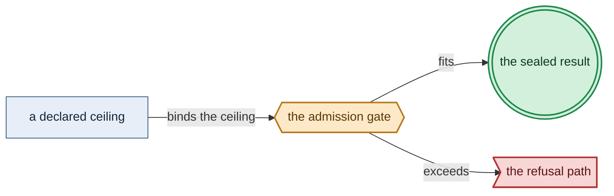

# Long Example Doctrine

> **Purpose**: A specimen long enough to cross the shape and diagram thresholds.
> **Read this if**: a threshold-based check needs a document to fire against.

This fixture doctrine exists to be long.
Status belongs to [the plan](../../DEVELOPMENT_PLAN/README.md).

Link-graph metadata

**Status**: Authoritative source
**Supersedes**: N/A
**Referenced by**: documents/engineering/README.md
**Generated sections**: none

## Contents
- [1. Why the long specimen exists](#1-why-the-long-specimen-exists)
- [2. The bound identity](#2-the-bound-identity)
- [3. The declared ceiling](#3-the-declared-ceiling)
- [4. The admission gate](#4-the-admission-gate)
- [5. What this specimen does not own](#5-what-this-specimen-does-not-own)
- [6. The specimen list](#6-the-specimen-list)

---

## 1. Why the long specimen exists

Rule 1 of the specimen constrains stage 1 exactly.
Rule 2 of the specimen constrains stage 1 exactly.
Rule 3 of the specimen constrains stage 1 exactly.
Rule 4 of the specimen constrains stage 1 exactly.
Rule 5 of the specimen constrains stage 1 exactly.
Rule 6 of the specimen constrains stage 1 exactly.
Rule 7 of the specimen constrains stage 1 exactly.
Rule 8 of the specimen constrains stage 1 exactly.
Rule 9 of the specimen constrains stage 1 exactly.
Rule 10 of the specimen constrains stage 1 exactly.
Rule 11 of the specimen constrains stage 1 exactly.
Rule 12 of the specimen constrains stage 1 exactly.
Rule 13 of the specimen constrains stage 1 exactly.
Rule 14 of the specimen constrains stage 1 exactly.
Rule 15 of the specimen constrains stage 1 exactly.
Rule 16 of the specimen constrains stage 1 exactly.
Rule 17 of the specimen constrains stage 1 exactly.
Rule 18 of the specimen constrains stage 1 exactly.
Rule 19 of the specimen constrains stage 1 exactly.
Rule 20 of the specimen constrains stage 1 exactly.
Rule 21 of the specimen constrains stage 1 exactly.
Rule 22 of the specimen constrains stage 1 exactly.
Rule 23 of the specimen constrains stage 1 exactly.
Rule 24 of the specimen constrains stage 1 exactly.
Rule 25 of the specimen constrains stage 1 exactly.
Rule 26 of the specimen constrains stage 1 exactly.
Rule 27 of the specimen constrains stage 1 exactly.
Rule 28 of the specimen constrains stage 1 exactly.
Rule 29 of the specimen constrains stage 1 exactly.
Rule 30 of the specimen constrains stage 1 exactly.
Rule 31 of the specimen constrains stage 1 exactly.
Rule 32 of the specimen constrains stage 1 exactly.
Rule 33 of the specimen constrains stage 1 exactly.
Rule 34 of the specimen constrains stage 1 exactly.
Rule 35 of the specimen constrains stage 1 exactly.
Rule 36 of the specimen constrains stage 1 exactly.
Rule 37 of the specimen constrains stage 1 exactly.
Rule 38 of the specimen constrains stage 1 exactly.
Rule 39 of the specimen constrains stage 1 exactly.
Rule 40 of the specimen constrains stage 1 exactly.
Rule 41 of the specimen constrains stage 1 exactly.
Rule 42 of the specimen constrains stage 1 exactly.
Rule 43 of the specimen constrains stage 1 exactly.
Rule 44 of the specimen constrains stage 1 exactly.
Rule 45 of the specimen constrains stage 1 exactly.
Rule 46 of the specimen constrains stage 1 exactly.
Rule 47 of the specimen constrains stage 1 exactly.
Rule 48 of the specimen constrains stage 1 exactly.
Rule 49 of the specimen constrains stage 1 exactly.
Rule 50 of the specimen constrains stage 1 exactly.
Rule 51 of the specimen constrains stage 1 exactly.
Rule 52 of the specimen constrains stage 1 exactly.
Rule 53 of the specimen constrains stage 1 exactly.
Rule 54 of the specimen constrains stage 1 exactly.
Rule 55 of the specimen constrains stage 1 exactly.
Rule 56 of the specimen constrains stage 1 exactly.
Rule 57 of the specimen constrains stage 1 exactly.
Rule 58 of the specimen constrains stage 1 exactly.
Rule 59 of the specimen constrains stage 1 exactly.
Rule 60 of the specimen constrains stage 1 exactly.
Rule 61 of the specimen constrains stage 1 exactly.
Rule 62 of the specimen constrains stage 1 exactly.
Rule 63 of the specimen constrains stage 1 exactly.
Rule 64 of the specimen constrains stage 1 exactly.
Rule 65 of the specimen constrains stage 1 exactly.
Rule 66 of the specimen constrains stage 1 exactly.
Rule 67 of the specimen constrains stage 1 exactly.
Rule 68 of the specimen constrains stage 1 exactly.
Rule 69 of the specimen constrains stage 1 exactly.
Rule 70 of the specimen constrains stage 1 exactly.
Rule 71 of the specimen constrains stage 1 exactly.
Rule 72 of the specimen constrains stage 1 exactly.
Rule 73 of the specimen constrains stage 1 exactly.
Rule 74 of the specimen constrains stage 1 exactly.
Rule 75 of the specimen constrains stage 1 exactly.
Rule 76 of the specimen constrains stage 1 exactly.
Rule 77 of the specimen constrains stage 1 exactly.
Rule 78 of the specimen constrains stage 1 exactly.
Rule 79 of the specimen constrains stage 1 exactly.
Rule 80 of the specimen constrains stage 1 exactly.
Rule 81 of the specimen constrains stage 1 exactly.
Rule 82 of the specimen constrains stage 1 exactly.
Rule 83 of the specimen constrains stage 1 exactly.
Rule 84 of the specimen constrains stage 1 exactly.
Rule 85 of the specimen constrains stage 1 exactly.
Rule 86 of the specimen constrains stage 1 exactly.
Rule 87 of the specimen constrains stage 1 exactly.
Rule 88 of the specimen constrains stage 1 exactly.
Rule 89 of the specimen constrains stage 1 exactly.
Rule 90 of the specimen constrains stage 1 exactly.
Rule 91 of the specimen constrains stage 1 exactly.
Rule 92 of the specimen constrains stage 1 exactly.
Rule 93 of the specimen constrains stage 1 exactly.
Rule 94 of the specimen constrains stage 1 exactly.
Rule 95 of the specimen constrains stage 1 exactly.
Rule 96 of the specimen constrains stage 1 exactly.
Rule 97 of the specimen constrains stage 1 exactly.
Rule 98 of the specimen constrains stage 1 exactly.
Rule 99 of the specimen constrains stage 1 exactly.
Rule 100 of the specimen constrains stage 1 exactly.
Rule 101 of the specimen constrains stage 1 exactly.
Rule 102 of the specimen constrains stage 1 exactly.
Rule 103 of the specimen constrains stage 1 exactly.
Rule 104 of the specimen constrains stage 1 exactly.
Rule 105 of the specimen constrains stage 1 exactly.
Rule 106 of the specimen constrains stage 1 exactly.
Rule 107 of the specimen constrains stage 1 exactly.
Rule 108 of the specimen constrains stage 1 exactly.
Rule 109 of the specimen constrains stage 1 exactly.
Rule 110 of the specimen constrains stage 1 exactly.
Rule 111 of the specimen constrains stage 1 exactly.
Rule 112 of the specimen constrains stage 1 exactly.
Rule 113 of the specimen constrains stage 1 exactly.
Rule 114 of the specimen constrains stage 1 exactly.
Rule 115 of the specimen constrains stage 1 exactly.
Rule 116 of the specimen constrains stage 1 exactly.
Rule 117 of the specimen constrains stage 1 exactly.
Rule 118 of the specimen constrains stage 1 exactly.
Rule 119 of the specimen constrains stage 1 exactly.
Rule 120 of the specimen constrains stage 1 exactly.
Rule 121 of the specimen constrains stage 1 exactly.
Rule 122 of the specimen constrains stage 1 exactly.
Rule 123 of the specimen constrains stage 1 exactly.
Rule 124 of the specimen constrains stage 1 exactly.
Rule 125 of the specimen constrains stage 1 exactly.
Rule 126 of the specimen constrains stage 1 exactly.
Rule 127 of the specimen constrains stage 1 exactly.
Rule 128 of the specimen constrains stage 1 exactly.
Rule 129 of the specimen constrains stage 1 exactly.
Rule 130 of the specimen constrains stage 1 exactly.

*Design intent, Tier-1. The specimen gate, drawn in the algebra register.*

## 2. The bound identity

Rule 131 of the specimen constrains stage 2 exactly.
Rule 132 of the specimen constrains stage 2 exactly.
Rule 133 of the specimen constrains stage 2 exactly.
Rule 134 of the specimen constrains stage 2 exactly.
Rule 135 of the specimen constrains stage 2 exactly.
Rule 136 of the specimen constrains stage 2 exactly.
Rule 137 of the specimen constrains stage 2 exactly.
Rule 138 of the specimen constrains stage 2 exactly.
Rule 139 of the specimen constrains stage 2 exactly.
Rule 140 of the specimen constrains stage 2 exactly.
Rule 141 of the specimen constrains stage 2 exactly.
Rule 142 of the specimen constrains stage 2 exactly.
Rule 143 of the specimen constrains stage 2 exactly.
Rule 144 of the specimen constrains stage 2 exactly.
Rule 145 of the specimen constrains stage 2 exactly.
Rule 146 of the specimen constrains stage 2 exactly.
Rule 147 of the specimen constrains stage 2 exactly.
Rule 148 of the specimen constrains stage 2 exactly.
Rule 149 of the specimen constrains stage 2 exactly.
Rule 150 of the specimen constrains stage 2 exactly.
Rule 151 of the specimen constrains stage 2 exactly.
Rule 152 of the specimen constrains stage 2 exactly.
Rule 153 of the specimen constrains stage 2 exactly.
Rule 154 of the specimen constrains stage 2 exactly.
Rule 155 of the specimen constrains stage 2 exactly.
Rule 156 of the specimen constrains stage 2 exactly.
Rule 157 of the specimen constrains stage 2 exactly.
Rule 158 of the specimen constrains stage 2 exactly.
Rule 159 of the specimen constrains stage 2 exactly.
Rule 160 of the specimen constrains stage 2 exactly.
Rule 161 of the specimen constrains stage 2 exactly.
Rule 162 of the specimen constrains stage 2 exactly.
Rule 163 of the specimen constrains stage 2 exactly.
Rule 164 of the specimen constrains stage 2 exactly.
Rule 165 of the specimen constrains stage 2 exactly.
Rule 166 of the specimen constrains stage 2 exactly.
Rule 167 of the specimen constrains stage 2 exactly.
Rule 168 of the specimen constrains stage 2 exactly.
Rule 169 of the specimen constrains stage 2 exactly.
Rule 170 of the specimen constrains stage 2 exactly.
Rule 171 of the specimen constrains stage 2 exactly.
Rule 172 of the specimen constrains stage 2 exactly.
Rule 173 of the specimen constrains stage 2 exactly.
Rule 174 of the specimen constrains stage 2 exactly.
Rule 175 of the specimen constrains stage 2 exactly.
Rule 176 of the specimen constrains stage 2 exactly.
Rule 177 of the specimen constrains stage 2 exactly.
Rule 178 of the specimen constrains stage 2 exactly.
Rule 179 of the specimen constrains stage 2 exactly.
Rule 180 of the specimen constrains stage 2 exactly.
Rule 181 of the specimen constrains stage 2 exactly.
Rule 182 of the specimen constrains stage 2 exactly.
Rule 183 of the specimen constrains stage 2 exactly.
Rule 184 of the specimen constrains stage 2 exactly.
Rule 185 of the specimen constrains stage 2 exactly.
Rule 186 of the specimen constrains stage 2 exactly.
Rule 187 of the specimen constrains stage 2 exactly.
Rule 188 of the specimen constrains stage 2 exactly.
Rule 189 of the specimen constrains stage 2 exactly.
Rule 190 of the specimen constrains stage 2 exactly.
Rule 191 of the specimen constrains stage 2 exactly.
Rule 192 of the specimen constrains stage 2 exactly.
Rule 193 of the specimen constrains stage 2 exactly.
Rule 194 of the specimen constrains stage 2 exactly.
Rule 195 of the specimen constrains stage 2 exactly.
Rule 196 of the specimen constrains stage 2 exactly.
Rule 197 of the specimen constrains stage 2 exactly.
Rule 198 of the specimen constrains stage 2 exactly.
Rule 199 of the specimen constrains stage 2 exactly.
Rule 200 of the specimen constrains stage 2 exactly.
Rule 201 of the specimen constrains stage 2 exactly.
Rule 202 of the specimen constrains stage 2 exactly.
Rule 203 of the specimen constrains stage 2 exactly.
Rule 204 of the specimen constrains stage 2 exactly.
Rule 205 of the specimen constrains stage 2 exactly.
Rule 206 of the specimen constrains stage 2 exactly.
Rule 207 of the specimen constrains stage 2 exactly.
Rule 208 of the specimen constrains stage 2 exactly.
Rule 209 of the specimen constrains stage 2 exactly.
Rule 210 of the specimen constrains stage 2 exactly.
Rule 211 of the specimen constrains stage 2 exactly.
Rule 212 of the specimen constrains stage 2 exactly.
Rule 213 of the specimen constrains stage 2 exactly.
Rule 214 of the specimen constrains stage 2 exactly.
Rule 215 of the specimen constrains stage 2 exactly.
Rule 216 of the specimen constrains stage 2 exactly.
Rule 217 of the specimen constrains stage 2 exactly.
Rule 218 of the specimen constrains stage 2 exactly.
Rule 219 of the specimen constrains stage 2 exactly.
Rule 220 of the specimen constrains stage 2 exactly.
Rule 221 of the specimen constrains stage 2 exactly.
Rule 222 of the specimen constrains stage 2 exactly.
Rule 223 of the specimen constrains stage 2 exactly.
Rule 224 of the specimen constrains stage 2 exactly.
Rule 225 of the specimen constrains stage 2 exactly.
Rule 226 of the specimen constrains stage 2 exactly.
Rule 227 of the specimen constrains stage 2 exactly.
Rule 228 of the specimen constrains stage 2 exactly.
Rule 229 of the specimen constrains stage 2 exactly.
Rule 230 of the specimen constrains stage 2 exactly.
Rule 231 of the specimen constrains stage 2 exactly.
Rule 232 of the specimen constrains stage 2 exactly.
Rule 233 of the specimen constrains stage 2 exactly.
Rule 234 of the specimen constrains stage 2 exactly.
Rule 235 of the specimen constrains stage 2 exactly.
Rule 236 of the specimen constrains stage 2 exactly.
Rule 237 of the specimen constrains stage 2 exactly.
Rule 238 of the specimen constrains stage 2 exactly.
Rule 239 of the specimen constrains stage 2 exactly.
Rule 240 of the specimen constrains stage 2 exactly.
Rule 241 of the specimen constrains stage 2 exactly.
Rule 242 of the specimen constrains stage 2 exactly.
Rule 243 of the specimen constrains stage 2 exactly.
Rule 244 of the specimen constrains stage 2 exactly.
Rule 245 of the specimen constrains stage 2 exactly.
Rule 246 of the specimen constrains stage 2 exactly.
Rule 247 of the specimen constrains stage 2 exactly.
Rule 248 of the specimen constrains stage 2 exactly.
Rule 249 of the specimen constrains stage 2 exactly.
Rule 250 of the specimen constrains stage 2 exactly.
Rule 251 of the specimen constrains stage 2 exactly.
Rule 252 of the specimen constrains stage 2 exactly.
Rule 253 of the specimen constrains stage 2 exactly.
Rule 254 of the specimen constrains stage 2 exactly.
Rule 255 of the specimen constrains stage 2 exactly.
Rule 256 of the specimen constrains stage 2 exactly.
Rule 257 of the specimen constrains stage 2 exactly.
Rule 258 of the specimen constrains stage 2 exactly.
Rule 259 of the specimen constrains stage 2 exactly.
Rule 260 of the specimen constrains stage 2 exactly.

*Orientation. The specimen map; the rule is owned by [the standards](../documentation_standards.md).*

## 3. The declared ceiling

Rule 261 of the specimen constrains stage 3 exactly.
Rule 262 of the specimen constrains stage 3 exactly.
Rule 263 of the specimen constrains stage 3 exactly.
Rule 264 of the specimen constrains stage 3 exactly.
Rule 265 of the specimen constrains stage 3 exactly.
Rule 266 of the specimen constrains stage 3 exactly.
Rule 267 of the specimen constrains stage 3 exactly.
Rule 268 of the specimen constrains stage 3 exactly.
Rule 269 of the specimen constrains stage 3 exactly.
Rule 270 of the specimen constrains stage 3 exactly.
Rule 271 of the specimen constrains stage 3 exactly.
Rule 272 of the specimen constrains stage 3 exactly.
Rule 273 of the specimen constrains stage 3 exactly.
Rule 274 of the specimen constrains stage 3 exactly.
Rule 275 of the specimen constrains stage 3 exactly.
Rule 276 of the specimen constrains stage 3 exactly.
Rule 277 of the specimen constrains stage 3 exactly.
Rule 278 of the specimen constrains stage 3 exactly.
Rule 279 of the specimen constrains stage 3 exactly.
Rule 280 of the specimen constrains stage 3 exactly.
Rule 281 of the specimen constrains stage 3 exactly.
Rule 282 of the specimen constrains stage 3 exactly.
Rule 283 of the specimen constrains stage 3 exactly.
Rule 284 of the specimen constrains stage 3 exactly.
Rule 285 of the specimen constrains stage 3 exactly.
Rule 286 of the specimen constrains stage 3 exactly.
Rule 287 of the specimen constrains stage 3 exactly.
Rule 288 of the specimen constrains stage 3 exactly.
Rule 289 of the specimen constrains stage 3 exactly.
Rule 290 of the specimen constrains stage 3 exactly.
Rule 291 of the specimen constrains stage 3 exactly.
Rule 292 of the specimen constrains stage 3 exactly.
Rule 293 of the specimen constrains stage 3 exactly.
Rule 294 of the specimen constrains stage 3 exactly.
Rule 295 of the specimen constrains stage 3 exactly.
Rule 296 of the specimen constrains stage 3 exactly.
Rule 297 of the specimen constrains stage 3 exactly.
Rule 298 of the specimen constrains stage 3 exactly.
Rule 299 of the specimen constrains stage 3 exactly.
Rule 300 of the specimen constrains stage 3 exactly.
Rule 301 of the specimen constrains stage 3 exactly.
Rule 302 of the specimen constrains stage 3 exactly.
Rule 303 of the specimen constrains stage 3 exactly.
Rule 304 of the specimen constrains stage 3 exactly.
Rule 305 of the specimen constrains stage 3 exactly.
Rule 306 of the specimen constrains stage 3 exactly.
Rule 307 of the specimen constrains stage 3 exactly.
Rule 308 of the specimen constrains stage 3 exactly.
Rule 309 of the specimen constrains stage 3 exactly.
Rule 310 of the specimen constrains stage 3 exactly.
Rule 311 of the specimen constrains stage 3 exactly.
Rule 312 of the specimen constrains stage 3 exactly.
Rule 313 of the specimen constrains stage 3 exactly.
Rule 314 of the specimen constrains stage 3 exactly.
Rule 315 of the specimen constrains stage 3 exactly.
Rule 316 of the specimen constrains stage 3 exactly.
Rule 317 of the specimen constrains stage 3 exactly.
Rule 318 of the specimen constrains stage 3 exactly.
Rule 319 of the specimen constrains stage 3 exactly.
Rule 320 of the specimen constrains stage 3 exactly.
Rule 321 of the specimen constrains stage 3 exactly.
Rule 322 of the specimen constrains stage 3 exactly.
Rule 323 of the specimen constrains stage 3 exactly.
Rule 324 of the specimen constrains stage 3 exactly.
Rule 325 of the specimen constrains stage 3 exactly.
Rule 326 of the specimen constrains stage 3 exactly.
Rule 327 of the specimen constrains stage 3 exactly.
Rule 328 of the specimen constrains stage 3 exactly.
Rule 329 of the specimen constrains stage 3 exactly.
Rule 330 of the specimen constrains stage 3 exactly.
Rule 331 of the specimen constrains stage 3 exactly.
Rule 332 of the specimen constrains stage 3 exactly.
Rule 333 of the specimen constrains stage 3 exactly.
Rule 334 of the specimen constrains stage 3 exactly.
Rule 335 of the specimen constrains stage 3 exactly.
Rule 336 of the specimen constrains stage 3 exactly.
Rule 337 of the specimen constrains stage 3 exactly.
Rule 338 of the specimen constrains stage 3 exactly.
Rule 339 of the specimen constrains stage 3 exactly.
Rule 340 of the specimen constrains stage 3 exactly.
Rule 341 of the specimen constrains stage 3 exactly.
Rule 342 of the specimen constrains stage 3 exactly.
Rule 343 of the specimen constrains stage 3 exactly.
Rule 344 of the specimen constrains stage 3 exactly.
Rule 345 of the specimen constrains stage 3 exactly.
Rule 346 of the specimen constrains stage 3 exactly.
Rule 347 of the specimen constrains stage 3 exactly.
Rule 348 of the specimen constrains stage 3 exactly.
Rule 349 of the specimen constrains stage 3 exactly.
Rule 350 of the specimen constrains stage 3 exactly.
Rule 351 of the specimen constrains stage 3 exactly.
Rule 352 of the specimen constrains stage 3 exactly.
Rule 353 of the specimen constrains stage 3 exactly.
Rule 354 of the specimen constrains stage 3 exactly.
Rule 355 of the specimen constrains stage 3 exactly.
Rule 356 of the specimen constrains stage 3 exactly.
Rule 357 of the specimen constrains stage 3 exactly.
Rule 358 of the specimen constrains stage 3 exactly.
Rule 359 of the specimen constrains stage 3 exactly.
Rule 360 of the specimen constrains stage 3 exactly.
Rule 361 of the specimen constrains stage 3 exactly.
Rule 362 of the specimen constrains stage 3 exactly.
Rule 363 of the specimen constrains stage 3 exactly.
Rule 364 of the specimen constrains stage 3 exactly.
Rule 365 of the specimen constrains stage 3 exactly.
Rule 366 of the specimen constrains stage 3 exactly.
Rule 367 of the specimen constrains stage 3 exactly.
Rule 368 of the specimen constrains stage 3 exactly.
Rule 369 of the specimen constrains stage 3 exactly.
Rule 370 of the specimen constrains stage 3 exactly.
Rule 371 of the specimen constrains stage 3 exactly.
Rule 372 of the specimen constrains stage 3 exactly.
Rule 373 of the specimen constrains stage 3 exactly.
Rule 374 of the specimen constrains stage 3 exactly.
Rule 375 of the specimen constrains stage 3 exactly.
Rule 376 of the specimen constrains stage 3 exactly.
Rule 377 of the specimen constrains stage 3 exactly.
Rule 378 of the specimen constrains stage 3 exactly.
Rule 379 of the specimen constrains stage 3 exactly.
Rule 380 of the specimen constrains stage 3 exactly.
Rule 381 of the specimen constrains stage 3 exactly.
Rule 382 of the specimen constrains stage 3 exactly.
Rule 383 of the specimen constrains stage 3 exactly.
Rule 384 of the specimen constrains stage 3 exactly.
Rule 385 of the specimen constrains stage 3 exactly.
Rule 386 of the specimen constrains stage 3 exactly.
Rule 387 of the specimen constrains stage 3 exactly.
Rule 388 of the specimen constrains stage 3 exactly.
Rule 389 of the specimen constrains stage 3 exactly.
Rule 390 of the specimen constrains stage 3 exactly.
Rule 901 of the specimen constrains stage 3 exactly.
Rule 902 of the specimen constrains stage 3 exactly.
Rule 903 of the specimen constrains stage 3 exactly.
Rule 904 of the specimen constrains stage 3 exactly.
Rule 905 of the specimen constrains stage 3 exactly.
Rule 906 of the specimen constrains stage 3 exactly.
Rule 907 of the specimen constrains stage 3 exactly.
Rule 908 of the specimen constrains stage 3 exactly.
Rule 909 of the specimen constrains stage 3 exactly.
Rule 910 of the specimen constrains stage 3 exactly.
Rule 911 of the specimen constrains stage 3 exactly.

## 4. The admission gate

Rule 391 of the specimen constrains stage 4 exactly.
Rule 392 of the specimen constrains stage 4 exactly.
Rule 393 of the specimen constrains stage 4 exactly.
Rule 394 of the specimen constrains stage 4 exactly.
Rule 395 of the specimen constrains stage 4 exactly.
Rule 396 of the specimen constrains stage 4 exactly.
Rule 397 of the specimen constrains stage 4 exactly.
Rule 398 of the specimen constrains stage 4 exactly.
Rule 399 of the specimen constrains stage 4 exactly.
Rule 400 of the specimen constrains stage 4 exactly.
Rule 401 of the specimen constrains stage 4 exactly.
Rule 402 of the specimen constrains stage 4 exactly.
Rule 403 of the specimen constrains stage 4 exactly.
Rule 404 of the specimen constrains stage 4 exactly.
Rule 405 of the specimen constrains stage 4 exactly.
Rule 406 of the specimen constrains stage 4 exactly.
Rule 407 of the specimen constrains stage 4 exactly.
Rule 408 of the specimen constrains stage 4 exactly.
Rule 409 of the specimen constrains stage 4 exactly.
Rule 410 of the specimen constrains stage 4 exactly.
Rule 411 of the specimen constrains stage 4 exactly.
Rule 412 of the specimen constrains stage 4 exactly.
Rule 413 of the specimen constrains stage 4 exactly.
Rule 414 of the specimen constrains stage 4 exactly.
Rule 415 of the specimen constrains stage 4 exactly.
Rule 416 of the specimen constrains stage 4 exactly.
Rule 417 of the specimen constrains stage 4 exactly.
Rule 418 of the specimen constrains stage 4 exactly.
Rule 419 of the specimen constrains stage 4 exactly.
Rule 420 of the specimen constrains stage 4 exactly.
Rule 421 of the specimen constrains stage 4 exactly.
Rule 422 of the specimen constrains stage 4 exactly.
Rule 423 of the specimen constrains stage 4 exactly.
Rule 424 of the specimen constrains stage 4 exactly.
Rule 425 of the specimen constrains stage 4 exactly.
Rule 426 of the specimen constrains stage 4 exactly.
Rule 427 of the specimen constrains stage 4 exactly.
Rule 428 of the specimen constrains stage 4 exactly.
Rule 429 of the specimen constrains stage 4 exactly.
Rule 430 of the specimen constrains stage 4 exactly.
Rule 431 of the specimen constrains stage 4 exactly.
Rule 432 of the specimen constrains stage 4 exactly.
Rule 433 of the specimen constrains stage 4 exactly.
Rule 434 of the specimen constrains stage 4 exactly.
Rule 435 of the specimen constrains stage 4 exactly.
Rule 436 of the specimen constrains stage 4 exactly.
Rule 437 of the specimen constrains stage 4 exactly.
Rule 438 of the specimen constrains stage 4 exactly.
Rule 439 of the specimen constrains stage 4 exactly.
Rule 440 of the specimen constrains stage 4 exactly.
Rule 441 of the specimen constrains stage 4 exactly.
Rule 442 of the specimen constrains stage 4 exactly.
Rule 443 of the specimen constrains stage 4 exactly.
Rule 444 of the specimen constrains stage 4 exactly.
Rule 445 of the specimen constrains stage 4 exactly.
Rule 446 of the specimen constrains stage 4 exactly.
Rule 447 of the specimen constrains stage 4 exactly.
Rule 448 of the specimen constrains stage 4 exactly.
Rule 449 of the specimen constrains stage 4 exactly.
Rule 450 of the specimen constrains stage 4 exactly.
Rule 451 of the specimen constrains stage 4 exactly.
Rule 452 of the specimen constrains stage 4 exactly.
Rule 453 of the specimen constrains stage 4 exactly.
Rule 454 of the specimen constrains stage 4 exactly.
Rule 455 of the specimen constrains stage 4 exactly.
Rule 456 of the specimen constrains stage 4 exactly.
Rule 457 of the specimen constrains stage 4 exactly.
Rule 458 of the specimen constrains stage 4 exactly.
Rule 459 of the specimen constrains stage 4 exactly.
Rule 460 of the specimen constrains stage 4 exactly.
Rule 461 of the specimen constrains stage 4 exactly.
Rule 462 of the specimen constrains stage 4 exactly.
Rule 463 of the specimen constrains stage 4 exactly.
Rule 464 of the specimen constrains stage 4 exactly.
Rule 465 of the specimen constrains stage 4 exactly.
Rule 466 of the specimen constrains stage 4 exactly.
Rule 467 of the specimen constrains stage 4 exactly.
Rule 468 of the specimen constrains stage 4 exactly.
Rule 469 of the specimen constrains stage 4 exactly.
Rule 470 of the specimen constrains stage 4 exactly.
Rule 471 of the specimen constrains stage 4 exactly.
Rule 472 of the specimen constrains stage 4 exactly.
Rule 473 of the specimen constrains stage 4 exactly.
Rule 474 of the specimen constrains stage 4 exactly.
Rule 475 of the specimen constrains stage 4 exactly.
Rule 476 of the specimen constrains stage 4 exactly.
Rule 477 of the specimen constrains stage 4 exactly.
Rule 478 of the specimen constrains stage 4 exactly.
Rule 479 of the specimen constrains stage 4 exactly.
Rule 480 of the specimen constrains stage 4 exactly.
Rule 481 of the specimen constrains stage 4 exactly.
Rule 482 of the specimen constrains stage 4 exactly.
Rule 483 of the specimen constrains stage 4 exactly.
Rule 484 of the specimen constrains stage 4 exactly.
Rule 485 of the specimen constrains stage 4 exactly.
Rule 486 of the specimen constrains stage 4 exactly.
Rule 487 of the specimen constrains stage 4 exactly.
Rule 488 of the specimen constrains stage 4 exactly.
Rule 489 of the specimen constrains stage 4 exactly.
Rule 490 of the specimen constrains stage 4 exactly.
Rule 491 of the specimen constrains stage 4 exactly.
Rule 492 of the specimen constrains stage 4 exactly.
Rule 493 of the specimen constrains stage 4 exactly.
Rule 494 of the specimen constrains stage 4 exactly.
Rule 495 of the specimen constrains stage 4 exactly.
Rule 496 of the specimen constrains stage 4 exactly.
Rule 497 of the specimen constrains stage 4 exactly.
Rule 498 of the specimen constrains stage 4 exactly.
Rule 499 of the specimen constrains stage 4 exactly.
Rule 500 of the specimen constrains stage 4 exactly.
Rule 501 of the specimen constrains stage 4 exactly.
Rule 502 of the specimen constrains stage 4 exactly.
Rule 503 of the specimen constrains stage 4 exactly.
Rule 504 of the specimen constrains stage 4 exactly.
Rule 505 of the specimen constrains stage 4 exactly.
Rule 506 of the specimen constrains stage 4 exactly.
Rule 507 of the specimen constrains stage 4 exactly.
Rule 508 of the specimen constrains stage 4 exactly.
Rule 509 of the specimen constrains stage 4 exactly.
Rule 510 of the specimen constrains stage 4 exactly.
Rule 511 of the specimen constrains stage 4 exactly.
Rule 512 of the specimen constrains stage 4 exactly.
Rule 513 of the specimen constrains stage 4 exactly.
Rule 514 of the specimen constrains stage 4 exactly.
Rule 515 of the specimen constrains stage 4 exactly.
Rule 516 of the specimen constrains stage 4 exactly.
Rule 517 of the specimen constrains stage 4 exactly.
Rule 518 of the specimen constrains stage 4 exactly.
Rule 519 of the specimen constrains stage 4 exactly.
Rule 520 of the specimen constrains stage 4 exactly.

## 5. What this specimen does not own

Rule 521 of the specimen constrains stage 5 exactly.
Rule 522 of the specimen constrains stage 5 exactly.
Rule 523 of the specimen constrains stage 5 exactly.
Rule 524 of the specimen constrains stage 5 exactly.
Rule 525 of the specimen constrains stage 5 exactly.
Rule 526 of the specimen constrains stage 5 exactly.
Rule 527 of the specimen constrains stage 5 exactly.
Rule 528 of the specimen constrains stage 5 exactly.
Rule 529 of the specimen constrains stage 5 exactly.
Rule 530 of the specimen constrains stage 5 exactly.
Rule 531 of the specimen constrains stage 5 exactly.
Rule 532 of the specimen constrains stage 5 exactly.
Rule 533 of the specimen constrains stage 5 exactly.
Rule 534 of the specimen constrains stage 5 exactly.
Rule 535 of the specimen constrains stage 5 exactly.
Rule 536 of the specimen constrains stage 5 exactly.
Rule 537 of the specimen constrains stage 5 exactly.
Rule 538 of the specimen constrains stage 5 exactly.
Rule 539 of the specimen constrains stage 5 exactly.
Rule 540 of the specimen constrains stage 5 exactly.
Rule 541 of the specimen constrains stage 5 exactly.
Rule 542 of the specimen constrains stage 5 exactly.
Rule 543 of the specimen constrains stage 5 exactly.
Rule 544 of the specimen constrains stage 5 exactly.
Rule 545 of the specimen constrains stage 5 exactly.
Rule 546 of the specimen constrains stage 5 exactly.
Rule 547 of the specimen constrains stage 5 exactly.
Rule 548 of the specimen constrains stage 5 exactly.
Rule 549 of the specimen constrains stage 5 exactly.
Rule 550 of the specimen constrains stage 5 exactly.
Rule 551 of the specimen constrains stage 5 exactly.
Rule 552 of the specimen constrains stage 5 exactly.
Rule 553 of the specimen constrains stage 5 exactly.
Rule 554 of the specimen constrains stage 5 exactly.
Rule 555 of the specimen constrains stage 5 exactly.
Rule 556 of the specimen constrains stage 5 exactly.
Rule 557 of the specimen constrains stage 5 exactly.
Rule 558 of the specimen constrains stage 5 exactly.
Rule 559 of the specimen constrains stage 5 exactly.
Rule 560 of the specimen constrains stage 5 exactly.
Rule 561 of the specimen constrains stage 5 exactly.
Rule 562 of the specimen constrains stage 5 exactly.
Rule 563 of the specimen constrains stage 5 exactly.
Rule 564 of the specimen constrains stage 5 exactly.
Rule 565 of the specimen constrains stage 5 exactly.
Rule 566 of the specimen constrains stage 5 exactly.
Rule 567 of the specimen constrains stage 5 exactly.
Rule 568 of the specimen constrains stage 5 exactly.
Rule 569 of the specimen constrains stage 5 exactly.
Rule 570 of the specimen constrains stage 5 exactly.
Rule 571 of the specimen constrains stage 5 exactly.
Rule 572 of the specimen constrains stage 5 exactly.
Rule 573 of the specimen constrains stage 5 exactly.
Rule 574 of the specimen constrains stage 5 exactly.
Rule 575 of the specimen constrains stage 5 exactly.
Rule 576 of the specimen constrains stage 5 exactly.
Rule 577 of the specimen constrains stage 5 exactly.
Rule 578 of the specimen constrains stage 5 exactly.
Rule 579 of the specimen constrains stage 5 exactly.
Rule 580 of the specimen constrains stage 5 exactly.
Rule 581 of the specimen constrains stage 5 exactly.
Rule 582 of the specimen constrains stage 5 exactly.
Rule 583 of the specimen constrains stage 5 exactly.
Rule 584 of the specimen constrains stage 5 exactly.
Rule 585 of the specimen constrains stage 5 exactly.
Rule 586 of the specimen constrains stage 5 exactly.
Rule 587 of the specimen constrains stage 5 exactly.
Rule 588 of the specimen constrains stage 5 exactly.
Rule 589 of the specimen constrains stage 5 exactly.
Rule 590 of the specimen constrains stage 5 exactly.
Rule 591 of the specimen constrains stage 5 exactly.
Rule 592 of the specimen constrains stage 5 exactly.
Rule 593 of the specimen constrains stage 5 exactly.
Rule 594 of the specimen constrains stage 5 exactly.
Rule 595 of the specimen constrains stage 5 exactly.
Rule 596 of the specimen constrains stage 5 exactly.
Rule 597 of the specimen constrains stage 5 exactly.
Rule 598 of the specimen constrains stage 5 exactly.
Rule 599 of the specimen constrains stage 5 exactly.
Rule 600 of the specimen constrains stage 5 exactly.
Rule 601 of the specimen constrains stage 5 exactly.
Rule 602 of the specimen constrains stage 5 exactly.
Rule 603 of the specimen constrains stage 5 exactly.
Rule 604 of the specimen constrains stage 5 exactly.
Rule 605 of the specimen constrains stage 5 exactly.
Rule 606 of the specimen constrains stage 5 exactly.
Rule 607 of the specimen constrains stage 5 exactly.
Rule 608 of the specimen constrains stage 5 exactly.
Rule 609 of the specimen constrains stage 5 exactly.
Rule 610 of the specimen constrains stage 5 exactly.
Rule 611 of the specimen constrains stage 5 exactly.
Rule 612 of the specimen constrains stage 5 exactly.
Rule 613 of the specimen constrains stage 5 exactly.
Rule 614 of the specimen constrains stage 5 exactly.
Rule 615 of the specimen constrains stage 5 exactly.
Rule 616 of the specimen constrains stage 5 exactly.
Rule 617 of the specimen constrains stage 5 exactly.
Rule 618 of the specimen constrains stage 5 exactly.
Rule 619 of the specimen constrains stage 5 exactly.
Rule 620 of the specimen constrains stage 5 exactly.
Rule 621 of the specimen constrains stage 5 exactly.
Rule 622 of the specimen constrains stage 5 exactly.
Rule 623 of the specimen constrains stage 5 exactly.
Rule 624 of the specimen constrains stage 5 exactly.
Rule 625 of the specimen constrains stage 5 exactly.

## 6. The specimen list

The specimen carries one short list so an over-long item can be seeded against it.

- The first item stays within the item cap.
- The second item stays within it too.
- The third item is the one a fixture grows past the cap.
